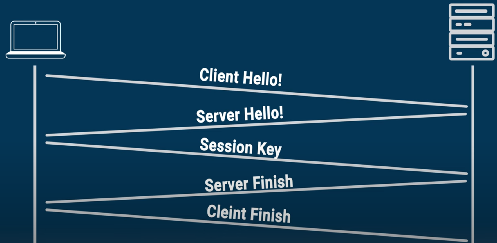
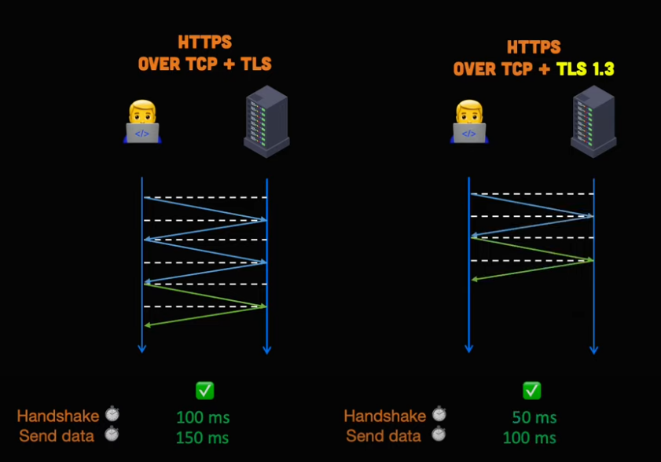
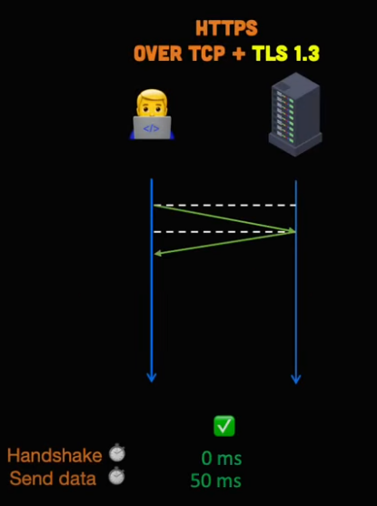
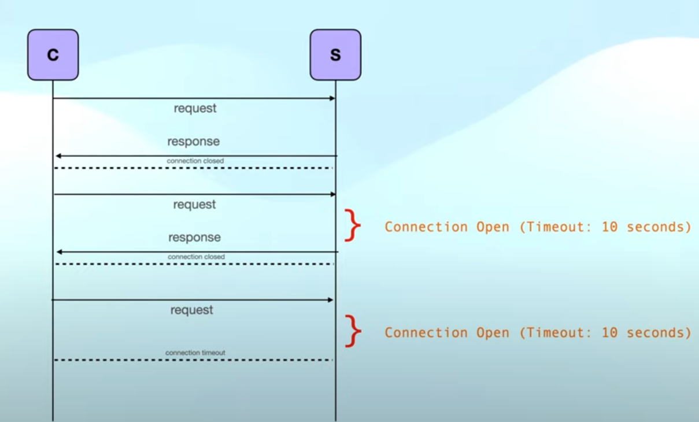
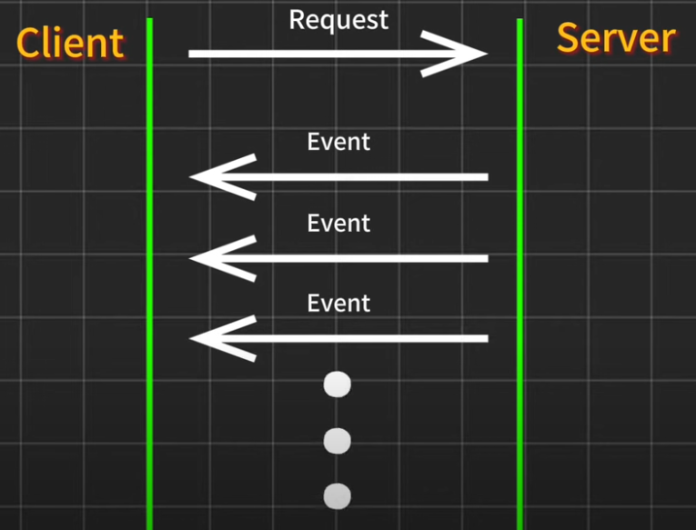
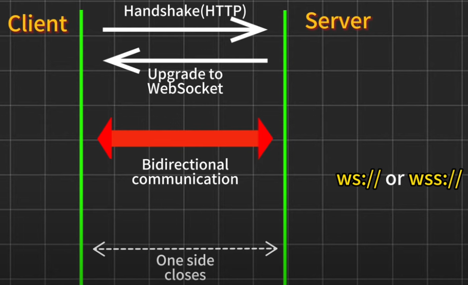

# Computer Networks

# IP Address
- Usually `routers` and `moderms` have a global IP address which is unique in the world
- Then try provide local IP address to all the devices connected to them 
- When a request is made to another IP then it goes through router and when the response is recieved it is sent back to local IP using `NAT(Network Access Translator)`
- But the response is recieved it needs to sent to a perticular application not should not be seen by other application
  - So each application has `PORT` which is unique in a system so the response is sent to the perticular port
# PORTs
- 0 to 1023 are reserved for system and we cannot use them 
- default port for `HTTP` is `80`
- 1024 to 49152 are reserved for certain applications
# LAN, MAN, WAN
- LAN (Local Area Network) : small number of connections
- MAN (Metropolitan Area Network) : Connect cities
- WAN (Wide Area Network) : Connect conutries
- LAN are connected to each other using MAN 
- MAN are connected to each other using WAN 
# MODERM and ROUTER
- MODERM : Convert digital to electrical signal and vice-verse
- ROUTER : Routes the data packages based on their IP addresses
> From router data is sent to ISP(Internet Service Provider) then it is requested from internet

# Structure of Network (OSI model)
- 7 layers of OSI model
  1. Application layer
  2. Persentation layer
  3. Session layer
  4. Transport layer
  5. Network layer
  6. Data link layer
  7. Physical layer

1. Application Layer
  - Implemented in software like google, WhatsApp
  - When we sent data using `application` it goes from `application layer` to `presentation layer`
2. Presentation layer
  - Convert data into machine representable binary format
  - From ASCII to EBCDIC (Translation) 
  - Here data is translated, encripted, compressed
3. Session layer
  - Manages connections
  - Setting up and termination of connections
  - Also authentication and authorisation
4. Transport layer
  - How data is to be transfered TCP/UDP
  - This is responsible for transporting data correctly 
    - it is done in 3 parts 
      1. Segmentation : This segment contains port and sequence. port is the sender application port and reciever port and sequence is for the data recieved from above layers to below layers
      2. Flow control : Amount of data that is transfered say server sends at 20mbps and client is capable of 5mbps then server drops its speed
      3. Error Control : It addeds checksum 
  - TCP Connection oriented transmission : Feedback is generated to check the data is recieved correctly or not
  - UDP Connectionless Oriented transmission : Feedbackk is not recieved hence fast and prone to error, like video call and live gamming
5. Network Layer
  - Router is over here
  - Before here everything is local then this is the point where it connects to the internet
  - This layer creates a packet of every segment and assign senders and recievers IP to it and the packet created is `IP packet` or `data packet`
6. Data Link Layer
  - MAC address of sender and reciever are assigned to the `data packet`
7. Physical Layer
  - Here it is hardware  

# TCP/IP model
- Internet Protocal Suite
- Layers are reduced to 5 layers
- Application, Transport, Network, Datalink, Physical
- This is used pracitcally and OSI is more of theoritical
- Here Application, presentation, Sessioon layer are merged to one 

# Different Archetecture
1. Client Server Architecture : Normal connections
2. Peer to Peer Architecture : Bit torrent

# Protocals
- TCP/IP 
  - HTTP
  - DHCP
  - FTP (Not used now)
  - SMTP
  - POP3 | IMAC
  - SSH
  - VNC
- Telnet(Port : 23)
- UDP

# Socket
- Interface between application and internet

> Ports : Ephemeral Ports?

>- HTTP uses TCP
>   - Stateless protocal : Does not save info

> ## Sending email
> - Emails are sent using SMTP and are recieved using POP3, IMAP and other protocals

# DNS (Domain Name System)
- In the application layer when we enter the name of the server HTTP converts the name to IP address 
- DNS is the directory which has IP address of all the domains

> #### Website names can be divided into 3 parts
> - like say mail.google.com
> - Here `mail` is the `sub domain`
> - `google` is `second level domain`
> - `com` is the `top level domain`
> For each categories there are multiple servers
> - Top ones are called `root DNS servers` (First point of contact)
>   - example : .io, .org, .com, .in

> #### When a website is typed
> - First it is checked in out own computer 
> - Then it is searched in user's local DNS server(Many times it is ISP)
> - Then it finds it in `root server`
> - Then it is searched in `Top level domain`

# Transport Layer
- Transport data from network layer to application
- Like network layer has multiple data packets transporting them to application is done by transport layer
- When data from multiple apps is to be trasfered over internet then from the transport layer it is converted to single file via `multiplexing`
- Similarly when the data from network layer is to be distributed to multiple apps it is done via `demultiplexing`
- Transport layer takes care of congestion control
- Data is sent in chunks so there are chances that some data arrives first and some data later so there are checksums keep data integrity and get put them in correct order
- Checksum is calculated on our side before sending data and then it is attached to data packet then it send to other side and again it is calculated on other side and compared with the checksum sent 
- Timers : When the data packet is sent a timer starts if the timer on my side expires and the confirmation is not recieved from the other side then it means data is lost and is sent again, hence it is known as re-transmission timer
- Say I sent it again and the packet was already recieved on other side 
  - To solve this there are squence number on each packet 

## UDP (User Datagram Protocal)
- With checksum the reciver will know if the data is currupted or not, but nothing will done for it
- It is fast, usecase include video call, live gaming
- Feedback not available over here
- It is transport layer protocal

## TCP (Transmission Control Protocal)
- It is transport layer protocal
- Application layer sends raw data TCP in transport layer converts it into chucks and adds headers
- Congestion control
- Takes care of data resent
- Maintains the order of data
- Full duplex

## 3 way handshake (How two device connect)
- First client sends a `syncronisation flag` with the packet
- Then server returns `Acknoledgement flag`
- Then client will send `Acknoledgement flag`

>- In `transport layer` we have data in `segnemts`
>- In `Network layer` we have data in `packets`
>- In `Data link layer` we have data in `frames`

# Network Layer
- Here we work with routers
- Every router has its network address
- Now say we have a packet then it is forwarded to the another router, then to another
  - This chain goes on till the packet reaches its desired desitnation (network address of desitnation is mentioned on packet)

## IP (Internet Protocal)
- IPv4 : 32 bit number with 4 words (255.255.255.255)
- IPv6 : 128 bits 

# HTTP / HTTPS / SSL / TLS

### HTTP (HyperText Transfer Protocal)
- Text transfered in clear text no encoding
- Vulnerable

### HTTPS (Secured HTTP)
- Data is encripted
- Data is secured by one of two protocal
  1. SSL(Secure Socket Layer)
      - When a connection request is sent to a website a SSL certificate is returned.
      - This certificate authenticate identity of website
  2. TLS(Transport Layer Security)
      - Successor of SSL
      - Industry standard
      - Like SSL it authenticate server and clinet
      - ecrypt data
      - Three major functions of TLS
        1. Authentication
        2. Data encryption
        3. Data integrity

### Security Handshake
1. `Sender(or client)` : sends `client hello`, this message include
    - `OS info`, `browser info`, `encryption algo supported`
    - Then server choose the most powerful algo supported
2. `Reciever(or server)` : sends `server hello`, which include
    - `Server info`, `encryption algo` to be used
    - digital SSL certificate (include domain name, certificate authority, and public key)
3. `Sender(or client)` : Brower generates `random session key` and encrypts it with server's public key 
    - Server decrypts it with private key 
4. `Reciever(or server)` : Then server sends `server finish` message
5. `Sender(or client)` : Browser or client sends `client finish` message of its own which contains digest of all previous message in the handshake
- Now the secure connection is established and now all the communication will be encrypted using the session key 


### TLS session
- It consist of two phases
  1. Handshake phase 
  2. Encryption phase
- Handshake phase (The number mentioned are corrosponding the handshke mentioned above)
  - The `public key` is utilized only in the `handshare phase` for authentication
  - And the `private key` on the server is used to decrypt data
  - This is known as assymetic encryption
  - (2)The server initially sends the `certificate` and the `public key`
  - (3)Then the client checks the legitimacy of certificate
  - (3)Then client generates a random string and encrypts it with public key
  - (3)This encrypted string is then sent to server
  - (4)Server decrypts the message using `private key`
  - Now both server and client have the secret string and now they both use other info to create a `master key`
  - Then using this `master key` both client and server generate a `session key`
  - This `session key` will be used to encrypt and decrypt the data 
- Now the handshake is done but the data can be huge and encryption needs to be fast 
- Encryption phase ( For this TLS has `symmetric algorithm` and `symmetric key` )
  - This `symmetric encryption` is much faster then `public key encrytion`    
  - Reason being it used same key for both encryption and decryption
  - Also `symmetric key` is much smaller then `public key` and `private key`
  - Hence the `asymmetric encrytion` or `public-private key encryption` is only used in `handshake phase`
- Data integrity 
  - For this when each message is sent an additional code is calculated called `MAC(message authentication code)`
  - This is calculated using `message`, `hash function` and `secret mac key`
  - This `mac key` is `generated` during `TLS handshake`
  - Hence when `encrypted message` is sent `MAC` is also attached 
    - Hence when the `encrypted message` is recieved it is hashed using `mac key` and compared to `MAC` recieved
- Time consumption in TLS
  - Traditional TLS takes more back and forth for handshake
  - but for TLS 1.3 the handshake time is reduced to high extent
- Another feature TLS 1.3 offer is `session resumption`
  - This allows to use abreviated handshake hence reducing time furthur

<center>

|||
|-|-|
|  | |

</center>

# Caching
## CDN (Content Delivery Network)
- Initially developed to speed up the `delivery` of `static content` like HTML
- Now it is used whenever HTTP traffic is served
- They are basically used to speed up content delivery today
- They are present at multiple locations, these locations are called `Point Of Presence(PoP)`
  - A server inside `PoP` is called `Edge server`
- Eg. Amazon Cloudfront, Cloudfare, Microsoft Azure CDN
- Different CDN use different tech. to connect user to PoP
  - Two common ones are `DNS based routing` and `Anycast`
- DNS based routing : 
  - Each PoP has its own unique IP address
- AnyCast : 
  - Each PoP has same IP address
- Each edge server works as reverse proxy 
- If content is request first it is checked in PoP if not found in PoP then it searched in original server
- TLS handshakes are expensive and TLS connections are terminated at PoP server
  - This reduces wait time by significat amount

# Hashing Algorithm
## MD5
- Not secure but worth learning
- Takes 512 bits input and converts it to 128 bits output
- It is now considered cryptographically broken and unsuitable for security-sensitive applications
  - This is due to vulnerabilities that allow for collision attacks (where two different inputs produce the same hash)
## SHA (Secure Hash Algorithm) family
- length of text must be less then 2^64 bits for SHA-1 and SHA-256
- These are irreversible
- Industry standard SHA-512
## sCrypt
- TypeScript based Domain Specific language 
- Used for Crypto mining
## bCrypt
- Mostly used for storing password
- a `salt` is added at the end of password and then it is hashed
- This algo is slow on purpose
- Algo is slow and salt is added hence the dictionary attack wont work

# Content Security Policy
- Specifically mention all the websites that a site is allowed to load the content from
- And if any script tries to load content from another website then it blocks it  

## Cross Site Scripting (XSS)
- Type of Cyber attack
- This involves injecting malicios code into a trusted website
- Like say a there is a comment on youtube that has a script that runs when the comment is loaded
 
## Working
- In the HTML requested from server an additional header is added named
```html
  Content-Security-Policy: <directives> <value>; <directives> <value>; 
```  
- Example

|||
|-|-|
|`content-security-policy:`|`object-src 'none';base-uri 'self';script-src 'nonce-6rdWWH3mrjgDiCL8EVJuXA' 'strict-dynamic' 'report-sample' 'unsafe-eval' 'unsafe-inline' https: http:;report-uri https://csp.withgoogle.com/csp/gws/clkf`|

# Tests in software development
### There are 5 types of test in software development 
- The complexicity decrease along the list
  1. Unit Test
      - Where we test each line of the code
  2. Component Test
      - Testing all the api, functions, components
  3. Integration Test
  4. End-to-End Test
  5. Manual Test

# Polling or Short Polling
- Client makes a request if server has the response then it will return response or else wil return empty response
- This repeats after set interval of time as shown in figure
- Pros : Easy to implement, Compatible, <b>near</b> real time updates
- Cons : Network load, Connection overloading
- Examples :
  - Chat applications
  - Stock ticker
  - Weather updates


# Long polling 
- Here client waits for response once request is sent for specified amount of time
- If no response then again it sennds request
- Pros : Less network load, Low latancy, Efficient
- Cons : server load, Complex implemention
- Example : 
  - Chat application
  - Real time notifications
  - Live updates
  - Online gamming




# Server Side Events (SSE)
- Here once the connection is established server sends the data continuously
- Only Server sends data clinet only listens to the data
- Pros : Simple, Auto-Reconnect
- Cons : Uni-directional, Text support only
- Example : Real time news, Live sports updates

<center>

</center>

# Web sockets
- First client sends request 
  - Then server response with `upgrade request`
- This is bidirectional
- If even one side close then communication is closed
- if `ws://` : unsecured connection | `wss://` : secured connection


## CDN (Content Delivery Network)
- developed to speedup delivery of static content
- There are hundreds of CDN present which are called PoP(Point of Presence)
  - Server inside a pop is called edge server
- There is basically a main server 
  - then there child servers which are connected to main server
  - The user makes a request to child server and if the data is cached then it is returned if not the it is requested from main server
- There are two main technologies used by CDN two commom ones are 
  1. DNS based routing : Each pop has its own IP address
  2. Anycast : All the POP have save IP address

## Proxy and Reverse Proxy
- Proxy or Forward Proxy
  - Server that sits between client and internet
  - This is done because
    - It protects clients idnetity
    - When we use this only the IP of proxy server is visible and that of client is hidden 
    - Can be used to bypass certian restrictions
    - Can be used to block certain contents
- Reverse Proxy
  - Sits between web server and the internet
  - Takes request from the clients and talks to web servers on behalf of client
  - One example is Nginx
  - Why used
    - Protect web servers as they hide the IP of webservices
    - Used for load balancing 
    - These reverse proxy servers are placed at 100's of location so are closer to user as compared to server
    - Can be used for caching 
## Nginx
- Webserver software used for `reverse proxy`, `load balancing` and `caching`
- For concurrency it uses `highly efficient run loops` in a single thread processes called `workers`
- It has 3 main things
  1. Workers : Threads
  2. Masters : Manage threads
  3. Proxy caches : Used for caching
- When a request comes it can consist of two parts `static` and `dynamic` part
  - Static part is handled by nginx and dynamic part is forwarded to WSGI
    - Then this WSGI sends request to django app and recieves response and then returns this response to Nginx 

