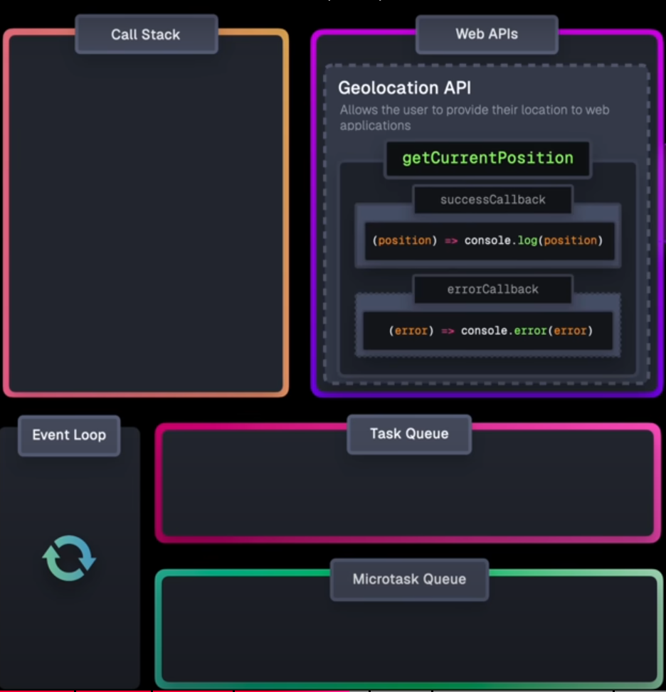

# Javascript basics

- There are two types of tasks 
  1. Macro Tasks : Handled by Task queue
  2. Micro Tasks : Handled by Microtask queue
- Macro Tasks are executed in next event loop like `setTimeout`,`setInterval`,`I/O operations`, `HTTP/s requests`
- Micro Tasks are executed before the start of next loop like `Promises`

### Some imp things to note 
- Only the following are pushed to the micro task queue
  - .then
  - .catch
  - .finally
  - parts of function in async after await
  - queueMicrotask(()=>{...})
  - new MutationOberserver()



- Everything that is not handled by JS is usually a webAPI
- The webapi processes the request and sends the response to `Task queue` and `MicroTask Queue`
- 


## Promise
- A promise consist of 3 things
  1. PromiseState
  2. PromiseResult
  3. PromiseFullFilmentReaction


- Fetch returns a promise
```js

const example_promise = fetch('https://some.url');

example_promise
  .then(res=>res.json())
  .then(data=>console.log(data))
  .catch(err=>console.log(err));

```

- Be cautious with `resolve/reject` and `.then/.catch`
- `resolve/reject` are created with constructor and are only responisble for passing data of success and failure
- `.then/.catch` calls for a callback (hence go in the microtask queue)
- So for this code
```js
  return new Promise((resolve,reject)=>{
    let i = 0;
    while(i< 1e8){i++;}
    resolve(`loops done`);
  })
```
- the exection is in the main/event loop and only the log goes to microtask queue
  - As the while loop is in the `resolve/reject` which is initialised with constructor
- While for the following code
```cpp
  return Promise.resolve().then( result => {
    let i = 0;
    while(i<1e8){i++;}
    return "done";
  })
```
- The while loop is the the microtask queue

- Entire code 
```js
const tick = Date.now();
const log = (v) => {
  console.log(`${v} \nElapsed: ${Date.now() - tick} ms`);
};

const url = `https://api.github.com/users/hadley/orgs`

const block = () => {
  return new Promise((resolve,reject)=>{
    let i = 0;
    // Processed in event loop
    while(i< 1e9){i++;}
    // processed in task queue
    setTimeout(() => {
      log("timeout");
    }, 1000);
    resolve(`loops done`);
    
  })
  // code 2
  // return Promise.resolve().then( result => {
  //   let i = 0;
  //   while(i<1e8){i++;}
  //   return "done";
  // })
}

log('Step 1 complete'); 

block().then(result => {
  log(result);
})

log('Step 2 complete'); 
```
Working of the Above Code:
- JavaScript is single-threaded: It processes tasks one at a time on the main thread, using the event loop to handle asynchronous operations.

- Event Loop: Manages the execution of code, including handling asynchronous events and callbacks.

1. log('Step 1 complete');:

  - This is a synchronous operation added to the call stack and executed immediately.

2. block() Function:

  - When block is called, it creates a new Promise.

  - The while (i < 1e9) { i++; } loop runs synchronously, blocking the main thread until it completes.

  - The setTimeout callback is added to the task queue to be executed after 1 second.

  - resolve('loops done') is called, resolving the promise.

3. log('Step 2 complete');:

  - This is also a synchronous operation added to the call stack and executed immediately after the block function.

4. Promise Resolution:

  - The then callback is a microtask added to the microtask queue and will execute as soon as the current synchronous code finishes.

  - Thus, log(result); (where result is 'loops done') is processed after log('Step 2 complete');.

5. Task Queue:

  - After the synchronous code and microtasks are done, the event loop checks the task queue.

  - The setTimeout callback is executed, logging "timeout".

- Another way of using the promise is using async await 
```js
const block = async () =>{
  let i = 0;
  // while(i<1e9){i++}
  // log(`while done`)
  setTimeout(()=>{
    log('timeout')
  },1000);
  return "done"
}


const main = async () =>{
  const result = await block();
  log(result);
  
}
log('Step 1 complete');

main(); 
log('Step 2 complete');
```

- The problem that can come over here is the way we resolve multiple promises
```js
const delay = ms => new Promise(resolve => setTimeout(resolve, ms));


const block = async () =>{
  // let i = 0;
  // while(i<1e9){i++}
  // log(`while done`)
  await delay(1000);

  return "done"
}


const main = async () =>{
  // code 1
  const result1 = await block();
  const result2 = await block();
  return [result1,result2];
  // // code 2
  // const result1 = block();
  // const result2 = block();
  // return Promise.all([result1,result2]);
}
log('Step 1 complete');

main().then(result=>{
  log(result);
}); 
log('Step 2 complete');
```
- Is we use `code 1` then first promise will execute then second 
- But if we use code 2 then both promises will be executed at once

### Problem with array iteration
- If we do the following then we need to wait for each await to execute
```js
const smoothie = fruits.map(async v => {
  const emoji = await getFruit(v)
  log(emoji)
  return emoji
});
```
- Rather we can use traditional for loop
```js
const fruitLoop = async() => {
  for await (const emoji of smoothie) {
    log(emoji)
  }
}
```
### We can also use `await` in `if` directly 
```js
const fruitLoop = async() => {
  if (await getFruit(fruitname) === "smoothie") {
    log(emoji)
  }
}
```


