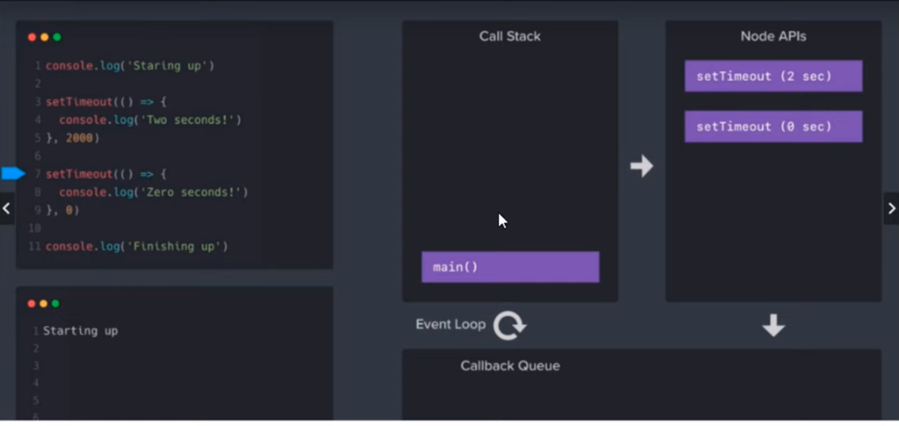
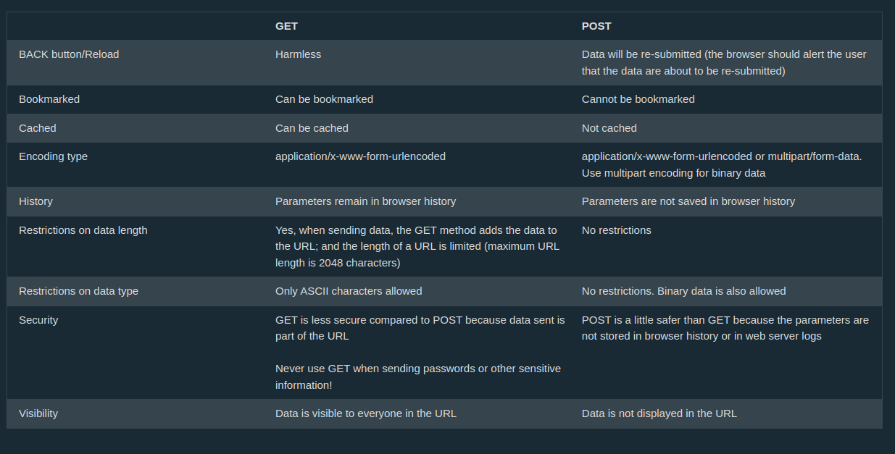

# NodeJS
- Node.js is an open-source, cross-platform JavaScript runtime environment and library to run web applications outside the client’s browser
- ECMAScript : Standard scripting language with include JS, and many more
- V8 engine : Parses and Executes JS
- JS runtime enviroment : Where the program will be executed. It consists of
  - The JavaScript engine
  - Web APIs
  - Callback Queue : Stores callback functions in web API 
  - CallStack : Keeps track of where we are in the program
  - Event loop : Moniters CallStack and Callback Queue
  - Heap
- JavaScript is a single-threaded syncronus language

- event handler moves callback from the Callback Queue to Callstack 
  - This happens only when callstack is empty 
  - or else event handler will wait till callstack is empty then It will fill the callback from queue
#

- NodeJs is on server side
- HTML,CSS,JS are on client side
- NodeJs developer create API
- Why there is `undefined` written when we run code in console
  - statements like 
  - ```js
      console.log("34"), var a = 5, const b = ["sada","dsadas"]
    ```

  - These statement dont return anything
  - But say we have defined an array : 
   ```js 
      const fruits = ["mango","banana","apple"] 
    ```
  - Now whenever I just type "fruits" in command line it wont show undefined
- Global models are already present and non-Global modules need to be imported

# initialise

`go inside the folder and then initialise the work space `

`file can run even with initializing environemt`

    npm init

# HTTP
> Program to print hello world
- HTTP module : Handle server's request and response
- syntax
- ```js
  var http = require("http");

  http.createServer((req, res) => {
      res.writeHead(200, { "Content-Type": "text/html" });
      res.write("Hello world");
      res.end();
    }).listen(8000);
  // localhost:8000

  //The first argument of the res.writeHead() method is the status code
  // 200 means that all is OK,
  // the second argument is an object containing the response headers.
  ```

- ```js
  var http = require("http");

  http.createServer(function (req, res) {
      res.write("<h1>Holla!</h1>");
      res.end();
    }).listen(8000);
  ```

## HTTP status code
- 1xx : Information response
- 2xx : Success response(Eg. 200)
- 3xx : Redirection message
- 4xx : Client error response (Eg. 404)
- 5xx : Server Response Error

## HTTP communication protocals
1. GET 
2. POST
3. PUT
4. DELETE
5. ...

  ### GET
  - Used to request data from a specific reource
  - the qurey string is sent in the URL of GET request
  - Eg. 
    ```
        /test/demo_form.php?name1=value1&name2=value2
    ```
  - Can be `Cached`
  - Remains in `browser history`
  - Never be used while sending sensitive data
  - Should only be used to request data and not modify data

  ### POST
  - Should be used to creating data 
  - The data sent to the server with POST is stored in the request body of the HTTP request:
  - POST requests are never cached
  - POST requests do not remain in the browser history
  - POST requests have no restrictions on data length
  - POST is `not idempotent` : Multiple request will result in multiple resource being created

  ### PUT
  - Mostly used for updating data
  - PUT is `idempotent` : sending same request will result in same output 

  ### DELETE
  - Delete resource

  

# Running file

    node file.js

continous running

    nodemon index.js

# Package.json

- Contains meta-data about the project like name,version,git etc
- install package

        npm install package

- uninstall package

        npm uninstall package

> nodejs is `single threaded`?
> JS and NodeJS is `single threaded` with event loop model

- > NodeJs is `async`
  - > Asyncronus : many functions can run parallely
  - > Syncronus : all the code, functions etc. run after executoin of previous is complete

> to ignore files while git push create ".gitignore" file and write the folder name in it "/node_modules" here

> Drawback of async : consistancy issue (say data is updation take longer time then read, so wrong data will be read as updation will take time)

# Nodemon

- After making any change in project we need to restart it and it is time consuming when we are working on huge project

        nodemon index.js

# Creating API

- Response used for sending data
  - resp.WriteHead(200,{})
  - first : Status code
  - Second : Status message
- to stringify `object`
  ```js
  // JSON.stringify({object})
  JSON.stringify({ name: "asa", email: "dsad" });
  ```

# Importing data

- say we have file in a folder

        /data/data.js

- now we want to import data
```
  const data = require('./data/data');
```
# comand line input

- we can access command line parameters using `process.argv`
```
  const input = process.argv;
```
- Here input is an array where first two element are path to nodejs and current repo
- ```
  [
    "/usr/bin/node",
    "/home/ohm/GitRepo/NodeJS/temp.js",
    .
    .
    .
  ]
  ```


# file system module

    const fs = require('fs')

## creating file

```js
// fs.writeFileSync(path_with_file_name, content)
fs.writeFileSync(dir_path + "/filename.txt", "lora ipsum");
// File will be created in dir_path with
// name "filename.txt"
// content "lora ipsum"
```

## get files name

```js
fs.readdir(dir_path, (err, files) => {
  console.warn(files);
});
```

output

    ['file1.txt','file2.txt','file3.txt', ... ]

to iterate over items

```js
fs.readdir(dir_path, (err, files) => {
  files.forEach((item) => {
    console.log(item);
  });
});
```

output

    file1.txt
    file2.txt
    file3.txt
    .
    .
    .

> we cannot access files outside this envt without user permission

## getting path

```js
const path = require('path');
// changing file
const dir_path = path.join(__dirname,'data');
```

## reading file

```js
fs.readFile(`${file_path}/filename.txt`, "utf8", (err, item) => {
  console.log(item);
});
```

if 'utf8' is not written then output will be

    <Buffer 45 25 c3 s5 ...>
    // this is file location
    // utf8 is encoding

## update

```js
fs.append(
  `${file_path}/filename.txt`,
  "this will also be added to file",
  (err) => {
    if (!err) console.log("operation succesfull");
    else console.log(err);
  }
);
```

## Rename

```js
fs.rename(`${file_path}/filename.txt`, `${file_path}/new_name.txt`, (err) => {
  if (!err) console.log("operation succesfull");
  else console.log(err);
});
```

## delete

```js
fs.unlinkSync(`${file_path}/filename.txt`);
```

# Promise (Detailed version in JS md)
> ### Consistancy issue due to async behaviour of node
>

> ### JS is asyc language
> Eg : 
> ```js
>   console.log("start exe...")
>   setTimeout(()=>{
>     console.log("logic exe...")
>   },2000)
>   console.log("complete exe...") 
> ```
> - Output
> ```
> start exe...
> complete exe...
> logic exe...
> ```

### This create consistancy issue
- Say a = 10, b=0;
- I update b = 10; but that process is time taking
- And in next line I display a+b 
- So ideally output should be 20 but it will be 10 as b was not updated at the time when a and b were added
- ```js
  let a = 10,b = 0;
  // timetaking function 
  SetTimeout(()=>{

  },2000);
  console.log(a+b);//output will be 10 instead of 20
  ``` 

### Handling consistancy issue with Promise

- promise wait till execution is not completed

#### Using Promise 1st method
```js
a = 10;
b = 0;

let waitingdata = new Promise((resolve, reject) => {
  // time taking function
  // for now we are adding delay to duplicate time taking function
  setTimeout(() => {
    // resolve returns the data
    resolve(30);
  }, 2000);
});

waitingdata.then((data) => {
  // data is the value that we passed in resolve in promise above
  b = data;
  console.log(a + b);
});
```

#### Using Promise method 2

```js
const express = require("express");
const app = express();

app.get("", async (req,res)=>{
  let a = new Promise((resolve,reject)=>{
    if(req.qureyy.name == "ohm"){
      resolve();// if promise is resolved 
    }
    else{
      reject();// if promise is not resolved
    }
  }).then(()=>{
    res.send("correct name");
  }).catch(()=>{
    res.send("incorrect name");
  });
})

```

# Working of Node.Js (Detailed version in JS.md)

- In `Node.js` architecture there is an `event loop` which has 3 components
  1. Callstack 
      - Stacks all the function from bottom to top
      - There is a main function by default in the stack at the bottom
  2. Node API
      - All the inherited objects, function etc. goes to `Node API block`
      - Here `setTimeout` is written in C++ hence it is inherited 
      - These work async from Call Stack 
  3. Callback queue
      - As the process complete in Node API block then are send to Callback queue
      - From here the process are sent to call stack to be executed
     >- Process waits for call stack to get empty and then goes to call stack one by one (waits for one process to complete then enters call stack) 

 

- 

# Express Js

`basic Express Js syntex`

```js
const express = require("express");
// make express execuitable
const app = express();

// the elemets of request can be accesed by
// req.qurey is an object
// Then they can be iterated using map
app.get("", (req, res) => {
  const response = Object.keys(req.qurey).map((key)=> ({ 
    [key]: req.query[key] 
    })); 
  console.log(JSON.stringify(response));
  res.send("main page");
});

app.get("/about", (req, res) => {
  res.send("about page");
});

app.listen(8000);
```

## Request, Response

- Client : Requests
- Server : Response

### getting request from browser / querey parameter

`index.js`

```js
app.get("", (req, resp) => {
  console.log("Request recived from browser : ", req.qurey);
  resp.send("welcome to homepage");
});
```

`webpage`

    localhost:8000/?name=ohm

`terminal output`

    Request recived from browser : {name : 'ohm'}

## Ways to load html file

1. using sendFile

```js
const path = require('path');
const dirPath = path.join(__dirname,'file.html');

app.get('',(req,resp){
    resp.sendFile(dirPath);
});
```

2. using express

- NodeJs - node_modules... - htmlfiles - index.html - about.html - index.js - package.json - README.md

    ```js
      const express = require('express');
      const path = require('path');
      const public = path.join(__dirname,'/htmlfiles')

      const app = express();

      app.use(express.static(public));

      app.listen(5000);
    ```

  > here `app` is executable from express

> express has many more functionality

## Error page (404 page)

```jsx
// "*" --> used to add midware to all pages
app.get("*", (req, res) => {
  res.sendFile(`${FilePath}/error.html`);
});

app.listen(8000);
```

> questions

> - what is 404 page
>    - It is a response status code 
>    - It means a server could not find a client-requested webpage 
> - how to get html page using get method

# Types of pages
- Static pages : once the page is loaded it don't interact with database
- Dynamic pages : They interace with database as per user's request

# Template engine
- EJS (Embaded JavaScript)
- It is used to create template(render page) with minimal code
- Usually template is static and is stored as `.ejs`
- Dynamics pages are rarely made in NodeJs
- NodeJs is usually used to make API
- `Routing` way to handle client requests
- package used ejs
  ```
  npm install ejs
  ```
- Examples
- say this my home.ejs
```html

<!DOCTYPE html>
<html>
<head>
    <title>Home Page</title>
    <style type="text/css" media="screen">
        body {
            background-color: skyblue;
            text-decoration-color: white;
            font-size: 5em;
        }
    </style>
</head>
  
<body>
    Hobbies of <%=data.name%> are:<br />
  
        <ul>
            <% data.hobbies.forEach((item)=>{%>
                <li>
                    <%=item%>
                </li>
                <%});%>
        </ul>
</body>
</html>
```

- and this is main file

```js
app.get('/', (req, res) => {

	// The render method takes the name of the html
	// page to be rendered as input.
	// This page should be in views folder
	// in the root directory.
	let data = {
		name: 'Akashdeep',
		hobbies: ['playing football', 'playing chess', 'cycling']
	}

	res.render('home', { data: data });// home.ejs - file name
});

const server = app.listen(4000, function () {
	console.log('listening to port 4000')
});

```

### setting template engine

```js
const express = require("express");
const app = express();
app.set("view engine", "ejs"); // app.set('view engine', engine_name)
```

### using it to get data

```js
app.get('/profile_page',(_,resp){
    // say we connected it database here
    // which has an object user={name:'ohm',age:'21'};
    // for now we are creating dummy data
    const user = {name:'ohm',age:'21'};

    resp.render('profile',{user});// profile is .ejs file name
    // so the data "user" is feched from DB and shared with ejs file "profile"
});
```

`importing data in profile.ejs file`

> here "`=`" is used for data of `javascript`

> and "`-`" is used for data of `HTML` (ejs use js so for importing ejs file "`=`" is used)

```html
<body>
    name of user is <%= data.name%>
</body>
```
- Importing `common/header.ejs` in current ejs file

```html
<body>
    <%- include('common/header'); %>
</body>
```

## Middleware

- These are functions used with `routes`
- Used to `access` and `modify` => `requests` and `responses`
- Types of middleware
  - Application-level Middleware
  - Router-level Middleware
  - Error-handling Middleware
  - Build-in Middleware
  - Third-party Middleware

### Example of application-level middleware

```js
const express = require('express');
const app = express();

const Filter = (req,resp,next)=>{
    if(!req.qurey.age) 
    {
      resp.send("age not found?");
      return;// necessary or else response from main route will also be sent
    }
    else if(req.qurey.age < 18) 
    {
      resp.send("access denied child");
      return;// necessary or else response from main route will also be sent
    }
    else next();
    // next() is used pass the middleware function
}

app.use(Filter);

app.get(...);
.
.
.
```

### Middleware on single route

`Instead of using it on entire application`

```js
app.use(Filter);
```

`We will use it specific route`

```js
app.get("/user", Filter, (res, req) => {});
```

### Saving Middleware in seperate file

`other file with name middleware.js`

```js
module.exports Filter = (req,resp,next)=>{}
```

`main file`

```js
const Filter = require("./middleware");
```

### (Route level middleware)Applying Middleware on multiple route

```js
const my_routes = express.Router();

my_routes.use(Filter);// apply filter(middleware) on all routes named 'my_routes'

app.get('',(req,resp)=>{});
app.get...

// now instead of using app.get('',(req,resp)=>{});
// we use         my_routes.get('',(req,resp)=>{});
my_routes.get('',(req,resp)=>{});
my_routes.get...

app.use('/',my_routes);
```

# Connecting mongodb with nodejs

### Connecting to database

```js
var {MongoClient} = require('mongodb');
var url = "mongodb://localhost:27017";
const client = new MongoClient(url)

// Connect to database
client.connect()
    .then(() => {
      console.log('Connected Successfully'); // Print success 
      
      })
    .catch(error => console.log('Failed to connect', error))// Display error if any

console.log("close connection");
client.close();// close connection
```

### Reading data from DB
```js
const express = require("express");
const app = express();
const { MongoClient } = require('mongodb');
const url = "mongodb://localhost:27017";
const client = new MongoClient(url);

// Connect to database
client.connect()
  .then(() => console.log('Connected Successfully'))
  .catch(error => console.log('Failed to connect', error));

app.get("", async (req, res) => {
  try {
    // Select the "dummy" database
    const db = client.db("dummy"); 

    // Select the "sales" collection
    const collection = db.collection("sales"); 
    
    // Retrieve all documents from the "sales" collection
    const data = await collection.find().toArray(); 
    
    // Send the data in the response
    res.send(data); 
  } catch (error) {
    console.log('Error', error);
    res.status(500).send('Internal Server Error');
  }
});

app.listen(8000);
```

## Importing Mongodb connection 

- This file connects to DB, so connection is made only once
- `getCollection` will be used as a function that return collection;  
  ```js
  const {MongoClient} = require("mongodb");

  const url = "mongodb://localhost:27017";
  const client = new MongoClient(url);

  client.connect()
      .then(() => console.log('client connected succefully'))
      .catch(error => console.log('failed to connect : ',error));

  const getCollection = async function(){
      const db = client.db("dummy");
      const collection =  db.collection("sales");
      return collection;
  };
  module.exports = getCollection;
  ```

- Main file


  ```js

  const express = require("express");
  const app = express();
  const getCollection = require('./mongo');


  // read file
  const Read = async () => {
    const collect = await colelction();
    // toArray converts data to array
    const data = await collect.find().toArray();
    console.log(data);
  };

  const Insert = async () => {
    const collect = await colelction();
    const result = await collect.insert(
      { name: "abc", roll: "19ME01001" },
      { name: "cdr", roll: "19ME01002" }
    );
    console.log(result); //will return acknowledgement, insertCount, insertID
  };

  const Upadate = async () => {
    const collect = await colelction();
    const result = await collect.update(
      { name: "abc", roll: "19ME01001" },
      { $set: { name: "oaoo" } }
    );
    console.log(result);
  };

  const Delete = async () => {
    const collect = await colelction();
    const result = await collect.deleteOne({ name: "abc" });
    console.warn(result);
  };
  ```

- > why cant we pass `body` in `GET` method?
- > What is `body`

## API nomenclaure

### fetching data from client

- Base code

```js
const express = require("express");
const app = express();
const getCollection = require('./mongo');


app.use(async (req,res,next)=>{

    req.collection = await getCollection();
    next();
});

```

- GET

```js
// read data from DB and send it to client/webpage
app.get("/read", async (req, res) => {
    let data = await req.collection.find().toArray()
    res.send(data);
});
```

- POST

```js
// get data from client and insert data in DB
app.post("/create", async (req, resp) => {
    // get collection

    /*
    req.qurey -> it is in paramter : value form
    Object.key(req.qurey) -> convert qurey to array 
    map is used to iterate over key 
    arr.map(val,index,array2)=>{
      ...
    }
    mongodb takes input in document form or key:value pair
    [key] : value 
    here value is "req.query[key]"

    so overall qurey which is in parameter : value for is converted to JSON or document form which can be stored in mongodDB database
    */
    const doc = Object.keys(req.query).map((key)=>({
        [key]: req.query[key]
    }));
    try{
        let entry_created = await req.collection.insertMany(doc);
        res.send(["entry created",entry_created]);

    }catch(e){
        res.send(["error message : ",e])
    }
});
```

- PUT
> - ### Param v/s Qurey
<h4>

> - Parameter or req.params are the one after `/` and before `?`
> - Qurey or req.qurey are the one after ?
> - `http://localhost:8000/update/10/52?name=hungry&food=555`
>   - say in app.put is like this 
>   - 
```js
  app.put("/update/:id/:size", async (req, res) => {
    //http://localhost:8000/update/10/52?...
  })    
``` 
>   - here id=10 and size=52 can be taken form param 
>   - name="hungary","food"="555" is qurey 

</h4>

```js
app.put("/update/:id", async (req, res) => {
    try {
      const result = await req.collection.updateOne(
        // Assuming the document ID is passed as a URL parameter
        { _id: req.params.id }, 
        { $set: req.query } // Using the $set operator to update specific fields in the document
      );
  
      res.send(`Document updated:  
        \tacknowledged: ${result.acknowledged},
        \tinsertedId: ${result.insertedId},
        \tmatchedCount: ${result.matchedCount},
        \tmodifiedCount: ${result.modifiedCount},
        \tupsertedCount: ${result.upsertedCount},`);
    } catch (e) {
      res.send(["Error message:", e]);
    }
  });


```

- DELETE

```js

// delete data from DB as per request from client
// for this we will use object ID
// But id is stored as _id.ObjectId
app.delete("/update/:id", async (req, res) => {
    try {
      const result = await req.collection.deleteOne(
        { _id: req.params.id }/*, // Assuming the document ID is passed as a URL parameter
        { $set: req.query } */ // Using the $set operator to update specific fields in the document
      );
  
      res.send(`Document updated:  
        \tacknowledged: ${result.acknowledged},
        \tdeletedCount: ${result.deletedCount},`);
    } catch (e) {
      res.send(["Error message:", e]);
    }
  });

```

## GET v/s POST API

- `POST` is used for security
- We cant get security in `GET`
- 

# Mongoose
> Why mongoose?
> - `MongoDB` --> `flexible data model`.
> -  `MongoDB` --> `databases very easy to alter and update` in the future.
> - `developers accustomed to `-->` having rigid schemas`.
> - `Mongoose` -->`semi-rigid schema` from the beginning.
> - `Mongoose` --> `defined Schema and Model`.


- Convinent create and manage data using mongoDB
- Validation can be done easily

- Schema : How the data is stored
```
  {
    name:String,
    roll:Number
  }
```

- Model : It is applied on database to check weather the data matched the schema

### Connecting with data base

```js
const mongoose = require("mongoose");
// replace dummy withd database name 
mongoose.connect("mongodb://localhost:27017/dummy");

```

### creating schema and model 

```js
  const OrderSchema = new mongoose.Schema({
      name: {
          type:String,
          require:true,
          unique:true,
      },
      order: String,
      quantity: Number,
  });
  OrderModel = mongoose.model("sales",OrderSchema);
```

### Saving schema in another file
> we generally save connection and models in sepeate files 
```js
const mongoose = require("mongoose");

const OrderSchema = new mongoose.Schema({
  name: {
    type: String,
    required: true,
    unique: true,
  },
  order: String,
  quantity: Number,
});


module.exports = mongoose.model("sales", OrderSchema);

// Importing
// const OrderModel = require("./order");
```
### Base

```js
const express = require("express");
const app = express();
const mongoose = require("mongoose");

mongoose.connect("mongodb://localhost:27017/dummy");

const OrderModel = require("./order");
```

### Read data
```js
app.get("/data",async (req,res)=>{
    const data = await OrderModel.find();
    res.send(data);
});
app.listen(8000);
```

### Create data

```js
app.post("/create",async (req,res)=>{
    const order = new OrderModel(
        req.query
    );
    const data = await order.save().then((x)=>{
        res.send([`entry added : `,x]);
    }).catch((e)=>{
        res.send(`${e}`);
        return;
    });
});
```
- Update data

```js
//http://localhost:8000/update/6516b1101de6a875392e989c?name=updatedOhm
app.put("/update/:id",async (req,res)=>{
    const id = req.params.id;
    const data = req.query;
    const result  = await OrderModel.findByIdAndUpdate(id,
        {$set : {name:data.name}},
        {
            rawResult : true,
            returnDocument:'after'
        }
    );
    res.send(result);
});

```

- Delete Data

```js
// http://localhost:8000/delete/6516b1101de6a875392e989c
app.delete("/delete/:id",async (req,res)=>{
    const result = await OrderModel.findByIdAndDelete(req.params.id,{
        rawResult:true
    });
    res.send(result);
})
```

- API of CURD operation

```js

const express = require("express");
const app = express();
const mongoose = require("mongoose");

mongoose.connect("mongodb://localhost:27017/dummy");

const OrderModel = require("./order");

app.get("/data",async (req,res)=>{
    const data = await OrderModel.find();
    res.send(data);
});
app.get("/find/:id",async (req,res)=>{
    const data = await OrderModel.findById(req.params.id);
    res.send(data);

});

app.post("/create",async (req,res)=>{
    const order = new OrderModel(req.query);
    await order.save().then((x)=>{
        res.send([`entry added : `,x]);
    }).catch((e)=>{
        res.send(`${e}`);
        return;
    });
});

app.put("/update/:id",async (req,res)=>{
    const id = req.params.id;
    const data = req.query;
    const result  = await OrderModel.findByIdAndUpdate(id,
        {$set : {name:data.name}},
        {
            rawResult : true,
            returnDocument:'after'
        }
    );
    res.send(result);
});

app.delete("/delete/:id",async (req,res)=>{
    const result = await OrderModel.findByIdAndDelete(req.params.id,{
        rawResult:true
    });
    res.send(result);
});
app.listen(8000);

// order.js
/*
const mongoose = require("mongoose");
// mongoose.connect("mongodb://localhost:27017/dummy");

const OrderSchema = new mongoose.Schema({
  name: {
    type: String,
    required: true,
    unique: true,
  },
  order: String,
  quantity: Number,
});


module.exports = mongoose.model("sales", OrderSchema);
*/
```

# Multer (Uploading file )

```js
const multer = require("multer");
const express = require("express");
const app = express();

// this is middleware
const upload = multer({
  storage: multer.diskStorage({
    destination: function (req, file, cb) {
      cb(null, "./images"); //cb(error,folder) the data is stored in folder path provided
    },

    filename: function (req, file, cb) {
      cb(null, `${file.originalname}_${Date.now()}.png`);
    },
  }),
}).single("user_file"); 
//user_file field name that will be used while uploading the file
  // to set this field name changes need to be made in HTML file 
  // or if using POSTMAN or THUNDERCLOUD then in body/form when you upload file the field name is set to the string in "single()"
// single here says only one file is being uploaded

// now we will use this middleware in a route
app.post("/upload", upload, (req, resp) => {
  resp.send("file uploaded");
});
```

# Events and Events Emitter

- To get number of clicks a

```js
const EventEmitter = require("events");
const express = require("express");
const app = express();
const events = new EventEmitter();

event.on("countAPI", (a, b, c) => {
  count++;
  console.log("event function called");
}); // here "countAPI" is the name of this event function
// a,b,c are the input parameters

app.get("/", (req, resp) => {
  resp.send("api called");
  event.emit("countAPI", "1", "2", "3"); // countAPI is function 1,2,3 are input parameters
});
```

# MySQL with NodeJs

```js

    const mysql = require('mysql');
    // here the connection is made
    const con = mysql.createConnection({
        host:"localhost",
        user:"root",
        password:"",
        database:"test"
    });

    // to test if connection is successful
    // not necessary
    con.connect((err)=>{
        if(err) console.warn("error");
        else console.warn("connected successfuly");
    })

    // writing a query
    con.query("select * from userTable",(err,result)=>{
        console.warn("result",result);// check if operation is successful or not
    });

    // Insert Data using query
    const data = {name:"ohm",branch:"mech",year:4};
    con.qurey("INSERT INTO user SET ?",data,(error,results,fields))=>{
        if(error) throw error;
        else console.log("insertion successful");
    }

```

# JWT(JSON Web Token) Token Authentication

- If correct login details are provided by client so a token is returned to client
- This token will be used every time client tries to access website instead of login at every page
- It has 3 parts
- `eyJhbGciOi`.eyJzdWIiOiIxMjM0NT.`T4fwpMeJf36POk6`
  - First part is header (contain algo)
  - Second part is payload or data
  - Third part is Signature which verifies token

```js
const express = require("express");
const JWT = require("jsonwebtoken");
const app = express();

const secretKey = "SecKey";

app.post("/login", (req, resp) => {
  const user = {
    id: 1,
    name: "Ohm",
    branch: "ME",
    year: 4,
  };
  JWT.sign({ user }, secretKey, { expire: "300s" }, (err, token) => {
    resp.json(token);
  }); //JWT.sign(user_details, secretKey, expire_conditions, callback_function)
});

// here login request is recived
app.post("/profile", verifyToken, (req, resp) => {
  // JWT.verify varifies the data and allows the access to page
  JWT.verify(req.token, secretKey, (error, authData) => {
    if (error) resp.send("invalid token");
    else
      resp.json({
        message: "profile accessed",
        authData,
      });
  });
});

function verifyToken(req, resp, next) {
  const bearerHead = req.headers["authorization"];
  if (typeof bearerHead !== "undefined") {
    const bearer = bearerHead.split(" "); // token : "bearer dasde3rft43g5g345g3f43f"
    const token = bearer[1];
    req.token = token;
  } else resp.send("token not found");
}

app.listen(5000, () => {
  console.log("Port 5000 active");
});
```

# Hash password

- Hash function is a one way function that convert string to a fix length new string
- Say one function convert string password to hash of 10 length
  - So if we get hash string of a password so we cannot get password back from hash string
  - Now if we want to compare password so we need to use compare hash output with currently stored hash password

# Salt

- Salt adds a random character or characters to password so the hash of the password changes
-

# validator

- used as middleware to check for consistancy of qurey
  - i.e. if the schema is matched
- it is in form of array

```js
const routeValidator = [
  body("username").isLength({ min: 3, max: 20 }),
  body("email").isEmail(),
];
```

- Using it with routes

```js
router.post("/route", routeValidator, routeHandle);
```

# login API route handle and return jwt token

```js
const loginHandle = async (req, res) => {
  // validate result
  const errors = validationResult(req);
  if (!errors.isEmpty()) {
    return res.status(400).json({ error: errors.array() });
  }

  // extract email and password from request qurey
  const { email, password } = req.body;

  try {
    // try to find if email ID matched with DB
    let user = await UserSchema.findOne({ email: email });

    // if email id not found then show following error
    if (!user) {
      console.log(`log email : ${user.email} not found`);
      return res
        .status(400)
        .json({ errors: `client email : ${user.email} not found ` });
    }

    // compare password
    // compare(input_passowrd, hash_password_in_DB)
    const passwordCompare = await compare(password, user.password);
    // return error if password dont match
    // ususally error output to user/client are same but here they are different for learning purpose
    if (!passwordCompare) {
      console.log(`log password : ${password} | not matched`);
      return res
        .status(400)
        .json({ errors: `client password : ${user.password} not matching ` });
    }

    // as both if statements are passed then user is valid
    // now return json token
    const data = {
      user: {
        id: user.id,
      },
    };
    const jwtToken = sign(data, "mykey", (err, token) => {
      console.log(`token sent : ${token}`);
      return res.json({ token });
    });
  } catch (error) {
    // if there is server side error
    console.log({ error });
    return res.status(500).send(`catch internal server error : ${error} `);
  }
};
```

# decode jwt web token

- Say you recive token via request so you change the request variable to data which you want to use after validating token

```js
// this is the name of header which contain JWT token used in thundercloud
// from here token is fetched
const token = req.header("auth-token");

// if token is not provided
if (!token) {
  res.status(401).send("please send token to validate");
}

// if token is recived
try {
  // if token is not verified so it sent to catch error
  const data = verify(token, JwtSecret);
  // if token is verified
  // reqest data is modified to decoded data
  req.user = data.user;
  // next is used to continue out of middleware
  // if next is not used so code will be stuck at middleware
  next();
} catch (error) {
  // if token does not match
  res.status(401).send(`token auth failed with error \n ${error}`);
}
```

- Then in main file the data can be extracted using user.id

```js
const userID = req.user.id;
const user = await UserSchema.findById(userID).select("-password");
```

# Express Router
- Used to export routes
- so here all the routes after `"/addUser"` 
- Say after adduser there are 4 routes depending on the level of user 
  - Say I have 4 level of user `/level1` to `/level4`
  - So in next file with POST we will use `/level1` instead of `/addUser/level1`   
### Without router
```js
const express = require("express");
const userSchema = require("../model/userSchema.js");

router.use(express.json());

app.use("/addUser",async (req,res)=>{
    const d = await userSchema.find();
    var size = d.length+1;
    try{
        const user = new userSchema({
            shopID : size,
            createdAt : Date.now() ,
            shopName : req.body.shopName,
            firstName : req.body.firstName,
            lastName : req.body.lastName,
            shopEmail : req.body.shopEmail
        });
        const newUser = await user.save().then((x)=>{
            console.log(x);
            res.send("added succesfully");
            return;
        }).catch((err)=>{
            console.log(err);
            res.send(["user not added server error : ",err])
        });
    }catch(err){
        console.log(err);
        res.send(["user not added client error : ",err])
    }
});

```

### With router
- Main file
```js
const addUserRouter = require("./routes/addUser.js");
app.use("/addUser",addUserRouter);
```

- Other file
```js

const express = require("express");
const router = express.Router();
const userSchema = require("../model/userSchema.js");

router.use(express.json());

router.post("/",async (req,res)=>{
    const d = await userSchema.find();
    var size = d.length+1;
    try{
        const user = new userSchema({
            shopID : size,
            createdAt : Date.now() ,
            shopName : req.body.shopName,
            firstName : req.body.firstName,
            lastName : req.body.lastName,
            shopEmail : req.body.shopEmail
        });
        const newUser = await user.save().then((x)=>{
            console.log(x);
            res.send("added succesfully");
            return;
        }).catch((err)=>{
            console.log(err);
            res.send(["user not added server error : ",err])
        });
    }catch(err){
        console.log(err);
        res.send(["user not added client error : ",err])
    }
});

module.exports = router;

```
