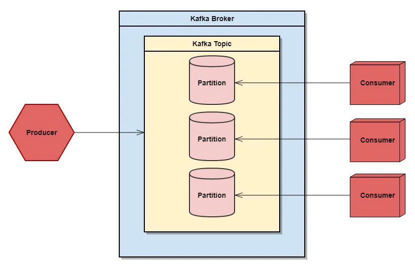

# Apache Kafka / Zookeeper
 
## Managing user in ubuntu
- Adding user 
```
sudo adduser <kafka-user-name>
```  
- Adding it to sudo group
```
sudo adduser <kafka-user-name> sudo
```
- Changing user 
```
su -l <user-name>
```
> - A Kafka topic is the category, group, or feed name to which messages can be published. However, Kafka’s default behavior will not allow you to delete a topic. To modify this, you must edit the configuration file, which you will do in this step.
> - in `config/server.properties` add
> `delete.topic.enable = true`
> - Next we also have to change log dirs to `log.dirs=/home/kafka/logs` : add that in `config/server.properties`
> - Creating a `systemd unit file` for starting kafka

## Event Streaming 
- Process of capturing data in real-time in the form of stream; 
  - Real time events : databases, sensors, mobile devices, cloud services, and software applications
- Storing these streams for later use or perform real time processing 
  - Like data manuplations, routing etc
- Event streaming thus ensures a `continuous flow` and `interpretation` `of data`  
- Eg. of event streams
  - Financial transactions
  - real time tracking cab, logistics, couriers
  - continuously capture and process data in IoT
  - Collect data immediately and respond to customer and process later

## Why kafka
- Lets take an example to understand
- In Ola services the driver's location is updated every second
- And that location is fetched by customer every second
- And there are nearly 1000's of drivers
> - QPS (Queries Per Second)
- So the quries to DB to store location and share them are very high nearly 1000 updateData qps for a region and  1000 getData qps
- And DB cannot handle this large throughput
- So kafka comes to picture, it doesnot have very high storage but has a very high throughput
- Another example
- Say a group chat with 100s of friends, each friend texts something and the update is send to each device this can be slow 

## What is Kafka and its use
- Mainly used for events streaming end-to-end
- 3 main functions are 
  1. Publish/Subcribe
  2. Process
  3. Store

## kafka working
- It is a distributed system consisting of server and client(Producer/Consumer)
- Communication is done via TCP network protocal
- Servers: 
  - In kafka there may be single or multiple Servers
  - The server running on the storage layer are called `brokers`
    - Brokers handle the storage, replication, and serving of data.
  - The there are `kafka connect servers` 
    - These are responsible for handling data streams and connections with external systems, like relational databases or other apps.

> ### `Replicas` are made for `topics`

## Kafka Architecture
- Producer: Sends data to the Kafka cluster.
- Consumer: Consumes data from the Kafka cluster.
- Kafka Cluster: Consists of multiple Kafka brokers.
- Brokers: Each broker acts as a server and hosts multiple topics.
- Topics: Topics are subdivided into partitions.
- Partitions: Serve consumer groups.
- Consumer Group: Comprises one or more consumers.
  - Partitions are automatically divided among the consumers within a group.
  - Each consumer group does not hold all partitions, but rather partitions are distributed among the consumers in the group.
  - If the number of consumers in a group exceeds the number of partitions, the extra consumers will remain idle.
- Rules:
  - A consumer can read from multiple partitions.
  - A partition can only be consumed by one consumer per group.

## Kafka APIs
- `Admin API` : `manage and inspect`: topics, brokers, and other Kafka objects 
- `Producer API`
- `Consumer API`
- `Kafka Stream API` : apply Stream processing applications and microservices
  - Used for processing and analysing data present in topics using simple, high-level operations such as filtering, transforming, and aggregating data 
- `Kafka Connect API` : Used for connecting kafka with external systems like DB, key-value stores, search indexes, and file systems
  - Simplifies the process of moving data between Kafka and other systems 
  - This is done by providing connectors that handle the data integration


## Zookeeper
- The balancing of partitions or distribution of partitons discussed above is managed by zookeeper
- Zookeeper uses kafka internally



## Running zookeeper
1. For new installation run following from the extracted folder
```
KAFKA_CLUSTER_ID="$(bin/kafka-storage.sh random-uuid)"
```
2. Format log dirs
```
bin/kafka-storage.sh format -t $KAFKA_CLUSTER_ID -c config/kraft/server.properties
```
3. Start zookeeper services
```
bin/zookeeper-server-start.sh config/zookeeper.properties
```
4. Start kafka Broker service
```
bin/kafka-server-start.sh config/server.properties
```

### Creating topic / List topics
```
bin/kafka-topics.sh --create \
  --topic <topic-name> \
  --bootstrap-server localhost:9092
```
```
bin/kafka-topics.sh --describe \
  --topic quickstart-events \
  --bootstrap-server localhost:9092
```
### Producer
```
bin/kafka-console-producer.sh \
  --topic quickstart-events \
  --bootstrap-server localhost:9092
```
### Consumer
```
bin/kafka-console-consumer.sh \
  --topic quickstart-events \
  --from-beginning \
  --bootstrap-server localhost:9092
```
### Terminate Kafka events
```
rm -rf /tmp/kafka-logs /tmp/zookeeper /tmp/kraft-combined-logs
```


## Event
- A thing that has just happened, combined with description that have just happened
- Like a user interaction, change in process like due date gone, a signal sent
- It is a combination of `notification` and `state`
- These events are stored as `key-value pair`
  - Key is not unique

## Kafka Cluster
- It is a group of `kafka brokers`

## Kafka Broker
- It is a server on which our `kafka` is running

## Kafka Producer
- Write new data into `kafka cluster`

## Kafka Consumer
- Consumes data from `kafka cluster`

## Zookeeper
- Maintains Health of `kafka cluster`

## Kafka Connect
- Get data from external entity
- This is `declarative integration`

## Kafka Stream
- Functionalitiy used for data transformation
- Takes data from cluster transforms it and sends it back to cluster


