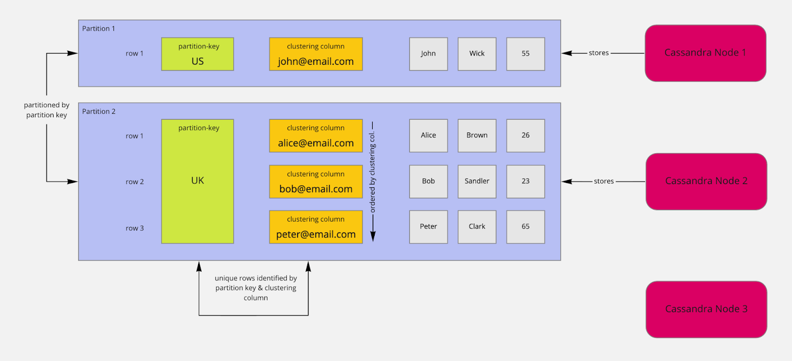

# Cassandra

- Unlike RDBMS where entities are defined first  
  - then model is created 
  - Finally queries are written for applcation
- But in Cassendra queries to be fired are defined first 
  - Then model is created 
  - Then data is defined

## Content

- [Cassandra Architecture](./cassandra.md#cassandra-architecture)
- [Cassandra Data Model](./cassandra.md#cassandra-data-model)
- [Cassandra vs RDBMS](./cassandra.md#cassandra-vs-rdbms)
- [Cassandra Query Language (CQL)](./cassandra.md#cassandra-query-language-cql)
- [Cassandra CRUD Operations](./cassandra.md#cassandra-crud-operations)
- [Cassandra Indexing](./cassandra.md#cassandra-indexing)
- [Cassandra Clustering and Partitioning](./cassandra.md#cassandra-clustering-and-partitioning)
- [Replication and Consistency in Cassandra](./cassandra.md#replication-and-consistency-in-cassandra)
- [Cassandra Performance Tuning](./cassandra.md#cassandra-performance-tuning)
- [Cassandra Security](./cassandra.md#cassandra-security)
- [Cassandra Backups and Restoration](./cassandra.md#cassandra-backups-and-restoration)
- [Cassandra vs NoSQL Databases](./cassandra.md#cassandra-vs-nosql-databases)
- [Cassandra Use Cases](./cassandra.md#cassandra-use-cases)
- [Cassandra Limitations](./cassandra.md#cassandra-limitations)
- [Cassandra Best Practices](./cassandra.md#cassandra-best-practices)
- [Cassandra Troubleshooting](./cassandra.md#cassandra-troubleshooting)

## Cassandra vs RDBMS

| Cassandra | RDBMS |
|-|-|
| `Cassandra Modeling Methodology` | `Sample Relational Model Methodology` |
| Flow : Application -> Model -> Data | Flow : Data -> Model -> Application |
| Model is build on queires to be fired | Model is based on entities to be stored |
| Distrubuted arch | Single Point of failure |
| Use CAP theorm | ACID prop |
| Denormalized | Normalized + Joins and Indices |
| Referential Integrity `not` Enforced | Referential Integrity Enforced |

## Data Flow into cassandra
- Cassandra Flows `log-Structured Storage Engine`, hence the data first goes to logs then to memeory
- ### Commit Logs
  - It is a write-Ahead Log (WAL) used by cassandra to ensure data functionality
  - If disk is flused then using data on log it can be recored
- ### MemTable
  - These are inmemory storage like RAM
  - Comment logs send the data to memtable
  - Once it is full, it flushes data to SSTable(Storad String Table)
- ### SSTable
  - Data ends up here
  - When the MemTable is full it flushes the data to SSTable
  - These tables are immutable
  - When new data comes it replaces old data if conflict occurs
  - Each of SSTable has `Bloom Filter` and `partition index` for efficient access
- ### Flow
  - Data comes to comment logs
  - Then it is passed to MemTable
  - Comment logs are not deleted as MemTable are not presistant storage
  - Hence when the MemTable are full they are flused to SStable
  - As MemTable empties comment logs deletes that section of data, as it is now persistant
- ### Durable Table
  - If durability is set to true then the data goes through comment logs to memtable
  - If it is set to false then data directly goes to Memtable
    
    ```sql
    CREATE KEYSPACE store 
    WITH replication = {'class': 'SimpleStrategy', 'replication_factor': '1'} 
    AND durable_writes = false;
    ```

## CAP
- ### Cassendra works on AP (Availability + Partition Tolerance)

## Decentralized Cassandra
- In Cassendra tables are not normalized 
- Instead related data is stored together
- And Joins are not supported in cassendra
- Example : Say we need to create tables for youtube comments 
  - Here we will define table for two types of queries
    1. Fetching comments on a video
    2. Fetching comments done by user
  - Generally in RDBMS we craete User table, Video table and comments table
  - But in cassendra two table will be created
    1. Vides table with comments included which are present in collection like `videoID1, array<commentIDs>`
    2. User table with comments included which are present in collection like `UserID1, array<commentIDs>`
  - This is denormalized but for performing queries it is very efficient 




## Cassandra Architecture
- ### Node
  - They are actual place where data is stored 
  - Communicate using gossip protocal
- ### Virtual Node
  - Nodes are logically divided in many parts 
  - So different data can be stored in each virtual node and accounting can be easy
- ### Decentraized
  - No node is superior to other 
  - All nodes have different roles
  - And there is no centralized controller
  - Hence if one node becomes unavailable then other node is added
- ### Request reciever node
  - The request reciever node becomes `coordinator node` for that request
  - If consistency is required then the `coordinator node` requests data from `replica ndoes`
  - The `replica nodes` are calculated using `cosistent hashing also`
- ### Primary Key and Partitioning
  - `Primary Key` consist of two types of keys
    - (Mandatory) Partition Keys (Including composite key)
    - (Optional) Clustering column
  - While creating a table the first set defines Partition key and rest defines clustering columns
  - Clustering Key : responsible for data sorting within the partition.

    ```sql
    CREATE TABLE learn_cassandra.users_by_country (
      country text,
      user_email text,
      first_name text,
      last_name text,
      age smallint,
      PRIMARY KEY ((country), user_email)
      --- country : Partition Key
      --- user_email : Clustering column
    );
    ```
- ### KeySpace
  - Alternate to Database in RDBMS
  - It is a top level container used for storing tables
  - While creating one we can define
    - Replication Strategy --> `'class':` 
    - Replication Factor --> `'replication_factor':`
  - Eg.
    ```sql
    CREATE KEYSPACE something
      WITHREPLICATION={'class':'SimpleStrategy', 'replication_factor':2};
    ```
  - `USE` command can be used to set `KeySpace`
  - Else we need to define it while craeting table like : `<keyspace-name>.<table-name>`

- ### Gossiper / Gossip Protocal
  - The node which sends a Gossip is called gossper
  - And it sends it to random selected few nodes
  - Gossip Lifecycle
    - Gossiper send a `GossipDigestSync` message to selected node
    - And the node replies with `GossipDigestAck` Acknolegdement to Gossiper
    - And Gossiper replies with `GossipDigestAck2` Acknolegdement to Node for its recognisition
  - This means node is healthy
  - Data send via gossip protocal
    - `Uptime and Health`: Whether a node is alive (UP) or dead (DOWN).
    - `Schema Changes`: If a node has a new table or keyspace definition
    - `Token Ranges` : How data is distributed across nodes.

- ### Consistency level in Cassandra
  - It offers tunable consistency, means we can tune the consistency
  - It offers read and write consistency
  - And the level dictates how many replicas should respond for successfull completaion of request
  - High Consistency, Low availability
    - ALL
      - Read : query is sent to all replicas, if all respond only then it is success
      - Write : when all replicas update the data successfully
    - QUORUM
      - Quorum = (Replication Factor / 2) + 1
      - Read : Acknowleged by majority number of replicas
      - Write : Acknowleged by majority number of replicas
    - LOCAL_QUORUM
      - Similar to quorum but only checks local data center
    - EACH_QUORUM
      - A quorum of nodes must acknowledge from each data center
  - High Availability, Low consistency
    - One
      - Acknowlegdement from only one replica is required
    - Two
    - Three
    - LOCAL_ONE
      - Acknowlegdement from only one `Local` replica is required
  - Special consistency level 
    - ANY
      - Only server write request
      - acknowledges if at least one node responds, even if all other replicas are down
    - Serial
      - Used with conditions like `IF NOT EXIST`, `UPDATE ... IF`
    - Local_Serial
  
- ### Partition and Data Distribution
  - Cassandra uses the partition key and keyspace to generate token using hashing algo  
  - Based on the token value the virtual node will be assigned to the data to be stored

- ### Phi Accural Failure Detector
  - Detect node failure based on time it takes to respond to a request
  - Adjust the likelihood of failure based on latancy
  - If the value exceeds the threshold then it declares the node as dead

- ### Snitch
  - Helps finding node with least latancy to replicate
    - Simple Snitch
      - Assumes all the nodes are on same network as gives same weight
    - Dynamic Snitching
      - Takes into account the current network latency of nodes, selecting the least-latency node to route requests.


## NodeTool
- Command line utility used to manage nodes
- Common use cases
  - `nodetool status` : Used to access status of node
  - `nodetool repair` : Repair data accross node for consistency
  - `nodetool decommission` : Remove node from cluster in same manner
  - `nodetool flush` : Forces the node to flush its memtable to disk.
  - `nodetool cleanup` : Removes any unnecessary SSTables from a node after a node is removed or data is relocated.

## Static column
- If a partition has a non primary column which has same value throughout the column then it will craete one instance of that value and remove the column and the value is shared accross the table
- if a new cell in that same column is added with different value then this column will go back to usual i.e storing data for each row


## Cassandra Data Update Lifecycle
- Node 1 updates partition P1 with new data (timestamped).
- Node 1 gossips the update to other nodes in the cluster.
- Node 3, with a replica of P1, does not know about the update yet.
- Node 3 receives the update from gossip or direct communication.
- Node 3 compares timestamps of its replica of P1 and the updated version from Node 1.
- If Node 3 has an older version, it fetches the updated data from Node 1.
- Node 3 updates its replica to match the latest version of P1.


## Cassandra Request Cycle
- Say data is to be fetched
- So it will go to a node and the node will become coordinator node
- Coordinator node will check the request's metadata and compare with the metadata it has
- Using the metadata in the request it generates the token
- Once the token is generated, if coordinator node has all the data it aggregates the data and sends the response
- If not then if forwards the request to other node which has data
- Based on the consistency level (e.g., QUORUM, ONE, ALL), Cassandra retrieves data from multiple replicas.
- Then the data is sent back to coordinator node
- Then the data is aggregated and send back to client

## Cluster Load Balacing policy
- TokenAwarePolicy
- RoundRobinPolicy
- DCAwareRoundRobinPolicy

## Hinted Handoff
- When one Node is temperory down 
- The data of that node is sent to other nodes for temperory storing it
- When the is back online it takes the data back

## UPSERT (Update + Insert)
- When inserting the data if the data exist it is updated
- There is no new clause for it, it is just `INSERT` clause which functions as UPSERT

## DataTypes

- ### Basic Data Types in Cassandra

| Data Type  | Description |
|------------|------------|
| `ascii`    | Stores US-ASCII characters only. |
| `text`     | Stores UTF-8 encoded strings. |
| `varchar`  | Alias for `text`. |
| `int`      | 32-bit signed integer. Range: -2,147,483,648 to 2,147,483,647. |
| `bigint`   | 64-bit signed integer. Useful for storing large numbers. |
| `varint`   | Arbitrary precision integer. Can store very large numbers but is slower than `int` or `bigint`. |
| `float`    | 32-bit floating-point number. Less precise than `double`. |
| `double`   | 64-bit floating-point number. More precise but uses more storage. |
| `decimal`  | Arbitrary precision floating-point number. More accurate but requires more processing power. |
| `boolean`  | Stores `true` or `false`. |

- ### UUID and TimeUUID

  - **UUID (Universally Unique Identifier)**
    - 128-bit identifier, unique across space and time.
    - Useful for ensuring uniqueness without relying on sequential IDs.
    - Example: `550e8400-e29b-41d4-a716-446655440000`.
    - Generated using `uuid()` function in CQL.

  - **TimeUUID (Version 1 UUID with Timestamp)**
    - Special type of UUID that includes a timestamp component.
    - Useful for sorting events chronologically.
    - Example: `f81d4fae-7dec-11d0-a765-00a0c91e6bf6`.
    - Generated using `timeuuid()` function in CQL.


| **Function**               | **Example**                                                         | **Use Case**                                                      |
|----------------------------|---------------------------------------------------------------------|-------------------------------------------------------------------|
| **`uuid()`**                | `SELECT uuid();`                                                   | Generates a random `uuid`. Useful for globally unique identifiers.|
| **`now()`**                 | `SELECT now();`                                                    | Generates a `timeuuid` based on the current timestamp. Ideal for time-based event ordering. |
| **`minTimeuuid(timestamp)`**| `SELECT minTimeuuid('2025-02-06 00:00:00');`                       | Generates the earliest possible `timeuuid` for a given timestamp. Useful for range queries. |
| **`maxTimeuuid(timestamp)`**| `SELECT maxTimeuuid('2025-02-06 00:00:00');`                       | Generates the latest possible `timeuuid` for a given timestamp. Useful for range queries. |
| **`unixTimestamp(timeuuid)`**| `SELECT unixTimestamp(now());`                                     | Converts `timeuuid` to the timestamp (in milliseconds) when it was generated. Useful for extracting timestamps. |


- ### INET (IP Address)
  - ### INET Data Type
    - Stores IPv4 or IPv6 addresses.
    - Useful for tracking user activity, logging, and networking.
    - Example: `'192.168.1.1'` (IPv4) or `'2001:db8::ff00:42:8329'` (IPv6).

- ### Collection 
  - Storing group of data 
  1. List
      - Ordered collection (May contain duplicates)
      - While creating table use 
        - Syntax : `field_name LIST<Basic-Datatype>` 
        - Example : `emails LIST<TEXT>`
      - Inserting data

        ```sql
        INSERT INTO users (id, name, emails) 
        VALUES (uuid(), 'John Doe', ['john@example.com', 'doe@example.com']);
        ```
      
      - Limitation
        - Since lists maintain order, updates can be expensive
        - Retriving specific element is not possible
  2. Set
      - Unordered Unique collection
      - Syntax : `field_name SET<Basic-Datatype>` 
      - Example : `emails SET<TEXT>`

        ```sql
        INSERT INTO students (id, name, subjects) 
        VALUES (uuid(), 'Alice', {'Math', 'Science', 'History'});
        ```

      - Limitation : Removing elements is efficient, but ordering is not guaranteed
  3. Map  
      - Unoredered unique key-value pair
      - Syntax : `field_name MAP<Key: Value >` 
      - Example : `skills MAP<TEXT, INT>`
      
        ```sql
        INSERT INTO employees (id, name, skills) 
        VALUES (uuid(), 'Bob', {'Java': 5, 'Python': 3, 'SQL': 4});
        ```
    
    - Limitatation : There is no direct way to get all keys or values efficiently
- ### Tuple
  - fixed-size ordered collection of elements 
  - Eg in create table  
    - `activity tuple<timestamp, text>`
  - Insert

    ```sql
    INSERT INTO user_activity (user_id, activity) 
    VALUES (uuid(), (toTimestamp(now()), 'Login'));
    ```

  - But cannot be partially update

- ### UDT (User Defined Type)
  - Creating custom data type
  - Eg.
  
    ```sql
    CREATE TYPE address (
        street text,
        city text,
        zipcode int
    );
    ```

  - This can be used in another table

    ```sql
    CREATE TABLE users (
        user_id UUID PRIMARY KEY,
        name text,
        home_address frozen<address> -- Using UDT as a column type
    );
    ```

  - Inserting data

    ```sql
    INSERT INTO users (user_id, name, home_address) 
    VALUES (uuid(), 'John Doe', { street: '123 Main St', city: 'Mumbai', zipcode: 400001 });
    ```

  - UDT cannot be partially modified
  - Cannot be used as partition key 

- ### other datatypes (TimeStamp, Date, Time, Duration)

| Data Type  | Description | Table Definition | Insertion Example | Insertion Format Example |
|------------|-------------|------------------|-------------------|--------------------------|
| **Timestamp** | Consistent format: `YYYY-MM-DD HH:MM:SS`<br>Stores both date and time | `event_time timestamp` | ```sql INSERT INTO events (event_id, event_name, event_time)```<br>``` VALUES (uuid(), 'Product Launch', toTimestamp(now())); ``` | `2025-02-06 15:30:45` |
| **Date** | Stores only date in `YYYY-MM-DD` format | `event_date date` | ```sql INSERT INTO events (event_id, event_name, event_date) ```<br>``` VALUES (uuid(), 'Conference', '2025-03-15'); ``` | `2025-03-15` |
| **Time** | Stores only time in `HH:MM:SS` format | `event_start_time time` | ```sql INSERT INTO events (event_id, event_start_time)```<br>``` VALUES (uuid(), '12:30:00'); ``` | `12:30:00` |
| **Duration** | Stores duration. Two format options:<br>1️⃣ ISO 8601 format: `P[n]Y[n]M[n]DT[n]H[n]M[n]S` or `P[n]W`<br>2️⃣ ISO 8601 alternative format: `P[YYYY]-[MM]-[DD]T[hh]:[mm]:[ss]` | `event_duration duration` | ```sql INSERT INTO events (event_id, event_name, event_duration) ```<br>``` VALUES (uuid(), 'Task', 'P2Y3M5DT6H30M'); ``` | `P2Y3M5DT6H30M` (ISO 8601 format)<br>`P2025-03-15T12:30:00` (ISO 8601 alternative format) |


- ### Blob 
  - Creating table with blob
  
    ```sql
    CREATE TABLE users (
    user_id UUID PRIMARY KEY,
    username TEXT,
    profile_picture BLOB
    );
    ```

  - Insert example

    ```sql
    INSERT INTO users (user_id, username, profile_picture)
    VALUES (uuid(), 'john_doe', 0x89504E470D0A1A0A0000000D494844520000000200000001010300000002000004E52B6D8000000);
    ```

- ### Counter
  - They can be initialized with any value 
  - Can only be incremented or decremented in `atomic operations`
  - Counters cannot be assigned a new value
  - Cannot be a primary key
  - Creating a table with counter
  
    ```sql
    CREATE TABLE page_views (
    page_id UUID PRIMARY KEY,
    view_count COUNTER
    );
    ```

  - Inserting value

    ```sql
    INSERT INTO page_views (page_id, view_count)
    VALUES (uuid(), 10);  -- Initializes the counter with a value of 10
    --- Updating counter
    UPDATE page_views
    SET view_count = view_count + 1
    WHERE page_id = <your-page-id>;
    ```


## Commands
- ### Truncate
  - If used then data from persistance storage will be removed
  - If once removed then can be restored from backup
  - If used with `JMX` command will delete from all nodes
  - If even one node is down then the command will fail
- ### Alter
  - All functionalites are available except
  - Cannot change primary key column
- ### Source 
  - Used to run a `.cql` file
- ### Where
  - **We need to mention `partition key` when using `where` clause**
- ### ALLOW FILTERING
  - Used for non standard queries
  - When you want to use where clause without using primary key
  - Just write `ALLOW FILTERING` at the end of query
  - `SELECT * FROM users WHERE age = 30 ALLOW FILTERING;`
- ### Time-To-Live
  - We can set expiry on the data 
  
    ```sql
    INSERT INTO users (user_id, username, email) 
    VALUES (1, 'john_doe', 'john@example.com') 
    USING TTL 86400; --- 86400 seconds : 1 day
    ```

  - `Cassandra compaction process` : Is a background process that runs at fixed interval of time
  - Once this process detects expired data it deletes it
  - But the data may not be deleted after the TTL, it is only deleted when `Cassandra Compaction Process` runs
- ### Secondary Key
  - Even after primary indexing we want to further divide table so we can use it
  - `CREATE INDEX ON table_name (column_name);`
- ### Materialized view 
  - Same as View in SQL
  - Example

    ```sql
    --- Base table
    CREATE TABLE orders (
        order_id UUID PRIMARY KEY,
        customer_id UUID,
        order_date timestamp,
        total_amount double
    );


    --- View table
    CREATE MATERIALIZED VIEW orders_by_customer AS
      SELECT customer_id, order_id, order_date, total_amount
      FROM orders
      WHERE customer_id IS NOT NULL
      PRIMARY KEY (customer_id, order_date);

    ```
