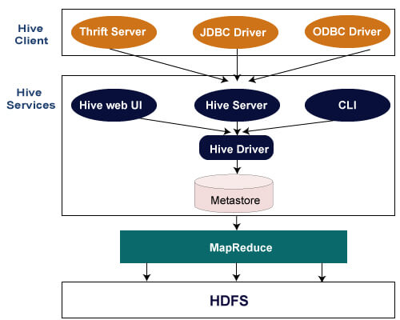
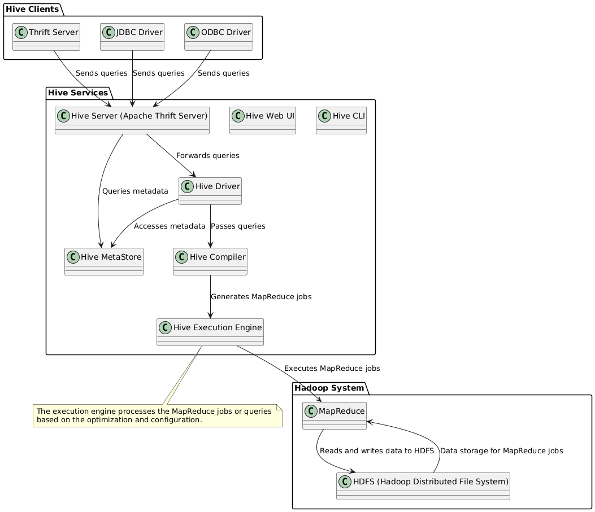

# Hive 
- Data warehousing system
- Helps in reading, writing and managing large dataset
- Uses indexing, can operate on compressed data, supports UDF(User defined functions)

## Hive Architecture

<p style="text-align:center;">

</p>

- ### Hive Client
  - Interface through with users interact with hive
  1. Thrift Server
  2. JDBC driver
  3. ODBC driver : Supports C++, C database connectivity
- ### Hive Services
  1. Hive CLI : execute hive queries and command
  2. Hive web UI 
  3. Hive MetaStore : Central repo to store all the meta data
  4. Hive Server(A.K.A apache Thrift Server) : Accept request from different client and provides it to hive driver
      - It handles queries, manages connections, and sends results back to the clients.
      - It can process incoming data and metadata requests
  5. Hive Driver : Recives queries from different sources as shown in image and passes it to compiler
  6. Hive Compilet : Convert HQL(Hive Query Language) command to mapReduce job
  7. Hive Executioner engine : At the end it is the one that executes the command in optimised manner

<p style="text-align:center;">

  <details>
    <summary>
      uml code
    </summary>

      ```
      @startuml
      !define RECTANGLE class

      ' Client Side
      package "Hive Clients" {
        RECTANGLE "Thrift Server" as ThriftServer
        RECTANGLE "JDBC Driver" as JDBCDriver
        RECTANGLE "ODBC Driver" as ODBCDriver
      }

      ' Hive Services
      package "Hive Services" {
        RECTANGLE "Hive CLI" as HiveCLI
        RECTANGLE "Hive Web UI" as HiveWebUI
        RECTANGLE "Hive MetaStore" as HiveMetaStore
        RECTANGLE "Hive Server (Apache Thrift Server)" as HiveServer
        RECTANGLE "Hive Driver" as HiveDriver
        RECTANGLE "Hive Compiler" as HiveCompiler
        RECTANGLE "Hive Execution Engine" as HiveExecutionEngine
      }

      ' Hadoop System
      package "Hadoop System" {
        RECTANGLE "MapReduce" as MapReduce
        RECTANGLE "HDFS (Hadoop Distributed File System)" as HDFS
      }

      ' Relationships
      ThriftServer -down-> HiveServer : "Sends queries"
      JDBCDriver -down-> HiveServer : "Sends queries"
      ODBCDriver -down-> HiveServer : "Sends queries"

      HiveServer -down-> HiveDriver : "Forwards queries"
      HiveDriver -down-> HiveCompiler : "Passes queries"
      HiveCompiler -down-> HiveExecutionEngine : "Generates MapReduce jobs"
      HiveExecutionEngine -down-> MapReduce : "Executes MapReduce jobs"
      MapReduce -down-> HDFS : "Reads and writes data to HDFS"
      HDFS -down-> MapReduce : "Data storage for MapReduce jobs"

      HiveServer -down-> HiveMetaStore : "Queries metadata"
      HiveDriver -down-> HiveMetaStore : "Accesses metadata"

      ' Optional: Adding a note about the process flow
      note bottom of HiveExecutionEngine
        The execution engine processes the MapReduce jobs or queries 
        based on the optimization and configuration.
      end note

      @enduml
      ```

  </details>

</p>




## Starting hive
- After starting hadoop and yarn
- Use `hive --service metastoreHive` to create hive session
  - Without this hive may start but may not work properly
- on another tab use `hive`