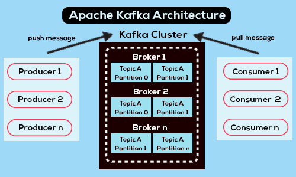

# Kafka
- Distributed event streaming platform
- Primarily used for real time data pipeline and streaming applications



## Core Componenets
- `Producer` : Publish message to kafka topics
- `Consumer` : Subscribe to a topic and processes/consumes the message
- `Broker` : Kafka Server, or the location where the events/messages are stored 
- `Topics` : Category to which messages are sent to 
- `Partition` : A topic is split into partitions, allowing parallel processing
- `Offset` : The unique ID of each message within a partition
- `Consumer` Group : A group of consumers working together to consume messages
- `Record` : Datatype used to store data in kafka. Record consists of
  - `Key`(Optional) : Used to determine which partition record will go to 
    - If not provided then random partition is selected using round-robin
  - `*Value`(Requred) : Actual data in any format
  - `TimeStamp`(Optional) 
  - `Header`(Optional) : Metadata of message
  - `Offset`(Auto-Assigned by kafka) : Unique ID of record in a partition, is incremental for each new record
- `Replication` : Replicas of partitions are good for scaling
  - `Leader Partition` 
    - If there are multiple replicas of partition then zookeeper creates a `leader partition`
    - Only on `leader partition` both read and write operation can be perfromed
  - `partition followers`(partition replicas)
    - Replicas are `partition followers` which support read-only operation
    - `partition followers` update themselves from `Leader partition`
    - all `Partition followers` and the `partition leader` each reside on different broker
### Other details about kafka
- Partitions of a Topics may or may not be stored on same broker
- all `Partition followers` and the `partition leader` each reside on different broker
- Zookeeper's responsibility
  - Broker managerment : Zookeeper maintains list of brokers
  - Handles dynamic addition and removal of brokers
  - Leader Election : Elects new partition leader if a broker goes down 
    - Zookeeper do not create new partition or broker, they just elect
  - Stores metadata of : topics, partitions, broker-partition-mapping and their status.

## Data flow in kafka
- Before producer sends `record` it asks for `topic's` required `partition leader` and on which `broker` that `partition leader` is located
- Then it sends data to the `partition leader` to be consumed
- Then the record on `partition leader` is replicated to `partition followers`
- Next consumer consumer consumes record


## Starting kafka
- Go to kafka home

```
cd $KAFKA_HOME
```

- Start zookeeper and kafka in separte terminal

```
bin/zookeeper-server-start.sh config/zookeeper.properties
bin/kafka-server-start.sh config/server.properties
```

## Basic kafka commands
- Creating topic

```
bin/kafka-topics.sh --create \
--bootstrap-server localhost:9092 \
--replication-factor 1 \
--partitions 1 \
--topic gft-topic
```

- List topics

```
bin/kafka-topics.sh --list --bootstrap-server localhost:9092
```

- Describe topic

```bash
# Describe single topic
bin/kafka-topics.sh --bootstrap-server localhost:9092 --describe --topic <topic-name>
# Describe all topics
bin/kafka-topics.sh --bootstrap-server localhost:9092 --describe --topic 
```

- Create producer

```
bin/kafka-console-producer.sh --bootstrap-server localhost:9092 --topic gft-topic
```

- Create consumer

```
bin/kafka-console-consumer.sh --bootstrap-server localhost:9092 --topic gft-topic --from-beginning
```

| **Example**                                         | **Description**                              |
|-----------------------------------------------------|----------------------------------------------|
| `--from-beginning`                                   | Reads messages from the beginning of the topic. |
| `--group my-consumer-group`                          | Specifies a consumer group for offset management. |
| `--partition 0 --from-beginning`                     | Consumes messages from a specific partition only. |
| `--partition 0 --offset 5`                           | Starts reading from a specific offset. Supports `earliest`, `latest`, `<number>`. |
| `--timeout-ms 10000`                                 | Specifies wait time (in ms) if no messages are available. |
| `--max-messages 10`                                  | Limits the number of messages consumed.       |
| `--property print.key=true`                          | Displays message keys.                        |
| `--property key.separator=:`                         | Defines the key-value separator.              |
| `--property print.timestamp=true`                    | Shows the timestamp of messages.              |

- Delete topic
  - Before deleteing topic add following to `server.properties` file

    ```
    delete.topic.enable=true
    ```

  - Now we can delete topic
 
    ```
    bin/kafka-topics.sh --bootstrap-server localhost:9092 --delete --topic <topic-name>
    ```

## Creating multiple brokers on same node
- (Optional) Creating dirs for seperate logs

  ```
  mkdir -p /tmp/kafka-logs-1
  mkdir -p /tmp/kafka-logs-2
  ```

- Creating properties file for each broker
  
  ```
  cp config/server.properties config/server-1.properties
  cp config/server.properties config/server-2.properties
  ```

  ```
  # server-1.properties
  broker.id=1
  listeners=PLAINTEXT://localhost:9092
  log.dirs=/tmp/kafka-logs-1
  num.partitions=3
  delete.topic.enable=true
  ```

  ```
  # server-2.properties
  broker.id=2
  listeners=PLAINTEXT://localhost:9093
  log.dirs=/tmp/kafka-logs-2
  num.partitions=3
  delete.topic.enable=true
  ```

- Starting broker

  ```
  bin/kafka-server-start.sh config/server-1.properties
  bin/kafka-server-start.sh config/server-2.properties
  ```

- Creating topic on multiple brokers

  ```
  bin/kafka-topics.sh --create --bootstrap-server localhost:9092,localhost:9093 \
  --replication-factor 2 --partitions 3 --topic multi-broker-topic
  ```

- Starting producers and consumers

  ```
  bin/kafka-console-producer.sh --broker-list localhost:9092,localhost:9093 --topic multi-broker-topic
  bin/kafka-console-consumer.sh --bootstrap-server localhost:9092,localhost:9093 --topic multi-broker-topic --from-beginning
  ```

  
