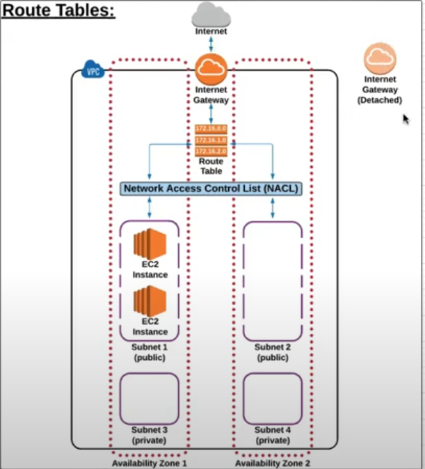
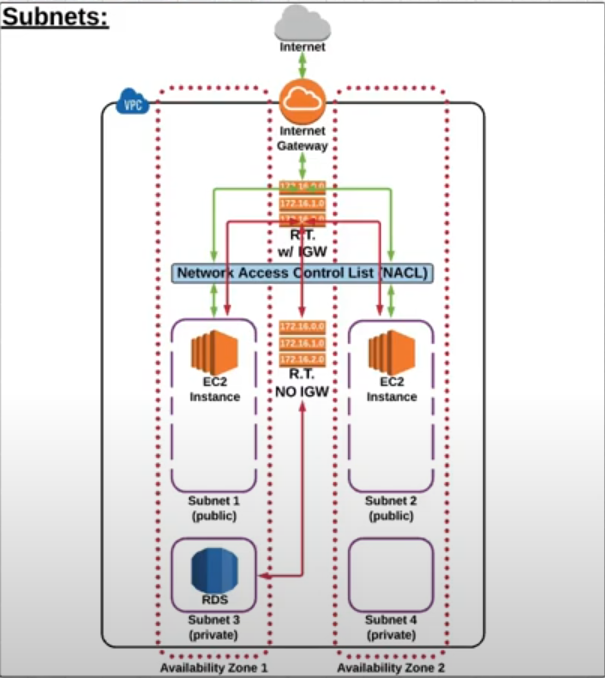
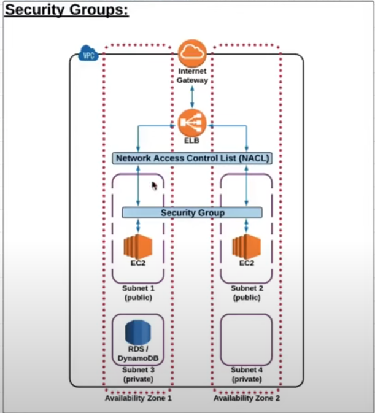
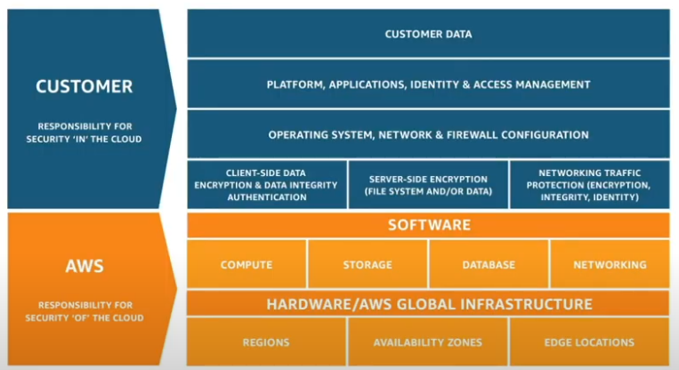
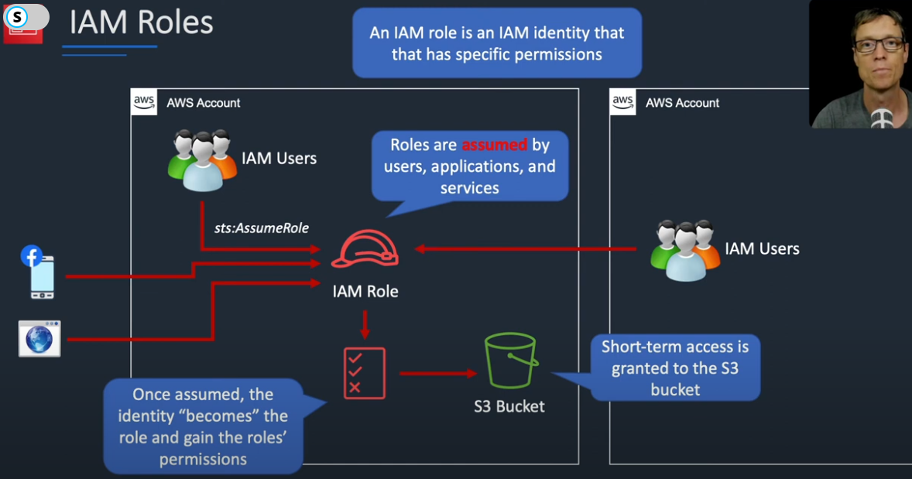

# Cloud Computing
- It is on-demand network access to shared computing resources
- A model for managing storing and processing data online via the internet
## Delivery model/ Service model of cloud computing 
- Types
	- SaaS : Software as a Service
	- PaaS : Platform as a Service
	- IaaS : Infracture as a Service 
- Software as a service : allows users to connect to and use cloud-based apps over the Internet
	- Mostly end users are frequest users like google workspace, microsoft office 365
- Platform as a service : a complete development and deployment environment in the cloud
	- cloud computing service model that provides a platform for developers to build, test, deploy, manage, and update applications
	- Used by developers Eg: Google app engine, Heroku
- Infrastructure as a service : a cloud computing model that provides on-demand access to computing resources such as servers, storage, networking, and virtualization
	- Used by System admins : amazon EC2, google computing engine

## Cloud deployment model
- Types
	- Public Cloud (Most openness) 
	- Hybrid Cloud
	- Private Cloud (Least openness)
- Public Cloud :  Deployed globally
	- Shared resources
	- Cost is generally pay on amount of resouces used
	- Management offloaded to hosts
- Private Cloud : Deployed locally
	- Managed by customers
	- Private resources
- Hybrid Cloud

## Amazon S3 (Simple Storage Service)
### Core conecpts
- Buckets
	- General purpose File storage
- Objects
	- Contents stored in buckets like media, js, csv, zip...
	- Max size 5TB
- Accessing
	1. using url : http://s3/amazonaws.com/<bucket_name>/<object_name>
	2. Using programs like : django, node...
- S3 storage classes
	- allows to reduce cost with reduce in CAP  
	- Eg: Standard, Intelligent, Infrequent Access, Glacier
> - HOT data: data with more frequest access
> - COLD data : data with less frequest access
- Security
	- Public access is blocked by default
	- Data Protection : High durability and availablity gaurantee
	- Access : managed AWS IAM ( Identity and Access Management)
	- Auditing
		- Access Logs, Action logs, alarm
	- Infra security
## EC2
- EC2 : Elastic Compute Cloud | Infrastructure as a service | IaaS
- Sizing and configs 
	- OS : windows and Linux
	- Compute power and cores
	- RAM
	- Storage (EBS or/and EFS)
	- Network card
	- Firewall rules
	- Bootstrap script (First launch)

## Storage in AWS
- Types:
	- Block storage : EBS (Elastic block store) for persistant data, Instance storage( Cache storage) 
	- Object storage : S3(simple Storage Service) 
	- File storage : EFS(Elastic File System) only for linux works on NFS, FSX for windows
- Types of SQL and No-SQL
	- Amazon Arora : Fully managed RDBMS
		- Combines MySQL and PostgreSQL
	- DynamoDB: NoSQL, key value pair
	- Amazon Redshift: Data warehouse & Petabyte Storage
		- Data warehouse: centralized repository of data from multiple sources, designed for analysis and reporting
			- Basically incomming data is not stored directly and it is processed first and then stored
	- Amazon Neptune: Graph based DB

## ELB ( Elastic Load Balancer )

## AMI (Amazon Machine image)
- Pre-configured with OS, softwares and other settings

## VPC (Virtual Private Network)
- `Logically isolated` virtual network
- Resources inside one vpc can communicate with each other
- Resources cannot communicate with resources outside vpc and pubic network
	- They need to be configured to do the same
- AWS VPC is a `regional service`
- Each region has its own `default VPC` 
- EC2, Load balancers,... are resources inside a VPC
- S3 exist outside VPC

- ### Internet gateway (IGW)
	- Enables resources in VPC to access internet
	- Only one internet gateway can connect with a VPC
	- IGW is not `Avability Zone Specific` (IGW not tied to specific zone)

- ### Route Table
	- Set of rules that tell where to direct traffic to in a VPC
	- A VPC can have multiple route tables
	- A route table cannot be deleted if it has dependencies

- ### Network access control list (NACL/ ACL)
	- Optional layer of security for a VPC that acts as a firewall for controlling traffic to one or more subnets
	- Default VPC has a NACL associted with default subnets
	- NACL for default VPC allows all inbound and outbound traffic
	- There can be multiple NACL in a VPC
	- All the subnets need be associted to specific NACL or else they will be assigned to default NACL
	- Rules are evaluated from the lowest to highest 
	- If first rule applies to traffic then it is executed before moving to next rules
	- Eg:
		- Rule 80 : HTTP rule : Allow
		- Rule 90 : HTTP rule : Deny
		- Now here although second rules says to deny HTTP traffic but the first rule with lower rule number will allows it 

- ### Subnets
	- It can be in only one availability zone and cannot span access zone
	- We can add one or more Subnets in a VPC in a availability zone
	- They can be either public or private
	- Public subnets have a route to the internet 
	- Private subnets cannot have a route to the internet
	- Subnets can have communication with other subnets in a VPC
	- Subnets are basically connected to a route table 
	- So a route table with private cannot have public access

- ### Security Groups
	- They are very similar to NACLs in terms of allowing traffic, but they are found on instance level
	- And also their allow/deny rules work different from NACL 
	- They evaluate all the rules before passing the traffic
	- All the traffic is denied by default unless specifically mentioned allow

- ### NAT gateway
	- Say the OS needs to update itself which is in private subnet
	- To give it access of internet we create a NAT gateway in the public subnet 
	- Then provide its IP to private subnet
	- This NAT gateway is a just outbound and does not accept any inbound traffic
	- A single NAT Gateway is associated with a specific Availability Zone (AZ).
	- However, it can be associated with multiple subnets, both within the same AZ and across different AZs

> ## Network interface card (NIC)
> - Present in a PC or laptop to connect it to different systems or basically internet
> ## Elastic Network interface AWS (ENI) 
> - Logical networking component in a VPC that represents a virtual network card / Virtual NIC
> ### By default each instance is connected to a Virtual NIC but if we want to attach another Virtual NIC for higher performance we can by creating additional Virtual NIC  

## AWS cloudwatch
- Used for monitering services and instances
- If there is anormality then it collects data of it and rings an alarm
	- Eg: CPU utilization 90% alarm
- Types of monitering 
	- Basic: Metric published after every 5mins
		- Free of charge
		- Supported by most services
	- Detailed: Metric published after every 1min
		- Additional charges incured
		- Supported by some services and needs manual config
- Metric resolution: `Standard resolution` and `High resolution`
 	- Basic: 
		- Standard resolution: data collected after every 5 mins
		- Detailed resolution: data collected every 1min and published every 5min
	- Detailed:
    - Standard resolution: data collected after every 1 mins
    - Detailed resolution: data collected every 1sec and published every 1min 
## CloudTrail
- Analyze `who` performed `what` action and `when` on your resources
## Auto Scaling Groups (ASG)
- Automatically scales up and scales down
	- Just specify min and max number of instances
## AWS System Manager
- Automate and manage admin task
- Manage multiple instances
- ### Fleet manager
	- Single platform for monitering health, server and perfrom various system admin task
- ### Session manager
	- Fully managed service that allows to `securely manage and access` `EC2 instance`
## Loadbalancer in AWS
- Types:
	1. Application load balancer
		- Distributes traffic based on HTTP, HTTPS, websockets etc.
	2. Network Load Balancer
		- Distributes traffic at Network layer (Layer 4)
	3. Gateway load Balancer
		- Serves as a gateway for incoming internet traffic
	4. Classic Load balancer
		- Old not used now 
- Health Checks for Load Balancer
	- As load balancer forward traffic to different instances they need to know if it is healthy
	- We just need to provide the route that performs health check
- Stickiness | session affinity | session persistance
	- Directs incoming traffic from a specific client to specific server for the duration of session
	- Required in stateful instances
- `X-Forwarded-For (XFF)` :  header is a standard HTTP header used to identify the original IP address of a client when its request is forwarded by one or more proxies, such as a load balancer

## AWS CloudFormation
- Infrastructure as code
- Its Teraform for AWS cloud

## AWS Elastic BeanStalk 
- It is a fully managed PaaS (Platform as a Service)
- A little like Vercel and Render which allows to delpoy website without managing underlying infra.
- We just need to upload code and rest of deployment is taken care by EBS 
	- The env can be node, django, container
- Health monitering, load balancers, autoscalling, security is managed by EBS
## AWS direct connect 
- Service that allows to establish a dedicated network connection between on-premise networks or one or more VPC 
- Basically allows to bypass internet to connect with local services 
## Amazon Route 53
- Domain Name service (DNS)
## AWS lambda v/s Elastic BeanStalk
- Both are PaaS in a way
- While lambda is triggered by events
- Lambda is ideal for microservices and small applications
- We usually create full fledge application using Elastic Beanstalk 
## AWS SNS (Simple notification service)
- Uses Pub-Sub system
- Fan-out approach (Single message to multiple subs)
- Eg. of subscriber SQS, Lambda, Email
## AWS SQS (Simple queue system)
- Queing service for message processing
- A system must have a provision to notify SQS about new event discovered
- Typically processed by a single consumer
## AWS CloudFront
- CDN service offered by aws
## AWS ElastiCache
- Similar to Redis for AWS which is AWS managed 

# Shared Responsibility Model
> - ### AWS is reponsibe for security `of` the cloud
> - ### customers is reponsibe for security `in` the cloud
- Managed svc : S3, RDS, DynamoDB
- Unmanaged svc : EC2, EBS

## AWS IAM 
- Things in IAM
	- User : 
	- Groups : Collection of users with same access
	- Role : Used for `deligations` and are `assumed`
	- Policy : It can be applied to group
		- Permission for the identities and resources associated to it
 		- User gains the permissions that are applied to the group in which they are in
		- It can also be called `identity based policy` as it is applied to an identity like user, group and/or roles  
- IAM users: 	
	- Root user: The one who creates account and has full access to everything in account
		- Best practice is to avoid using root user and using user with limited permissions
	- User : Have no premissions by default
		- Friendly name
		- Amazon resource name
- IAM groups: are of three types
	- Admin group
	- Development group
	- Operations group 	
- IAM Role: 
	- Roles are entites that we create to grant temperory security credentials to user, application, svc.
	- These credentials allow entity to perform specific actions with your AWS account

## AWS Inspector
- Amazon Inspector is an automated security assessment service to test the network accessibility of EC2 instances

## DDoS (Distributed Denial of Service)
- A cyber attack on a server or network, intending to distupt normal operations
- This is done by flooding the target with a constant flood to traffic
- If attack is from single network it is called DoS attack and can be identified and connection can be closed
- And when attack comes from multiple systems it is called DDoS
- `Botnet` : An army of infected computers to do DDoS attack

## AWS shield
- Protect against all known infra level 3 & 4 attack
- There are two tier of AWS shield: `Standard` and `Advanced`
- They are auto applied on following svc: 
	- Elastic Load Balancers 
	-	Amazon CloudFront distributions
	- Amazon Route 53
- Difference between `AWS shield` and `AWS WAF(Web Application Firewall)`
- AWS WAF provide protection on application layer
- While AWS shild provide protection on Infra layer of OSI model 

## AWS well architected framework
- 6 pillars of well architectured framework
	- Operational Excellence
	- Security
	- Reliability
	- Performance Efficiency
	- Cost optimization
	- Sustainability
- Operational Excellence
	- Perform Operations as code (Infra as code)
	- Make frequest small reversible changes
	- Anticipate failure
	- Learn from operational failures
- Security
	- Implement a Strong Identity Foundation
		- Grant minimum necessary permissions to user
		- Divide responsibilities among multiple individuals to prevent unauthorized access and malicious activities
		- Use central system to manage user identity, access control and auth
		- Eleminate long term static credentials
	- Enable traceability
		- Real-time monitering
		- Log and metric collection
		- Automated investication and response
	- Apply security to all layers
	- Automate Security best practice
	- Protect data in transit and at rest
	- Keep people away from data
	- Prepare for Security events
-  Reliability
	- Automatically recover from failure
	- Test recovery procedures
	- Scale horizontally to increase aggregate workload availability
	- Stop guessing capacity
	- Manage change in automation
- Performance Efficieny pillar
	- Democratize Advanced Technologies : use managed service, PaaS, Low-code/no-code tools
	- Go Global in minuites: Use CDN, Global infra(Multiple availability zones)
	- Use serverless arch
	- Experiment more often
- Cost Optimization pillar
	- Implement Cloud Financial Management: Set budgets and foracast, cost allocations, cost monitering
	- Adopt consumption model: Pay-As-You-Go
	- Measure overall efficiency
	- Stop Spending Money on Undifferentiated Heavy Lifting: Use managed service, PaaS, Low-code/No-code tools
- Sustainability
	- Understand impact: carbon footprint, energy consumption
	- Establish Sustainability Goals, Maximize Utilization(No unused resources)
	- Use Managed Services, and latest service
	- Choose data center location wisely 

# Pricing AWS
### Pay-as-you-go
- Pay only for the service that you have used
### Reserved Instance (Save as you commit)
- When you commit for a specific period of time 1-3 years you get discount
- The discount is upto 72% compared to on-demand pricing
- There are three types in Reseved Instance (RI)
	1. All up-front (AURI) : Max discount
	2. Partial up-front(PURI) : Less discount compared to AURI
	3. No Up-front (NURI) : Least discount
### Pay less use more
- More the service you use less the usage charge 

### More on pricing
1. Compute
	- EC2 : pay for EC2 instances by the hour or second, depending on the instance type.
		- more you use, less pay less
	- Lambda : Pay based on number of requests and execution time
		- more you use, less you pay  
2. Storage	
	- S3 : Offers tiered storage depending on frequency of access 
		- Standard, Intelligent-Tiering, Standard-IA, One Zone-IA, Glacier, and Glacier Deep Archive
	- EBS : Priced based of storage size and amount of data transfered
3. Data Transfer
	- Data Transfer Out: Fees is charged in data transfered out of AWS
	- Data Transfer In: Generally no fees is charged

### EC2 instance types based on cost
- On-Demand Instances
	- Pay-as-you-go model
	- Ideal for short-term or unpredictable workloads
	- More expensive at long terms 
- Savings Plans
	- Commit using it for 1-3 years
- Dedicated Hosts
	- Physical server dedicated to you
	- High performance and security
	- More expensive than shared instances but offers better performance and control 
- Spot Instances
	- Other user's unused EC2 instances are used by my services
	- Cons: If the EC2 of other user gains workload then mine EC2 would drop in performance
		-	Instances can be interrupted if demand of other's EC2 instance increases
