# Introduction

- Data : Unorganised data with no meaning
- Information : Proceesed data so it can have some meaning
- DataBase : Place where data can be stored in can be easily sorted, managed, and accessed
- DBMS : Set of program to access, add, update and delete data stored
- Abstraction : hiding irrelevent data from users so make the usability more simplified
- DBMS v/s File System

> ### Source of data generation
> - Experimental data : Generated through clinical research and investigations
> - Observational data : Result of direct human observation and is usually real time
> - Complied data : Manually gathered data over time
> - Simulated data : Result of studing behaviour and identifying patterns

> ### Common data source
> - Human generated
> - Machine generated
> - Business generated : Data of stocks, financial institutions

> ### Common data types
> - Quantative data : Measurable like numbers and values
> - Qualitative data : Non mesurable, descriptive
> - Geospatial data : Location data
> - Digital data : image, audio, video data
> - Data from docs and scripts : Code, text doc, script etc

> ### Data format
> - Structured : Defined schema
> - Semi structured : Flexible schema
> - Unstructured : No schema

> ### Data Terminologies
> - Primay Data : Person or group that collect data themself
> - Secoundary Data : Data collected by third party
> - Data Analytics : Process to tech used to explore data
> - Data aggregation : Procedure used to gather data
> - Meta Data
> - Time series
> - Anonymized data
> - Augmented reality : Data analytics using ML and NLP
> - Data literacy : The ability to understand data to read and communicate as info

### Data storage and backup
- Full Backup : Covers backup of all data in hard-drive
- Differential backup : Backup of data generated and/or revised since last backup
- Incremental backup : Overs backup of only revised and changes made from previous backup

> DMBS is program to handle data not data itself
> But nowadays Database and DBMS exists together
> DBA - DataBase Administrator
> Consistancy Constraints

## Data migrations
1. Planning
    - Identifying stakeholders and data
    - Determining risks and backup stratergies
2. Analyzing
    - Explore the data
    - Determine the impact of migration cut-off point
    - Create data directory
3. Design
    - Develop source to target mapping
    - Determine ETL transforation used for migration
4. Implementation
    - Configure tools required for migrations and write scripts
5. Testing
    - Delpoy all tools required
    - Create migration test plan
6. Migration
    - Execute all the data migration steps
    - Go-live

### ETL (Extract Transform Load)
- Process to integrate and manage data from multiple source
- Extract : Get data from various places like API, CSV, Excel etc.
- Transform : Raw data is cleaned, validated and transformed
- Load : Data is finally loaded into the target

# Three Schema Architecture

- Physical Level
- Logical Level
- View Level

## Physical Level / Internal Level

- Lowest level
- Physical Schema
  - Tells what data is stored where and how
  - Eg. Maps, set, stack, Encription, decription, RB tree, N-arry tree etc
  - Need to design algo to efficiently <b>store and access</b> data

## Logical Level / Conceptual Level

- Describes relationship among the existing data
- Users does not need to be aware of Physical schema
- DBA, decides what info in DB needs logical level of abstraction
- goal : ease to use
- DBA(Data Base Administrator)

## View Level / Extranal Level

- Highest level of abstraction
- Used by end-users
- This level contains various subschema for various types of users
- Also Security mecahnisms are provided to prevet users from accessing certain data

> Instance - Collection of information stored in DB at any moment is called an instance in DB

> Data Model - ways to describe the design of DB at logical level

# DataBase Language

## DDL (Data Defination Language)

- Specify database schema. Constraints that must be checked before DB is updated
- Used to define and modify structure of database (not modifying data itself)
  - Eg. CREATE TABLE, ALTER TABLE, DROP TABLE, CREATE INDEX, DROP INDEX

## DML (Data Manuplation Language)

- to perform CRUD operations
- Involve Insertion, retrival, deletion, updating info stored in DB
- Qurey language
- Used to manuplate data (CRUD)

## DCL (Data Control Language)
- Access permision of user
- Like `GRANT` and  `REVOKE`

## DQL (Data Query Language)

## TCL (Transaction control language)
- Manage transactions like `commit`, `rollback`, `save point`, `set transaction`

## Database, DateWarehouse, Datalake, Lakehouse
- Data warehosuse
  - Data from Database is ETL to data warehosue
  - Data warehouse is used for data analytics and reporting
  - Data is scheduled to be sent from database to data warehouse
- Data lake
  - Any kind of data can be stored in datalake
  - Like images, video audo files, zip files...
- Lakehouse
  - Combines features of data lakes and data warehouses

# 1,2,3 Tier Architecture

- Tire-1
  - All Client Server and Database are on same machine
- Tier-2
  - App partitioned into two components one server and client
  - Client machine sends query to server
- Tier-3
  - App is partitioned into 3 components
  - Client is frontend and dont call DB directly
  - Client machine sends query to App server and then App server send query to DB to access data
  - Features : Scalability, Data Integrity, Security

# ER model

- High level data model, based on preception on real world
- It is collection of basic objects called entities and of relationship among them

# Entity, Attribute, Entity Set

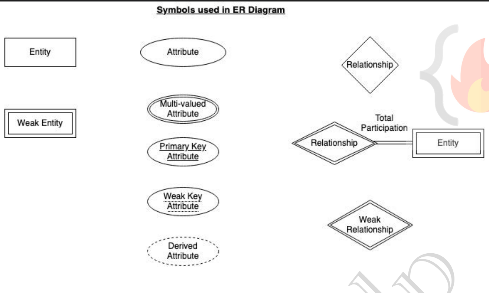

- Entity
  - An Object that can be distinguised from other objects
  - Entity can be uniquely defined by Primary Key or Primary attribute
  - Strong entity : Can be uniquely identified
  - Weak entity : Can't be uniquely identified, depends on strong key
- Entity Set
  - Collection of entities with same type of attributes
- Example
  - A student has name, ID, address, phone_no etc
    - Collection of all students is entity set
    - A student is an entity
    - name, ID, address etc are attributes
- Attributes
  - Properties of entity
  - Types
    - Simple - Cant be divided furthur
    - Composite - Can be divided furthur - eg: name- first, middle, last
    - Single-valued - can only have one value - eg- student ID
    - Multi-valued - have more then one value - eg- Phone No
    - Derived - Can be derived from other attribute - eg- Age (can be derived from DOB)
    - NULL value
      - Maybe "Not Applicable" Eg. middle name
      - Or maybe "Unknown" to be filled yet or missing
- Relationship
  - Relates two or more entities
  - Strong Relationship - Between two strong enitity
  - Weak Relationship - Between one strong and one weak entity
  - Degree of Relationships
    - Unary - Between only one entity
    - Binary - Between two entities
    - Ternary - Between three entities
  - Mapping cardinality / Cardinality Ratio
    - Number of entities in one entity set related with Number of entities in other entity set
    - One to One - One entity in a set is only related to one entity in other set Eg. Citized to Addhar Card
    - One to many - Citizen to Vehicle (One citizen may own many cars, but one car has only one owner)
    - Many to one - Course to Professor (One prof may take multiple courses, but one course is taken by single prof)
    - Many to Many - Groceries to Customer (Many customer may buy single grocery, and single customer may buy many grocery)
  - Participation Constraint
    - Total or Partial
    - Total Participation - All entities are involved in relationship
    - Pratial Participation - All entities may not be involved in relationship
    - Eg. Customer Take Loan
      - All loans are related to a customer No loan can be without customer
      - All customer may not have taken loan
      - So "Customer" to "Take" is Partial
      - "Loan" to "Take" is Total
      - Weak entity are always in Total participation
      - Strong entites may or maynot be in Total constraint

# Extended ER Fratures

## Specialization and Generalisation

- Splitting entities into sub-entities based on their attributes
- Specialisation - Top-Down-Approch
- Generalisation - Bottoms-Up-Approch
- Denoted by upside-down tirangle
- Why
  - Improve blueprint
  - Remove redundancies
- Eg. - Preson entity - Person - Customor - level 1 Subentity 1 - Employee - level 1 Subentity 2 - HR, Developer, HouseKeeping
  > Attribute inheritance - Child can access the attributes of parent
  > Participation inheritance - If parent entity is in relationship with other enitities then child entities are also in realtionship with that entity

## Aggrigation

- To show relationship of one entity with multiple entities we need to link multiple entity with relationship
- Instead we can do <b>Abstraction</b>
  - Grouping multiple entities and relationships to form a high-level entity, A.K.A <b>Abstract Entity</b>

# Relation model

- Data stored in organised tables
- first ER model is created then relation model is dervied from it
- All tables have unique name

        - An entity set is a table
        - An entity is called tuple
            - tuple contain the data of all the attribute relatied to that entity
        - Columns represents all the attributes

- Example - Table/Entity set - student - Say columns are - Student_Roll_No, Name, DOB, Sex - Tuple/Entity - 19ME02037, Ohm, 1/3/2001, male

  > RDBMS - Softwares/Tools to implement DBMS eg. MySQL, MSaccess, Oracle

          - Degree of table : Number of entites involved in a relation (Unary,Binary,ternary,n-ary)
          - Cardinality : Number of tuple invloved in a relation

- Property of relational table
  - Name of relation, column/attribute, values of tuples are distinct
  - Values are atomic, can't be broken further
  - Sequencing of rows and columns is insignificant
  - Tables must follow intigrity constraints
- Relational Key : Set of columns/attributes which can uniquely identify each tuple

## Relational model Keys

    - SK(Super Key) : P&C of all the attributes in table that can uniquly identify each tuple
    - CK(Candidate Key) : (Should not be NULL)minimun subset of SK which can uniquely identify the tuple and dont contain any redundant attribute
    - PK(Primary Key) : Selected out set of CK with least number of attributes.
    - AK(Alternate Key) : All CK except PK
    - FK(Foriegn Key) : Used to create relation between two tables
        - Referenced/Parent table | Referencing/Child table
    - Composite Key : PK with least 2 attributes
    - Compound Key : PK formed using 2 FK
    - Surrogate Key : When two tables are merged so new integer key is generated which may be used as PK

> CRUD - Create Read Update Delete

## Integrity Constraints

- CRUD operations must be done with some integrity policy so they remain consistaint
- else some querry might corrupt our database

        - Domain Constraint : Resticts value of attributes Eg: name must contain A-Z or age>18
        - Entity Constraint : Pk != NULL
        - Referential Constraint : Foriegn key cannot be null
            - Insert Constraint : To insert tuple in child table corrosping key value mus be present in parent table
            - Delete Constraint : We cant delete tuple from parent table untill there is a reference(foriegn key) present in child table
            - ON Delete Cascade :- While deleting tuple from parent table all the related tuple with FK of child==PK of parent are also deleted
            Can we have foriegn key with NULL value - YES
            - ON delete NULL :- After deleting tuple from parent table the FK in child table is changed to NULL
        - Key Constraint :
            - NOT NULL :- This attribute cannot have NULL value
            - UNIQUE :- All values in column are unique
            - DEFAULT :- Uses default value for element in table if not specified
            - CHECK :- Integrity constraint, check data integrity before and after CURD
            - PRIMARY KEY :- This attribute/column is set to primary key
            - FORIRGN KEY :- This attribute/column is set to foriegn key

# Normalisation

- Used to optimse DB
- Functional Dependency (FD)
  - When one attribute is used to determine other attribute the dependency is called FD
- "A --> B " A is Determinant and B is Dependent
- Types of FD
  - Trivial FD
    - For a FD "A --> B" B is subset of A
  - Non-Trivial FD
    - For a FD "A --> B" B is not subset of A
- Rules of FD
  - Reflexive : If B is subset of A then "A --> B"
  - Augmentation : Adding a function to FD wont change it Eg. if "A-->B" then "AX-->BX"
  - Transitivity : If A-->B and B-->C then A-->C
- Normalisation
  - Decompose table to remove redundancies from table
  - Types of Redundancies / Anomalies
    - Insertion : When certain data cannot be added without presence of other data
    - Deletion, Updation : The following operations may result in unintentional data loss or data inconsistancy
- Normal Forms
  - 1NF
    - All attributes mush have values which are atomic and single-valued
  - 2NF
    - 1NF + All non-prime attributes must be fully dependent on prime attribute
    - if PK {A,B} | other Key {C,D} so
    - Valid - (A,B-->C and A,B-->D)
    - InValid - (B-->C) || (A-->D)
  - 3NF
    - No Transitivity
  - BCNF(Boyce-Codd normal form)
    - No attribute should define PK
    - Non prime attribute should not define a prime attribute
    - Say we have following table

      |Student| Teacher | Subject | 
      |-|-|-|
      | S1 | T1 | Sub1 |
      | S2 | T2 | Sub2 |
      | S3 | T1 | Sub1 |
      | S4 | T2 | Sub2 |

    - Here each teacher has a specific subject.
    - (Student, Teacher) -> (Subject) AND (Student, Subject) -> (Teacher)

  - 4NF
    - Table should not have multi valued dependencies
    - Like say A->B and A->C and we have a table with column A,B,C so when for A1 we have B11, B12 and for A1 we have C11 
    - | A | B | C |
      |-|-|-|
      |A1 | B11 | C11 |  
      |A1 | B12 | C11 |  
      |A2 | B2 | C2 |  
      |A3 | B3 | C3 |
    - So here C11 has to be present in table 2 times because of multiple values of B relating to A
      - So consumes extra space and Is not in 4NF
    - We need to seperate table like A->B as table 1 and A->C as table 2

  - For 1,2,3NF we directly decompose i.e. split table into two with one common PK
  - For BCNF we add new key while dividing table

# Transaction

- A unit work done in DB in logical sequence
- Each step is logical step like read,write, a = a-b etc.
- The result of these statements are complete succes or compete failure
  - If sucess then changes in DB are commited
  - else if failure occur at any step so all the steps are reverted

# ACID properties

- A transaction must follow ACID properties to ensure integrity of data
- Atomicity : Either all operations are refected in DB correctly or none are if any operation is incorrect
- Consistency : Integrity constraints are maintained before and after every transactions
- Isolation : All the transactions must be isolated.
  - i.e if multiple transactions are required on an account so first one transaction is completely finished and then next is done
  - Thus it is ensured one transation wont iterfer with other
- Durability : After all transactions are complete changes must presist to DB even if there is an system failure

# Transition state

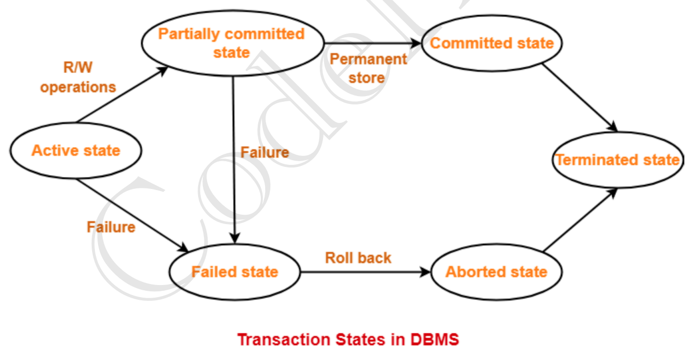

- Active State
  - First all basic operations are performed like read/write
  - If they are successful then state is changes to partically committed state
  - If anyone fails then state is changes to failed state
- Partially Committed State
  - Now all the changes are in buffer if they all are implemened so state is changed to committed state
  - if it fails to commit change then it is shifted to failed state
- Committed State
  - Here the premanent changes are made to DB and rollback cannot be done
  - Here after DB is updated and terminated state is achived
- Failed state
  - When transaction is being implemented and some failure is occured so this state is reached and transaction cant be carried forward so all the changes are rolled back and aborted state is reached
- Aborted state
  - After Transaction is rolled back and all the changes are reverted, DB's prior state(state before starting of transaction) is reached.
- Terminated state
  - Transaction is either said to commited or aborted in this stage

# Implementing Atomicity and Durability

- It is done by "Recovery Mechanism Component" of DBMS

1. Shadow Scheme
   - Based on making copies of DB
   - Say we have a `old copy` of DB and There is a pointer `DB pointer` pointing to it
   - A `new copy is made in RAM`, all changes are made this new copy of RAM and once they are completed `DB pointer` now points at this new copy
   - Atomicity : The DB is either old or new, there is no intermediate DB
   - Durability : Even if system fails the DB pointer points to new DB
   - `COMMITTED` status is to be said when DB-pointer points to new DB
   - Then old copy is deleted
2. Log based recovery scheme
   - Instead of making a copy of entite DB, which is storage and time consuming we store logs
   - Before processing any step log is made
     1. Deferred DB modification
        - First all the changes are made in log then they are implemented in DB
        - If log fails at any instence so the updated logs are discarded
        - Atomicity : If committed status is reached in log then the entire transaction(changes in DB) are implemented or no change is implemented if log fails at any instence
        - Durability : If DB fails at any instance and the committed status is reached in log commands are performed again based on progess in log
     2. Immediate DB modification
        - Here after each upadte in log change is DB is made
        - If Transaction fails so changes are revered based on log
     3. Checkpoint DB modification
        -

# Indexing

- Done to optimise performance
  > Binary Searching is done sorted data
- Index is a type of data structure which is used to locate and access the data quickly from DB
  > Index files are always sorted
- Methods : Primary Indexing(Sorted data) | Secoundary Indexing(Unsorted data)
1. Ordered indexing 
  - Indices are stored in sorted order to finding them is reasy

2. Primary Indexing / Clustering index
  - Indexing is usually done using primary key (however other candidate key may also be used)
    1. `Sparse Indexing`/ Indexing Based on `Key attribute`
      - Indices are stored with gaps like 1st primary key, 100th primary key, 200th primary key...
      - As the data is sorted based on primary key so key of starting of data block is stored rather then whole data
      - 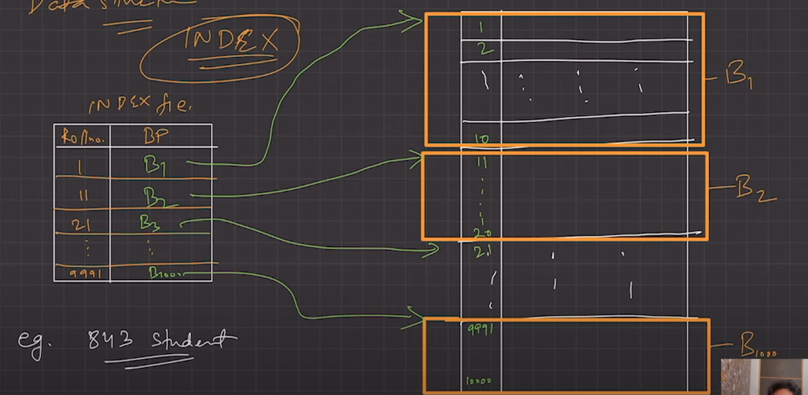
      - So in index file only 1,11,21,.... are stored instead of whole DB from 1,2,3,4....
    2. `Dense Indexing`/ Indexing based on `Non-Key attribute`
      - Contains index of every record in seach key, more like 1v1 mapping
      - When we are using non-primary key for indexing there may be multiple entries of same key
      - So we store every search key value corrosponding to DB
      - 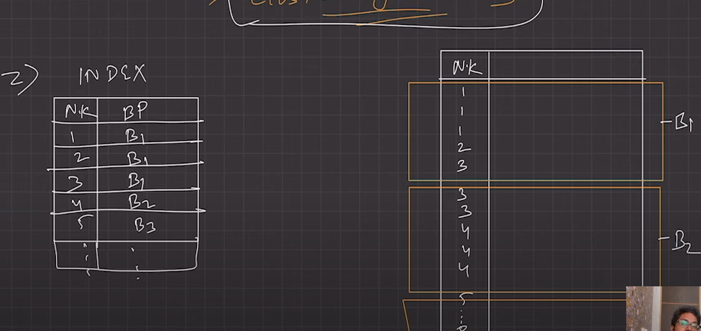
    3. Multi-level Indexing
      - Above the indexing is done once here it is done multiple time
      - 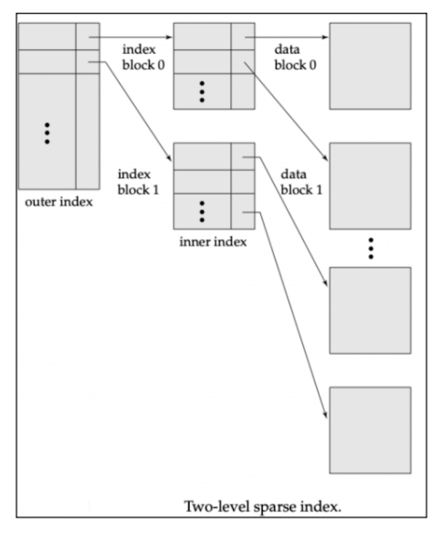
2. Secondary Indexing / Non-Clustering index
  - Indexing done on unsorted data
  - Here index table contain same number of entries as that in DB
  - Here in the index table the keys are sorted and pointed to DB where that key is stored in DB
  - Now primary indexing can be on the index formed from Secondary Indexing
  - 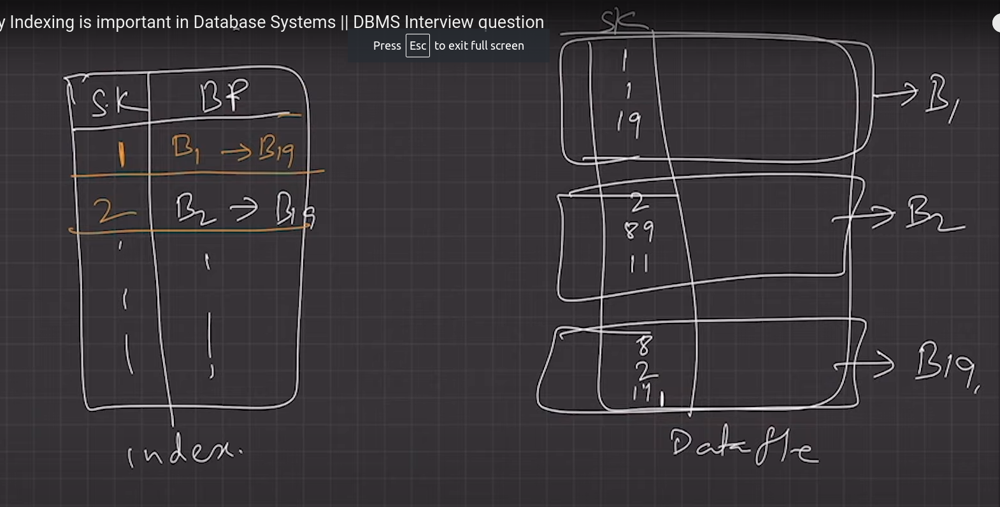

# NoSQL (Not Only SQL)

- DB that stores data differently then relational table
- data is stored in JSON format file (JavaScript Object Notation)
  - Here all data of entity is stored in file unlike having different tables in SQL
  - So relationships are avoided
- Flexible Schema, easily scalable and can handle big data
- Ease of storing unstructured data
- History
  - Memory/storage device became cheaper and fast processing became must
  - So there are redundancies in data at the cost of processing
  - Popular application : Cloud Computing
- Advantages
  - Flexible Schema : Changing schema is easy
  - Horizontal Scaling : Easier reason being they are self contained and not coupled in relationship
    - Sharding or Replica-sets
  - High availability
    - Data replica is stored accross multiple server
    - If one server fails data is safe in other server
  - Easy insertion and read
    - In SQL data is normalized so data related to one enity is stored accross multiple tables and many join operations are applied at time
    - This join are expensive
    - But in NoSQL data related to one entity is stored in single JSON file hence easy access
  - Caching Mechanism
- When to use NoSQL
  - Fast development (No ER or relationship model is requied to develop)
  - Where data is semi-structured and unstructured
  - Huge volumes of data and fast access
  - Scaling is required
  - Real time streaming, micro-service
- Misconceptions
  - NoSQL can store relational DB as well (There are different types of schema in NoSQL)
  - most NoSQL follow ACID properties
- Types of NoSQL
  1. Key Value store
     - Stores data in key-value pairs(Only two per file)
     - Uses
       - Real time random data access : Gaming, Finance
       - Application designed for simple queries
     - 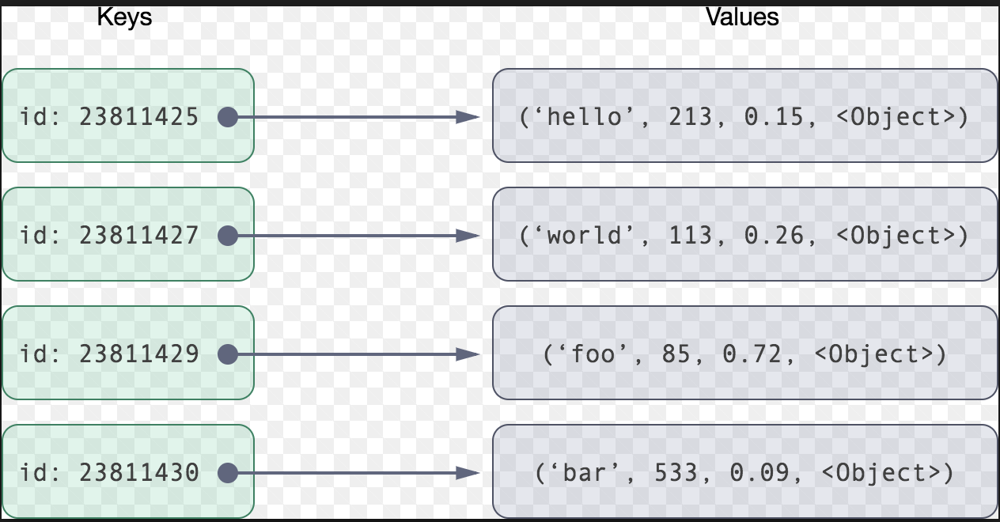
  2. Column Oriented/ Columnar/ C-Store/ Wide Column
     - Data is stored column wise say we have employee, salary, age so first row will have all name, second salary, and third age
     - So unwanted data access can be avioded
     - Used for analytics
     - 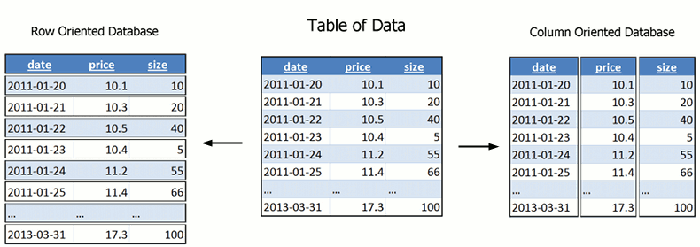
  3. Document Based Store
     - BJSON(Binary JSON)
     - Contain pair of 'field : value' objects
     - MongoDB uses this
     - 
  4. Graph Based Store
     - Each element is called node, and connection is called relationship
     - In enitre app only some type of data is stored in graph based store
       - Eg. Friends in Facebook, Fraud detection
     - 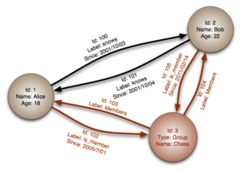
- Disadvantages
  - Data redundancies
  - Upadte and Delete are costly
  - Does not support data entry with consistency constraint

## ORM(Object Relational Mapping)

- Way to create `bridge` between object-oriented program and relational DB
- Technique used to query and manuplate data easily
- Increase readablility
- Protection against SQL injections

# Types of Databases

1. Relational Database

   - Stores data in tables
   - A.K.A RDBMS
   - Highly optimised DB, no redundancies
   - When data become huge system become more complex
   - Scalabilty issue (Horizontal scaling not fesible)

2. Object Oriented Database

   - Based on OOPs
   - Maintaining relations in huge DB can be complex
   - All data is treated as objects
   - Advantage
     - Quick data storage and retrieval
     - Can handle complex data
   - Disadvantage
     - High complexicity data can cause preformance issues like read, and update can become slow
     - Dosen't support view in DB

3. NoSQL Database

4. Hierarchical Database

   - Data stored in hierarchical order
   - A parent may have several child
   - Useful for Disk storage
   - Only problem is relations can only be 1:n and can't be m:n
   - Top to bottom search takes time

5. Network Database
   - Like Hierarchical DB but can have m:n relations
   - Data is in Graph data structure, cant handle complex DB
   - Read and wirte are time consuming

> Mostly used DB are Relational DB and NoSQL

# Clustering

- Millions of request made to DB every single second and one server may or may not be able to handle it
- So replica of server is made so number of requests can be divided per server
- Advantages - Data Redundancy : In case of one server fails others are still active - Load Balancing : If one server is having high amount of traffic some traffic is diverted to other server - High availability : If one server shuts other is available and if one server is at high load we have other server
  > load balancer diviedes requests based on server load

## Pratitioning & Sharding

- Dividing and storing data in seperate servers
- Vertical Partitioning
  - Slicing Vertically
  - For getting a complete tuple different servers may need to be accessed
- Horizontal Partitioning
  - Slicing row wise
  - Independent data chunks can be stored in different servers
- Routing Layer
  - To split request we need a routing layer so send request to desired server
- Advantage
  - Parallelism : For different data different servers are accessed.
  - Availability : If one server is down other server is there
  - Performance : Less traffic per server
  - Managebility : Say we need to edit data for a region say India amazon server so can be done easily
  - Reduce cost of scaling
- Disadvantage
  - For analytics purpose not suitable coz entire data is required which may be stored in different servers
  - Complex routing layer may be required for complex data relations

> | Feature                 | Partitioning                                                                   | Sharding                                                                                 |
> | ----------------------- | ------------------------------------------------------------------------------ | ---------------------------------------------------------------------------------------- |
> | Scope                   | Within a single database instance                                              | Across multiple database instances                                                       |
> | Performance improvement | Improved performance for queries that only need to access a subset of the data | Improved performance for all queries, especially those that access large amounts of data |
> | Scalability improvement | Limited by the capacity of a single database instance                          | Can scale horizontally by adding more database instances                                 |
> | Complexity              | Less complex than sharding                                                     | More complex than partitioning, requires managing multiple database instances            |

> ## Partitioning v/s Indexing in DBMS
>
> - Indexing creates a data structure that allows the database to quickly locate specific rows in a table
> - where as Partitioning divides a table into smaller, more manageable units (partitioning dont create new data structure)

# DB scaling

## Pattern 1

`Query Optimisation and connection pool`

- `Cache frequently used` and `non-dynamic` data
  - Eg. Ola booking service past booking is non-dynamic data and can be cached
  - While ride's position is dynamic and needs to feched from server
- Introducing Data redundancy(NoSQL)
  - Multiple server etc.
- Use connection pool libaries to `Cache DB connections`
  - Say in a code connection is establised multiple times for different purposes
  - So we save the connection till current session

## Pattern 2

`Vertical Scaling / Scaling-up`

- Upgrading machine i.e. RAM-2x SSD-3x

## Pattern 3

`Command Query Response Segregation (CQRS)`

- Seperate `Read` and `Write` operations
- Master machine handles `Write` request and replica machine `Read` operations
- Due to this there is `lag` due to time required by replica machine to update data from Master machine.
  - `lag` is always there but it must be acceptably low
  - Eg. While ordering from zomato the driver's location is updated after every 1sec and not instantinously and this is acceptable lag for this case

## Pattern 4

`Multiple primary replica`

- Multiple replica's are made but here instead of Master-Replica all the machines are Master
- And an update cycle is running say we have a,b,c,d server.
  - a --> take update from b server
  - similarly b --> c, c-->d, d-->a
  - 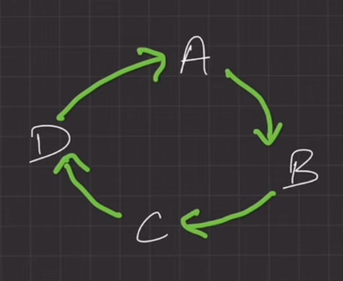
- Even here there is lag, but load is decreased

## Pattern 5

`Partition by data functionaliy`

- Here data is divided, and stored in seperate place
- Now when request is made so there is a layer which brings data from `multiple seperate DB` and performs `join` operation and returns result
- Eg. say in OLA
  - after booking ride the user may or maynot check the driver's location
  - But driver's location needs to be updated and the ride start, end location, payment method, driver's details etc... are constant
- So we can save driver's location data and other details in seperate loaction. This pratition be data functionality
- And for communication between server `Multiple primary replica` or `primary replica(CQRS)` can be done

## Pattern 6

`Horizontal Scaling/ Scale-Out`

- Type of sharding where each set of data is called shard.
- A machine stores all the related data.
- A new layer needs to added which can assemble or say jon all the data before returning.
- Eg. Say in a bank one branch deals with all savings account and other branch deals with current account,
  - so we can seperate data of both type of customer so accessing data becomes fast

## Pattern 7

`Data Center wise partitioning`

- Say on expanding business in another country the data sent from host country will have high latency
- To avoid this we setup another DB in new country

# CAP theorm

- Parameters to `optimise` --> `distributed DB`
  - Consistancy
    - All the nodes/DBs must have same data simuntaniously
    - Say `write` is done on master node and `read` is done on slave DB
    - Now once `write` is done on `master` DB it takes time to update `slave` DB
    - If in between a user `reads` data so old value is returned this is `inconsistancy`
  - Availabity
    - From last case even if data is wrong but data is available, this is availability
  - Partition Tolerance
    - Partition is communication break between two nodes
    - To have low tolerance to this partition the data update rate must be high. and this lag is partition tolerance
- According to CAP theorm only two of these parameters can be achived at once
  - CA(Consistancy-Availability)
    - Two seperate node with high partition tolerancce and low C and A is not practical
    - This is possible when there is only one node, `not practically applicable for` <b>`distributed DB`</b>
  - CP(Consistancy-Partition Tolerance)
    - Here its okay if data is available late but data must be accurate
    - Say we are doing payment using UPI so there is lag 2-3sec sometime 10-15sec but bank balance is accurate
    - MongoDB
  - AP(Availability-Pratition tolerance)
    - Here accuracy(Consistancy) is not that big deal
    - Eg. Facebook if number of likes decrease the data may take some time to update and the number of likes is always visible even if it is less or more

# Master Slave configuration

- Master generally takes `write` requests
- Slave generally takes `read` requests
- Schema of master and slave may be different
- 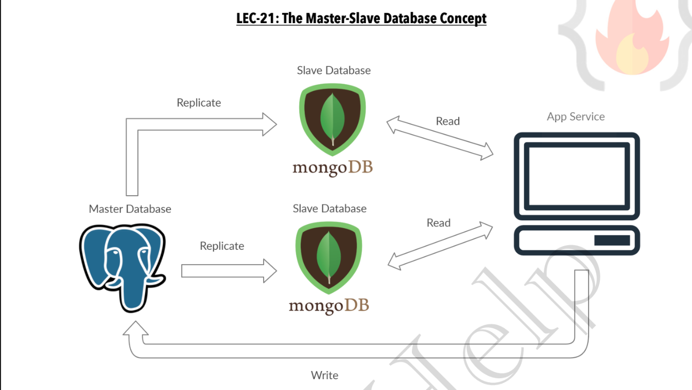
- System may be syncronus or asyncronus
