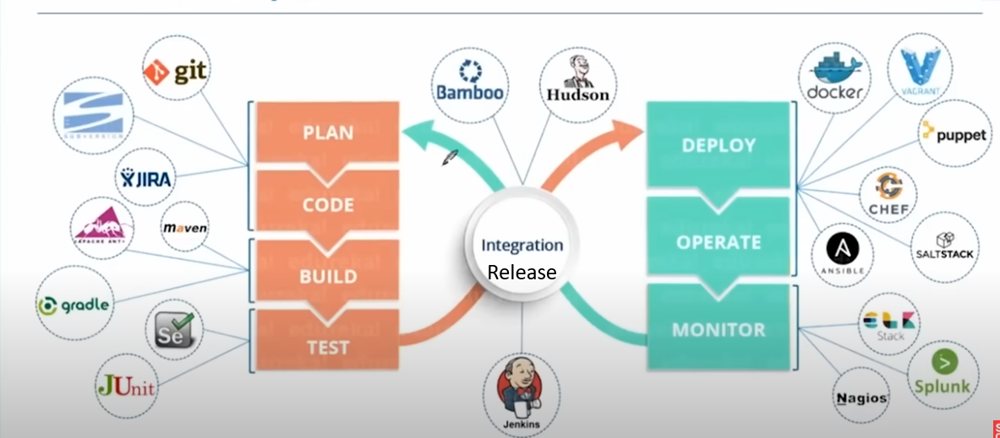
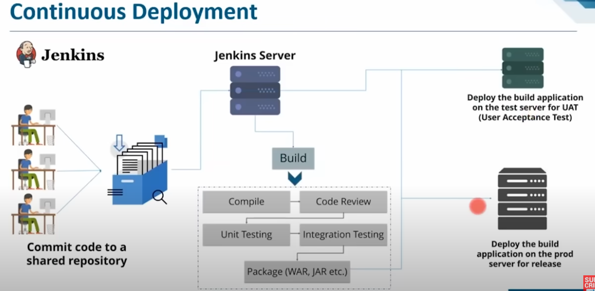

# Devops
- Earlier Waterfall development stratergy was used
- Waterfall stages
	1. Requirement gathering 
	2. Design
	3. Implementataion
	4. Tesst
	5. Deploy
	6. Maintainance
- What is devops
	- Bridges gaps btwn `development team` and `operations team`

## Devops stages
- Version contorl
- CI (Continous integreation) 
	- Compile > Validate > Code review > Unit testing > Integration testing > Packaging
- CD (Continous delivery)
	- Deploying application on test servers
	- All automation tests are performed
- Continous Deployment
	- Deploying to prod server for release
- Continous monitering

## Devops phases/cycle 
- Plan
- Code
- Build
- Test
- Release
- Deploy
- Operate
- Monitor

## Continous integrations 
- Whenever a change is made to central repo jenkins detects it
- Then jenkins pull it to jenkins server
	- Now it is build, which includes
		- Compiling code
		- Code review
		- Unit testing 
		- Integration testing 
		- Package (Packing in war, jar, zip file) and sending it to prod

## Continous delivery 
- One the build is success then the jenkins moves it to test server
	- In test server it goes for UAT (User Acceptance Testing)

## Continious deployment
- Taking the build applcation that is tested and pushing it to prod server  
 

## Configuration management
- Defination : 
	- Defining, controlling, releasing, changing, documenting, and reporting the configuration of item in system
- Say I have upgraded a library and the prod has outdated version of the library
	- This can create a problem, config management can solve this
- Configuration management is a practice of handling changes systematically 
- More-------------------------------------------
- Tools : Puppet, Ansible, CHEF
- Practice 
	- Use infra as code

## Continous monitering 
- Detect problems in server asap
	- Like low memory, server crash, unreachable server
- Ability to detect, report, respond, contain and migrate attacks and problems on infra
- Helps in plannig infra upgrades before system fails
- Eg. Nagios, Prometheus, Splunk

## CI/CD

### Integration testing

---

- Jenkins
- CircleCI
- TeamCity
- Bamboo
- Gitlabs

- CI/CD pipeline
	- Source
	- Build 
	- Test
	- Deploy
- Azure pipeline
- AWS code pipeline
- BitBucket

---
# DevSecOps
## C.A.M.S model
- Culture Automation Measurement Sharing
1. Culture
	- Communication btwn Developers, QAs and Operations team
2. Automation
	- Automating pipeline like testing, integration, deployment and monitering
3. Measuremnt
	- Measure : Lead time, deployment frequency, change failure rate, average time to recovery, average time between failures, defect escape rate
4. Sharing
	- Collaboration, feedback

## Blue green Deployment
- There are two running instances blue instance and green instance
- First say blue is handling all the users and green will be sitting idle
- If there is an update we update green server and gradually shift users to green server
- Now the blue server will be sitting idle like a backup server
- If there is a new update, we will make changes to idle server and then gradually shift users 

# Testing terminologies
## SAST (Static Application Security Test)
- White box testing
- Analyze source code, bytecode, binary code without executing
- Detects SQL injection, cross-site scripting(XSS)

## DAST (Dynamic Application Security Testing)
- black box testing
- Analyze running application
- Simulates attacks on application

## SCA (Software Composition Analysis)
- Manages open source components
	- Like security, licensing, and quality of open source code

## Container Security
- Security of container
