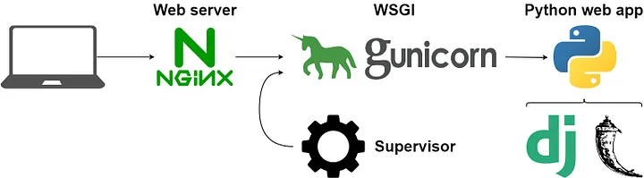

# Deployment Docs

## CDN (Content Delivery Network)
- developed to speedup delivery of static content
- There are hundreds of CDN present which are called PoP(Point of Presence)
  - Server inside a pop is called edge server
- There is basically a main server 
  - then there child servers which are connected to main server
  - The user makes a request to child server and if the data is cached then it is returned if not the it is requested from main server
- There are two main technologies used by CDN two commom ones are 
  1. DNS based routing : Each pop has its own IP address
  2. Anycast : All the POP have save IP address

## Proxy and Reverse Proxy
- Proxy or Forward Proxy
  - Server that sits between client and internet
  - This is done because
    - It protects clients idnetity
    - When we use this only the IP of proxy server is visible and that of client is hidden 
    - Can be used to bypass certian restrictions
    - Can be used to block certain contents
- Reverse Proxy
  - Sits between web server and the internet
  - Takes request from the clients and talks to web servers on behalf of client
  - One example is Nginx
  - Why used
    - Protect web servers as they hide the IP of webservices
    - Used for load balancing 
    - These reverse proxy servers are placed at 100's of location so are closer to user as compared to server
    - Can be used for caching 
## Nginx
- Webserver software used for `reverse proxy`, `load balancing` and `caching`
- For concurrency it uses `highly efficient run loops` in a single thread processes called `workers`
- It has 3 main things
  1. Workers : Threads
  2. Masters : Manage threads
  3. Proxy caches : Used for caching
- When a request comes it can consist of two parts `static` and `dynamic` part
  - Static part is handled by nginx and dynamic part is forwarded to WSGI
    - Then this WSGI sends request to django app and recieves response and then returns this response to Nginx 

## Gunicorn and WSGI (Web Server Gateway Interface)
- It is a `specification` that defines how `webserver` interact with web applications like django
- In this project WSGI acts a bridge between nginx and django application
- `Gunicorn` is a `Python WSGI HTTP server` and is used to make python based web application accessible to internet


# Setting up Gunicorn
1. ### Creating a `system socket file` for `Gunicorn`
  - This will setup `Gunicorn` to run as a `systemd service` on the server currently laptop
  - This will allow us to manage gunicorn using systemd
    - Hence better control over starting, stopping and restarting webservices
  #### System scoket file
  - It is a configuration file
  - It is used by systemd to define and manage socket-based activation for services
  - For Gunicorn it manages communication btwn `NGINX` and `Gunicorn`
  #### add the following data to 'sudo vim /etc/systemd/system/gunicorn.socket'
  ```python
  [Unit]
  Description=gunicorn socket

  [Socket]
  ListenStream=/run/gunicorn.sock

  [Install]
  WantedBy=sockets.target
  ``` 
  - here unit is a configuration file that `describes` a `service, socket, device, mount point, or other resource` that `systemd manages`
  - Socket : This line specifies the socket that systemd should create and listen on
  - Install : This line specifies when the socket should be started


server {
    listen 80;
    server_name localhost;

    location = /base.jpg { access_log off; log_not_found off; }
    location /static/ {
        root /home/ohm/webd/django_md/nginxGunicornTest;
    }

    location / {
        include proxy_params;
        proxy_pass http://127.0.0.1:8000;
    }
}
