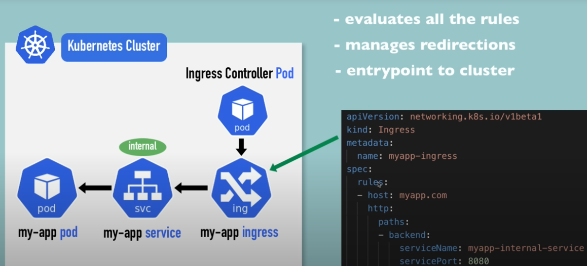
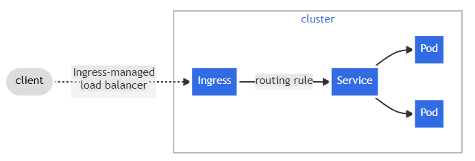
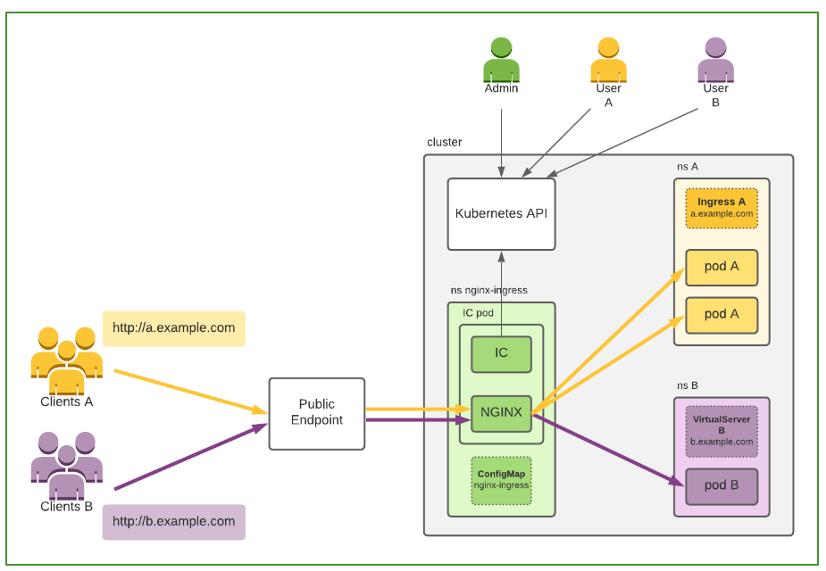
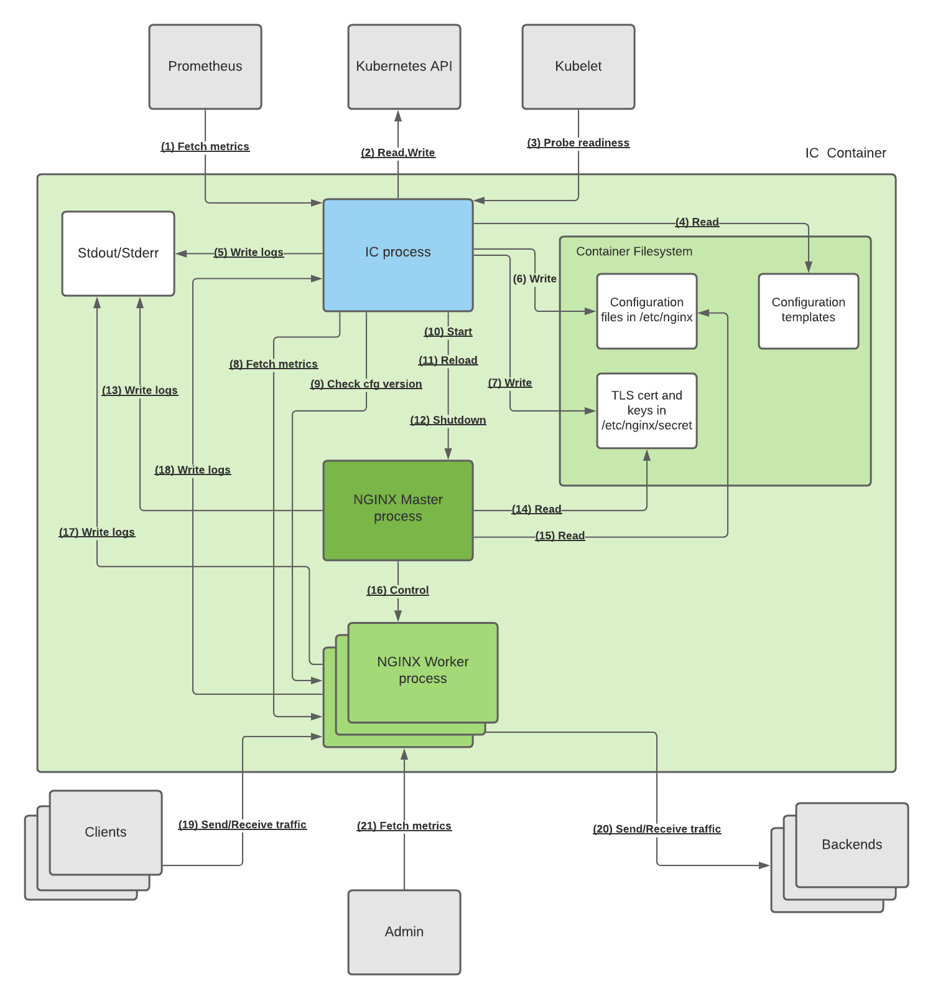
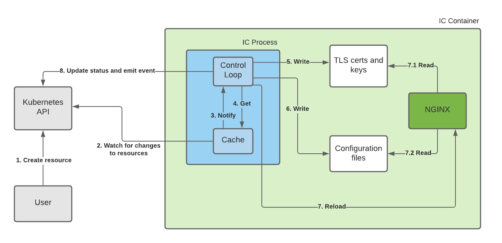
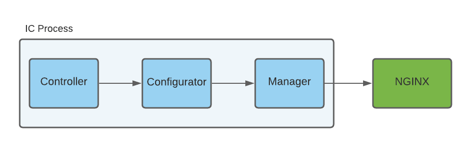

## NGINX Ingress
- When we expose a port, there is a IP address accessable and not the domain name
- So instead of exposing a IP:port we can use ingress which will take request from domain and redirect it to services
- Ingress is inside cluster
- Ingress controllers are set of pods in the cluster 
  - The controller manages ingress resourcecs 
  - And is responsible for redirecting traffic
- There are many ingress controller here F5 NGINX Ingress Controller is discussed

- 

  ```yaml
    apiVersion: networking.k8s.io/v1betal
    kind: Ingress
    metadata:
      name: myapp-ingress
    spec:
      rules:
      - host: myapp.com
        http: # does not relate to http:// or https:// 
          paths:
            - backend:
                service Name: myapp-internal-service
                servicePort: 8080
  ``` 

- 

  ```yaml
    apiVersion: networking.k8s.io/v1beta1
    kind: Ingress
      metadata:
        name: simple-fanout-example
      annotations:
        nginx.ingress.kubernetes.io/rewrite-target: /
    spec:
      rules:
      - host: myapp.com
        http:
          paths:
          - path: /analytics
            backend:
              service Name: analytics-service
              servicePort: 3000
          - path: /shopping
            backend:
              serviceName: shopping-service
              servicePort: 8080
  ```


  ```yaml

apiVersion: networking.k8s.io/v1betal
kind: Ingress
metadata:
  name: name-virtual-host-ingress
spec:
  rules:
  - host: analytics.myapp.com
    http:
     paths:
      backend:
        service Name: analytics-service
        servicePort: 3000
  - host: shopping.myapp.com
    http:
      paths:
        backend:
          service Name: shopping-service
          servicePort: 8080

  ```


- All the request after myapp.com will be directed to services `myapp-internal-service`
- The file showed above is `ingress` but we need a `ingress-controller` pod to control it as well
  - This pod evaluates all the rules
<center>

</center>

> ### - To get kubernetes dashboard we need to change namespace and also add port in hosts 
> - Check on youtube how to do that

### Adding TLS certificate
- We need to create a secret to hold TLS certificate and then supply that secret to ingress
- Secret

```yaml
apiVersion: v1
kind: Secret 
metadata:
  name: myapp-secret-tls
  namespace: default
data:
  # the value are actual content and not the file name
  tls.crt: base64 encoded cert
  tls.key: base64 encoded key
# this is must
type: kubernetes.io/tls
```
- After this just add `tls` in `spec`
```yaml
apiVersion: networking.k8s.io/v1betal
kind: Ingress
metadata:
  name: tls-example-ingress 
spec:
  ## for mapping tls
  tls:
    - hosts:
      - myapp.com
      secretName: myapp-secret-tls
  #################
  rules:
    host: myapp.com
      http:
        paths:
        - path: /
          backend:
            serviceName: myapp-internal-service
            servicePort: 8080
```


## Ingress
- Terminology
  - Edge Router : 
    - A router that manages firewall policy
    - Could be a gateway managed by cloud provider

<center>

## Basic example of Ingress



</center>

<h2> 

> - The service type for ingress is recommended as `NodePort` or `LoadBalancer`  

</h2>

### Basic ingress resource
```yaml
apiVersion: networking.k8s.io/v1
kind: Ingress
metadata:
  name: minimal-ingress
  annotations:
    nginx.ingress.kubernetes.io/rewrite-target: /
spec:
  ingressClassName: nginx-example
  rules:
  - http:
      paths:
      - path: /testpath
        pathType: Prefix
        backend:
          service:
            name: test
            port:
              number: 80
```
-  `rewrite-target annotation` rewrites request if the rules of ingress dont match
- So if request comes here is /a/path
- When it is forwarded to service it will be /b/path
```yaml

apiVersion: networking.k8s.io/v1
kind: Ingress
metadata:
  name: example-ingress
  annotations:
    nginx.ingress.kubernetes.io/rewrite-target: /b
spec:
  rules:
  - host: example.com
    http:
      paths:
      - path: /a
        pathType: Prefix
        backend:
          service:
            name: example-service
            port:
              number: 80

```
### Ingress Rules
- Host is optional, if host is not provided all the traffic at IP will be processed
  - If host is provided then only traffic to host will be processed
- Traffic is directed only if path and host matches

### Resource (Serving static files and media files)
- Instead of service we can point to a `Resource`
- We can only mention one at a time it can be either `Resource` or `Service`
- Common usecase can be to serve static files
- Say we using google cloud bucket for that
- Then there is `pathType`, with every `resource` we need a `pathType`
  - `ImplementationSpecific`: 
    - Can be treated as prefix or exact 
    - There can be other rules as well depending on the controller
    - Eg. If path is `/a`, then it accept all of these `/a`, `/a/b`,`/a/b/c...`
  - `Exact` : 
    - will take request if exact path match with case-sensitivity
    - Eg. path: `/a` then `✔: /a` and `✘: /a/`, `✘: /a/b...`
  - `Prefix`: 
    - Eg. path: `/a` then `✔: /a`, `✔: /a/`, `✔: /a/b...`
- Using wildcard characters
  - say host is `*.abc.com`
  - ✔ : Then vaild are `a.abc.com`, `b.abc.com`
  - ✘ : Invalid are `a.a.abc.com`,`b.a.c.abc.com`

### Ingress class
- There may be multiple ingress controllers on a cluster 
  - Hence it a good practice to define ingress class
  - These class define the controller to use
  - This is IngressClass
  ```yaml
  apiVersion: networking.k8s.io/v1
  kind: IngressClass
  metadata:
    name: nginx
  spec:
    controller: k8s.io/ingress-nginx
    parameters:
      apiGroup: k8s.nginx.org
      kind: IngressClassParameters
      name: nginx-params
  ```
  - If we want to define parameters seprately
  ```yaml
  apiVersion: k8s.nginx.org/v1
  kind: IngressClassParameters
  metadata:
    name: nginx-params
  spec:
    someParameter: someValue
  ```
  - Using ingressclassname in deployment
  ```yaml
  apiVersion: networking.k8s.io/v1
  kind: Ingress
  metadata:
    name: example-ingress
  spec:
    ingressClassName: nginx
    rules:
    - host: example.com
      http:
        paths:
        - path: /
          pathType: Prefix
          backend:
            service:
              name: example-service
              port:
                number: 80
  ```
### Types of ingress
- Multiple sub route
```yaml
apiVersion: networking.k8s.io/v1
kind: Ingress
metadata:
  name: simple-fanout-example
spec:
  rules:
  - host: foo.bar.com
    http:
      paths:
      - path: /foo
        pathType: Prefix
        backend:
          service:
            name: service1
            port:
              number: 4200
      - path: /bar
        pathType: Prefix
        backend:
          service:
            name: service2
            port:
              number: 8080
```
- Multiple domain
```yaml
apiVersion: networking.k8s.io/v1
kind: Ingress
metadata:
  name: name-virtual-host-ingress
spec:
  rules:
  - host: foo.bar.com
    http:
      paths:
      - pathType: Prefix
        path: "/"
        backend:
          service:
            name: service1
            port:
              number: 80
  - host: bar.foo.com
    http:
      paths:
      - pathType: Prefix
        path: "/"
        backend:
          service:
            name: service2
            port:
              number: 80
```

### Securing ingress using TLS
```yaml
spec:
  tls:
  - hosts:
      - https-example.foo.com
    secretName: testsecret-tls
  .
  .
  .
```


> # How to apply this in django projecy with cloud bucket
```yaml
apiVersion: networking.k8s.io/v1
kind: Ingress
metadata:
  name: ingress-resource-backend
spec:
  defaultBackend:
    resource:
      apiGroup: k8s.example.com
      kind: StorageBucket
      name: static-assets
  rules:
    - http:
        paths:
          - path: /icons
            pathType: ImplementationSpecific
            backend:
              resource:
                apiGroup: k8s.example.com
                kind: StorageBucket
                name: icon-assets
```

### GKE ingress controller
- When we create a `GKE ingress controller` it creates `Google cloud HTTP(s) Load Balancer` and configures accroding the info provided
- GKE ingress are of two types
  - Ingress for external application load balancer
  - Ingress for internal application load balancer


### NGINX ingress controller
- The image shows how it works, for simplicity Deployment and Services are hidden

<center>

</center>

- Details of ingress controller container
	- IC process : Ingress Controller Process
	- IC Container : Ingress Controller Container
  
  ||Protocol| Description | 
  |-|-|-|
	| 1.  | Prometheus (HTTP) | Logs of IC process(Ingress Controller) |
	| 2.  | Kubernetes API (HTTPS) | Reads and writes about the resource update |
	| 3.  | Kubelet (HTTP) | Checks readiness of the IC container |
	| 4.  | (File I/O) | reads configs when it starts |
	| 5.  | (File I/O) | Writes logs for container runtime |
	| 6.  | (File I/O) | Based on the resources recieved for kubenetes API updates its  NGINX config files (.conf files) |
	| 7.  | (File I/O) | TLS certificate related |
	| 8.  | (HTTP) | Internal status of NGINX worker process |
	| 9.  | (HTTP) | verify successful reload of nginx configs in worker |
	| 10. | |Start Nginx master |
	| 11. | (Signal) |  Reload Nginx master |
	| 12. | (Signal) |  Shutdowm nginx master |
	| 13. | (File I/O) |  logs for container runtime |
	| 14. | (File I/O) |  TLS certificate |
	| 15. | (File I/O) |  Reads updated configs to manage(start,stop,reload) worker process |
	| 16. | (Signal) |  Manage lifecycle of worker NGINX nodes with new configurations  or shutting down	|
	| 17. | (File I/O) |  Worker Nodes Logs for contianer runtime |
	| 18. | (UDP) |  Sends logs to IC process |
	| 19. | (HTTP,HTTPS,TCP,UDP) |  Receives traffic from client |
	| 20. | (HTTP,HTTPS,TCP,UDP) |  Redirect traffic to desired service |
	| 21. | (HTTPS) |  Admin connection  |

<center>

</center>

## NGINX ingress Contorller Process
- The image basically depicts the interaction between `Nginx IP process` and `Kubernetes API`
- The NGINX master and worker nodes are considered as one NGINX process in image for simplicity and logs are omited in image 
- Details of image
  1. User creates resource
  2. Ingress has the cache of resource that ingress is concerned with
    - It also keeps a watch of any update in the cluter through kuberenetes API
  3. If the cache detects update in resources it notifies control loop
    - These resources also include TLS update
  4. Control loop request for updated cache
  5. Control loop update TLS secret and TLS certificate
  6. Control loop update the config files 
  7. Control loop reloads NGINX master and waits for successfull reload.
    1. NGINX master reads TLS certificate and keys
    2. NGINX master also reads the updated config files
  8. Contorl loops emits igress resource update status or error message if required

<center>

</center>

## Resource caching (How Nginx IC watches for resource change)
- Every resource that NGINX IC moniters it has `Informer` of every single resource type
	- Like one for deployment, one for namespace, one for statefulset etc.
	- This informer also has a store that holds resource of same type
- To keep sync with cluster informer calls Watch and List apis
- When there is change detected Informer updates store 
	- Then it invokes `Handler` for that informer
	- Most of the time this handlers craete an entry in the `Workqueue` 
		- This include resource type, name and namespace
- This workqueue tries to drain itself by sending element to Controller using callback function
- Then controller gets resource form the Informer store
- Then the controller recofigures NGINX master 
- Then emits event of update (success or error) to kubernetes API 

<center>

</center>

## Working of Contorl Loop (Controller)
- It consists of 3 parts
	1. Controller
		- Runs the NGINX Ingress Controller control loop
		- Instantiates Informers, Handlers, the Workqueue and additional helper components
		- Passes changed resources to configurator
	2. Configurator
		- Generates NGINX configuration files, TLS and cert keys, and JWKs based on the Kubernetes resource
		- And these are sent to manager 
	3. Manager
		- Controls lifecycle of nginx 
		- Manages the configuration files, TLS keys and certs, and JWKs

<center>

</center>

> ### To solve http to https forwarding
## FrontendConfig and BackendConfig
- These are `CRD(custom resource definations)`
- Used for configuring `load balancer` features for Ingress in Google Kubernetes Engine (GKE).
- `Ingress object` refers `FrontendConfig CRD`
- `Service object` refers `BackendConfig CRD`
- `Multiple Service` or `Ingress objects` can reference the `same CRDs` for configuration consistency.
- `Lifecycle` : `FrontendConfig` and `BackendConfig` CRDs share the same lifecycle as their `corresponding Ingress and Service resources`
- `FrontendConfig` Most common use case
  - SSL Policies : 
    - Strict(strict ssl required), 
    - Permissive(allows wider range of SSL configurations), 
    - Custom
  - HTTP Redirects : HTTP to HTTPS
- `BackendConfig` most common use case 
  - Health Checks:
    - send health check packages via HTTP/HTTPS, TCP, HTTP2
  - Interval: Specifies the frequency at which health checks are performed
- FrontendConfig: 
```yaml
apiVersion: networking.k8s.io/v1
kind: FrontendConfig
metadata:
  name: my-frontend-config
spec:
  sslPolicy:
    name: gke-ssl-policy-strict
  httpRedirect:
    code: 301
    scheme: https
  hostBasedRouting:
    enabled: true
  pathBasedRouting:
    enabled: true
```
- BackendConfig:
```yaml
apiVersion: networking.k8s.io/v1
kind: BackendConfig
metadata:
  name: my-backend-config
spec:
  healthCheck:
    protocol: HTTP
    path: /healthz
    port: 80
    interval: 10s
    timeout: 5s
    unhealthyThreshold: 3
    healthyThreshold: 2
  connectionDraining:
    timeout: 30s
  customLoadBalancerHealthCheckConfig:
    protocol: TCP
    port: 8080
    interval: 30s
    timeout: 5s
    unhealthyThreshold: 2
    healthyThreshold: 3
```
- Using these with services and ingress
  - Ingress
  ```yaml
  apiVersion: networking.k8s.io/v1
  kind: Ingress
  metadata:
    annotations:
      networking.gke.io/v1beta1.FrontendConfig: "FRONTENDCONFIG_NAME"
  ...  
  ```
  - Service
  ```yaml
  apiVersion: v1
  kind: Service
  metadata:
    annotations:
      cloud.google.com/backend-config: '{"default": "my-backendconfig"}'
  ...
  ```
  - Multiple port serivce and different backendconfig for each
  ```yaml
  apiVersion: v1
  kind: Service
  metadata:
    annotations:
      cloud.google.com/backend-config: '{"ports": {
      "SERVICE_REFERENCE_A":"BACKENDCONFIG_REFERENCE_A",
      "SERVICE_REFERENCE_B":"BACKENDCONFIG_REFERENCE_B"
      }}'
  spec:
    ports:
    - name: PORT_NAME_1
      port: PORT_NUMBER_1
      protocol: TCP
      targetPort: 50000
    - name: PORT_NAME_2
      port: PORT_NUMBER_2
      protocol: TCP
      targetPort: 8080
  ...
  ```

## SSL Policies for frontend config in ingress
- SL Policy: An SSL policy defines the TLS versions and ciphers allowed for HTTPS traffic termination on the load balancer.
- Creation: SSL policies must be created outside of GKE (e.g., using the Google Cloud console or gcloud command-line tool).
- FrontendConfig Reference: SSL policies are referenced in a FrontendConfig custom resource.
- SSL Policy Association: The sslPolicy field in FrontendConfig associates the policy with the target HTTPS proxy of the external HTTP(S) load balancer.
- Multiple Ingress References: A single SSL policy can be referenced by multiple Ingress resources.
- Policy Propagation: Changes to an SSL policy are propagated to the GFEs (Google Front Ends) that power the load balancer.
>### By using SSL policies, you can control the security and compatibility of your HTTPS connections, ensuring that your Ingress meets your specific requirements.
```yaml
apiVersion: networking.k8s.io/v1
kind: FrontendConfig
metadata:
  name: my-frontend-config
spec:
  sslPolicy:
    name: gke-ingress-ssl-policy
```

## HTTP to HTTPS redirect
- Automatic Redirection: An external HTTP load balancer can automatically redirect unencrypted HTTP requests to an HTTPS load balancer with the same IP address.
- Ingress Configuration: To enable HTTP to HTTPS redirects, the Ingress must be configured to serve both HTTP and HTTPS traffic.
- FrontendConfig: HTTP to HTTPS redirects are configured using the redirectToHttps field in a FrontendConfig custom resource.
- Redirect Code: The responseCodeName field in FrontendConfig can be used to specify the HTTP response code for the redirect (default is 301).
Example FrontendConfig:

> ### By enabling HTTP to HTTPS redirects in your Ingress configuration, you can ensure that all traffic to your application is encrypted, enhancing security and compliance.
```yaml
  apiVersion: networking.k8s.io/v1
  kind: FrontendConfig
  metadata:
    name: my-frontend-config
  spec:
    redirectToHttps:
      enabled: true
      responseCodeName: RESPONSE_CODE
```
Replace RESPONSE_CODE with one of the following:
- MOVED_PERMANENTLY_DEFAULT to return a 301 redirect response code (default if responseCodeName is unspecified).
- FOUND to return a 302 redirect response code.
- SEE_OTHER to return a 303 redirect response code.
- TEMPORARY_REDIRECT to return a 307 redirect response code.
- PERMANENT_REDIRECT to return a 308 redirect response code.

