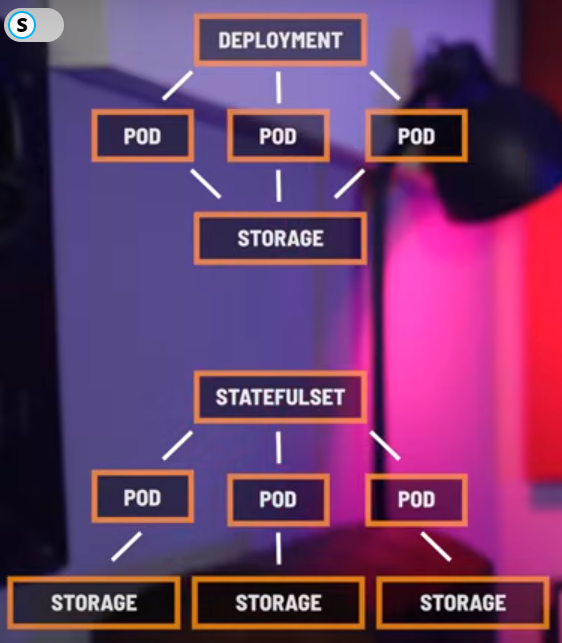
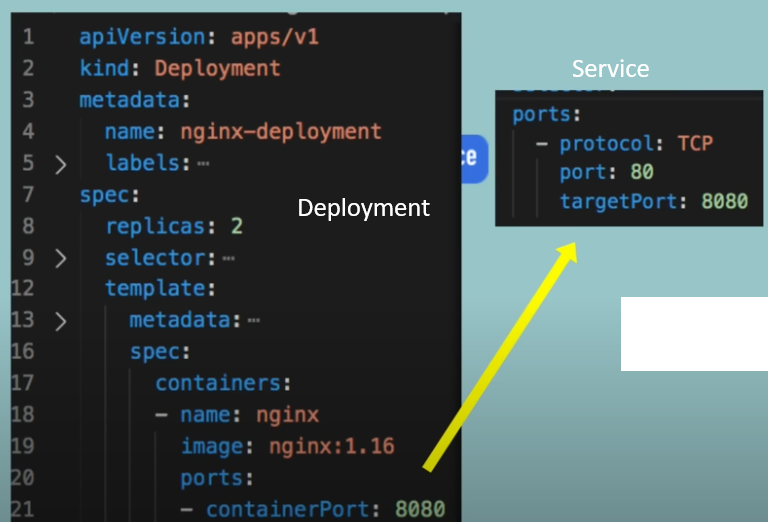
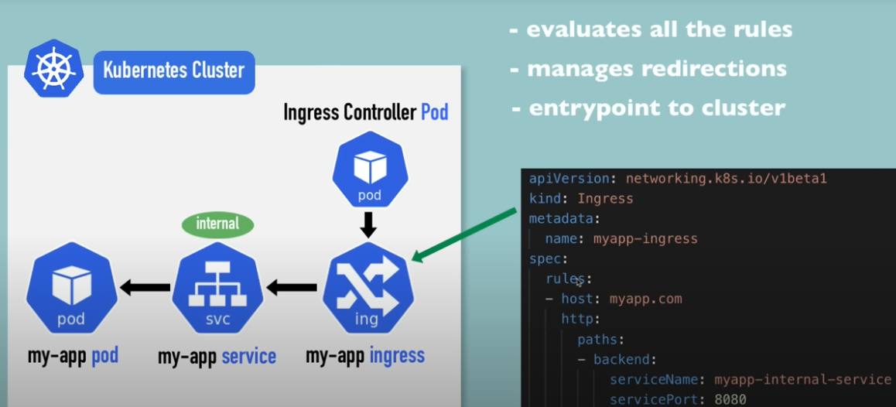
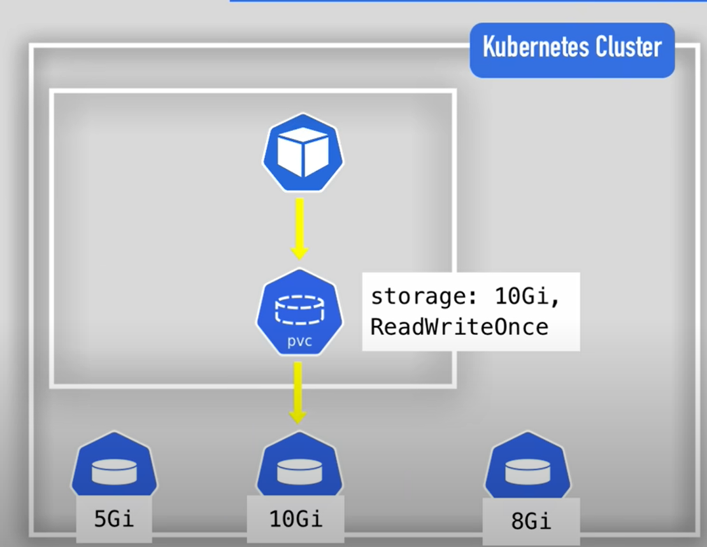
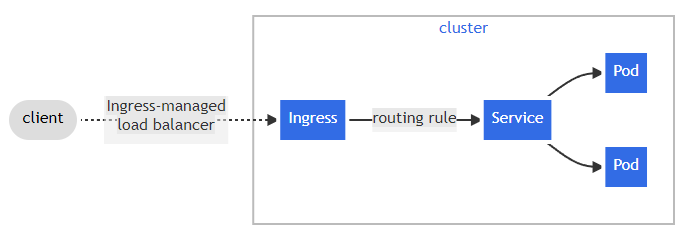
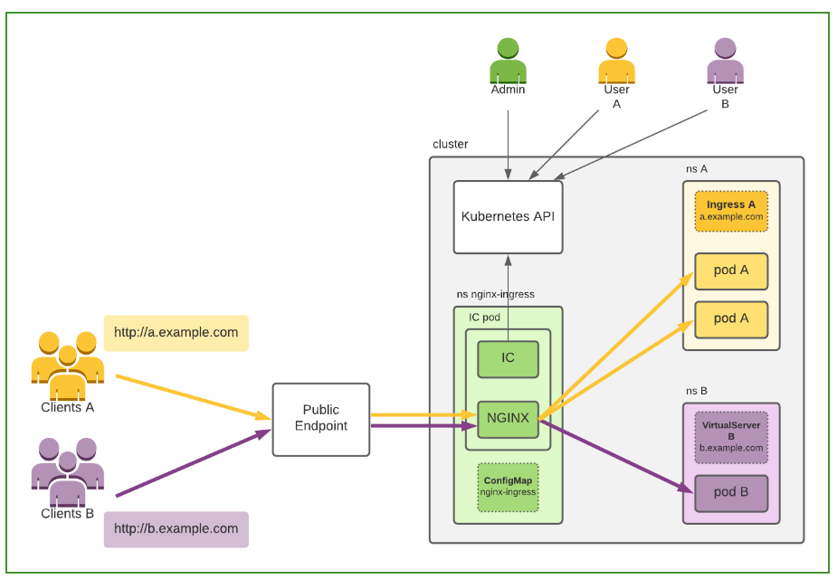
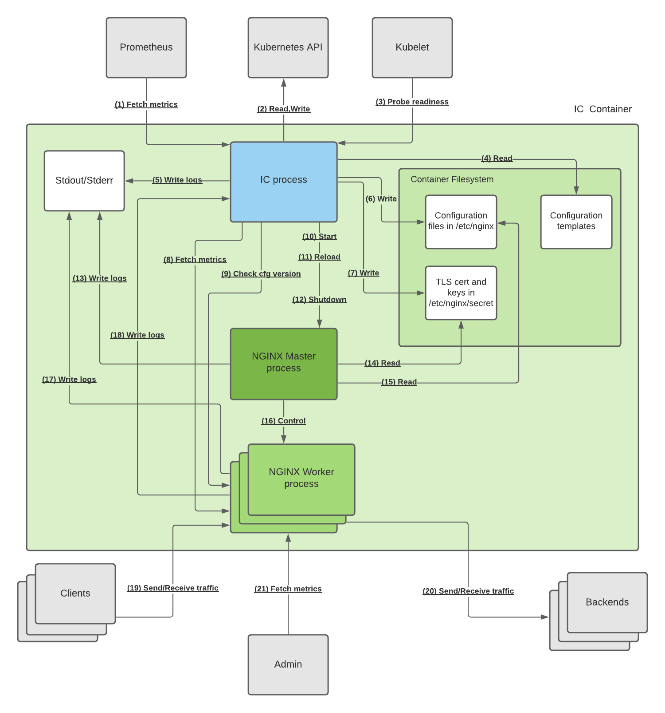
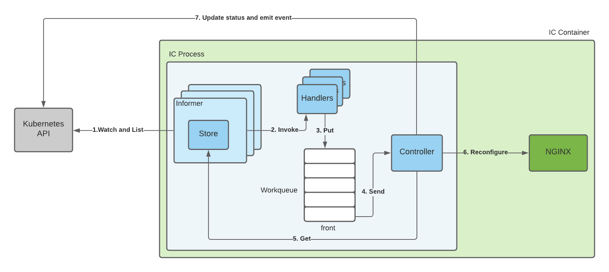

# Docker learn 

## Virtual Machine v/s container
| Virutal Machine|Container|
|-|-|
|While virtual machine are an abstraction of a machines |Containers are isolated environment for running an application|
|Like say there is an OS, so on top of it there will a `hypervisor` that will manage other OS inside current OS |On the other hand these containers are lightweight and use the host OS as host |
|like : VMware, VirtalBox|More specifically they use `kernel of host`|
|But the problem with this is each OS is a full blown OS and hence are slow to start coz entire OS will be loaded like starting a your PC|They start quickly and need less resource|
|Also these are resource intensive and the hardware needs to be divied like out of 16GB ram 4GB will be given to aother OS| |

## Docker Architecture
- Client-Server Architecture
- Server a.k.a Docker engine
- Client-Server communicate using RESTful API
- It is just like a process like other process running on a system
- On linux we can run linux container
- On windows we can run both windows and linux container
- On Mac OS we use a lightweight VM to run linux container

## Docker Images
- Read-only templates containing instructions for creating container
- Think of an image like a blueprint or snapshot of what will be in a container when it runs.
- The image relies on the host operating system (OS) kernel
- Images can be build using `Dockerfile` or pulled from repo
- Docker images are immutable, so you cannot change them once they are created.

## Docker container
- It is an isolated enviroment, like a seprate OS


## Docker commands

|Purpose|Command|
|-|-|
|List all running container| ``` dosker ps ```|
|List all containers (running and dead) | ``` docker ps -a ``` | 
| List all images | ``` docker image ls ```| 
| Run docker image without entering | ``` docker run  <image-name> ``` |
| Stop docker image | ```docker stop <container-name>``` | 
| Interact with running container | ``` docker exec <container-id> <command> ``` |
| Attach current command line with container | ``` docker run -it <image-name> --name <container-name>```  container name is optional|


## Port mapping 
- If I am running an app in a container then the ports are also inside container
- So we need to connect container's internal ports to host OS's port this is done using port mapping 
```
docker run -p <HostPort:containerport> <image-name> 
```

## Passing env variables 
```
docker run -e key1=value1 -e key2=value2 <image-name> 
```

## Building docker image
- Use `-t` tag to name image
```
docker build -t <image-name> .
```


## Removing image
- First you need to remove all the container using the image
```
docker rm <container-name>
```
- To remove all containers 
```
docker rm $(docker ps -aq)
```
- Removing image
```
docker image rm <image-name>
```


## Layers Caching 
- Docker caches automatically so if a same code runs it will be faster
```
FROM ubuntu

COPY package.json package.json
COPY package-lock.json package-lock.json
COPY main.js main.js

RUN apt-get update
RUN apt-get install -y curl
RUN curl -SL https://deb.nodesource.com/setup_18.x | bash
RUN apt-get upgrade -y
RUN apt-get install -y nodejs
RUN npm install

CMD ["node", "index.js"]

```
- Say if we build this again then it will run faster
- but say have a change in main.js so till that line cache will be used but after that everything will run again 
- Hence it is better to organize Dockerfile correctly
```
FROM ubuntu

RUN apt-get update
RUN apt-get install -y curl
RUN curl -SL https://deb.nodesource.com/setup_18.x | bash
RUN apt-get upgrade -y
RUN apt-get install -y nodejs
RUN npm install

COPY package.json package.json
COPY package-lock.json package-lock.json
COPY main.js main.js

CMD ["node", "index.js"]


```
## Coping files from another folder 
- If the file structure is as follows
```
Project-folder/
├── docker/
│   ├── Dockerfile
│   └── .dockerignore
└── other file-folder
```
- Then build docker image from the `project-folder` and not from the `docker` folder
```
docker build -t <image-name> -f docker/Dockerfile .
```

## Docker compose
- Create, run or destroy multiple container at once 
- file name `docker-compose.yml`
```yaml
version: '3.8'
services:
  postgres:
    image: postgres # hub.docker.com
    ports:
      -'5432:5432'
    environment:
      POSTGRES_USER: postgres
      POSTGRES_DB: review
      POSTGRES_PASSWORD: password
  redis:
    image: redis
    port: 
      - '6379:6379'
```
- To start docker-compose
  ```
  docker compose up
  ```
- To stop docker-compose
  ```
  docker compose down
  ```
- Version is obsolete it can be removed
- Name should be same `docker-compose.yml`
- to run `docker compose up` go to the directory having `docker-compose.yml` then run it.
## Docker networking (How docker connect to internet)
```
docker run -it --network=<network-name> <image-name>
```
> here network name can be bridge, host, none, ipvlan, macvlan, other   
### Bridge driver
- By default it is `bridge` driver
- Commonly used when container on a same host need to communicate with each other
- For this docker creates a `docker bridge` under the host machine and then every container using bridge is connected to this `docker bridge`  
- Over here each container has its own ip address and ports required needs to be exposed
### Host driver
- It is directly connected to host's network
- So we dont need to expose port coz the container is using host's port
### none driver
- Container does not have internet access

### Creating custom network
```
docker network create -d <network-name> <custom-network-name>
docker network create -d bridge my-custom-bridge
```
> ### why custom network
> - Say we want to make two different connection of container to communicate between themselves and not to each other
> - This can be done using custom network
> - Eg. 
  ```
  docker network create -d bridge custom-network-1
  docker network create -d bridge custom-network-2
  ```
  ```
  docker run -it --network=custom-network-1 --name=container10 alpine 
  docker run -it --network=custom-network-1 --name=container11 alpine 
  docker run -it --network=custom-network-1 --name=container12 alpine 
  ```
  ```
  docker run -it --network=custom-network-2 --name=container20 alpine 
  docker run -it --network=custom-network-2 --name=container21 alpine 
  docker run -it --network=custom-network-2 --name=container22 alpine 
  ```
> - So here container10, container11, container12 can communicate with each other and container20, container21, container22 can communicate with each other 
> - And container on custom-network-1 cannot communicate with custom-network-2 

### Inspecting network
- We can check the details of continer on a certain network using
``` 
docker network inspect <network-name>
```
### Remove network 
```
docker network rm <network-name>
```
### docker volumes
- when continers are destroyed then their memory is also wiped out
- To prevent this we can use docker volumes
- We can mount a folder/directory of the machine on the container
- So the data will be stored that folder
- Ways to create docker volume
1. specifically mentioning the storage location on host machine
```
docker run -v <host-folder-location>:<continer-folder-location> <image-name>
docker run -v /home/ohm/temp:/var/lib/mysql/data alpine
```
```yaml
version: '3'
services:
  mongodb:
    image: mongo
    ports:
      - 27017:27017
    volumes:
      /home/ohm/temp:/var/lib/mysql/data
```

2. `Anonymous  volume` : Without mentioning location on host machine (docker will take care of path on host machine)
```
docker run -v <container-folder to store> <image>
docker run -v /var/lib/mysql/data apline
```
```yaml
version: '3'
services:
  mongodb:
    image: mongo
    ports:
      - 27017:27017
    volumes:
      /var/lib/mysql/data
```
3. `Named Volumes` : Improvement of Anonymous volume, it takes care of creating file/folder on host, but it allows us to give name to it
```
docker run -v name:<container-folder to store> <image>
docker run -v alpine_volume:/home/ohm apline
```
```yaml
version: '3'
services:
  mongodb:
    image: mongo
    ports:
      - 27017:27017
    volumes:
      apline_volume:/var/lib/mysql/data
# this needs to be specified at same level as service if using named volume
volumes:
  apline_volume
```

### Docker bind mount
- Mount is more explicit and verbose version of `-v` or `--volume`
- Difference
  - If the folder does not exist volume will create the folder but bind mount wont
  - volume cannot access external data present in the host machine folder but mount can
- Options in mount
  1. Recursive mount
    - Say if I have a dir and it has sub dirs, so we need to mount all the sub dirs in order to access subdirs
    - This option is not available for volumes
    ```yaml
    bind-recursive: enable # (default) submounts are readonly
    bind-recursive: disable # submounts not accessable(not mounted)
    bind-recursive: writable # submounts are read-write
    bind-recursive: readonly # submounts are readonly
    ```
  2. Read-only mount / Read-write mount 
    ```bash
    # using mount
    docker run -d \
      -it \
      --name devtest \
      --mount type=bind,source="$(pwd)"/target,target=/app,readonly \
      nginx:latest
    ```
    ```bash
    # using volume
    docker run -d \
      -it \
      --name devtest \
      -v "$(pwd)"/target:/app:ro \
      nginx:latest
    ```
### Docker tmpfs mount
  - In this file system is outside container 
  - when container stops the data is removed hence no data persistnace
  - Also the data cannot be shared accross containers
> - This folder can be used once the continer is destroyed or with anyother image


#### Custom volumes
> ### ?

## Multi stage builds
- There are some modules and files that are required for building and not for running 
- Hence these files consume extra space when running but are not required 
- To solve this there is multi-stage build
  - Here everything is installed and then only the necessary things are coppied to the image
- Eg.
```docker
##########
# Part 1 #
##########

FROM node: 14-alpine AS builder
# Add a work directory
WORKDIR /app
#Cache and Install dependencies
COPY package.json.
RUN npm install
# Copy app files
COPY..
ENV NODE_ENV production
#Build the app
RUN yarn build

##########
# Part 2 #
##########
FROM production.0-alpine as production
ENV NODE_ENV production
# Copy built assets from builder
COPY --from-builder /app/build /usr/share/nginx/html
RUN ls -latr /usr/share/nginx/html
# Add your nginx.conf
COPY nginx.conf /etc/nginx/conf.d/default.conf
# Expose port
EXPOSE 80
# Start nginx
CMD ["nginx", "-9", "daemon off;"]

###########################################################################
# Part 1 will be deleted after the build and will not take space in image #
###########################################################################

```

## Deploying mysql using docker 
- Say you have mysql image and are going to use it as database for django
- To create a user at start use following script
  - `Caution` : Volume can be tricky over here
    - If container has once then volume will have details and on restart it may not run `mysql` files as desired
  ```yaml
    version: '3.8'

    services:
      mysql-test:
        image: mysql:9.0.1
        container_name: mysql
        environment:
          MYSQL_ROOT_PASSWORD: password
          MYSQL_DATABASE: mech_sim_db
          MYSQL_USER: mechsimvault-server
          MYSQL_PASSWORD: Ohm@42@42@42@
        ports:
          - "3306:3306"
        volumes:
          - /home/docker-volume:/var/lib/mysql
          - ./init.sql:/docker-entrypoint-initdb.d/init.sql

    volumes:
      mysql-data:
        driver: local
    ```
  - `init.mysql`
  ```sql
  #
  -- if user exist then delete it
  DROP USER IF EXISTS 'mechsimvault-server'@'%';
  CREATE USER 'mechsimvault-server'@'%' IDENTIFIED BY 'Ohm@42@42@42@';
  GRANT ALL PRIVILEGES ON mech_sim_db.* TO 'mechsimvault-server'@'%';
  FLUSH PRIVILEGES;
  ```
  - Note run this script before deploying django container or else django will try to connect mysql and mysql may not have started
  - To prevent this we can add check in entrypoint of django container
  ```bash
  #!/bin/sh

  # Function to check if MySQL is running
  check_mysql() {
    mysqladmin ping -h mysql -u root -ppassword > /dev/null 2>&1
  }

  # Wait for MySQL to be available
  until check_mysql; do
    echo "Waiting for MySQL..."
    sleep 2
  done

  echo "MySQL is up and running. Starting Django..."

  # Apply database migrations
  python manage.py makemigrations
  python manage.py migrate

  # Start the Django application
  python manage.py runserver 0.0.0.0:8000

  ```

> ### Container orchestration
> - deployment, scaling, securing, managing and healing container dynamically
> ### Cloud nativa applicaton 
> - an application that was designed to reside in the cloud from the start  
# Kubernetes
- Open source container orchestraition system for automating deployment, scaling, and management.
### Kubernetes cluster
- A cluster is made of : `Control planes` + `worker nodes`
- Each node has a `kubelet` working on it
- Depending on load different number of docker containers are running on a worker node
- Terminology
  - Control plane : Master node
  - Node : Virtual or Physical Machine
- Parts of Control Panel 
  - `API server` : Entry Point to k8d cluster
    - Basically UI/API/CLI talk to this server
  - `Control Manager` : Manages nodes, restarting of container, container repair
  - `Schedular` : Decides on which node a new `pod` will be scheduled
  - `etcd` key value storage : has config data and status of each node
  > - More then one `control plane` is running at a time so if one goes down then other will be still working 
  > - To restart control plain there exist a backup, which is made of `etcd snap shot`
- `Virtual network` 
  - Spins nodes that are part of cluster
  - Communication between node and master
>  - Kublet process : ?
- Kubectl(Kubernetes CLI) : Commands Control plane   


## Data Plane v/s control Plane
- Control Plane : Manages 
  - kube-apiserver
  - etcd
  - kube-Schedular
  - kube-controller-manager
  - cloud-control-manager
- Data plane : manages
  - kubelet : Agent that runs and manages nodes
  - kubeproxy
  - container runtime
- Basically `control plane` makes decision and `Data plane` implement decisions

<center>

</center>

### Main Kubernetes Componenets
- List of Main Kubernetes Componenets
  - Pod
  - Service
  - Ingress
  - ConfigMap
  - Secret
  - Deployment
  - StatefulSet
  - DaemonSet
- `Pod`
  - A node has multiple pods
  - Smallest unit in kubernetes
  - Abstraction over `container`
    - So we dont need to interact with `container` directly
    - And we only interact with Kubernetes layer
  - Pod runs one application at a time (usually)
  - For communication each pod has its own `IP address`
    - But if the pod dies new `IP` is assigned 
    - So to solve this `Service` is used
- `Service`
  - Have `permanent` `IP address` 
  - Lifecycle of pod and service are not connected
  - They also work as load balancer
    - Multiple pod can be connected to a service
    - Hence requests can be routed accordingly 
  - `Internal service` or `ClusterIP`  
    - Default service
    - Exposes service on internal IP making it accessable only on internal server
  - `External Service` 
    - Allows communication between `kubernetes cluster` and `external entities`
- `Ingess`
  - Manages external access to service, typically HTTP and HTTPS
  - When a http or https request comes it goes to ingress then it is forwarded to desired service
- `ConfigMap`
  - Say the url of my database is changed in the internal server
  - So we need to re`build` the app push it to repo and pull it in the `pod`
    - This is tedeous
  - ConfigMap has all this data like URL and other like env variable file
  - `Stores non-confidential` configuration data in key-value pairs.
- `Secret`
  - It is like ConfigMap but store data in 64-bit encoded format
  - They are needed to be encrypted by a third party app furthur
- `Volume`
  - If the pod restarts and the data is stored in pod then it is lost 
  - It attaches physical location to the cluster so if the pod is lost then the data is not lost, just like `docker volume`
  - Kubernetes does not itself manage data persistance
- `Deployment`
  - It is a `blueprint` for `pods`
  - We will be creating `deployments` and we can mention how many duplicate pods need to run   
  - `Deployment` is abstraction of `pods`
  - So if a pod dies then request are directed to other pod
  - However data base cannot be replicated using deployment as they have currentt state
  - Hence `only stateless app's` blueprint should be creating using `deployment`
- `StatefulSet`
  - As `databases have states` so the blueprint of database should be created using `StatefulSet` 
  - Hence Stateful app's blueprint should be created using `StatefulSet`

### Configuration
- Template for deployment pod
```yaml
apiversion: apps/v1
kind: Deployment
metadata:
  name: my-app
  labels:
    app: my-app
spec:
  replicas: 2
  selector:
    matchLabels:
      app: my-app
  template:
    metadata:
      labels:
        app: my-app
      spec:
        containers:
          - name: my-app
            image: my-image
            env:
              - name: SOME_ENV
                value: $SOME_ENV
            ports:
              containerPort: 8080
```
- Parts of configuration file
  1. Metadata
  2. Specification
  3. Status (auto generated not to be added)
      - Kubernetes compare current state and desired state(found in config file)
      - This is self healing feature

## StatefulSet v/s Deployment
- When scaling up and down horizontally deployment are created and destroyed randomly
- but this is not the case in stateful set, pods are created and destroyed in predictable manner
  - pods are indexed and are created and destroyed in specific order
- Each deployment's pod share common storage 
- Each statefulSet's pod has individual persistant storage
  - Now if a pod goes down then it will be asigned the same persistance storage which was used by the previous pod
> ### This does not mean statefulSet are good to run database
> ### They are just slightly better choise but not the best choise
 
<center>

</center>

## Minikube
> ### kubernetes is running in minikube cluster
> - minikube cli is just for startup and deleting the cluste
> - kubectl cli is for configuring minikube cluster

- Minikube v/s other kubernetes engine

|Feature|	Minikube|	Google Kubernetes Engine (GKE)|
|-|-|-|
Purpose	| Local development and testing	|Production-grade managed Kubernetes service|
Deployment Scale	|Single-node, small-scale|	Multi-node, large-scale|
Resource Requirements|	Minimal, suitable for local machines|	Significant, designed for large-scale environments
Infrastructure|	Local machine with virtualization/containerization|	Google Cloud Platform|
Networking|	Basic, single-node configuration|	Advanced, with load balancing and ingress options|
Cluster Management|	Simplified, lacks advanced features	|Extensive, with auto-scaling, updates, and more|


- Starting minikube
  ```
  minikube start
  ```
  - If it starts successfully then this message will appear
  ```
  😄  minikube v1.34.0 on Ubuntu 22.04 (amd64)
  ✨  Using the docker driver based on existing profile
  👍  Starting "minikube" primary control-plane node in "minikube" cluster
  🚜  Pulling base image v0.0.45 ...
  🔄  Restarting existing docker container for "minikube" ...
  🐳  Preparing Kubernetes v1.31.0 on Docker 27.2.0 ...
  🔎  Verifying Kubernetes components...
      ▪ Using image gcr.io/k8s-minikube/storage-provisioner:v5
  🌟  Enabled addons: default-storageclass, storage-provisioner
  🏄  Done! kubectl is now configured to use "minikube" cluster and "default" namespace by default
  ```
- Stop minikube
  ```
  minikube stop
  ```
- Checking minikube status
  ```
  minikube status
  ```
  - expected status
    ```
    minikube
    type: Control Plane
    host: Running
    kubelet: Running
    apiserver: Running
    kubeconfig: Configured
    ```
- getting Nodes
  ``` 
  kubectl get nodes
  ```
- Creating most basic deployment using kubectl
  ```
  kubectl create deployment <deployment-name> --image=<image>
  ```
  ```
  kubectl create deployment redis-kube-dep --image=redis:latest --replica=1
  ```
- Check pods and deployments and replicaset
  - ```
    kubectl get pods | kubectl get pods -o wide
    ```
  - ```
    kubectl get deployments
    ```
  - ```
    kubectl get replicaset
    ```
- Edit deployment
  ```
    kubectl edit deployment <deployment-name>
  ```
  - This will open vim editor
- get logs
  ```
  kubectl logs <pod-name>
  ```
- To access pod(docker container in the pod)
  - ```
    kubectl exec -it <pod-name> -- <container-command>
    ```
  - ```
    kubectl exec -it redis-kube-dep-5754ccb858-nxwcx -- redis-cli
    ```
  - ```
    kubectl exec -it ubuntu-pod-5754ccb858-nxwcx -- bin/bash
    ```
- Describe service
  ``` 
    kubectl describe service <service-name>
  ```
- Get status of depolyment
  ```
    kubectl get deployment <deployment-name> -o yaml
  ```
- Delete pod/service/deployment
  ```
    kubectl delete pod <pod-name/id>
    kubectl delete pod <pod-name/id> --force
  ```
  ```
    kubectl delete deployment <deployment-name/id>
    kubectl delete deployment <deployment-name/id> --force
  ```
  ```
    kubectl delete svc <service-name/id>
    kubectl delete svc <service-name/id> --force
  ```
- If a yaml file is used to create multiple deployments/services/statefulset the 
  ```
    kubectl delete -f <deployment-file-name>.yaml
  ```


## yaml config file for kubernetes cluster
- Basic config file for running redis
- Use apply to create node
  ```
  kubectl apply -f <file-name>.yaml
  ```

```yaml
apiVersion: apps/v1
kind: Deployment
metadata:
  name: redis-deployment
  labels:
    app: redis
spec:
  replicas: 2
  selector:
    matchLabels:
      app: redis
  template:
    metadata:
      labels:
        app: redis
    spec:
      containers:
      - name: redis
        image: redis:latest
        ports:
        - containerPort: 6379
```
- 4 parts of config file
  1. apiVersion
  2. Kind
  3. metadata
  4. spec
- ### `apiVersion`
  | apiVersion | Group members | 
  |-|-|
  |`v1`|Pods, Services, ConfigMaps, Secrets|
  |`apps/v1`|Deployments, StatefulSets, DaemonSets, and ReplicaSets|
  |`batch/v1`| Jobs and CronJobs| 
  |`batch/v1beta1`|  beta features related to batch processing|
  |`autoscaling/v1`|  HorizontalPodAutoscalers |
  |`networking.k8s.io/v1`|  NetworkPolicies and Ingress|
  |`rbac.authorization.k8s.io/v1`|  Role, ClusterRole, RoleBinding, and ClusterRoleBinding|
  |`policy/v1beta1`|  PodDisruptionBudgets and PodSecurityPolicies|
  |`storage.k8s.io/v1`|  StorageClasses, VolumeAttachments, and CSI drivers|
  |`apiextensions.k8s.io/v1`|  CustomResourceDefinitions (CRDs)|
  |`admissionregistration.k8s.io/v1`|  Admission Webhooks|
  |`scheduling.k8s.io/v1`| PriorityClasses|
  |`coordination.k8s.io/v1`|  Leases|
- ### `kind`
  - Core resource
    - `Pod`, `Service`
  - Workload resource
    - `Deployment`,  `StatefulSet`,  `DaemonSet`,  `ReplicaSet`,  `Job`,  `CronJob`
  - Networking resources
    - `Ingress`,`NetworkPolicy`
  - Configuration and storage resource
    - `ConfigMap`,`Secret`,`PersistentVolume`,`PersistentVolumeClaim`
  - Policy resource
    - `PodDisruptionBudget`,`PodSecurityPolicy`
  - Custom resource
    - `CustomResourceDefinition (CRD)`
- ### `metadata`
  - This contains information about the resources
  - `name` : name of the resource like name of deployment or name of service
  - `labels`(optional) : used in grouping resources
    - `app` and `environment` are two sub parts of label along with many others
- ### `spec`
  - Components depend on `kind`
    - Eg: Deployment has 3 componenets : `replicas`, `selector`, `template`
    - Eg: Service has 2 components : `selector`, `port`
  - `replicas` : number of replicas of pods required
  - `template` 
    - It has its own `metadata` and `spec`
    - `spec` : 
      - one subpart under spec is `container` any number of different container can come under spec
    ```yaml
      template:
        metadata:
          labels:
            app: multi-container-app
        spec:
          containers:
          - name: nginx-container
            image: nginx:latest
            ports:
            - containerPort: 80
          - name: redis-container
            image: redis:latest
            ports:
            - containerPort: 6379
    ```
  - Spec has `selector` which has `matchLabels` which bind the pod to all the key-value pairs present and matches with its own key value pair
  - And then the `labels` in `template: metadata:` are the labels of pod
  - Together with these two pod can connect to `service` as `service` also has `selector` in them 
- Now lets say a service want to access current pod then it will access using pod's service
  - hence all the request to the service will be forwarded to pod
  - so pod has three ports
    - port : External port
    - targetPort : port of pod should match with containerPort
    - nodePort : optional
  <center>
    
  </center>


### Requirements for file
- For a deployment to run it needs to have services to interact with others
- Example of deployment with service


<table>
  <tr>
    <th>MongoDB Deployment</th>
    <th>Mongo Service</th>
  </tr>
  <tr>
    <td>

```yaml
apiVersion: apps/v1
kind: Deployment
metadata:
  name: mongo-deployment
spec:
  replicas: 1
  selector:
    matchLabels:
      # select the label from service
      app: mongo 
  template:
    metadata:
      labels:
        app: mongo
    spec:
      containers:
      - name: mongodb
        image: mongo:latest
        ports:
        - containerPort: 27017
        env:
        - name: MONGO_INITDB_ROOT_USERNAME
          valueFrom:
            secretKeyRef:
              name: mongo-secret
              key: username
        - name: MONGO_INITDB_ROOT_PASSWORD
          valueFrom:
            secretKeyRef:
              name: mongo-secret
              key: password
```


</td>
<td>

```yaml    
apiVersion: v1
kind: Service
metadata:
  name: mongo-service
spec:
  selector:
    app: mongo
  ports:
  - protocol: TCP
    # port of the service which will be static
    port: 27017
    # must match with container port
    targetPort: 27017
```
  </td>
  </tr>
</table>

- Example of mongo-express 

<table>
  <tr>
    <th>Mongo-Express Deployment</th>
    <th>Mongo-Express Service</th>
  </tr>
  <tr>
  <td>

  ```yaml
  apiVersion: apps/v1
  kind: Deployment
  metadata:
    name: mongo-express-deployment
  spec:
    replicas: 1
    selector:
      matchLabels:
        app: mongo-express
    template:
      metadata:
        labels:
          app: mongo-express
      spec:
        containers:
        - name: mongo-express
          image: mongo-express:latest
          ports:
          - containerPort: 8081
          env:
          - name: ME_CONFIG_MONGODB_ADMINUSERNAME
            valueFrom:
              secretKeyRef:
                name: mongo-secret
                key: username
          - name: ME_CONFIG_MONGODB_ADMINPASSWORD
            valueFrom:
              secretKeyRef:
                name: mongo-secret
                key: password
          - name: ME_CONFIG_MONGODB_SERVER
            valueFrom:
              configMapKeyRef:
                name: mongo-configmap
                key: mongodb-url
  ```
</td>
    <td>

```yaml    
  apiVersion: v1
  kind: Service
  metadata:
    name: mongo-express-service
  spec:
    type: NodePort
    selector:
      app: mongo-express
    ports:
    - protocol: TCP
      # port exposed internally
      port: 8081
      # port of deployment
      targetPort: 8081
      # external port
      nodePort: 30000
```

  </td>
  </tr>
</table>

<table>
  <tr>
    <th>ConfigMap</th>
    <th>Secret</th>
  </tr>
  <tr>
    <td>

```yaml
apiVersion: v1
kind: ConfigMap
metadata:
  name: mongo-configmap
data:
  mongodb-url: "mongo-service"

```

</td>
<td>

```yaml    
apiVersion: v1
kind: Secret
metadata:
  name: mongo-secret
type: Opaque
data:
  # base64 encoded 'username'
  username: dXNlcm5hbWU=  
  # base64 encoded 'password'
  password: cGFzc3dvcmQ=  
```
  </td>
  </tr>
</table>


> - Points to take care
>  - The url used will be the service name as done in 

## Namespaces
- Used to organise resource
- Virtual cluster inside a cluster
```
kubectl create namespace <namespace-name>
```
- Using config file to creae namespace
```yaml
apiVersion: v1
kind: ConfigMap
metadata:
  name: mysql-configmap
  namespace: my-namespace
data:
  db_url: mysql-service.database
```
- By default everything goes into one namespace
- It can become a mess when there so many resource
- Use
  - Limit the resource access
  - Blue/Green deployment
    - One is in production and other is in staging but both share same resource
    - So multiple resource wont be created for the production and staged namespace
  - Conflicting names of config files
- Property
  - ConfigMap and Secret connot be shared
  - Service can be shared accross namespace 
    - Now the service name changes to `<service-name>.<namespace>`
  - Resources that cannot be contained in namespace
    - Presistant volumes, nodes
  - We can make resource global like persistant volume
    ``` 
    kubectl <api-resource> --namespace=false
    ```
- Change default namespace
  ```
  kubie ctx <context>
  kubie ns <namespace>
  ```
  ```
  kubie ctx minikube
  kubie ns my-ns
  ```
## NGINX Ingress
- When we expose a port, there is a IP address accessable and not the domain name
- So instead of exposing a IP:port we can use ingress which will take request from domain and redirect it to services
- Ingress is inside cluster
- Ingress controllers are set of pods in the cluster 
  - The controller manages ingress resourcecs 
  - And is responsible for redirecting traffic
- There are many ingress controller here F5 NGINX Ingress Controller is discussed

- 

  ```yaml
    apiVersion: networking.k8s.io/v1betal
    kind: Ingress
    metadata:
      name: myapp-ingress
    spec:
      rules:
      - host: myapp.com
        http: # does not relate to http:// or https:// 
          paths:
            - backend:
                service Name: myapp-internal-service
                servicePort: 8080
  ``` 

- 

  ```yaml
    apiVersion: networking.k8s.io/v1beta1
    kind: Ingress
      metadata:
        name: simple-fanout-example
      annotations:
        nginx.ingress.kubernetes.io/rewrite-target: /
    spec:
      rules:
      - host: myapp.com
        http:
          paths:
          - path: /analytics
            backend:
              service Name: analytics-service
              servicePort: 3000
          - path: /shopping
            backend:
              serviceName: shopping-service
              servicePort: 8080
  ```


  ```yaml

apiVersion: networking.k8s.io/v1betal
kind: Ingress
metadata:
  name: name-virtual-host-ingress
spec:
  rules:
  - host: analytics.myapp.com
    http:
     paths:
      backend:
        service Name: analytics-service
        servicePort: 3000
  - host: shopping.myapp.com
    http:
      paths:
        backend:
          service Name: shopping-service
          servicePort: 8080

  ```


- All the request after myapp.com will be directed to services `myapp-internal-service`
- The file showed above is `ingress` but we need a `ingress-controller` pod to control it as well
  - This pod evaluates all the rules
<center>

</center>

> ### - To get kubernetes dashboard we need to change namespace and also add port in hosts 
> - Check on youtube how to do that

### Adding TLS certificate
- We need to create a secret to hold TLS certificate and then supply that secret to ingress
- Secret

```yaml
apiVersion: v1
kind: Secret 
metadata:
  name: myapp-secret-tls
  namespace: default
data:
  # the value are actual content and not the file name
  tls.crt: base64 encoded cert
  tls.key: base64 encoded key
# this is must
type: kubernetes.io/tls
```
- After this just add `tls` in `spec`
```yaml
apiVersion: networking.k8s.io/v1betal
kind: Ingress
metadata:
  name: tls-example-ingress 
spec:
  ## for mapping tls
  tls:
    - hosts:
      - myapp.com
      secretName: myapp-secret-tls
  #################
  rules:
    host: myapp.com
      http:
        paths:
        - path: /
          backend:
            serviceName: myapp-internal-service
            servicePort: 8080
```

## Helm
- It is package manager for kubernetes like `apt`
- It helps in distributing them in public and private repo
- Helm charts
  - Say I am adding Elastic search for logging data
  - I need to configure statefulSet, ConfigMap, Secret, Services
  - Also I need to set user permissions
  - And this is same for accross platforms for elastic search 
  - So why to waste time configuring them 
  - Hence we have `helm charts` which has this info stored  
  - We can create our own helm charts(bundle of yaml files)
  - This helm charts can be forwarded to helm repo and can be pulled like github
- Helm is template engine
  - We can define a common blueprint 
    - Like the deployments we have there are only a few changes
    - Like name, labels, ports, images
    - So they can be treated as dynamic values and replaced
  - Example
  <table>
  <tr>
  <th> values.yaml </th>
  <th> template </th>
  </tr>
  <tr>
  <td>
  
```yaml
name: my-app
container:
  name: my-app-container
  image: app-image
  port: app-port
```

  </td>


  <td>

```yaml
apiVersion: apps/v1
kind: deployemnt
metadata:
  name: {{.Value.name}}
spec:
  containers:
  - name: {{.Value.container.name}}
    image: {{.Value.container.image}}
    port: {{.Value.container.port}}
```

  </td>
  
  </tr>

  </table>

- Helm charts structure
  - Charts.yaml : meta info about the chart
  - values.yaml : values for template file
  - Default values can be overriden 
  - chart : chart dependencies

## Kubernetes volume
- We can store the container data on the pod using volume mount
- But this craete problem
  - When pod restart then data is deleted
  - Data sharing is a little difficult
  - Explain to see
  - <details>
      <summary> to open code </summary>

      ```yaml

      apiVersion: apps/v1
      kind: Deployment
      metadata:
        name: mongo
      spec:
        replicas: 1 
        selector:
          matchLabels:
            app: mongo
        template:
          metadata:
            labels:
              app: mongo
          spec:
            containers:
            - image: mongo
              name: mongo
              args: ["-dbpath", "/data/db"]
              env:
              - name: MONGO_INITDB_ROOT_USERNAME
                value: "admin"
              - name: MONGO_INITDB_ROOT_PASSWORD
                value: "password"
              volumeMounts:
              - mountPath: /data/db
                name: mongo-volume
            volumes:
            - name: mongo-volume
              emptyDir: {}
      ---

      apiVersion: v1
      kind: Service
      metadata:
        name: mongo-svc
      spec:
        ports:
        - port: 27017
          protocol: TCP
          targetPort: 27017
          nodePort: 32000
        selector:
          app: mongo
        type: NodePort


      ```

    </details>

- So else we can store data on node
  - for that just change the volume from
  ```yaml
  volume: 
  - name: mongo-volume
    emptyDir: {} 
  ```
  - to this  
  ```yaml
  volume: 
  - name: mongo-volume
    hostPath: 
      path: /path/in/node
  ```
- But what if a node goes down? then again it is problem
- Also data between nodes cannot be shared

- So the volumes discussed till now are ephimeral volumes
  - ephimeral volumes are ones that are created by resources itself
    - also these ephimeral volumes get deleted when resource goes down
- Hence we shift to a DB outside our custer like googleCloud   

- There are three types of volume 
  - Persistent volume
  - Persistent volume claim
  - Storage class
- Storage requirement
  - As kubernetes does not provide data persistance
    - Hence we need a storage that does not depend on pod lifecycle
  - Also storage must be available to all nodes
    - Hence it cannot be in a namespace
  - It needs to survive cluster crash
### 1. <u> Persistent volume </u>
  - cluster resource, can be created using kubeclt of yaml file
  - It is just an abstract componenet of storage
    - These storage can be local harddrive, nfs server, cloud-storage etc.
  - Hence Persistent volume is an interface that can be used to access actual database
> ### - For database perisitance we should we remote storage instead of local storage
  - Creating PersistentVolume
  ```yaml
  apiVersion: v1
  kind: PersistentVolume
  metadata:
    name: mongo-pv
  spec:
    capacity:
      storage: 100Mi
    accessModes:
      - ReadWriteMany
    local:
      path: /miniK/data
    nodeAffinity:
      required:
        nodeSelectorTerms:
        - matchExpressions:
          - key: kubernetes.io/hostname
            operator: In
            values:
            - minikube
  ```
  - AccessMode
    - `ReadWriteMany` : Multiple pods accross nodes can read write 
    - `ReadWriteOnce` : Pods of same node can access node
    - `ReadOnlyMany` : Same as ReadWriteMany but only read is allowed 
    - `ReadOnlyOnce` : Same as ReadWriteOnce but only read is allowed
    - `ReadWriteOncePod` : Only one pod can access data
### 2. <u> Persistent volume claim </u>
  - Pods dont directly access `persistent volume`
  - They need to specifically mention details 
  - Here is where `persistent volume claim` comes
    - It mentions details about the resources that pods require
    - And then request it to `persistent volume`
  > - `Persistent volume claim` must exist in same namespace as `pod`
  <center>
  
  </center> 

  - Example of PVC 
  ```yaml
    apiVersion: v1
    kind: PersistentVolumeClaim
    metadata:
      name: mongo-pvc
      namespace: default
      labels:
        app: mongo-pvc
    spec:
      storageClassName: ""
      accessModes:
      - ReadWriteMany
      resources:
        requests:
          storage: 100Mi
  ```
> ### I dont know how to bind PVC to specific PV it goes for default behavior 

- ### <u> Storage class </u>
  - Say there are 100s of `pods` and 100s of `persistent volumes` managing and craeting them is a tedious task
  - Hence `storage class` handles management and craetion of this `persistent volumes`
  <center>
  
  </center> 
  
  - So we cannot go creating PV for 100's of pods so storage class comes into picture
  - We can define whihc storage class to use PVC and then according to storage class PV will be creted
  
  ```yaml
  apiVersion: storage.k8s.io/v1
  kind: StorageClass
  metadata:
    name: mongo-storageclass
  provisioner: k8s.io/minikube-hostpath
  volumeBindingMode: Immediate
  reclaimPolicy: Delete
  ```

  - `volumeBindingMode` : 
     - `Immediate`: PV is created as soon as PVC is created
     - `WaitForFirstConsumer` : Waits till PVC is claimed by any pod
  - `reclaimPolicy`:
    - What to do with PV when PVC is deleted
    - `Delete` : delete PV when PVC is deleted
    - `Retain` : Dont delete PV when PVC is deleted
>  ### - When PV is deleted only the resouce is deleted and not the actual data 
>  ### - The actual storage is to be deleted manually when reqired
## Kubernetes Services
- It is an abstraction layer which has a stable IP address
- We use `selector` to know where should `Service` forward request to / which `pod` to forward request to 
  - The key value pair in selector are mapped to `app` in `label` in `deployment`/`statefulset`
  - Then for the port to forward to in the pod is defined by `targetPort` in `service`
- The `pod-ip:ports` are endpoints of service, and the list is maintained. This list can be fetched using 
  ``` 
    kubectl get endpoints
  ```
- Each `Pod` gets its own unique IP, Pod also have their own private network for containers to communicate within the pod
- A Pod can communicate with any other pod on the cluster irrespective of node without the use of proxies or address translator (NAT)
	- Cluster has its own DNS record 
	- this doesnot apply on windows
- `Services` provide static IP or hostname
- `EndpointSlice` : It is a resource that manages endpoints(IPs and Ports) for services
- Kubernetes manages this `EndpointSlice` for `Services`
- If the workload or requests are http type then we choose `ingress`
  - this is not a service but is designed to handle HTTP/s loads
  - It can expose multiple resources with one ingress resources
  - We write all routing rules in ingress
  - It is main communication between client and cluster
- If we have multi-port service then we have to define the name

<table>
<tr>
<th></th>
<th></th>
</tr>
<tr>
<tb></tb>
<tb></tb>
</tr>
</table>

### Selector label
- Services have `selector` label that finds the pod with label mentioned in svc
- As seen over here label is ` labels: app.kubernetes.io/name: proxy `
  - and label selector is `  selector:app.kubernetes.io/name: proxy `
- Also instead of PORT number we can give port name in the service as shown 
  - Container port and Target Port in the code

```yaml
apiVersion: v1
kind: Pod
metadata:
  name: nginx
  labels:
    app.kubernetes.io/name: proxy
spec:
  containers:
  - name: nginx
    image: nginx:stable
    ports:
      - containerPort: 80
        name: http-web-svc
---
apiVersion: v1
kind: Service
metadata:
  name: nginx-service
spec:
  selector:
    app.kubernetes.io/name: proxy
  ports:
  - name: name-of-service-port
    protocol: TCP
    port: 80
    targetPort: http-web-svc
```

### Protocol
- By default it is `TCP`
- It can be `UDP`, `SCTP`

### Service without selector
- Selector are basically used to match pod
- Service can be without selector eg.
  - We want to have external database in the cluster
  - Point to a service in another namespace or cluster
```yaml
apiVersion: v1
kind: Service
metadata:
  name: my-service
spec:
  ports:
    - name: http
      protocol: TCP
      port: 80
      targetPort: 9376
```
- As the selector is not there, so `EndpointSlice` object are not created
  - Hence we can manually configure it
- For the above service following is the `EndpointSlice` 
- for this when a request hits service at port 80 it forward it to port 9376 then `endpointslice` forward it to addresses mentioned "`10.4.5.6` & `10.1.2.3`"


```yaml

apiVersion: discovery.k8s.io/v1
kind: EndpointSlice
metadata:
  name: my-service-1 # by convention, use the name of the Service
                     # as a prefix for the name of the EndpointSlice
  labels:
    # You should set the "kubernetes.io/service-name" label.
    # Set its value to match the name of the Service
    kubernetes.io/service-name: my-service
addressType: IPv4
ports:
  - name: http # should match with the name of the service port defined above
    appProtocol: http
    protocol: TCP
    port: 9376
endpoints:
  - addresses:
      - "10.4.5.6"
  - addresses:
      - "10.1.2.3"

```

- Types of services
  1. ClusterIP 
      - Default type
      - Can only serve inside cluster
      - The service acts as load balancer 
      - Hence direct request randomly depending on load
      - For public access use `Ingress` or `Gateway` 
  2. Headless
      - In `StatefulSet` we need to direct request to specific `pod`
      - like say a `mongodb-pod` so we can write only in first `pod`
        - So we want to direct write request to only first pod
      - Also in `StatefulSet` when a new `pods` start it replicates specifically the previos pod
      - Hence `Headless` service comes into play
      - So we make the `ClusterIP` in service to `none` 
        - So when client do `DNS lookup` it instead of IP address of service IP address of pod is returned which is static in case of `StatefulSet` 
  3. NodePort
      - Creates a `static port` on the `node` that is accessible to `external client`
        - Basically an external port   
        - But the clusterIP is only internally accessable
        - This nodeport can be in range of `30000-32767`
      - Not very secure
  4. Load-balance
      - Service becomes accessable through the `LoadBalance` of the `cloud provider`  
      - Each cloud service has its own `load balancer functionality` 
      - When we use `Load Balancer` service a `Cloud provider's` `load balancer` is created
  5. ExternalName
      - Used to map service to external DNS name
      - When we use this k8s return CNAME record with external name
      - CNAME mapping domain->domain, domain->IP
      ```yaml
      apiVersion: v1
      kind: Service
      metadata:
        name: db-service
      spec:
        type: ExternalName
        externalName: my.database.example.com
      ```
#### External IPs
- If we want to forward request to another cluster or IP we can do it as 
```yaml
apiVersion: v1
kind: Service
metadata:
  name: my-service
spec:
  selector:
    app.kubernetes.io/name: MyApp
  ports:
    - name: http
      protocol: TCP
      port: 80
      targetPort: 49152
  externalIPs:
    - 198.51.100.32
```
- This take request from 49152 and send it to 198.51.100.32 via port 80 if it own

## Gateway API
- Allows us to make `service` accessable to external client
- Basically exposes service
- A simple way of exposing port is `Loadbalancer` service
  - While nodePort also expose service by directly exposing the node IP but 
  - `Loadbalancer` is external to cluster and is managed by `service provider`
  - Nodeport is mostly used in testing and development


## Redirecting services from WSL to windows (Port Forwarding)
```
minikube service <service-1> <service-2> 
```
## Problems Deploying MERN stack app on kubernetes
- When we have deployed a react(javascript based frontend) app on kubernetes
  - The service run on pod but the javascript code runs on browser
  - So it runs outside the pod hence it does not have access to kuberenetes resources
- To solve this there are two ways
  - Setup loadBalancer service and put external endpoint to backend config
  - Setup ingress controller and deploy both Ingress controller and Service with backend   


## Ingress
- Terminology
  - Edge Router : 
    - A router that manages firewall policy
    - Could be a gateway managed by cloud provider

<center>

## Basic example of Ingress



</center>

<h2> 

> - The service type for ingress is recommended as `NodePort` or `LoadBalancer`  

</h2>

### Basic ingress resource
```yaml
apiVersion: networking.k8s.io/v1
kind: Ingress
metadata:
  name: minimal-ingress
  annotations:
    nginx.ingress.kubernetes.io/rewrite-target: /
spec:
  ingressClassName: nginx-example
  rules:
  - http:
      paths:
      - path: /testpath
        pathType: Prefix
        backend:
          service:
            name: test
            port:
              number: 80
```
-  `rewrite-target annotation` rewrites request if the rules of ingress dont match
- So if request comes here is /a/path
- When it is forwarded to service it will be /b/path
```yaml

apiVersion: networking.k8s.io/v1
kind: Ingress
metadata:
  name: example-ingress
  annotations:
    nginx.ingress.kubernetes.io/rewrite-target: /b
spec:
  rules:
  - host: example.com
    http:
      paths:
      - path: /a
        pathType: Prefix
        backend:
          service:
            name: example-service
            port:
              number: 80

```
### Ingress Rules
- Host is optional, if host is not provided all the traffic at IP will be processed
  - If host is provided then only traffic to host will be processed
- Traffic is directed only if path and host matches

### Resource (Serving static files and media files)
- Instead of service we can point to a `Resource`
- We can only mention one at a time it can be either `Resource` or `Service`
- Common usecase can be to serve static files
- Say we using google cloud bucket for that
- Then there is `pathType`, with every `resource` we need a `pathType`
  - `ImplementationSpecific`: 
    - Can be treated as prefix or exact 
    - There can be other rules as well depending on the controller
    - Eg. If path is `/a`, then it accept all of these `/a`, `/a/b`,`/a/b/c...`
  - `Exact` : 
    - will take request if exact path match with case-sensitivity
    - Eg. path: `/a` then `✔: /a` and `✘: /a/`, `✘: /a/b...`
  - `Prefix`: 
    - Eg. path: `/a` then `✔: /a`, `✔: /a/`, `✔: /a/b...`
- Using wildcard characters
  - say host is `*.abc.com`
  - ✔ : Then vaild are `a.abc.com`, `b.abc.com`
  - ✘ : Invalid are `a.a.abc.com`,`b.a.c.abc.com`

### Ingress class
- There may be multiple ingress controllers on a cluster 
  - Hence it a good practice to define ingress class
  - These class define the controller to use
  - This is IngressClass
  ```yaml
  apiVersion: networking.k8s.io/v1
  kind: IngressClass
  metadata:
    name: nginx
  spec:
    controller: k8s.io/ingress-nginx
    parameters:
      apiGroup: k8s.nginx.org
      kind: IngressClassParameters
      name: nginx-params
  ```
  - If we want to define parameters seprately
  ```yaml
  apiVersion: k8s.nginx.org/v1
  kind: IngressClassParameters
  metadata:
    name: nginx-params
  spec:
    someParameter: someValue
  ```
  - Using ingressclassname in deployment
  ```yaml
  apiVersion: networking.k8s.io/v1
  kind: Ingress
  metadata:
    name: example-ingress
  spec:
    ingressClassName: nginx
    rules:
    - host: example.com
      http:
        paths:
        - path: /
          pathType: Prefix
          backend:
            service:
              name: example-service
              port:
                number: 80
  ```
### Types of ingress
- Multiple sub route
```yaml
apiVersion: networking.k8s.io/v1
kind: Ingress
metadata:
  name: simple-fanout-example
spec:
  rules:
  - host: foo.bar.com
    http:
      paths:
      - path: /foo
        pathType: Prefix
        backend:
          service:
            name: service1
            port:
              number: 4200
      - path: /bar
        pathType: Prefix
        backend:
          service:
            name: service2
            port:
              number: 8080
```
- Multiple domain
```yaml
apiVersion: networking.k8s.io/v1
kind: Ingress
metadata:
  name: name-virtual-host-ingress
spec:
  rules:
  - host: foo.bar.com
    http:
      paths:
      - pathType: Prefix
        path: "/"
        backend:
          service:
            name: service1
            port:
              number: 80
  - host: bar.foo.com
    http:
      paths:
      - pathType: Prefix
        path: "/"
        backend:
          service:
            name: service2
            port:
              number: 80
```

### Securing ingress using TLS
```yaml
spec:
  tls:
  - hosts:
      - https-example.foo.com
    secretName: testsecret-tls
  .
  .
  .
```


> # How to apply this in django projecy with cloud bucket
```yaml
apiVersion: networking.k8s.io/v1
kind: Ingress
metadata:
  name: ingress-resource-backend
spec:
  defaultBackend:
    resource:
      apiGroup: k8s.example.com
      kind: StorageBucket
      name: static-assets
  rules:
    - http:
        paths:
          - path: /icons
            pathType: ImplementationSpecific
            backend:
              resource:
                apiGroup: k8s.example.com
                kind: StorageBucket
                name: icon-assets
```

### GKE ingress controller
- When we create a `GKE ingress controller` it creates `Google cloud HTTP(s) Load Balancer` and configures accroding the info provided
- GKE ingress are of two types
  - Ingress for external application load balancer
  - Ingress for internal application load balancer


### NGINX ingress controller
- The image shows how it works, for simplicity Deployment and Services are hidden

<center>

</center>

- Details of ingress controller container
	- IC process : Ingress Controller Process
	- IC Container : Ingress Controller Container
  
  ||Protocol| Description | 
  |-|-|-|
	| 1.  | Prometheus (HTTP) | Logs of IC process(Ingress Controller) |
	| 2.  | Kubernetes API (HTTPS) | Reads and writes about the resource update |
	| 3.  | Kubelet (HTTP) | Checks readiness of the IC container |
	| 4.  | (File I/O) | reads configs when it starts |
	| 5.  | (File I/O) | Writes logs for container runtime |
	| 6.  | (File I/O) | Based on the resources recieved for kubenetes API updates its  NGINX config files (.conf files) |
	| 7.  | (File I/O) | TLS certificate related |
	| 8.  | (HTTP) | Internal status of NGINX worker process |
	| 9.  | (HTTP) | verify successful reload of nginx configs in worker |
	| 10. | |Start Nginx master |
	| 11. | (Signal) |  Reload Nginx master |
	| 12. | (Signal) |  Shutdowm nginx master |
	| 13. | (File I/O) |  logs for container runtime |
	| 14. | (File I/O) |  TLS certificate |
	| 15. | (File I/O) |  Reads updated configs to manage(start,stop,reload) worker process |
	| 16. | (Signal) |  Manage lifecycle of worker NGINX nodes with new configurations  or shutting down	|
	| 17. | (File I/O) |  Worker Nodes Logs for contianer runtime |
	| 18. | (UDP) |  Sends logs to IC process |
	| 19. | (HTTP,HTTPS,TCP,UDP) |  Receives traffic from client |
	| 20. | (HTTP,HTTPS,TCP,UDP) |  Redirect traffic to desired service |
	| 21. | (HTTPS) |  Admin connection  |

<center>

</center>

## NGINX ingress Contorller Process
- The image basically depicts the interaction between `Nginx IP process` and `Kubernetes API`
- The NGINX master and worker nodes are considered as one NGINX process in image for simplicity and logs are omited in image 
- Details of image
  1. User creates resource
  2. Ingress has the cache of resource that ingress is concerned with
    - It also keeps a watch of any update in the cluter through kuberenetes API
  3. If the cache detects update in resources it notifies control loop
    - These resources also include TLS update
  4. Control loop request for updated cache
  5. Control loop update TLS secret and TLS certificate
  6. Control loop update the config files 
  7. Control loop reloads NGINX master and waits for successfull reload.
    1. NGINX master reads TLS certificate and keys
    2. NGINX master also reads the updated config files
  8. Contorl loops emits igress resource update status or error message if required

<center>

</center>

## Resource caching (How Nginx IC watches for resource change)
- Every resource that NGINX IC moniters it has `Informer` of every single resource type
	- Like one for deployment, one for namespace, one for statefulset etc.
	- This informer also has a store that holds resource of same type
- To keep sync with cluster informer calls Watch and List apis
- When there is change detected Informer updates store 
	- Then it invokes `Handler` for that informer
	- Most of the time this handlers craete an entry in the `Workqueue` 
		- This include resource type, name and namespace
- This workqueue tries to drain itself by sending element to Controller using callback function
- Then controller gets resource form the Informer store
- Then the controller recofigures NGINX master 
- Then emits event of update (success or error) to kubernetes API 

<center>

</center>

## Working of Contorl Loop (Controller)
- It consists of 3 parts
	1. Controller
		- Runs the NGINX Ingress Controller control loop
		- Instantiates Informers, Handlers, the Workqueue and additional helper components
		- Passes changed resources to configurator
	2. Configurator
		- Generates NGINX configuration files, TLS and cert keys, and JWKs based on the Kubernetes resource
		- And these are sent to manager 
	3. Manager
		- Controls lifecycle of nginx 
		- Manages the configuration files, TLS keys and certs, and JWKs


<center>

</center>

# Context in Kubernetes
- Context is set of accessable parameters
  - Which cluster to connected to 
  - Which users are authenticated 
  - Which namespace to use
- Basically it helps to switch between GKE and minikube
- Get all context
  ```
  kubectl config get-contexts
  ```
- Switch context
  ```
  kubectl config use-context <context-name>
  ```
- Get context info
  ```
  kubeclt cluster-info
  ```
- View all clusters
  ```
  kuebctl config view
  ```
- Delete context
  ``` 
  kubectl config delete-context <context-name>
  ```
  - Also it is advisable to delete cluster and user info
  ```
  kubectl config unset users.<context-name>
  kubectl config unset clusters.<context-name>
  ```

## Network policy in kubernetes
- Any port in a cluster and contact any port inside the cluster 
- This can be problematic, when we want to restrict access to certain resources to employee
- Kubernetes have not inbuilt policies but support CNI that have policies related resources in them 
- This is an example of how to restrict the traffic

```yaml
apiVersion: networking.k8s.io/v1
kind: NetworkPolicy
metadata:
  name: silly-demo
spec:
  podSelector:
    matchLabels:
      app.kubernetes.io/name: silly-demo
  ingress:
  - from:
    - namespaceSelector:
        matchLabels:
          environment: production
    ports:
    - protocol: TCP
      port: 8080
```
- So here we are applying policy on service name `app.kubernetes.io/name: silly-demo`
- And the rules are 
  - If the traffic is entering then it should be from namespace `environment: production`
  - Its communication protocal should be `TCP`
  - Its communication port must be `8000`
- And if we want to control were it should send traffic then we can use `egress`

## TLS/SSL certificate
- Google provide two SSL certificate configration method
  1. Compute Engine SSL certificate resource
  2. Certificate Manager
-  `Certificate manager` is good for managing multiple SSL cerificate that are managed by google
- `Compute Engine SSL certificate resource` is good for managing self managed SSL certificate 
### Steps to Create cerificate manager
1. `Create SSL Certificate Resources:`
- Upload your SSL certificates (private key and certificate) to Google Cloud as SSL certificate resources.
- You can do this via the Google Cloud Console or using the gcloud command-line tool.

2. Configure Your Load Balancer:
- Reference the SSL certificate resources in your load balancer configuration.
- Ensure each target proxy for your load balancer points to the correct SSL certificate resource for each host.

```yaml
apiVersion: compute.googleapis.com/v1
kind: TargetHttpsProxy
metadata:
  name: example-https-proxy
spec:
  sslCertificates:
  - name: ssl-cert-1
  - name: ssl-cert-2
  urlMap: example-url-map
```