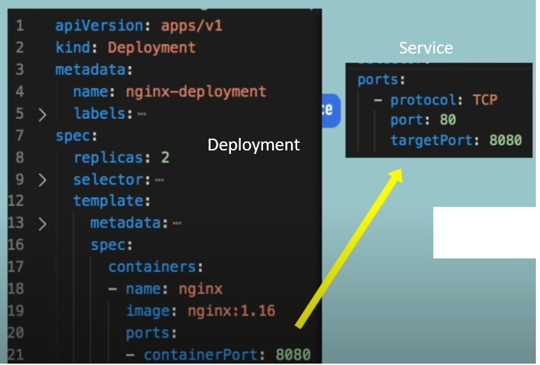
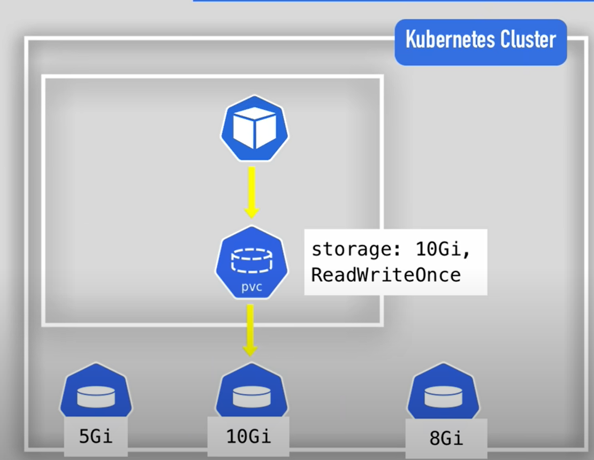
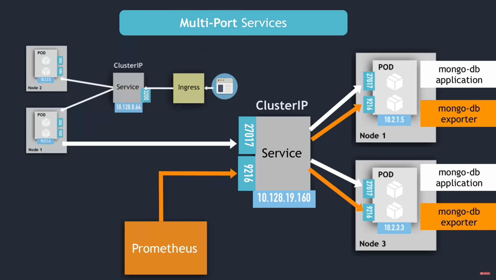
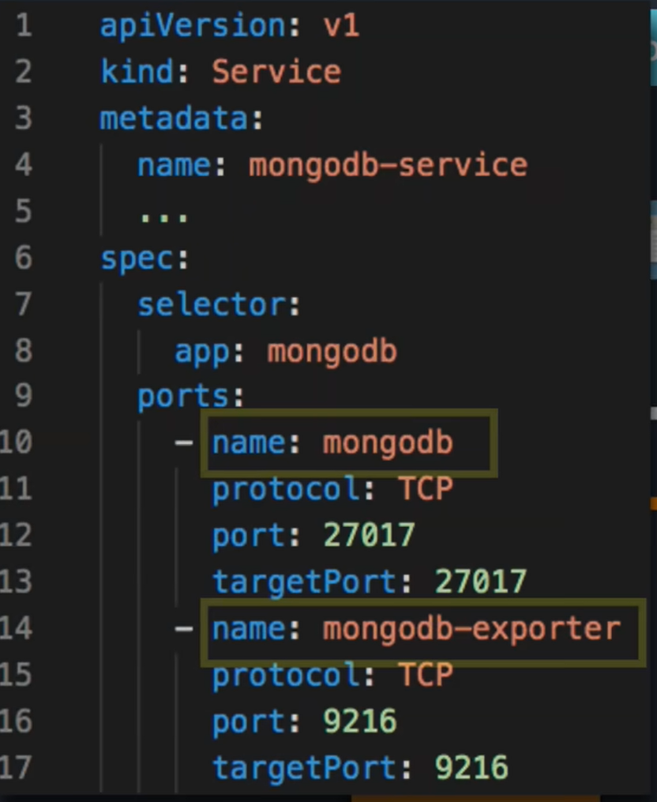

# Kubernetes
- Open source container orchestraition system for automating deployment, scaling, and management.
### Kubernetes cluster
- A cluster is made of : `Control planes` + `worker nodes`
- Each node has a `kubelet` working on it
- Depending on load different number of docker containers are running on a worker node
- Terminology
  - Control plane : Master node
  - Node : Virtual or Physical Machine
- Parts of Control Panel 
  - `API server` : Entry Point to k8d cluster
    - Basically UI/API/CLI talk to this server
  - `Control Manager` : Manages nodes, restarting of container, container repair
  - `Schedular` : Decides on which node a new `pod` will be scheduled
  - `etcd` key value storage : has config data and status of each node
  > - More then one `control plane` is running at a time so if one goes down then other will be still working 
  > - To restart control plain there exist a backup, which is made of `etcd snap shot`
- `Virtual network` 
  - Spins nodes that are part of cluster
  - Communication between node and master
>  - Kublet process : ?
- Kubectl(Kubernetes CLI) : Commands Control plane   


## Data Plane v/s control Plane
- Control Plane : Manages 
  - kube-apiserver
  - etcd
  - kube-Schedular
  - kube-controller-manager
  - cloud-control-manager
- Data plane : manages
  - kubelet : Agent that runs and manages nodes
  - kubeproxy
  - container runtime
- Basically `control plane` makes decision and `Data plane` implement decisions

<center>

</center>

### Main Kubernetes Componenets
- List of Main Kubernetes Componenets
  - Pod
  - Service
  - Ingress
  - ConfigMap
  - Secret
  - Deployment
  - StatefulSet
  - DaemonSet
- `Pod`
  - A node has multiple pods
  - Smallest unit in kubernetes
  - Abstraction over `container`
    - So we dont need to interact with `container` directly
    - And we only interact with Kubernetes layer
  - Pod runs one application at a time (usually)
  - For communication each pod has its own `IP address`
    - But if the pod dies new `IP` is assigned 
    - So to solve this `Service` is used
- `Service`
  - Have `permanent` `IP address` 
  - Lifecycle of pod and service are not connected
  - They also work as load balancer
    - Multiple pod can be connected to a service
    - Hence requests can be routed accordingly 
  - `Internal service` or `ClusterIP`  
    - Default service
    - Exposes service on internal IP making it accessable only on internal server
  - `External Service` 
    - Allows communication between `kubernetes cluster` and `external entities`
- `Ingess`
  - Manages external access to service, typically HTTP and HTTPS
  - When a http or https request comes it goes to ingress then it is forwarded to desired service
- `ConfigMap`
  - Say the url of my database is changed in the internal server
  - So we need to re`build` the app push it to repo and pull it in the `pod`
    - This is tedeous
  - ConfigMap has all this data like URL and other like env variable file
  - `Stores non-confidential` configuration data in key-value pairs.
- `Secret`
  - It is like ConfigMap but store data in 64-bit encoded format
  - They are needed to be encrypted by a third party app furthur
- `Volume`
  - If the pod restarts and the data is stored in pod then it is lost 
  - It attaches physical location to the cluster so if the pod is lost then the data is not lost, just like `docker volume`
  - Kubernetes does not itself manage data persistance
- `Deployment`
  - It is a `blueprint` for `pods`
  - We will be creating `deployments` and we can mention how many duplicate pods need to run   
  - `Deployment` is abstraction of `pods`
  - So if a pod dies then request are directed to other pod
  - However data base cannot be replicated using deployment as they have currentt state
  - Hence `only stateless app's` blueprint should be creating using `deployment`
- `StatefulSet`
  - As `databases have states` so the blueprint of database should be created using `StatefulSet` 
  - Hence Stateful app's blueprint should be created using `StatefulSet`

### Configuration
- Template for deployment pod
```yaml
apiversion: apps/v1
kind: Deployment
metadata:
  name: my-app
  labels:
    app: my-app
spec:
  replicas: 2
  selector:
    matchLabels:
      app: my-app
  template:
    metadata:
      labels:
        app: my-app
      spec:
        containers:
          - name: my-app
            image: my-image
            env:
              - name: SOME_ENV
                value: $SOME_ENV
            ports:
              containerPort: 8080
```
- Parts of configuration file
  1. Metadata
  2. Specification
  3. Status (auto generated not to be added)
      - Kubernetes compare current state and desired state(found in config file)
      - This is self healing feature

## StatefulSet v/s Deployment
- When scaling up and down horizontally deployment are created and destroyed randomly
- but this is not the case in stateful set, pods are created and destroyed in predictable manner
  - pods are indexed and are created and destroyed in specific order
- Each deployment's pod share common storage 
- Each statefulSet's pod has individual persistant storage
  - Now if a pod goes down then it will be asigned the same persistance storage which was used by the previous pod
> ### This does not mean statefulSet are good to run database
> ### They are just slightly better choise but not the best choise
 
<center>

</center>

## Minikube
> ### kubernetes is running in minikube cluster
> - minikube cli is just for startup and deleting the cluste
> - kubectl cli is for configuring minikube cluster

- Minikube v/s other kubernetes engine

|Feature|	Minikube|	Google Kubernetes Engine (GKE)|
|-|-|-|
Purpose	| Local development and testing	|Production-grade managed Kubernetes service|
Deployment Scale	|Single-node, small-scale|	Multi-node, large-scale|
Resource Requirements|	Minimal, suitable for local machines|	Significant, designed for large-scale environments
Infrastructure|	Local machine with virtualization/containerization|	Google Cloud Platform|
Networking|	Basic, single-node configuration|	Advanced, with load balancing and ingress options|
Cluster Management|	Simplified, lacks advanced features	|Extensive, with auto-scaling, updates, and more|


- Starting minikube
  ```
  minikube start
  ```
  - If it starts successfully then this message will appear
  ```
  😄  minikube v1.34.0 on Ubuntu 22.04 (amd64)
  ✨  Using the docker driver based on existing profile
  👍  Starting "minikube" primary control-plane node in "minikube" cluster
  🚜  Pulling base image v0.0.45 ...
  🔄  Restarting existing docker container for "minikube" ...
  🐳  Preparing Kubernetes v1.31.0 on Docker 27.2.0 ...
  🔎  Verifying Kubernetes components...
      ▪ Using image gcr.io/k8s-minikube/storage-provisioner:v5
  🌟  Enabled addons: default-storageclass, storage-provisioner
  🏄  Done! kubectl is now configured to use "minikube" cluster and "default" namespace by default
  ```
- Stop minikube
  ```
  minikube stop
  ```
- Checking minikube status
  ```
  minikube status
  ```
  - expected status
    ```
    minikube
    type: Control Plane
    host: Running
    kubelet: Running
    apiserver: Running
    kubeconfig: Configured
    ```
- getting Nodes
  ``` 
  kubectl get nodes
  ```
- Creating most basic deployment using kubectl
  ```
  kubectl create deployment <deployment-name> --image=<image>
  ```
  ```
  kubectl create deployment redis-kube-dep --image=redis:latest --replica=1
  ```
- Check pods and deployments and replicaset
  - ```
    kubectl get pods | kubectl get pods -o wide
    ```
  - ```
    kubectl get deployments
    ```
  - ```
    kubectl get replicaset
    ```
- Edit deployment
  ```
    kubectl edit deployment <deployment-name>
  ```
  - This will open vim editor
- get logs
  ```
  kubectl logs <pod-name>
  ```
- To access pod(docker container in the pod)
  - ```
    kubectl exec -it <pod-name> -- <container-command>
    ```
  - ```
    kubectl exec -it redis-kube-dep-5754ccb858-nxwcx -- redis-cli
    ```
  - ```
    kubectl exec -it ubuntu-pod-5754ccb858-nxwcx -- bin/bash
    ```
- Describe service
  ``` 
    kubectl describe service <service-name>
  ```
- Get status of depolyment
  ```
    kubectl get deployment <deployment-name> -o yaml
  ```
- Delete pod/service/deployment
  ```
    kubectl delete pod <pod-name/id>
    kubectl delete pod <pod-name/id> --force
  ```
  ```
    kubectl delete deployment <deployment-name/id>
    kubectl delete deployment <deployment-name/id> --force
  ```
  ```
    kubectl delete svc <service-name/id>
    kubectl delete svc <service-name/id> --force
  ```
- If a yaml file is used to create multiple deployments/services/statefulset the 
  ```
    kubectl delete -f <deployment-file-name>.yaml
  ```


## yaml config file for kubernetes cluster
- Basic config file for running redis
- Use apply to create node
  ```
  kubectl apply -f <file-name>.yaml
  ```

```yaml
apiVersion: apps/v1
kind: Deployment
metadata:
  name: redis-deployment
  labels:
    app: redis
spec:
  replicas: 2
  selector:
    matchLabels:
      app: redis
  template:
    metadata:
      labels:
        app: redis
    spec:
      containers:
      - name: redis
        image: redis:latest
        ports:
        - containerPort: 6379
```
- 4 parts of config file
  1. apiVersion
  2. Kind
  3. metadata
  4. spec
- ### `apiVersion`
  | apiVersion | Group members | 
  |-|-|
  |`v1`|Pods, Services, ConfigMaps, Secrets|
  |`apps/v1`|Deployments, StatefulSets, DaemonSets, and ReplicaSets|
  |`batch/v1`| Jobs and CronJobs| 
  |`batch/v1beta1`|  beta features related to batch processing|
  |`autoscaling/v1`|  HorizontalPodAutoscalers |
  |`networking.k8s.io/v1`|  NetworkPolicies and Ingress|
  |`rbac.authorization.k8s.io/v1`|  Role, ClusterRole, RoleBinding, and ClusterRoleBinding|
  |`policy/v1beta1`|  PodDisruptionBudgets and PodSecurityPolicies|
  |`storage.k8s.io/v1`|  StorageClasses, VolumeAttachments, and CSI drivers|
  |`apiextensions.k8s.io/v1`|  CustomResourceDefinitions (CRDs)|
  |`admissionregistration.k8s.io/v1`|  Admission Webhooks|
  |`scheduling.k8s.io/v1`| PriorityClasses|
  |`coordination.k8s.io/v1`|  Leases|
- ### `kind`
  - Core resource
    - `Pod`, `Service`
  - Workload resource
    - `Deployment`,  `StatefulSet`,  `DaemonSet`,  `ReplicaSet`,  `Job`,  `CronJob`
  - Networking resources
    - `Ingress`,`NetworkPolicy`
  - Configuration and storage resource
    - `ConfigMap`,`Secret`,`PersistentVolume`,`PersistentVolumeClaim`
  - Policy resource
    - `PodDisruptionBudget`,`PodSecurityPolicy`
  - Custom resource
    - `CustomResourceDefinition (CRD)`
- ### `metadata`
  - This contains information about the resources
  - `name` : name of the resource like name of deployment or name of service
  - `labels`(optional) : used in grouping resources
    - `app` and `environment` are two sub parts of label along with many others
- ### `spec`
  - Components depend on `kind`
    - Eg: Deployment has 3 componenets : `replicas`, `selector`, `template`
    - Eg: Service has 2 components : `selector`, `port`
  - `replicas` : number of replicas of pods required
  - `template` 
    - It has its own `metadata` and `spec`
    - `spec` : 
      - one subpart under spec is `container` any number of different container can come under spec
    ```yaml
      template:
        metadata:
          labels:
            app: multi-container-app
        spec:
          containers:
          - name: nginx-container
            image: nginx:latest
            ports:
            - containerPort: 80
          - name: redis-container
            image: redis:latest
            ports:
            - containerPort: 6379
    ```
  - Spec has `selector` which has `matchLabels` which bind the pod to all the key-value pairs present and matches with its own key value pair
  - And then the `labels` in `template: metadata:` are the labels of pod
  - Together with these two pod can connect to `service` as `service` also has `selector` in them 
- Now lets say a service want to access current pod then it will access using pod's service
  - hence all the request to the service will be forwarded to pod
  - so pod has three ports
    - port : External port
    - targetPort : port of pod should match with containerPort
    - nodePort : optional
  <center>
    
  </center>


### Requirements for file
- For a deployment to run it needs to have services to interact with others
- Example of deployment with service


<table>
  <tr>
    <th>MongoDB Deployment</th>
    <th>Mongo Service</th>
  </tr>
  <tr>
    <td>

```yaml
apiVersion: apps/v1
kind: Deployment
metadata:
  name: mongo-deployment
spec:
  replicas: 1
  selector:
    matchLabels:
      # select the label from service
      app: mongo 
  template:
    metadata:
      labels:
        app: mongo
    spec:
      containers:
      - name: mongodb
        image: mongo:latest
        ports:
        - containerPort: 27017
        env:
        - name: MONGO_INITDB_ROOT_USERNAME
          valueFrom:
            secretKeyRef:
              name: mongo-secret
              key: username
        - name: MONGO_INITDB_ROOT_PASSWORD
          valueFrom:
            secretKeyRef:
              name: mongo-secret
              key: password
```


</td>
<td>

```yaml    
apiVersion: v1
kind: Service
metadata:
  name: mongo-service
spec:
  selector:
    app: mongo
  ports:
  - protocol: TCP
    # port of the service which will be static
    port: 27017
    # must match with container port
    targetPort: 27017
```
  </td>
  </tr>
</table>

- Example of mongo-express 

<table>
  <tr>
    <th>Mongo-Express Deployment</th>
    <th>Mongo-Express Service</th>
  </tr>
  <tr>
  <td>

  ```yaml
  apiVersion: apps/v1
  kind: Deployment
  metadata:
    name: mongo-express-deployment
  spec:
    replicas: 1
    selector:
      matchLabels:
        app: mongo-express
    template:
      metadata:
        labels:
          app: mongo-express
      spec:
        containers:
        - name: mongo-express
          image: mongo-express:latest
          ports:
          - containerPort: 8081
          env:
          - name: ME_CONFIG_MONGODB_ADMINUSERNAME
            valueFrom:
              secretKeyRef:
                name: mongo-secret
                key: username
          - name: ME_CONFIG_MONGODB_ADMINPASSWORD
            valueFrom:
              secretKeyRef:
                name: mongo-secret
                key: password
          - name: ME_CONFIG_MONGODB_SERVER
            valueFrom:
              configMapKeyRef:
                name: mongo-configmap
                key: mongodb-url
  ```
</td>
    <td>

```yaml    
  apiVersion: v1
  kind: Service
  metadata:
    name: mongo-express-service
  spec:
    type: NodePort
    selector:
      app: mongo-express
    ports:
    - protocol: TCP
      # port exposed internally
      port: 8081
      # port of deployment
      targetPort: 8081
      # external port
      nodePort: 30000
```

  </td>
  </tr>
</table>

<table>
  <tr>
    <th>ConfigMap</th>
    <th>Secret</th>
  </tr>
  <tr>
    <td>

```yaml
apiVersion: v1
kind: ConfigMap
metadata:
  name: mongo-configmap
data:
  mongodb-url: "mongo-service"

```

</td>
<td>

```yaml    
apiVersion: v1
kind: Secret
metadata:
  name: mongo-secret
type: Opaque
data:
  # base64 encoded 'username'
  username: dXNlcm5hbWU=  
  # base64 encoded 'password'
  password: cGFzc3dvcmQ=  
```
  </td>
  </tr>
</table>


> - Points to take care
>  - The url used will be the service name as done in 

## Namespaces
- Used to organise resource
- Virtual cluster inside a cluster
```
kubectl create namespace <namespace-name>
```
- Using config file to creae namespace
```yaml
apiVersion: v1
kind: ConfigMap
metadata:
  name: mysql-configmap
  namespace: my-namespace
data:
  db_url: mysql-service.database
```
- By default everything goes into one namespace
- It can become a mess when there so many resource
- Use
  - Limit the resource access
  - Blue/Green deployment
    - One is in production and other is in staging but both share same resource
    - So multiple resource wont be created for the production and staged namespace
  - Conflicting names of config files
- Property
  - ConfigMap and Secret connot be shared
  - Service can be shared accross namespace 
    - Now the service name changes to `<service-name>.<namespace>`
  - Resources that cannot be contained in namespace
    - Presistant volumes, nodes
  - We can make resource global like persistant volume
    ``` 
    kubectl <api-resource> --namespace=false
    ```
- Change default namespace
  ```
  kubie ctx <context>
  kubie ns <namespace>
  ```
  ```
  kubie ctx minikube
  kubie ns my-ns
  ```
## Helm
- It is package manager for kubernetes like `apt`
- It helps in distributing them in public and private repo
- Helm charts
  - Say I am adding Elastic search for logging data
  - I need to configure statefulSet, ConfigMap, Secret, Services
  - Also I need to set user permissions
  - And this is same for accross platforms for elastic search 
  - So why to waste time configuring them 
  - Hence we have `helm charts` which has this info stored  
  - We can create our own helm charts(bundle of yaml files)
  - This helm charts can be forwarded to helm repo and can be pulled like github
- Helm is template engine
  - We can define a common blueprint 
    - Like the deployments we have there are only a few changes
    - Like name, labels, ports, images
    - So they can be treated as dynamic values and replaced
  - Example
  <table>
  <tr>
  <th> values.yaml </th>
  <th> template </th>
  </tr>
  <tr>
  <td>
  
```yaml
name: my-app
container:
  name: my-app-container
  image: app-image
  port: app-port
```

  </td>


  <td>

```yaml
apiVersion: apps/v1
kind: deployemnt
metadata:
  name: {{.Value.name}}
spec:
  containers:
  - name: {{.Value.container.name}}
    image: {{.Value.container.image}}
    port: {{.Value.container.port}}
```

  </td>
  
  </tr>

  </table>

- Helm charts structure
  - Charts.yaml : meta info about the chart
  - values.yaml : values for template file
  - Default values can be overriden 
  - chart : chart dependencies

## Kubernetes volume
- We can store the container data on the pod using volume mount
- But this craete problem
  - When pod restart then data is deleted
  - Data sharing is a little difficult
  - Explain to see
  - <details>
      <summary> to open code </summary>

      ```yaml

      apiVersion: apps/v1
      kind: Deployment
      metadata:
        name: mongo
      spec:
        replicas: 1 
        selector:
          matchLabels:
            app: mongo
        template:
          metadata:
            labels:
              app: mongo
          spec:
            containers:
            - image: mongo
              name: mongo
              args: ["-dbpath", "/data/db"]
              env:
              - name: MONGO_INITDB_ROOT_USERNAME
                value: "admin"
              - name: MONGO_INITDB_ROOT_PASSWORD
                value: "password"
              volumeMounts:
              - mountPath: /data/db
                name: mongo-volume
            volumes:
            - name: mongo-volume
              emptyDir: {}
      ---

      apiVersion: v1
      kind: Service
      metadata:
        name: mongo-svc
      spec:
        ports:
        - port: 27017
          protocol: TCP
          targetPort: 27017
          nodePort: 32000
        selector:
          app: mongo
        type: NodePort


      ```

    </details>

- So else we can store data on node
  - for that just change the volume from
  ```yaml
  volume: 
  - name: mongo-volume
    emptyDir: {} 
  ```
  - to this  
  ```yaml
  volume: 
  - name: mongo-volume
    hostPath: 
      path: /path/in/node
  ```
- But what if a node goes down? then again it is problem
- Also data between nodes cannot be shared

- So the volumes discussed till now are ephimeral volumes
  - ephimeral volumes are ones that are created by resources itself
    - also these ephimeral volumes get deleted when resource goes down
- Hence we shift to a DB outside our custer like googleCloud   

- There are three types of volume 
  - Persistent volume
  - Persistent volume claim
  - Storage class
- Storage requirement
  - As kubernetes does not provide data persistance
    - Hence we need a storage that does not depend on pod lifecycle
  - Also storage must be available to all nodes
    - Hence it cannot be in a namespace
  - It needs to survive cluster crash
### 1. <u> Persistent volume </u>
  - cluster resource, can be created using kubeclt of yaml file
  - It is just an abstract componenet of storage
    - These storage can be local harddrive, nfs server, cloud-storage etc.
  - Hence Persistent volume is an interface that can be used to access actual database
> ### - For database perisitance we should we remote storage instead of local storage
  - Creating PersistentVolume
  ```yaml
  apiVersion: v1
  kind: PersistentVolume
  metadata:
    name: mongo-pv
  spec:
    capacity:
      storage: 100Mi
    accessModes:
      - ReadWriteMany
    local:
      path: /miniK/data
    nodeAffinity:
      required:
        nodeSelectorTerms:
        - matchExpressions:
          - key: kubernetes.io/hostname
            operator: In
            values:
            - minikube
  ```
  - AccessMode
    - `ReadWriteMany` : Multiple pods accross nodes can read write 
    - `ReadWriteOnce` : Pods of same node can access node
    - `ReadOnlyMany` : Same as ReadWriteMany but only read is allowed 
    - `ReadOnlyOnce` : Same as ReadWriteOnce but only read is allowed
    - `ReadWriteOncePod` : Only one pod can access data
### 2. <u> Persistent volume claim </u>
  - Pods dont directly access `persistent volume`
  - They need to specifically mention details 
  - Here is where `persistent volume claim` comes
    - It mentions details about the resources that pods require
    - And then request it to `persistent volume`
  > - `Persistent volume claim` must exist in same namespace as `pod`
  <center>
  
  </center> 

  - Example of PVC 
  ```yaml
    apiVersion: v1
    kind: PersistentVolumeClaim
    metadata:
      name: mongo-pvc
      namespace: default
      labels:
        app: mongo-pvc
    spec:
      storageClassName: ""
      accessModes:
      - ReadWriteMany
      resources:
        requests:
          storage: 100Mi
  ```
> ### I dont know how to bind PVC to specific PV it goes for default behavior 

- ### <u> Storage class </u>
  - Say there are 100s of `pods` and 100s of `persistent volumes` managing and craeting them is a tedious task
  - Hence `storage class` handles management and craetion of this `persistent volumes`
  <center>
  
  </center> 
  
  - So we cannot go creating PV for 100's of pods so storage class comes into picture
  - We can define whihc storage class to use PVC and then according to storage class PV will be creted
  
  ```yaml
  apiVersion: storage.k8s.io/v1
  kind: StorageClass
  metadata:
    name: mongo-storageclass
  provisioner: k8s.io/minikube-hostpath
  volumeBindingMode: Immediate
  reclaimPolicy: Delete
  ```

  - `volumeBindingMode` : 
     - `Immediate`: PV is created as soon as PVC is created
     - `WaitForFirstConsumer` : Waits till PVC is claimed by any pod
  - `reclaimPolicy`:
    - What to do with PV when PVC is deleted
    - `Delete` : delete PV when PVC is deleted
    - `Retain` : Dont delete PV when PVC is deleted
>  ### - When PV is deleted only the resouce is deleted and not the actual data 
>  ### - The actual storage is to be deleted manually when reqired
## Kubernetes Services
- It is an abstraction layer which has a stable IP address
- We use `selector` to know where should `Service` forward request to / which `pod` to forward request to 
  - The key value pair in selector are mapped to `app` in `label` in `deployment`/`statefulset`
  - Then for the port to forward to in the pod is defined by `targetPort` in `service`
- The `pod-ip:ports` are endpoints of service, and the list is maintained. This list can be fetched using 
  ``` 
    kubectl get endpoints
  ```
- Each `Pod` gets its own unique IP, Pod also have their own private network for containers to communicate within the pod
- A Pod can communicate with any other pod on the cluster irrespective of node without the use of proxies or address translator (NAT)
	- Cluster has its own DNS record 
	- this doesnot apply on windows
- `Services` provide static IP or hostname
- `EndpointSlice` : It is a resource that manages endpoints(IPs and Ports) for services
- Kubernetes manages this `EndpointSlice` for `Services`
- If the workload or requests are http type then we choose `ingress`
  - this is not a service but is designed to handle HTTP/s loads
  - It can expose multiple resources with one ingress resources
  - We write all routing rules in ingress
  - It is main communication between client and cluster
- If we have multi-port service then we have to define the name

<table>
<tr>
<th></th>
<th></th>
</tr>
<tr>
<tb></tb>
<tb></tb>
</tr>
</table>

### Selector label
- Services have `selector` label that finds the pod with label mentioned in svc
- As seen over here label is ` labels: app.kubernetes.io/name: proxy `
  - and label selector is `  selector:app.kubernetes.io/name: proxy `
- Also instead of PORT number we can give port name in the service as shown 
  - Container port and Target Port in the code

```yaml
apiVersion: v1
kind: Pod
metadata:
  name: nginx
  labels:
    app.kubernetes.io/name: proxy
spec:
  containers:
  - name: nginx
    image: nginx:stable
    ports:
      - containerPort: 80
        name: http-web-svc
---
apiVersion: v1
kind: Service
metadata:
  name: nginx-service
spec:
  selector:
    app.kubernetes.io/name: proxy
  ports:
  - name: name-of-service-port
    protocol: TCP
    port: 80
    targetPort: http-web-svc
```

### Protocol
- By default it is `TCP`
- It can be `UDP`, `SCTP`

### Service without selector
- Selector are basically used to match pod
- Service can be without selector eg.
  - We want to have external database in the cluster
  - Point to a service in another namespace or cluster
```yaml
apiVersion: v1
kind: Service
metadata:
  name: my-service
spec:
  ports:
    - name: http
      protocol: TCP
      port: 80
      targetPort: 9376
```
- As the selector is not there, so `EndpointSlice` object are not created
  - Hence we can manually configure it
- For the above service following is the `EndpointSlice` 
- for this when a request hits service at port 80 it forward it to port 9376 then `endpointslice` forward it to addresses mentioned "`10.4.5.6` & `10.1.2.3`"


```yaml

apiVersion: discovery.k8s.io/v1
kind: EndpointSlice
metadata:
  name: my-service-1 # by convention, use the name of the Service
                     # as a prefix for the name of the EndpointSlice
  labels:
    # You should set the "kubernetes.io/service-name" label.
    # Set its value to match the name of the Service
    kubernetes.io/service-name: my-service
addressType: IPv4
ports:
  - name: http # should match with the name of the service port defined above
    appProtocol: http
    protocol: TCP
    port: 9376
endpoints:
  - addresses:
      - "10.4.5.6"
  - addresses:
      - "10.1.2.3"

```

- Types of services
  1. ClusterIP 
      - Default type
      - Can only serve inside cluster
      - The service acts as load balancer 
      - Hence direct request randomly depending on load
      - For public access use `Ingress` or `Gateway` 
  2. Headless
      - In `StatefulSet` we need to direct request to specific `pod`
      - like say a `mongodb-pod` so we can write only in first `pod`
        - So we want to direct write request to only first pod
      - Also in `StatefulSet` when a new `pods` start it replicates specifically the previos pod
      - Hence `Headless` service comes into play
      - So we make the `ClusterIP` in service to `none` 
        - So when client do `DNS lookup` it instead of IP address of service IP address of pod is returned which is static in case of `StatefulSet` 
  3. NodePort
      - Creates a `static port` on the `node` that is accessible to `external client`
        - Basically an external port   
        - But the clusterIP is only internally accessable
        - This nodeport can be in range of `30000-32767`
      - Not very secure
  4. Load-balance
      - Service becomes accessable through the `LoadBalance` of the `cloud provider`  
      - Each cloud service has its own `load balancer functionality` 
      - When we use `Load Balancer` service a `Cloud provider's` `load balancer` is created
  5. ExternalName
      - Used to map service to external DNS name
      - When we use this k8s return CNAME record with external name
      - CNAME mapping domain->domain, domain->IP
      ```yaml
      apiVersion: v1
      kind: Service
      metadata:
        name: db-service
      spec:
        type: ExternalName
        externalName: my.database.example.com
      ```
#### External IPs
- If we want to forward request to another cluster or IP we can do it as 
```yaml
apiVersion: v1
kind: Service
metadata:
  name: my-service
spec:
  selector:
    app.kubernetes.io/name: MyApp
  ports:
    - name: http
      protocol: TCP
      port: 80
      targetPort: 49152
  externalIPs:
    - 198.51.100.32
```
- This take request from 49152 and send it to 198.51.100.32 via port 80 if it own

## Gateway API
- Allows us to make `service` accessable to external client
- Basically exposes service
- A simple way of exposing port is `Loadbalancer` service
  - While nodePort also expose service by directly exposing the node IP but 
  - `Loadbalancer` is external to cluster and is managed by `service provider`
  - Nodeport is mostly used in testing and development


## Redirecting services from WSL to windows (Port Forwarding)
```
minikube service <service-1> <service-2> 
```
## Problems Deploying MERN stack app on kubernetes
- When we have deployed a react(javascript based frontend) app on kubernetes
  - The service run on pod but the javascript code runs on browser
  - So it runs outside the pod hence it does not have access to kuberenetes resources
- To solve this there are two ways
  - Setup loadBalancer service and put external endpoint to backend config
  - Setup ingress controller and deploy both Ingress controller and Service with backend   


# Context in Kubernetes
- Context is set of accessable parameters
  - Which cluster to connected to 
  - Which users are authenticated 
  - Which namespace to use
- Basically it helps to switch between GKE and minikube
- Get all context
  ```
  kubectl config get-contexts
  ```
- Switch context
  ```
  kubectl config use-context <context-name>
  ```
- Get context info
  ```
  kubeclt cluster-info
  ```
- View all clusters
  ```
  kuebctl config view
  ```
- Delete context
  ``` 
  kubectl config delete-context <context-name>
  ```
  - Also it is advisable to delete cluster and user info
  ```
  kubectl config unset users.<context-name>
  kubectl config unset clusters.<context-name>
  ```

## Network policy in kubernetes
- Any port in a cluster and contact any port inside the cluster 
- This can be problematic, when we want to restrict access to certain resources to employee
- Kubernetes have not inbuilt policies but support CNI that have policies related resources in them 
- This is an example of how to restrict the traffic

```yaml
apiVersion: networking.k8s.io/v1
kind: NetworkPolicy
metadata:
  name: silly-demo
spec:
  podSelector:
    matchLabels:
      app.kubernetes.io/name: silly-demo
  ingress:
  - from:
    - namespaceSelector:
        matchLabels:
          environment: production
    ports:
    - protocol: TCP
      port: 8080
```
- So here we are applying policy on service name `app.kubernetes.io/name: silly-demo`
- And the rules are 
  - If the traffic is entering then it should be from namespace `environment: production`
  - Its communication protocal should be `TCP`
  - Its communication port must be `8000`
- And if we want to control were it should send traffic then we can use `egress`

## TLS/SSL certificate
- Google provide two SSL certificate configration method
  1. Compute Engine SSL certificate resource
  2. Certificate Manager
-  `Certificate manager` is good for managing multiple SSL cerificate that are managed by google
- `Compute Engine SSL certificate resource` is good for managing self managed SSL certificate 
### Steps to Create cerificate manager
1. `Create SSL Certificate Resources:`
- Upload your SSL certificates (private key and certificate) to Google Cloud as SSL certificate resources.
- You can do this via the Google Cloud Console or using the gcloud command-line tool.

2. Configure Your Load Balancer:
- Reference the SSL certificate resources in your load balancer configuration.
- Ensure each target proxy for your load balancer points to the correct SSL certificate resource for each host.

```yaml
apiVersion: compute.googleapis.com/v1
kind: TargetHttpsProxy
metadata:
  name: example-https-proxy
spec:
  sslCertificates:
  - name: ssl-cert-1
  - name: ssl-cert-2
  urlMap: example-url-map
```