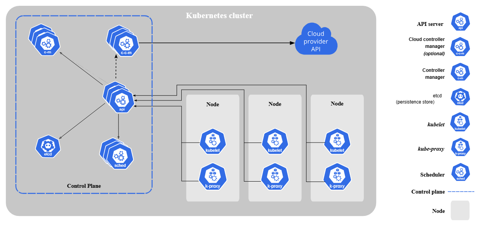
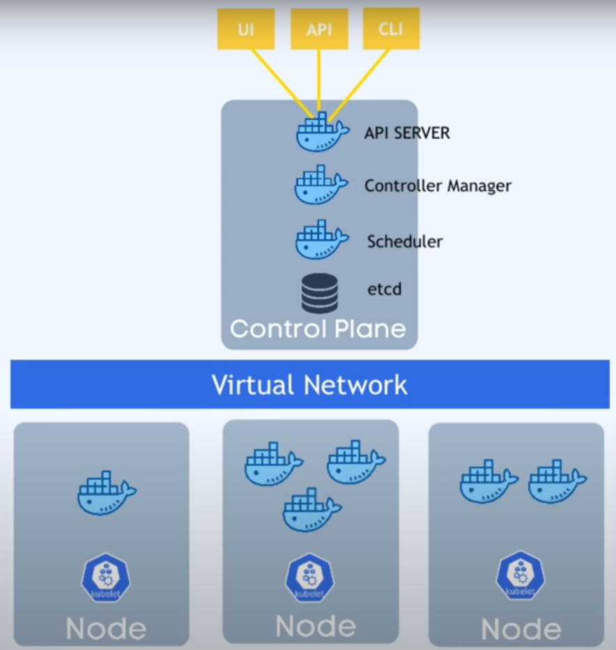
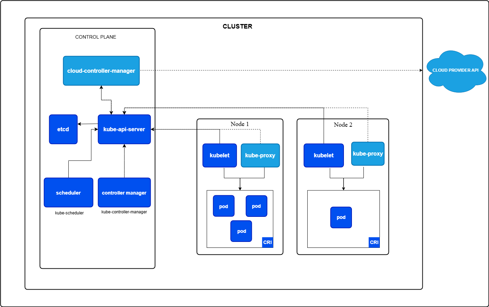
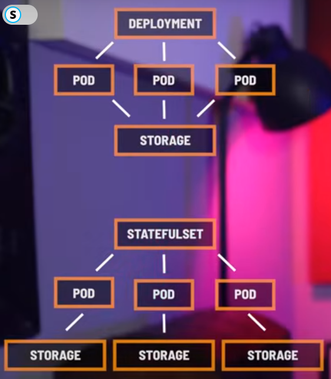
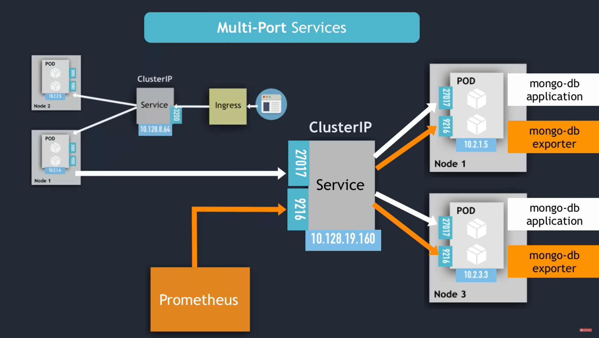
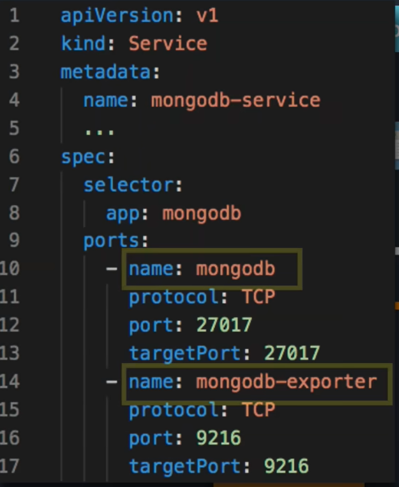
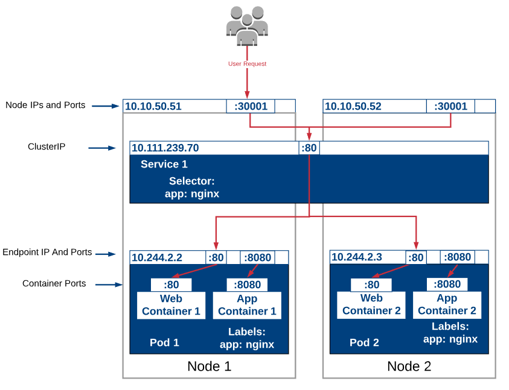
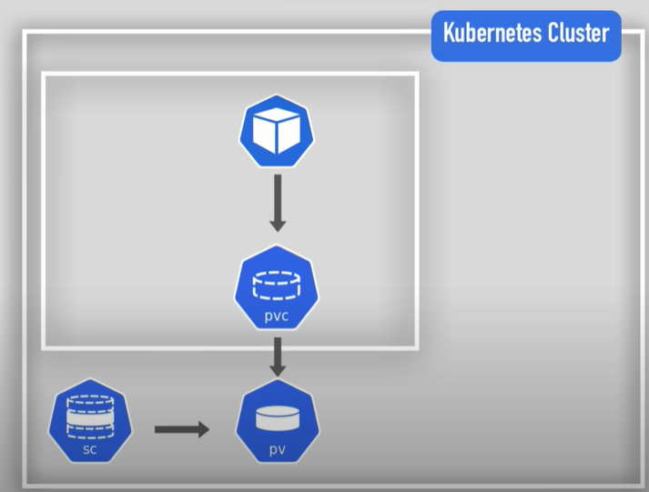

# Kubernetes
- Open source container orchestraition system for automating deployment, scaling, and management.

## Content
- [Master Node](./kubernetes.md#master-node--control-plane)
- [Worker Node](./kubernetes.md#Worker-node)
  - [Pods](./kubernetes.md#pods)
  - [Deployment](./kubernetes.md#Deployment)
  - [StatefulSet](./kubernetes.md#StatefulSet)
  - [StatefulSet vs Deployment](./kubernetes.md#statefulset-vs-deployment)
  - [Services](./kubernetes.md#services)
  - [Volume](./kubernetes.md#volume)
  - [Namespaces](./kubernetes.md#Namespaces)
- [Minikube](./kubernetes.md#Minikube)
- [MongoDB example](./kubernetes.md#MongoDB-example)
- [Helm](./kubernetes.md#Helm)


## Master Node / Control Plane

- Set of distributed processes that run together to orchestrate containers 
- ### **Core Components**
  - API server
  - etcd
  - Schedular
  - Controller Manager
  - Cloud Controller Manager
- ### **API server**
  - Central point of contact for all interaction in k8s cluster
  - Communcation happen using RESTful API
  - Versioning happen through path versioning 
  - APIs are organized in groups via path

    ```bash
    core/v1 # (core API group, version 1)
    apps/v1 # (apps API group, version 1)
    networking.k8s.io/v1 # (networking API group, version 1)
    ```
  
  - Also handles authorization and authentication
- ### **etcd** 
  - Stores metadata about the entire cluster in key-value pair
  - Also stores current and desired state 
- ### **Controller Manager**
  - Periodically requests data from etcd about current state and desired state
    - And acts upon it
  - Takes care of 
    - Container health
    - Number of replicas
    - endpoints
    - Volumes
- ### **Schedulars**
  - They generally recieve request for creating new resources
  - Once they recieve request Schedulars check for existing resources
  - Then it instructs node manager to create reousrce 
- ### **Cloud Controller Manager**
  - Provide integration with cloud provider

<center>


</center>

## Worker Node
- ### **Kubelet**
  - Each worker node has one kubelet
  - It ensures containers are running on pods
  - It communicates with control plane and recieves instruction
- ### **kube-proxy**
  - They are part of network rules management
  - Helps services in redirecting traffic recieved 


<center>

</center>

## Pods 
- Smallest deployable unit
- Each pod can host multiple containers
- Why pods instead of containers
   - Grouping containers locally
   - Shared Resources
   - Atomic Unit
- Pods have their own IP 
  - But it changes when a new pod replaces current pod
  - So to communicate with pod we depend on services 

<details>
  <summary> Pod's code </summary>

  ```yaml
  apiVersion: v1 # Specifies the API version for the resource (core API version 1)
  kind: Pod # Declares that this YAML defines a Pod resource

  metadata: # Metadata about the Pod
    name: detailed-pod-example # The unique name of the Pod
    namespace: default # Specifies the namespace for the Pod (optional, defaults to "default")
    labels: # Key-value pairs used to identify and select the Pod
      app: my-app # Label indicating the application this Pod belongs to
      environment: development # Label indicating the environment the Pod is running in
    annotations: # Key-value pairs for non-identifying metadata
      description: "This is a detailed example Pod." # A description of the Pod
      owner: "team-dev" # The team or person responsible for the Pod

  spec: # Specification of the Pod's desired state
    containers: # Defines the containers that will run within the Pod
    - name: main-container # The name of the main container
      image: nginx:latest # The Docker image to use for the container (nginx, latest tag)
      ports: # Defines the ports that the container will expose
      - containerPort: 80 # The port number that the container is listening on
        name: http-port # A name for the port
        protocol: TCP # The protocol used by the port (TCP)
      resources: # Defines resource requests and limits for the container
        requests: # Minimum resources the container requires
          cpu: "100m" # Requests 100 millicores of CPU
          memory: "256Mi" # Requests 256 megabytes of memory
        limits: # Maximum resources the container is allowed to use
          cpu: "500m" # Limits CPU usage to 500 millicores
          memory: "512Mi" # Limits memory usage to 512 megabytes
      env: # Defines environment variables for the container
      - name: ENVIRONMENT # Environment variable name
        value: "development" # Static value of the environment variable
      - name: CONFIG_VALUE # Environment variable name
        valueFrom: # Value is sourced from a ConfigMap
          configMapKeyRef: # Reference to the ConfigMap
            name: app-config # Name of the ConfigMap
            key: config_key # Key within the ConfigMap
      volumeMounts: # Mounts volumes into the container's filesystem
      - name: data-volume # Name of the volume to mount (defined later)
        mountPath: /usr/share/nginx/html # The path within the container where the volume will be mounted
      livenessProbe: # Checks if the container is still running
        httpGet: # Performs an HTTP GET request to check liveness
          path: / # The path to check (root path)
          port: http-port # The port to check (using the named port)
        initialDelaySeconds: 15 # Delay before the first probe is executed (15 seconds)
        periodSeconds: 20 # How often to perform the probe (20 seconds)
      readinessProbe: # Checks if the container is ready to serve traffic
        httpGet: # Performs an HTTP GET request to check readiness
          path: / # The path to check (root path)
          port: http-port # The port to check (using the named port)
        initialDelaySeconds: 5 # Delay before the first probe is executed (5 seconds)
        periodSeconds: 10 # How often to perform the probe (10 seconds)
    initContainers: # Defines containers that run before the main containers
    - name: init-container # Name of the init container
      image: busybox:latest # Docker image for the init container (busybox, latest tag)
      command: ['sh', '-c', 'echo "Initializing..." && sleep 5'] # Command to run in the init container (simulates initialization)
    volumes: # Defines volumes that can be mounted into containers
    - name: data-volume # Name of the volume
      emptyDir: {} # Creates an empty directory volume (ephemeral)
    nodeSelector: # Selects nodes based on labels
      kubernetes.io/os: linux # Schedules the Pod to nodes with the "kubernetes.io/os: linux" label
    tolerations: # Allows the Pod to tolerate taints on nodes
    - key: "node.kubernetes.io/unreachable" # Tolerates nodes with the "node.kubernetes.io/unreachable" taint
      operator: "Exists" # Matches any value of the taint
      effect: "NoExecute" # Tolerates taints with the "NoExecute" effect
      tolerationSeconds: 600 # Time to tolerate the taint (600 seconds)
    affinity: # Defines affinity rules for scheduling the Pod
      podAntiAffinity: # Prevents Pods with the same label from being scheduled on the same node
        requiredDuringSchedulingIgnoredDuringExecution: # Hard requirement during scheduling
        - labelSelector: # Selects Pods based on labels
            matchExpressions: # Defines label matching rules
            - key: "app" # Label key to match
              operator: In # Matches if the label value is in the list
              values: # List of label values to match
              - "my-app" # Matches Pods with the "app: my-app" label
          topologyKey: "kubernetes.io/hostname" # Ensures Pods are not scheduled on the same node (hostname)
  ```

</details>

## Deployment
- Used to manage stateless applicaton
- They are blueprint of pods
- Why not use pod?
  - Pods dont provide replication, we need to manually scale pods
  - Pods dont provide rollback if the new update fails
  - For updating pods we need to take them down and update them manually
  - If pods fail we need to manually repair them

<details>
  <summary>Basic code</summary>

  ```yaml
  apiversion: apps/v1
  kind: Deployment
  metadata:
    name: my-app
    labels:
      app: my-app
  spec:
    replicas: 2
    selector:
      matchLabels:
        app: my-app
    template:
      metadata:
        labels:
          app: my-app
        spec:
          containers:
            - name: my-app
              image: my-image
              env:
                - name: SOME_ENV
                  value: $SOME_ENV
              ports:
                containerPort: 8080
  ```

</details>

<details>
  <summary>Deployment code</summary>

  ```yaml
  apiVersion: apps/v1 # Specifies the API version for Deployments (apps/v1 is the current stable version)
  kind: Deployment # Declares that this YAML defines a Deployment resource
  metadata:
    name: my-application-deployment # The name of the Deployment (must be unique within the namespace)
    namespace: production # The namespace where the Deployment will be created (optional, defaults to "default")
    labels:
      app: my-application # Labels applied to the Deployment itself (used for organization and selection)
      environment: production # Additional label indicating the environment
    annotations:
      description: "Deployment for the main application" # Annotations for additional, non-identifying metadata
      owner: "team-app" # Annotation indicating the owner of the deployment
  spec:
    replicas: 3 # Specifies the desired number of Pod replicas (3 in this case)
    selector:
      matchLabels:
        app: my-application # Selects Pods with the label "app: my-application"
    strategy:
      type: RollingUpdate # Specifies the update strategy (RollingUpdate or Recreate)
      rollingUpdate: # Configuration for RollingUpdate strategy
        maxSurge: 25% # Maximum number of Pods that can be created above the desired number during update
        maxUnavailable: 25% # Maximum number of Pods that can be unavailable during update
    template: # Defines the Pod template that the Deployment will use to create Pods
      metadata:
        labels:
          app: my-application # Labels applied to the Pods created by the Deployment
      spec:
        containers:
        - name: application-container # Name of the container
          image: your-registry/my-application:v1.2.3 # Specifies the container image (replace with your actual image)
          ports:
          - containerPort: 8080 # Specifies the container port
            name: http-port # Name of the port
            protocol: TCP # Protocol used by the port
          resources: # Resource requests and limits for the container
            requests:
              cpu: "200m" # Requests 200 millicores of CPU
              memory: "512Mi" # Requests 512 megabytes of memory
            limits:
              cpu: "500m" # Limits CPU usage to 500 millicores
              memory: "1Gi" # Limits memory usage to 1 gigabyte
          env: # Environment variables for the container
          - name: DATABASE_URL # Example environment variable
            valueFrom:
              secretKeyRef:
                name: database-secret # Name of the Secret containing the database URL
                key: url # Key within the Secret
          - name: CONFIG_VALUE # Example environment variable sourced from a ConfigMap
            valueFrom:
              configMapKeyRef:
                name: app-config # Name of the ConfigMap
                key: config-key # Key within the ConfigMap
          livenessProbe: # Probe to check if the container is running
            httpGet:
              path: /health # Path to the health check endpoint
              port: http-port # Port to use for the health check
            initialDelaySeconds: 30 # Delay before the first probe
            periodSeconds: 10 # How often to perform the probe
          readinessProbe: # Probe to check if the container is ready to serve traffic
            httpGet:
              path: /ready # Path to the readiness check endpoint
              port: http-port # Port to use for the readiness check
            initialDelaySeconds: 15 # Delay before the first probe
            periodSeconds: 10 # How often to perform the probe
          volumeMounts: # Mounts volumes into the container
          - name: config-volume # Name of the volume to mount
            mountPath: /app/config # Path where the volume will be mounted
        volumes: # Defines volumes that can be mounted into containers
        - name: config-volume # Name of the volume
          configMap: # Specifies that this volume is sourced from a ConfigMap
            name: app-config # Name of the ConfigMap
        imagePullSecrets: # Used to specify secrets for pulling images from private registries.
        - name: regcred # Name of the secret.
        nodeSelector: # Select nodes based on labels
          kubernetes.io/os: linux # Schedule pods to nodes with the label kubernetes.io/os: linux.
        tolerations: # Allows pods to tolerate taints on nodes.
        - key: "node.kubernetes.io/unreachable"
          operator: "Exists"
          effect: "NoExecute"
          tolerationSeconds: 600
        affinity: # Defines affinity rules for scheduling the Pod
          podAntiAffinity: # Prevents Pods with the same label from being scheduled on the same node
            requiredDuringSchedulingIgnoredDuringExecution: # Hard requirement during scheduling
            - labelSelector: # Selects Pods based on labels
                matchExpressions: # Defines label matching rules
                - key: "app" # Label key to match
                  operator: In # Matches if the label value is in the list
                  values: # List of label values to match
                  - "my-application" # Matches Pods with the "app: my-application" label
              topologyKey: "kubernetes.io/hostname" # Ensures Pods are not scheduled on the same node (hostname) 
  ```

</details>


## StatefulSet
- Unlike Deployment they provide stable IP 
- When using with volumes each StatefulSet gets its own volume

<details>
  <summary>StatefulSet code</summary>

  ```yaml
  apiVersion: apps/v1
  kind: StatefulSet
  metadata:
    name: my-statefulset
    namespace: production # Use namespaces for better organization
    labels:
      app: my-stateful-app
  spec:
    serviceName: "my-stateful-service" # Headless service used for stable network identities
    replicas: 3 # Number of Pod replicas
    selector:
      matchLabels:
        app: my-stateful-app # Selector to match Pods
    template:
      metadata:
        labels:
          app: my-stateful-app # Labels applied to Pods
      spec:
        containers:
        - name: my-container
          image: your-registry/my-stateful-app:v1.0.0 # Replace with your image
          ports:
          - containerPort: 8080
            name: web
          volumeMounts:
          - name: data-volume # Mounts the persistent volume
            mountPath: /data # Path inside the container to mount the volume
          env:
          - name: POD_NAME
            valueFrom:
              fieldRef:
                fieldPath: metadata.name # Passes the Pod's name as an environment variable
          livenessProbe:
            httpGet:
              path: /health
              port: web
            initialDelaySeconds: 30
            periodSeconds: 10
          readinessProbe:
            httpGet:
              path: /ready
              port: web
            initialDelaySeconds: 15
            periodSeconds: 10
        imagePullSecrets:
        - name: regcred # for private registries.
    volumeClaimTemplates: # Defines persistent volume claims
    - metadata:
        name: data-volume # Name of the volume claim
      spec:
        accessModes: [ "ReadWriteOnce" ] # Access mode for the volume
        resources:
          requests:
            storage: 1Gi # Storage request for each volume
    updateStrategy:
      type: RollingUpdate # Specifies the update strategy
    podManagementPolicy: OrderedReady # Pod management policy for ordered deployment and scaling

  ---
  apiVersion: v1
  kind: Service
  metadata:
    name: my-stateful-service # Headless service name
    namespace: production
    labels:
      app: my-stateful-app
  spec:
    clusterIP: None # Creates a headless service
    selector:
      app: my-stateful-app
    ports:
    - protocol: TCP
      port: 8080
      targetPort: 8080
  ```

</details>

## StatefulSet v/s Deployment
- When scaling up and down horizontally deployment are created and destroyed randomly
- but this is not the case in stateful set, pods are created and destroyed in predictable manner
  - pods are indexed and are created and destroyed in specific order
- Each deployment's pod share common storage 
- Each statefulSet's pod has individual persistant storage
  - Now if a pod goes down then it will be asigned the same persistance storage which was used by the previous pod
> ### This does not mean statefulSet are good to run database
> ### They are just slightly better choise but not the best choise
 
<center>

</center>

## Services
- They provide stable IP for communication with the resources like pods, deployment, statefulset etc.
- The key value pair in selector are mapped to `app:label` in `deployment`/`statefulset`
- We use `selector` to know where should `Service` forward request to, i.e. which `pod` to forward request to 
- Types of services
  - **ClusterIP** : Used to expose IP to internal resources in the cluster
  - **NodePort** : Expose service on a static port accessable to outside world
    - Range for nodeport : `30000`-`32767`
  - **LoadBalancer** : Expose service to outside world using cloud provider's load balancer
    - If loadbalancer is mentioned in service cloud manager auto detectes and assigns public IP
  - **Headless** : A service without clusterIP
    - Here DNS name of the service resolves to IP address of pod
  - **ExternalName**
      - Used to map service to external DNS name
      - When we use this k8s return CNAME record with external name
      - CNAME mapping domain->domain, domain->IP
- `EndpointSlice` : It is a resource that manages endpoints(IPs and Ports) for services
- **Protocol**
  - By default it is `TCP`
  - It can be `UDP`, `SCTP`
- To forwad request to another IP

  ```yaml
  apiVersion: v1
  kind: Service
  metadata:
    name: my-service
  spec:
    selector:
      app.kubernetes.io/name: MyApp
    ports:
      - name: http
        protocol: TCP
        port: 80
        targetPort: 49152
    externalIPs:
      - 198.51.100.32
  ```


<details>
  <summary>base deployment</summary>

  ```yaml
  # Example Deployment for the Pods the services are selecting.
  apiVersion: apps/v1
  kind: Deployment
  metadata:
    name: my-app-deployment
    namespace: default
  spec:
    replicas: 2
    selector:
      matchLabels:
        app: my-app
    template:
      metadata:
        labels:
          app: my-app
      spec:
        containers:
        - name: my-app-container
          image: nginx:latest
          ports:
          - containerPort: 8080
  ```

</details>
<details>
  <summary>CluserIP</summary>

  ```yaml
  # ClusterIP Service Example
  apiVersion: v1
  kind: Service
  metadata:
    name: my-clusterip-service
    namespace: default # Or your desired namespace
  spec:
    selector:
      app: my-app # Select pods with label app: my-app
    ports:
      - protocol: TCP
        port: 80 # Service port
        targetPort: 8080 # Target port on the pod
    type: ClusterIP # Specifies ClusterIP type
  ```

</details>
<details>
  <summary>Node Port</summary>

  ```yaml
  # NodePort Service Example
  apiVersion: v1
  kind: Service
  metadata:
    name: my-nodeport-service
    namespace: default # Or your desired namespace
  spec:
    selector:
      app: my-app # Select pods with label app: my-app
    ports:
      - protocol: TCP
        port: 80 # Service port
        targetPort: 8080 # Target port on the pod
        nodePort: 30080 # Specifies the NodePort (optional, Kubernetes assigns if omitted)
    type: NodePort # Specifies NodePort type
  ```

</details>
<details>
  <summary>LoadBalancer</summary>

  ```yaml
  apiVersion: v1
  kind: Service
  metadata:
    name: my-loadbalancer-service
    namespace: default # Or your desired namespace
  spec:
    selector:
      app: my-app # Select pods with label app: my-app
    ports:
      - protocol: TCP
        port: 80 # Service port
        targetPort: 8080 # Target port on the pod
    type: LoadBalancer # Specifies LoadBalancer type
  ```

</details>
<details>
  <summary>Headless</summary>

  ```yaml
  apiVersion: v1
  kind: Service
  metadata:
    name: my-headless-service
    namespace: default # Or your desired namespace
  spec:
    selector:
      app: my-headless-app # Select pods with label app: my-headless-app
    ports:
      - protocol: TCP
        port: 8080 # Port that the service exposes
        targetPort: 8080 # Port on the pod
    clusterIP: None # This makes it a headless service
  ```

</details>
<table>
<tr>
<th></th>
<th></th>
</tr>
<tr>
<tb></tb>
<tb></tb>
</tr>
</table>




## Volume
- Kubernetes does not provide data persistence. To achieve persistence, we need a storage solution that is independent of the pod lifecycle and available to all nodes.

### Persistent Volume (PV)
- A cluster resource that can be created using kubectl or a YAML file.
- An abstract component that represents a storage resource, such as a local hard drive, NFS server, or cloud storage.
- PV is an interface to access the actual storage

> Note: For database persistence, it is recommended to use remote storage instead of local storage.

```yaml
apiVersion: v1
kind: PersistentVolume
metadata:
  name: mongo-pv
spec:
  capacity:
    storage: 100Mi
  accessModes:
    - ReadWriteMany
  local:
    path: /miniK/data
  nodeAffinity:
    required:
      nodeSelectorTerms:
      - matchExpressions:
        - key: kubernetes.io/hostname
          operator: In
          values:
          - minikube
```

- Access Modes:
  - ReadWriteMany: Multiple pods across nodes can read and write.
  - ReadWriteOnce: Pods on the same node can access the volume.
  - ReadOnlyMany: Same as ReadWriteMany, but only read is allowed.
  - ReadOnlyOnce: Same as ReadWriteOnce, but only read is allowed.
  - ReadWriteOncePod: Only one pod can access the volume

### Persistent Volume Claim (PVC)
- Pods do not directly access Persistent Volumes.
- Pods need to specify the storage resources they require using a PVC.
- PVC requests resources from a PV.
> - Note: PVC must exist in the same namespace as the pod.

  ```yaml
  apiVersion: v1
  kind: PersistentVolumeClaim
  metadata:
    name: mongo-pvc
    namespace: default
    labels:
      app: mongo-pvc
  spec:
    storageClassName: ""
    accessModes:
    - ReadWriteMany
    resources:
      requests:
        storage: 100Mi
  ```

### Storage Class
- Managing and creating multiple PVs and PVCs can be tedious.
- StorageClass handles the management and creation of PVs.
- StorageClass defines the type of storage and its parameters.
> - Note: We cannot create PVs for hundreds of pods. Instead, we define a StorageClass and use it in our PVC.

```yaml
apiVersion: storage.k8s.io/v1
kind: StorageClass
metadata:
  name: mongo-storageclass
provisioner: k8s.io/minikube-hostpath
volumeBindingMode: Immediate
reclaimPolicy: Delete
```

### Volume Binding Mode:
- Immediate: PV is created as soon as PVC is created.
- WaitForFirstConsumer: Waits until PVC is claimed by a pod.
### Reclaim Policy:
- Retain: Does not delete PV when PVC is deleted
- Delete: Deletes PV when PVC is deleted.
  
  
</details>
<table>
<tr>
<th></th>
<th></th>
</tr>
<tr>
<tb></tb>
<tb></tb>
</tr>
</table>

## Namespaces
- Used to organise resource
- Virtual cluster inside a cluster
```
kubectl create namespace <namespace-name>
```
- Using config file to creae namespace
```yaml
apiVersion: v1
kind: ConfigMap
metadata:
  name: mysql-configmap
  namespace: my-namespace
data:
  db_url: mysql-service.database
```
- By default everything goes into one namespace
- It can become a mess when there so many resource
- Use
  - Limit the resource access
  - Blue/Green deployment
    - One is in production and other is in staging but both share same resource
    - So multiple resource wont be created for the production and staged namespace
  - Conflicting names of config files
- Property
  - ConfigMap and Secret connot be shared
  - Service can be shared accross namespace 
    - Now the service name changes to `<service-name>.<namespace>`
  - Resources that cannot be contained in namespace
    - Presistant volumes, nodes
  - We can make resource global like persistant volume
    ``` 
    kubectl <api-resource> --namespace=false
    ```
- Change default namespace
  ```
  kubie ctx <context>
  kubie ns <namespace>
  ```
  ```
  kubie ctx minikube
  kubie ns my-ns
  ```

## Minikube
> - minikube cli is just for startup and deleting the cluste
> - kubectl cli is for configuring minikube cluster

- Minikube v/s other kubernetes engine

|Feature|	Minikube|	Google Kubernetes Engine (GKE)|
|-|-|-|
Purpose	| Local development and testing	|Production-grade managed Kubernetes service|
Deployment Scale	|Single-node, small-scale|	Multi-node, large-scale|
Resource Requirements|	Minimal, suitable for local machines|	Significant, designed for large-scale environments
Infrastructure|	Local machine with virtualization/containerization|	Google Cloud Platform|
Networking|	Basic, single-node configuration|	Advanced, with load balancing and ingress options|
Cluster Management|	Simplified, lacks advanced features	|Extensive, with auto-scaling, updates, and more|


- Starting minikube
  ```
  minikube start
  ```
  - If it starts successfully then this message will appear
  ```
  😄  minikube v1.34.0 on Ubuntu 22.04 (amd64)
  ✨  Using the docker driver based on existing profile
  👍  Starting "minikube" primary control-plane node in "minikube" cluster
  🚜  Pulling base image v0.0.45 ...
  🔄  Restarting existing docker container for "minikube" ...
  🐳  Preparing Kubernetes v1.31.0 on Docker 27.2.0 ...
  🔎  Verifying Kubernetes components...
      ▪ Using image gcr.io/k8s-minikube/storage-provisioner:v5
  🌟  Enabled addons: default-storageclass, storage-provisioner
  🏄  Done! kubectl is now configured to use "minikube" cluster and "default" namespace by default
  ```
- Stop minikube
  ```
  minikube stop
  ```
- Checking minikube status
  ```
  minikube status
  ```
  - expected status
    ```
    minikube
    type: Control Plane
    host: Running
    kubelet: Running
    apiserver: Running
    kubeconfig: Configured
    ```

| Command Description                     | Command                                                                                                                              |
| --------------------------------------- | ------------------------------------------------------------------------------------------------------------------------------------ |
| **Cluster Management** |                                                                                                                                    |
| Getting Nodes                           | `kubectl get nodes`                                                                                                                  |
| Describe Node                           | `kubectl describe node <node-name>`                                                                                                   |
| **Pod Management** |                                                                                                                                    |
| Creating basic Pod using kubectl        | `kubectl run <pod-name> --image=<image>`                                                                                              |
| Check pods (detailed)                   | `kubectl get pods \| kubectl get pods -o wide`                                                                                        |
| Get Pod Logs                            | `kubectl logs <pod-name>`                                                                                                            |
| Access Pod (Execute Command)            | `kubectl exec -it <pod-name> -- <container-command>`                                                                                |
| Access Pod (Interactive Shell)          | `kubectl exec -it <pod-name> -- bin/bash`                                                                                             |
| Delete Pod                              | `kubectl delete pod <pod-name/id>` or `kubectl delete pod <pod-name/id> --force`                                                     |
| **Deployment Management** |                                                                                                                                    |
| Creating basic deployment using kubectl | `kubectl create deployment <deployment-name> --image=<image>`                                                                         |
| Check Deployments                       | `kubectl get deployments`                                                                                                            |
| Edit Deployment                         | `kubectl edit deployment <deployment-name>` *(Opens vim editor)* |
| Get Deployment Status (YAML)            | `kubectl get deployment <deployment-name> -o yaml`                                                                                    |
| Delete Deployment                       | `kubectl delete deployment <deployment-name/id>` or `kubectl delete deployment <deployment-name/id> --force`                            |
| **Service Management** |                                                                                                                                    |
| Describe Service                        | `kubectl describe service <service-name>`                                                                                             |
| Delete Service                          | `kubectl delete svc <service-name/id>` or `kubectl delete svc <service-name/id> --force`                                            |
| **Configuration Management** |                                                                                                                                    |
| Apply Configuration from YAML file      | `kubectl apply -f <deployment-file-name>.yaml`                                                                                       |
| Apply Configuration from Directory      | `kubectl apply -f <directory-path>`                                                                                                  |
| Apply Configuration from STDIN          | `kubectl apply -f -`                                                                                                                 |
| Apply Configuration with Dry Run        | `kubectl apply -f <deployment-file-name>.yaml --dry-run`                                                                            |
| Apply Configuration with Server Side    | `kubectl apply -f <deployment-file-name>.yaml --server-side`                                                                         |
| Delete Resources from YAML file         | `kubectl delete -f <deployment-file-name>.yaml`                                                                                      |


Helm  
<table>
  <tr>
    <th>MongoDB Deployment</th>
    <th>Mongo Service</th>
  </tr>
  <tr>
    <td>

```yaml
apiVersion: apps/v1
kind: Deployment
metadata:
  name: mongo-deployment
spec:
  replicas: 1
  selector:
    matchLabels:
      # select the label from service
      app: mongo 
  template:
    metadata:
      labels:
        app: mongo
    spec:
      containers:
      - name: mongodb
        image: mongo:latest
        ports:
        - containerPort: 27017
        env:
        - name: MONGO_INITDB_ROOT_USERNAME
          valueFrom:
            secretKeyRef:
              name: mongo-secret
              key: username
        - name: MONGO_INITDB_ROOT_PASSWORD
          valueFrom:
            secretKeyRef:
              name: mongo-secret
              key: password
```


</td>
<td>

```yaml    
apiVersion: v1
kind: Service
metadata:
  name: mongo-service
spec:
  selector:
    app: mongo
  ports:
  - protocol: TCP
    # port of the service which will be static
    port: 27017
    # must match with container port
    targetPort: 27017
```
  </td>
  </tr>
</table>

- Example of mongo-express 

<table>
  <tr>
    <th>Mongo-Express Deployment</th>
    <th>Mongo-Express Service</th>
  </tr>
  <tr>
  <td>

  ```yaml
  apiVersion: apps/v1
  kind: Deployment
  metadata:
    name: mongo-express-deployment
  spec:
    replicas: 1
    selector:
      matchLabels:
        app: mongo-express
    template:
      metadata:
        labels:
          app: mongo-express
      spec:
        containers:
        - name: mongo-express
          image: mongo-express:latest
          ports:
          - containerPort: 8081
          env:
          - name: ME_CONFIG_MONGODB_ADMINUSERNAME
            valueFrom:
              secretKeyRef:
                name: mongo-secret
                key: username
          - name: ME_CONFIG_MONGODB_ADMINPASSWORD
            valueFrom:
              secretKeyRef:
                name: mongo-secret
                key: password
          - name: ME_CONFIG_MONGODB_SERVER
            valueFrom:
              configMapKeyRef:
                name: mongo-configmap
                key: mongodb-url
  ```
</td>
    <td>

```yaml    
  apiVersion: v1
  kind: Service
  metadata:
    name: mongo-express-service
  spec:
    type: NodePort
    selector:
      app: mongo-express
    ports:
    - protocol: TCP
      # port exposed internally
      port: 8081
      # port of deployment
      targetPort: 8081
      # external port
      nodePort: 30000
```

  </td>
  </tr>
</table>

<table>
  <tr>
    <th>ConfigMap</th>
    <th>Secret</th>
  </tr>
  <tr>
    <td>

```yaml
apiVersion: v1
kind: ConfigMap
metadata:
  name: mongo-configmap
data:
  mongodb-url: "mongo-service"

```

</td>
<td>

```yaml    
apiVersion: v1
kind: Secret
metadata:
  name: mongo-secret
type: Opaque
data:
  # base64 encoded 'username'
  username: dXNlcm5hbWU=  
  # base64 encoded 'password'
  password: cGFzc3dvcmQ=  
```
  </td>
  </tr>
</table>


> - Points to take care
>  - The url used will be the service name as done in 

## Helm
- It is package manager for kubernetes like `apt`
- It helps in distributing them in public and private repo
- Helm charts
  - Say I am adding Elastic search for logging data
  - I need to configure statefulSet, ConfigMap, Secret, Services
  - Also I need to set user permissions
  - And this is same for accross platforms for elastic search 
  - So why to waste time configuring them 
  - Hence we have `helm charts` which has this info stored  
  - We can create our own helm charts(bundle of yaml files)
  - This helm charts can be forwarded to helm repo and can be pulled like github
- Helm is template engine
  - We can define a common blueprint 
    - Like the deployments we have there are only a few changes
    - Like name, labels, ports, images
    - So they can be treated as dynamic values and replaced
  - Example
  <table>
  <tr>
  <th> values.yaml </th>
  <th> template </th>
  </tr>
  <tr>
  <td>
  
```yaml
name: my-app
container:
  name: my-app-container
  image: app-image
  port: app-port
```

  </td>


  <td>

```yaml
apiVersion: apps/v1
kind: deployemnt
metadata:
  name: {{.Value.name}}
spec:
  containers:
  - name: {{.Value.container.name}}
    image: {{.Value.container.image}}
    port: {{.Value.container.port}}
```

  </td>
  
  </tr>

  </table>

- Helm charts structure
  - Charts.yaml : meta info about the chart
  - values.yaml : values for template file
  - Default values can be overriden 
  - chart : chart dependencies


Helm Redirecting services from WSL to windows (Port Forwarding)
```
minikube service <service-1> <service-2> 
```


# Context in Kubernetes
- Context is set of accessable parameters
  - Which cluster to connected to 
  - Which users are authenticated 
  - Which namespace to use
- Basically it helps to switch between GKE and minikube
- Get all context
  ```
  kubectl config get-contexts
  ```
- Switch context
  ```
  kubectl config use-context <context-name>
  ```
- Get context info
  ```
  kubeclt cluster-info
  ```
- View all clusters
  ```
  kuebctl config view
  ```
- Delete context
  ``` 
  kubectl config delete-context <context-name>
  ```
  - Also it is advisable to delete cluster and user info
  ```
  kubectl config unset users.<context-name>
  kubectl config unset clusters.<context-name>
  ```

## Network policy in kubernetes
- Any port in a cluster and contact any port inside the cluster 
- This can be problematic, when we want to restrict access to certain resources to employee
- Kubernetes have not inbuilt policies but support CNI that have policies related resources in them 
- This is an example of how to restrict the traffic

```yaml
apiVersion: networking.k8s.io/v1
kind: NetworkPolicy
metadata:
  name: silly-demo
spec:
  podSelector:
    matchLabels:
      app.kubernetes.io/name: silly-demo
  ingress:
  - from:
    - namespaceSelector:
        matchLabels:
          environment: production
    ports:
    - protocol: TCP
      port: 8080
```
- So here we are applying policy on service name `app.kubernetes.io/name: silly-demo`
- And the rules are 
  - If the traffic is entering then it should be from namespace `environment: production`
  - Its communication protocal should be `TCP`
  - Its communication port must be `8000`
- And if we want to control were it should send traffic then we can use `egress`

## TLS/SSL certificate
- Google provide two SSL certificate configration method
  1. Compute Engine SSL certificate resource
  2. Certificate Manager
-  `Certificate manager` is good for managing multiple SSL cerificate that are managed by google
- `Compute Engine SSL certificate resource` is good for managing self managed SSL certificate 
### Steps to Create cerificate manager
1. `Create SSL Certificate Resources:`
- Upload your SSL certificates (private key and certificate) to Google Cloud as SSL certificate resources.
- You can do this via the Google Cloud Console or using the gcloud command-line tool.

2. Configure Your Load Balancer:
- Reference the SSL certificate resources in your load balancer configuration.
- Ensure each target proxy for your load balancer points to the correct SSL certificate resource for each host.

```yaml
apiVersion: compute.googleapis.com/v1
kind: TargetHttpsProxy
metadata:
  name: example-https-proxy
spec:
  sslCertificates:
  - name: ssl-cert-1
  - name: ssl-cert-2
  urlMap: example-url-map
```