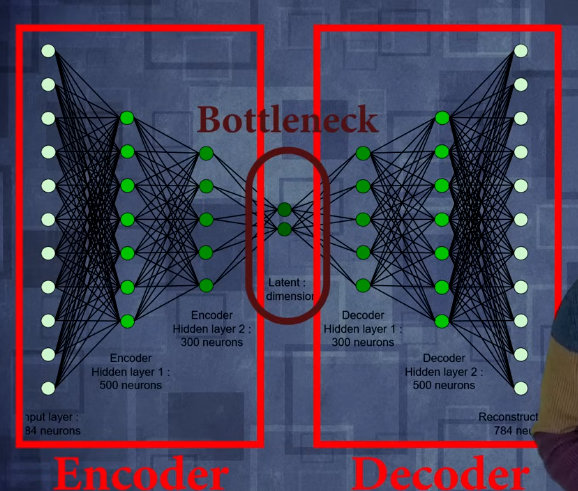
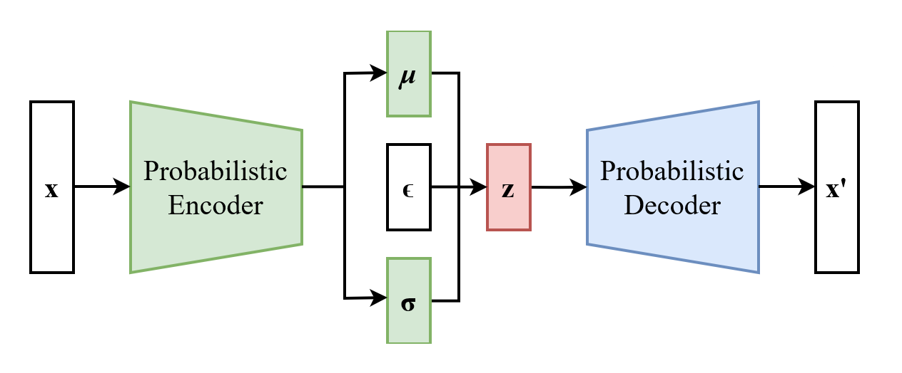
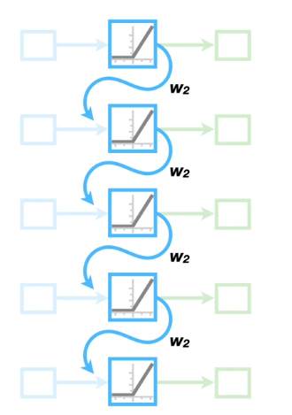

# Gen AI
- Data generated by AI
- LLM : Large Language Model
- `LLM` are part of `Foundation Models`
- `Foundation Models` are part of `Generative AI`

## Hierarchy
- AL
	- ML
		- NN
			- DL
				- GenAI

### Machine Learning
- Training algo to learn from data 
	- and make predictions
- ML include supervised, unsupervised and reinforcement learning(AI trained to make optimal decisions)

### Neural Network 
- ML model inspired from structure of brain
- Consist of interconnected nodes (neurons) that each `process and transform data` to meaningful output
- Can be trained to perform tasks like classification, regression(predict continous output like stocks), feature learning(dicover new features)
- 

### DL (Deep Learning)
- ML model that focuses on NN with more then two layers
- Used to learn complex patterns and representation in data like images, speech, human text
- It has CNN, RNN etc

## Types of ML

### Supervised Learning
- Involved training on labeled data where correct output is known 
- Goal is to learn mapping between input and output
- Algorithms Examples
	- Linear Regression
	- Logistic Regression
	- Decision Trees
### Unsupervised learning
- Involves training data on unlabeled data
- Goal is to find patterns, relations, structure
- Eg. algo
	- Clustering
	- Dimensionality reduction
	- K-Means Clustering
	- PCA
### Semi-supervised learning
- Training a model on a combination of labeled and unlabeled data.
- Goal is to leverage labeled data for good representation and use unlabeled data to improve model's perfromance
- Eg
	-	Self-training
	- Co-training
	- Label propagation
	- Graph-based methods
### Reinforcement Learning
- Involves agent to take actions in the enviroment to maximize reward
- like say I am playing a game and the actions I take in the envt. lead to reward, obstacle etc.
	- and my aim to maximize the rewards 
- Usecase
	- Robotic manuplator
	- Autonomous navigation

# ML algos

## Linear regression
- It is a supervised machine learning algo
- It tries to fit model on a single line 
- It assumes relation between input and output is linear
$$ y(x) = a*x(i) + b $$

## Logistic regression
- Used to model probability of event, that what is probability of event to occur
	- Then we can define threshold if the probability if greater then it is Yes, no otherwise
$$
f(x) = \frac{1}{1+ e^{b_{1}*x + b_{o}}}
$$

## Decision Tree
- Used for classification and regression task
- It splits down based on decision to come to consulsion
- It has following nodes
	- Root node : Input is given here
	- Decision Node : intermediate node, splits data based on specific attribute or features
	- Leaf node : The bottom most node, has the final value of prediction or decision
- Other terminologis
	- Spliting : Proccess of dividing nodes to two or more sub nodes
	- Pruning : Removing sub-nodes of decision tree
- Gini Impurity:
	- Determine quality of split
	- Probability of misclassifying dataset for current instance
- If group impurity or impurity at node goes to zero then we stop splitting 

### Random forest 
- Colleection of multiple decision trees put together to improve accuracy and roburstness of predictions
- Working:
	1. Bootstrap sample : Randomly selecting subset of data for training
	2. Decision tree creation : Creating decision tree using the bootstrap sample
	3. Feature Recognition : Randomly select a subset of features to consider for each decision node
	4. Prediction : Make prediction using Decision tree
	5. Repeat : 1-4 steps multiple times
	6. Combine Predictions to make final predictions

### Support Vector Machine (SVM)
- Supervised learning algo
- Used for classification
- SVM does this by creating hyperline(2D) / hyperplane(3D) to seperate data
- Support Vector : Points closest points to hyperplane that are used to create hyperplane
- Margin: Distance between the hyperplane and support vectors
- Kernel: Function to transform data into higher dimensions
- Types :
	-	Linear SVM : Using linear kernel
	- Non-Linear SVM : Using non-linear kernel 
	- Soft margin SVM : Allows for some missclassification to allow generalisation

### Naive bayes
- Supervised learning algo
- Probability v/s Conditional Probability
	- Probability : Chances of occurance of a events
	- Conditional Probability : Chances of occurance second event given first event has already occured
- It assumes features are independent of each other

### K-nearest Neighbour (KNN)
- Supervised Learning algo
- used for Classification and regresion task
- It uses a variable k to find nearest neighbour to the data point 
	- Then it classifies the data point as the one which has most neighbour
	- So we need to select K properly

### PCA
- Dimension reduction technique
- Transform higher dimension data to lower dimension while retaining most of info
- Unsupervised learning technique

### K-Mean
- K : Number of cluster we want to classify data into
- Unsupervied learning 
- Used for dividing data into groups and minimize within-cluster variance

# Activation functions
- Mathematical functions applied to neuron output
	- It is applied to decide wether to activate the neuron or not
- It introduces non linearity to the model
	- This helps model to learn and represent complex data
- If not used then the model will converge to linear regression 
- SomeTypes : 

### Step Functions:
- If value is greater then threshold then neuron will be activated
$$

f(x) =
\begin{cases}
0  \text{ if } x < \theta  \\
1  \text{ if } x > \theta
\end{cases}

$$

### Sigmoid
- Most used 
- Output in range 0-1
$$
f(x) = \frac{1}{1+e^{-x}}
$$

### TanH
- Range -1 to +1
- Good choise for hidden layer
$$
f(x) = \frac{2}{1+e^{-2x}} - 1
$$

### ReLU
- Also a popular choise for hidden layer
- But after prolong use it can give 0 always so leaky ReLU is used sometimes
$$
f(x) = max(0,x)
$$

### Leaky ReLU
$$
f(x) = 
\begin{cases}
x \text{ if } x >= 0 \\
a.x \text{ if } x < 0 
\end{cases}
$$
- Here a is very small value in range of 0.001

### Softmax
- Outputs btwn 0-1 like a probability
- Usually used in last layer
$$
S(x_{i}) = \frac{e^{x_{i}}}{\sum e^{x_{i}}}
$$

# Neural network in depth (Or Artificial Neural Network)
- There are layers of neurons 
- If number of layers surpass 2 we called it Deep Neural Network 
	- This is base of Deep learning
## CNN (Convolution Neural Network)
- Used in Image recognition
- It passes through first few convolution layer that apply filters to input image to detect features
- Then some processing is done

## RNN (Recurrent Neural Network)
- Used in Audio/Temporal files
- We can have feedback loop
	- Feedback loops : Running the output again to same neuron or pervious neurons

## Autoencoder
- Take high dimensional signal --> Compress it --> relift it to high dimensional signal
- PCA is an example

# Machine Learning model deployment
- Integrating machine learning model into existing prod env where it can take input and give output
### Criteria before deploying a model
	1. Portability: Ability to transfer model/software from one system to another
		- Low response time 
		- Easily re-written
	2. Scability
		- Doesn't need to be redefined to maintain its performance
### High level arch of ML system (4 main parts)
	1. Data layer : Access to all data source
	2. Feature layer : Generating feature data in transparent, scalable and usable manner
	3. Scoring layer : Transfrom features to predictions
	4. Evaluation layer : Monitering how closely model output is to real output on live traffic
### Ways to deploy model (3 general ways)
	- One-off
		- Not required frequently
		- After pushing in prod only require changes when it degreades
	- Batch training 
		- Training model on live data
	- Real time
		- Eg. Fraud transaction 
### Factors to consider 
	- How frequently predictions are done 
	- How urgent results are required
	- Predictions? batch or individually
	- Latency/Computing power required
	- Cost to deploy and required for sustainability
### Stages in ML model deployment
	1. Data collection
	2. Data storage? SQL, NoSQL, Data Warehouse 
	3. Data preparation : Preprocessing data for model training 
		- Spliting data for training, validation, and testing set
	4. Data Analysis
		- Data distribution, correlation, relationships
		- Statistical analysis
		- Handle imbalanced dataset and outliers
	5. Prototyping & Testing
		- Develop and train ML model
	6. ML in Prod

# Challanges in training ML model
1. Data-Related Challanges
	- Imbalanced dataset
		- There is a significant difference between data instances
		- This leads to biased results i.e accurate results on majority and poor result on minority
	- Data quality issue
		- Missing data
		- Noisy data
		- Inconsistant data
	- Data scarcity
		- Insufficient data
	- Concept drift
		- Data distribution change over time
2. Model related challanges
	- Overfitting : Model complexicity lead to poor generalization
	- Underfitting : Model simplicity leads to fail in capturing pattern
	- Model selection : Choosing right model and algo
	- Regularization : Preventing overfitting techniques
3. Computational Challanges
	- Scaling : Handling large sets of data
	- Computational resources : limited CPU/TPU
	- Parallelization : Efficiently distributing computations
4. Optimization challenges
	- Non-Convex optimization : Many ML problems has multiple local minima 
		- This cause difficulties in finding global optimum
	- Gradient Vanishing/ Exploding
	- Hyperparameter tuning
		- Hyperparameters are parameters that are set before training a model, 
		- such as learning rate, batch size, and regularization strength 
# Generative ML model
- GANs (Generative Adversial Network)
- VAEs (Variational AutoEncoders)
- Autoregressive Models

## 1. Generative Adversial Network
- Generator is used to create fake images from the data provided 
- Discriminator is used to Classify wether the data is fake or not
### Generator training
- Goal is to produce realistic data that can fool discriminator
- Objective is to minimize the `Generator loss function`
### Discriminator training
- Goal is to correctly distingusih between real and generated data correctly
- Objective is to minimize the `Discriminator loss function`
### Training process
- Generator : Creates synthetic data
- Discriminator : Evaluates the data and ouput probability that it's real
- Generator Training: Adjust params to improve the realism of its ouput
- Discriminator Training: adjusts its parameters to better distinguish real from fake data
- Then the Generator is used to provide data in prod
### Non generative model
- They dont generate new data samples instead they focus on making predictions or classification on existing data

# VAE (Variational AutoEncoder)

## Autoencoder
- Unsupervised Leaning model / Self supervised learning model
- We can get features that can be applied to other models and algos
- Say in a 3D space we have points at random and they have no relation between them
	- Hence we need 3 params to describe each point
- but say we have a 3D spiral it can be represented in less then 3 dimensions 
- Same is in the real life the data that we is structured to some extent
- The Autoencoders shrink data / reduce dimension of the data to some extent 
- This is done till we reach bottle neck
	- This forces the data to have info loss
- Then the data is decoded and compared with the original data
	- Then the error is found out
	- The loss is known as `Reconstruction loss`=Generated image - Original image
- The auto encoders improve themselves via comparing the input and the output
	- This may converge to no data loss and the input is same as output
- To avoid this noise is added to encoders and then feed to autoencoders 
	- Then the output is compared with real image
- This is done to improve performance

## VAEs
- Unlike Autoencoders, VAEs are designed to learn probabilistic representation of the data
	- This allows it to generate new data samples similar to training data
- In Traditional Autoencoders or Vanilla Autoencoders the data is mapped to z-vector
- But in VAEs data is mapped to probability distribution specifically a Guasian distribution
- So for basic understanding
	- Assume the bottle neck mentioned as a Vector 
	- Now Say we give input to vector and it is selected from pool of vector 
	- So this feed to vectors when decoded by decoders it will generate a sample 
- Here mu in the image is mean which is the exact data point 
	- and the sigma is the distribution or data pool from where the vector is selected 
	- Then it is sent to `z` and then the decoder 

# RNN (Recurrent Neural Networks)
- Generally used to handle sequential data
- Process one input at a time and maintains previous hidden state that has captured previous information
- Then runs feedback loop
- Types : Simple RNN, LSTM(Long Short-Term memory), GRU(Gated Recurrent Unit)

# Transformers
- Algos based on transformers : GPT-3, BERT, T5	

