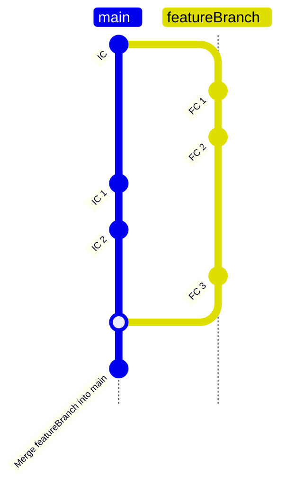
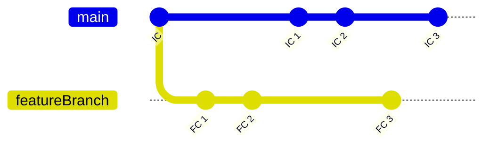
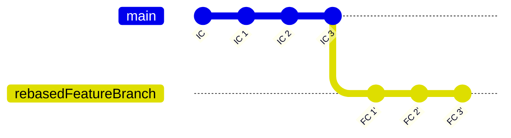
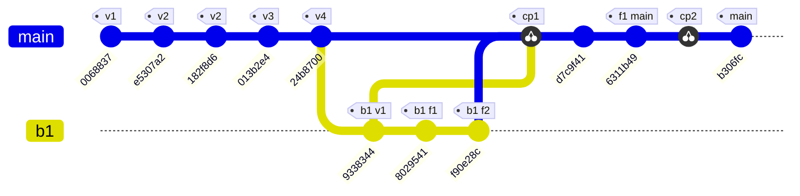

# Git / Github

## Content
- [Basic Commands](./readme.md#basic-commands)
- [Branch](./readme.md#branch)
- [Merge](./readme.md#merge)
- [Rebase](./readme.md#rebase)
- [Undoing changes (reset, revert, checkout)](./readme.md#undoing-changes-reset-revert-checkout)
  - [Reset](./readme.md#reset)
  - [Revert](./readme.md#revert)
- [Cherry Pick](./readme.md#cherry-pick)
- [Stash](./readme.md#stash)
- [Remote](./readme.md#remote)
- [Miscellaneous](./readme.md#miscellaneous)


## Basic commands

<table>
  <thead>
    <tr>
      <th>Operation</th>
      <th>Command</th>
      <th>Description</th>
    </tr>
  </thead>
  <tbody>
    <tr>
      <td>Staging file</td>
      <td><pre><code>git add .</code></pre></td>
      <td>Add all files in current and all its sub dir to staging</td>
    </tr>
    <tr>
      <td></td>
      <td><pre><code>git add &lt;file-1&gt; &lt;file-2&gt; &lt;dir-1&gt;</code></pre></td>
      <td>Add selected files and dir to staging</td>
    </tr>
    <tr>
      <td>Remove file/dir</td>
      <td><pre><code>git rm &lt;file-1&gt; &lt;file-2&gt; &lt;dir-1&gt;</code></pre></td>
      <td></td>
    </tr>
    <tr>
      <td>Rename file/dir</td>
      <td><pre><code>git mv &lt;file-old-name&gt; &lt;file-new-name&gt;</code></pre><br><pre><code>git mv &lt;dir-old-name&gt; &lt;dir-new-name&gt;</code></pre></td>
      <td></td>
    </tr>
    <tr>
      <td>Restore changes/ (Remove changes made after commit)</td>
      <td><pre><code>git checkout -- &lt;file-1&gt; &lt;file-2&gt; &lt;dir-1&gt;</code></pre></td>
      <td></td>
    </tr>
    <tr>
      <td>Unstage changes/file/dir</td>
      <td><pre><code>git reset</code></pre><br><pre><code>git reset &lt;file-1&gt; &lt;file-2&gt; &lt;dir-1&gt;</code></pre></td>
      <td></td>
    </tr>
  </tbody>
</table>

## Branch

<h2>Branch</h2>

<table>
  <thead>
    <tr>
      <th>Operation</th>
      <th>Command</th>
      <th>Description</th>
    </tr>
  </thead>
  <tbody>
    <tr>
      <td>List Branches</td>
      <td><pre><code>git branch</code></pre></td>
      <td>Lists all local branches.</td>
    </tr>
    <tr>
      <td>Create New Branch</td>
      <td><pre><code>git branch &lt;branch-name&gt;</code></pre></td>
      <td>Creates a new branch with the specified name.</td>
    </tr>
    <tr>
      <td>Change to New Branch</td>
      <td><pre><code>git checkout &lt;branch-name&gt;</code></pre><br><pre><code>git switch &lt;branch-name&gt;</code></pre></td>
      <td>Switches to the specified branch.</td>
    </tr>
    <tr>
      <td>Create and Checkout New Branch</td>
      <td><pre><code>git checkout -b &lt;new-branch-name&gt;</code></pre><br><pre><code>git switch -c &lt;branch-name&gt;</code></pre></td>
      <td>Creates a new branch and immediately switches to it.</td>
    </tr>
    <tr>
      <td>Push New Branch</td>
      <td><pre><code>git push -u origin &lt;branch-name&gt;</code></pre></td>
      <td>Pushes a new branch to the remote repository and sets up tracking.</td>
    </tr>
    <tr>
      <td>Delete Branch (Local)</td>
      <td><pre><code>git branch -d feature-xyz</code></pre><br><pre><code>git branch -D feature-xyz</code></pre></td>
      <td>Deletes a local branch. <code>-d</code> for safe delete, <code>-D</code> for force delete.</td>
    </tr>
    <tr>
      <td>Delete Branch (Remote)</td>
      <td><pre><code>git push origin --delete feature-xyz</code></pre></td>
      <td>Deletes a branch from the remote repository.</td>
    </tr>
  </tbody>
</table>


## Merge
- To merge branch_1(other) content to branch_2(main)
  - Move to branch_2(main)
  
    ```
    git checkout branch_2
    git switch branch_2
    ```

  - Merge branch_1 (other)

    ```
    git merge branch_1
    ```

  - Now branch_1 is merged to branch_2
    - If you want to abort merge

      ```bash
      git merge --abort
      ```

    - If confict arrsie we need to manually open file and make changes

    - Once changes are made stage changes
    
      ```bash
      git add <file-changed>
      ```

    - Then complete the merge

      ```bash
      git merge --continue
      ```

    - It will open a nano editor, you can edit commit message over there
    - Once saved and exited the changes will be reflected 




## Rebase
- When we rebase other branch(`b1`) with main 
  - So other brach(`b1`) will change its base from old commit of main to latest commit of main
- Say initially `b1` branched from `commit 1` of main 
  - now at the time of rebase, say latest commit at main is `commit 3`
  - So after rebase base of branch will shift from `commit 1` to `commit 3`  
- To rebase got to brach which is to be rebased
  ```bash
  git checkout b1
  ```
  ```bash
  git rebase <branch-to-rebase-with>
  git rebase main
  ```

- And to add make the changes added to main branch, merge using `fast forward`

  ```bash
  git merge b1 --ff-only
  ```


### Before



<hr>

### After



## Undoing changes (reset, revert, checkout)

### Reset

- ### Unstage commit

  ```bash
  git reset
  git reset <file1> <file2> <dir1>
  ```

- ### **Soft**
  - If changes are commited, but **not pushed yet**
  - And we want to undo to a commit keeping the changes staged
  
  ```bash
  git reset --soft <commit-id>
  git reset --soft HEAD~1
  git reset --soft HEAD~n
  ```

  - Take following example

  ```bash
  # base
  git add . && git commit -m "v1"
  git add . && git commit -m "v2"
  git add . && git commit -m "v3"

  # At this point tree will look like
  first-commit -> v1 -> v2 -> v3

  # from here if we reset to v2 
  git reset --soft <v1-commit-id>
  # now we will have commited state of v3, but we will be on commit v1 pushed
  # Now we can change v2 like shown
  git commit -m "v2"

  # Now new tree will look like
  first-commit -> v1 -> v2
  ```

  <hr> 
  
- ### **Mixed**
  - Here instead of staged commits,
    - Commits will be unstaged

  ```bash
  git reset --mixed <commit-id>
  git reset --mixed HEAD~1
  git reset --mixed HEAD~n
  ```

  <hr>

- ### ⚠️**hard**
  - If we want to delete all changes after a certain commit

  ```
  git reset --hard <commit-id>
  git reset --hard HEAD~1
  git reset --hard HEAD~n
  ```

### Revert
- When problematic changes are pushed to main branch 
- They cant be unstaged, fixed and pushed again using reset
- Reset works on local changes, and local commits
- Say I did commit v1 to v5

  ```
  v1 -> v2 -> v3 -> v4 -> v5
  ```

- Now v3 was problematic but the changes are pushed
  - So we create a new commit which has changes fixed from v3

  ```
  git revert <v3-commit-hash>
  ```

- Once fixed we can stage changes and push them say as `v5-(v3-fixed)`

  ```
  git add . && git commit -m "v5_with_fixed_V3"
  ```

- Then these can be pushed

## Cherry-pick
- Say you want some changes form a commit and not the entire history
- You can use cherry pick
- In the given diagram `v1`->`v4` are commits
- Now someone fixed bug in `v4` as `b1 v1` and I want on main line
- So I cherrypick `b1 v1` on main branch using 
  
  ```bash
  git checkout main
  git cherry-pick <b1 v1-commit-hash>
  ```
- Say now after commiting few changes on my branch I want to pick a new feature from b1

  ```
  git cherry-pick <b1 f2-commit-hash>
  ```

- There can be a confict, so it can be resolved same way as merge-confict
- If there are uncommited changes, even then confict may occur, we need to stash them and after cherry-picking we can again bring stash and resolve conflict

- If multiple commit id are provided then they are added in the order provided

```
git cherry-pick <commit1-hash> <commit2-hash>
git cherry-pick <start-commit>^..<end-commit>
```



## Stash
- Before pulling new changes it is recommended to stash current changes
- Then pull, or merge other branch, or cherry pick another commit
- Once it is done then empty stash to another branch and merge/rebase branch with current branch
<table>
  <thead>
    <tr>
      <th>Operation</th>
      <th>Command</th>
    </tr>
  </thead>
  <tbody>
    <tr>
      <td>Stashing all changes</td>
      <td>
      <pre><code>git stash</code></pre>
      <pre><code>git stash -m "message"</code></pre>
      </td>
    </tr>
    <tr>
      <td>List all stashes</td>
      <td><pre><code>git stash list</code></pre></td>
    </tr>
    <tr>
      <td>Apply most recent stash / or at an index</td>
      <td><pre><code>git stash apply</code></pre>
      <pre><code>git stash apply stash@{index}</code></pre></td>
    </tr>
    <tr>
      <td>Apply and remove most recent stash/ or at an index</td>
      <td><pre><code>git stash pop</code></pre>
      <pre><code>git stash pop stash@{index}</code></pre></td>
    </tr>
    <tr>
      <td>Create branch from recent/index stash </td>
      <td><pre><code>git stash branch &lt;branch-name&gt;</code></pre>
      <pre><code>git stash branch &lt;branch-name&gt; stash@{index}</code></pre></td>
    </tr>
    <tr>
      <td>Remove most recent stash/ or at an index</td>
      <td><pre><code>git stash drop</code></pre>
      <pre><code>git stash drop stash@{index}</code></pre></td>
    </tr>
    <tr>
      <td>Remove all stashes</td>
      <td><pre><code>git stash clear</code></pre></td>
    </tr>
  </tbody>
</table>

## Remote
- A remote in Git is a reference to a **repository hosted** on the **internet or another network**
- Local vs Remote Repository
  - Local repository: Your copy of the project on your machine.
  - Remote repository: A version stored on GitHub, GitLab, or another Git server
- Checking remotes on a local machine

  ```bash
  git remote
  git remote -v
  ```

- Adding remote

  ```bash
  git remote add <remote-name> https://github.com/user/repo.git
  git remote add <remote-name> git@github.com:user/repo.git
  ```

> - When having multiple remote of a single repo on a local machine makes sense
>   - You might want to push over SSH but fetch over HTTPS for security or network restrictions.

### Pushing new brach

  ```bash
  git push <remote-name> <branch-name>
  git push origin main
  ```

### Pulling changes from remote repo
- Fetch : Pull changes dont apply
  
  ```bash
  git fetch
  ```

- Applying changes one after another

  ```bash
  git merge <commit-id>
  ```

- Merging with last commit

  ```bash
  git pull
  ```

  - After this conflits will be seen

- If you are few commits ahead say remote is on `v3` and you are on `v4`
1. Merge
    -  Checkout on `v3`
  
      ```
      git checkout <v3-commit-hash>
      ```

    - Merge with lastest commit

        ```bash
        git merge <v4-commit-hash>
        ```

2. Rebase v4
    -  Checkout on `v4`
  
      ```
      git checkout <v4-commit-hash>
      ```

    - rebase

      ```
      git rebase <v3-commit-hash>
      ```

    - Push changes

      ```
      git push
      ```  


## Miscellaneous

<table>
  <thead>
    <tr>
      <td> Task </td>
      <td> Code </td>
    </tr>
  </thead>
  <tbody>
    <tr>
      <td>show tree</td>
      <td> <pre><code> git log --graph --oneline --decorate --all </code></pre> </td>
    </tr>
    <tr>
      <td>
        remove all commits after &lt;commit-hash&gt; <br><br> delete last commit <br><br> delete last n commit
      </td>
      <td> 
        <pre><code> git reset --hard &lt;commit-hash&gt; </code></pre> 
        <pre><code> git reset --hard head~1 </code></pre> 
        <pre><code> git reset --hard head~n </code></pre> 
      </td>
    </tr>
    <tr>
      <td>changing to perticular commit</td>
      <td> <pre><code> git checkout &lt;commit-id&gt; </code></pre> </td>
    </tr>
    <tr>
      <td>List all changes</td>
      <td> <pre><code> git reflog </code></pre> 
      <pre><code> git reflog --all </code></pre> </td>
    </tr>
  </tbody>
</table>