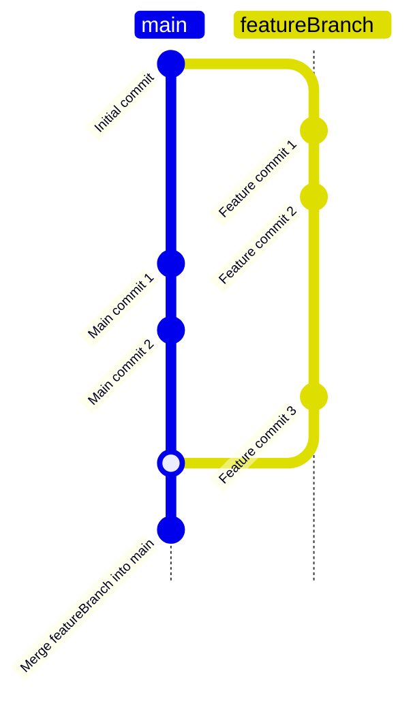

# Git / Github

## Basic commands

<table>
  <thead>
    <tr>
      <th>Operation</th>
      <th>Command</th>
      <th>Description</th>
    </tr>
  </thead>
  <tbody>
    <tr>
      <td>Staging file</td>
      <td><pre><code>git add .</code></pre></td>
      <td>Add all files in current and all its sub dir to staging</td>
    </tr>
    <tr>
      <td></td>
      <td><pre><code>git add &lt;file-1&gt; &lt;file-2&gt; &lt;dir-1&gt;</code></pre></td>
      <td>Add selected files and dir to staging</td>
    </tr>
    <tr>
      <td>Remove file/dir</td>
      <td><pre><code>git rm &lt;file-1&gt; &lt;file-2&gt; &lt;dir-1&gt;</code></pre></td>
      <td></td>
    </tr>
    <tr>
      <td>Rename file/dir</td>
      <td><pre><code>git mv &lt;file-old-name&gt; &lt;file-new-name&gt;</code></pre><br><pre><code>git mv &lt;dir-old-name&gt; &lt;dir-new-name&gt;</code></pre></td>
      <td></td>
    </tr>
    <tr>
      <td>Restore changes/ (Remove changes made after commit)</td>
      <td><pre><code>git checkout -- &lt;file-1&gt; &lt;file-2&gt; &lt;dir-1&gt;</code></pre></td>
      <td></td>
    </tr>
    <tr>
      <td>Unstage changes/file/dir</td>
      <td><pre><code>git reset</code></pre><br><pre><code>git reset &lt;file-1&gt; &lt;file-2&gt; &lt;dir-1&gt;</code></pre></td>
      <td></td>
    </tr>
  </tbody>
</table>

## Branch

<h2>Branch</h2>

<table>
  <thead>
    <tr>
      <th>Operation</th>
      <th>Command</th>
      <th>Description</th>
    </tr>
  </thead>
  <tbody>
    <tr>
      <td>List Branches</td>
      <td><pre><code>git branch</code></pre></td>
      <td>Lists all local branches.</td>
    </tr>
    <tr>
      <td>Create New Branch</td>
      <td><pre><code>git branch &lt;branch-name&gt;</code></pre></td>
      <td>Creates a new branch with the specified name.</td>
    </tr>
    <tr>
      <td>Change to New Branch</td>
      <td><pre><code>git checkout &lt;branch-name&gt;</code></pre><br><pre><code>git switch &lt;branch-name&gt;</code></pre></td>
      <td>Switches to the specified branch.</td>
    </tr>
    <tr>
      <td>Create and Checkout New Branch</td>
      <td><pre><code>git checkout -b &lt;new-branch-name&gt;</code></pre><br><pre><code>git switch -c &lt;branch-name&gt;</code></pre></td>
      <td>Creates a new branch and immediately switches to it.</td>
    </tr>
    <tr>
      <td>Push New Branch</td>
      <td><pre><code>git push -u origin &lt;branch-name&gt;</code></pre></td>
      <td>Pushes a new branch to the remote repository and sets up tracking.</td>
    </tr>
    <tr>
      <td>Delete Branch (Local)</td>
      <td><pre><code>git branch -d feature-xyz</code></pre><br><pre><code>git branch -D feature-xyz</code></pre></td>
      <td>Deletes a local branch. <code>-d</code> for safe delete, <code>-D</code> for force delete.</td>
    </tr>
    <tr>
      <td>Delete Branch (Remote)</td>
      <td><pre><code>git push origin --delete feature-xyz</code></pre></td>
      <td>Deletes a branch from the remote repository.</td>
    </tr>
  </tbody>
</table>


## Merge
- To merge branch_1(other) content to branch_2(main)
  - Move to branch_2(main)
  
    ```
    git checkout branch_2
    git switch branch_2
    ```

  - Merge branch_1 (other)

    ```
    git merge branch_1
    ```

  - Now branch_1 is merged to branch_2


```mermaid
%%{init: { 'logLevel': 'debug', 'theme': 'default' } }%%
gitGraph TB:
    commit id: "Initial commit"
    branch featureBranch
    commit id: "Feature commit 1"
    commit id: "Feature commit 2"
    checkout main
    commit id: "Main commit 1"
    commit id: "Main commit 2"
    checkout featureBranch
    commit id: "Feature commit 3"
    checkout main
    merge featureBranch
    commit id: "Merge featureBranch into main"
```

## Rebase

<table>
  <thead>
    <tr>
      <th>Before</th>
      <th>After</th>
    </tr>
  </thead>
  <tbody>
    <tr>
      <td>
        <div class="mermaid">
          %%{init: { 'logLevel': 'debug', 'theme': 'default' } }%%
          gitGraph TB:
            commit id: "IC"
            branch featureBranch
            commit id: "FC 1"
            commit id: "FC 2"
            checkout main
            commit id: "IC 1"
            commit id: "IC 2"
            checkout featureBranch
            commit id: "FC 3"
            %% Before Rebase (Visual representation)
            checkout main
            commit id: "IC 3"
        </div>
      </td>
      <td>
        <div class="mermaid">
          %%{init: { 'logLevel': 'debug', 'theme': 'default' } }%%
          gitGraph TB:
            commit id: "IC"
            checkout main
            commit id: "IC 1"
            commit id: "IC 2"
            commit id: "IC 3"
            branch rebasedFeatureBranch
            commit id: "FC 1'"
            commit id: "FC 2'"
            commit id: "FC 3'"
        </div>
      </td>
    </tr>
  </tbody>
</table>

