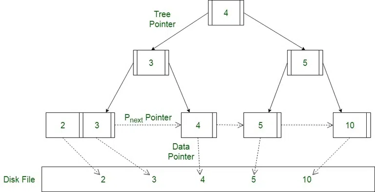

# Tech interview

## Content
- [Time Complexicities](./Tech.md#time-complexicities)
    - [B+ Tree](./Tech.md#b-tree)
    - [Red-Black Tree](./Tech.md#red-black-tree)
    - [HashMap](./Tech.md#hashmap)
    - [HashSet](./Tech.md#hashset)
    - [OrderedSet](./Tech.md#orderedset)
    - [OrderedMap](./Tech.md#orderedmap)
    - [QuickSort](./Tech.md#quicksort)
    - [MergeSort](./Tech.md#mergesort)
    - [PriorityQueue](./Tech.md#priorityqueue)
    - [Binary Search Tree (BST)](./Tech.md#binary-search-tree-bst)
    - [Binary Search](./Tech.md#binary-search)
- [AutoBilling MERN Stack Application](./Tech.md#autobilling-mern-stack-application)
- [Mechanical Simulation Showcase](./Tech.md#mechanical-simulation-showcase)

## Time Complexicities

### B+ Tree
- Variation Balanced Binary Tree
    - Here only leaf node points to actual data
    - Leaf node has extra pointer pointing to next leaf node
    - Non-leaf node do not have data pointer, or next Non-leaf node data
    - Non-leaf node just have pointer to child node
- Generally used for Indexing in Databases

### Red Black Tree
> ### Set, Maps are implemented using Red-Black Tree
- It is balanced binary search tree
- Each node is either red or black.
- The root node is always black.
- Every leaf (NULL node) is black.
- Red Node cannot have red as children, but black node can have either red or black node as children
- For each node, every path from that node to descendant NULL nodes must have the same number of black nodes.

1. ### HashMap

| Operation | Best Case | Average Case | Worst Case | Space Complexity |
|-----------|----------|--------------|------------|------------------|
| Insert    | O(1)     | O(1)          | O(n) | O(n) |
| Search    | O(1)     | O(1)          | O(n) | O(n) |
| Delete    | O(1)     | O(1)          | O(n) | O(n) |

2. ### HashSet

| Operation | Best Case | Average Case | Worst Case | Space Complexity |
|-----------|----------|--------------|------------|------------------|
| Insert    | O(1)     | O(1)          | O(n) | O(n) |
| Search    | O(1)     | O(1)          | O(n) | O(n) |
| Delete    | O(1)     | O(1)          | O(n) | O(n) |

3. ### OrderedSet

| Operation | Best Case | Average Case | Worst Case | Space Complexity |
|-----------|----------|--------------|------------|------------------|
| Insert    | O(log n) | O(log n)      | O(log n)  | O(n) |
| Search    | O(log n) | O(log n)      | O(log n)  | O(n) |
| Delete    | O(log n) | O(log n)      | O(log n)  | O(n) |

4. ### OrderedMap

| Operation | Best Case | Average Case | Worst Case | Space Complexity |
|-----------|----------|--------------|------------|------------------|
| Insert    | O(log n) | O(log n)      | O(log n)  | O(n) |
| Search    | O(log n) | O(log n)      | O(log n)  | O(n) |
| Delete    | O(log n) | O(log n)      | O(log n)  | O(n) |

5. ### QuickSort

| Case      | Time Complexity | Space Complexity |
|-----------|---------------|------------------|
| Best Case  | O(n log n)   | O(log n) |
| Average Case | O(n log n)   | O(log n) |
| Worst Case  | O(n²)       | O(log n) |

6. ### MergeSort

| Case      | Time Complexity | Space Complexity |
|-----------|---------------|------------------|
| Best Case  | O(n log n)   | O(n) |
| Average Case | O(n log n)   | O(n) |
| Worst Case  | O(n log n)   | O(n) |

7. ### PriorityQueue

| Operation | Best Case | Average Case | Worst Case | Space Complexity |
|-----------|----------|--------------|------------|------------------|
| Insert    | O(1)     | O(log n)     | O(log n)  | O(n) |
| Extract Min/Max | O(1) | O(log n) | O(log n) | O(n) |
| Delete    | O(log n) | O(log n) | O(log n) | O(n) |

8. ### Binary Search Tree (BST)

| Operation | Best Case | Average Case | Worst Case | Space Complexity |
|-----------|----------|--------------|------------|------------------|
| Insert    | O(log n) | O(log n)      | O(n) | O(n) |
| Search    | O(log n) | O(log n)      | O(n) | O(n) |
| Delete    | O(log n) | O(log n)      | O(n) | O(n) |

9. ### Binary Search

| Case      | Time Complexity | Space Complexity |
|-----------|---------------|------------------|
| Best Case  | O(1)        | O(1) |
| Average Case | O(log n)   | O(1) |
| Worst Case  | O(log n)   | O(1) |

## AutoBilling MERN Stack Application

### 1. Brief Overview  
**AutoBilling** is a MERN stack application designed to help shopkeepers manage pending payments efficiently.  

### 2. Problem Statement  
Many shopkeepers allow customers to buy on credit but struggle with tracking pending payments and following up manually.  
AutoBilling solves this by automating bill management, reminders, and payment collection.  

### 3. Key Features  
- **Shopkeeper Registration:** Shopkeepers can sign up and manage their customers.  
- **Bill Management:** They can create a bill whenever a customer opts for ‘pay later.’  
- **Automated Payment Handling:** Integrated with **Razorpay** for seamless payment collection.  
- **Reminder Emails:** Uses **Nodemailer** to send regular reminders with payment links.  
- **Database:** Stores data securely on **MongoDB Atlas**.  

### 4. Deployment Challenges & Solutions  
- Initially deployed on **Render/Vercel**, but servers went inactive due to PAAS limitations.  
- Shifted to **Google Cloud Platform (GCP)**, but free-tier expired.  
- Now migrating to a self-managed **Linux server (HostEasy)**, using **SFTP for deployment**.  

## Mechanical Simulation Showcase

### 1. Brief Overview
- I am developing a platform similar to GrabCAD, but focused on showcasing **mechanical simulations** instead of CAD models.

### 2. Problem Statement
- While GrabCAD allows users to share CAD designs, there is no dedicated platform to showcase **simulation results** (like animations, stress analysis, and other mechanical engineering simulations). My project fills this gap.

### 3. Key Features
- **Simulation Showcase:** Users can upload and share mechanical simulations.  
- **Data Management:** Stores simulation files (videos, images, zip files, etc.).  
- **Scalable Backend:** Built using **Django** to handle requests efficiently.  
- **Database:** Uses **MySQL** for structured data storage.  
- **Modern UI:** Frontend developed with **React.js** for a smooth user experience.  

### 4. Deployment & Storage Challenges
- **Static File Storage:** Still exploring the best option for hosting large media files (**images, videos, zip files**).  
- **Server Management:** Django handles backend logic, and MySQL ensures reliable data storage.  
