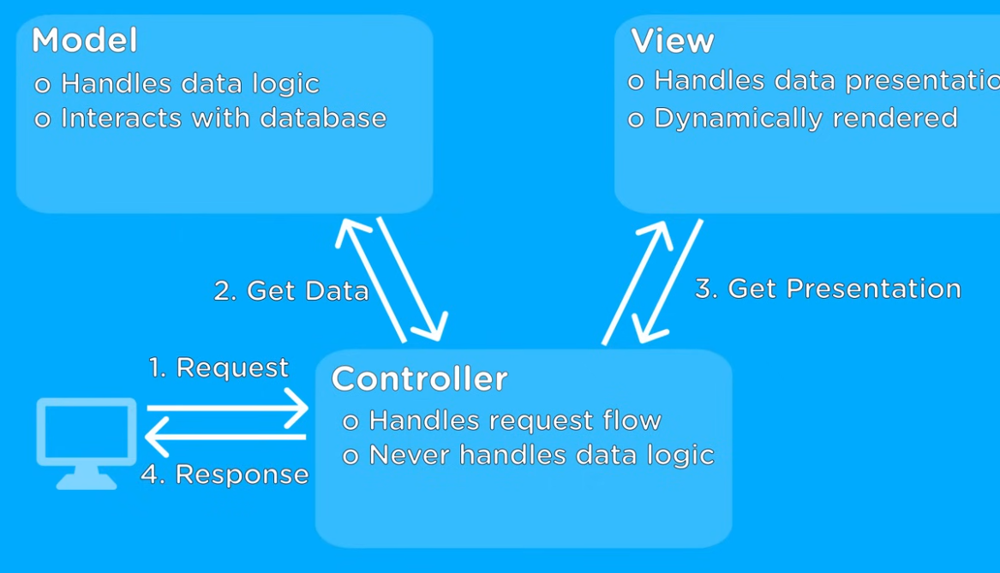

# MVC (Model View Controller) Architecture
- Working of MVC
  1. Client sends requrest
  2. `Controller` process request and request data from `model`
  3. Once the data is fetched 
      - `controller` sends data and gets the presentation from `views`
  4. Then the response is sent back to client
  - Model never intracts with view 

# JSTL (JSP Standard Template Library)
