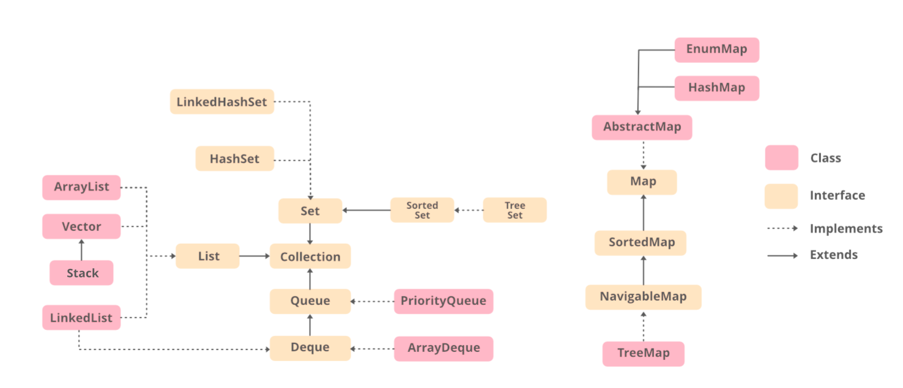

# Java Enterprise Edition

- Main classes cannot be private, nested classes can be private
- Main clases can be public and default

## Collections

## Java Related
- [Basics](./sub/basic.md)
  - [MultiThreading](./sub/multiThreading.md)
- [Maven](./sub/maven.md)
- [Junit5](./sub/junit5.md)
- [tomcat](./sub/tomcat.md)
- [jdbc](./sub/jdbc.md)
- [servlet](./sub/servlet.md)
  - [Configuring_JSP_premissions](./sub/JSP_Permissions.md)
  - [JSP](./sub/JSP.md)
- [MVC](./sub/MVC.md)
- [JSTL](./sub/JSP.md#jstl-jsp-standard-template-library)
- [Filters](./sub/servlet.md#filters)
- [Hibernate](./sub/hibernate.md)
  - [Hibernate lifecycle (Persistance Lifecycle)](./sub/hibernate_lifecycle.md)
- [jersey](./sub/rest.md)
- [Spring](./sub/spring.md)
  - [Spring-Annotations](./sub/spring_annotations.md)
  - [Spring-JDBC](./sub/spring_jdbc.md)
  - [Spring-Boot-MVC](./sub/spring_boot_mvc.md)
  - [Spring-Boot-MVC-Annotations](./sub/spring_boot_mvc_annotations.md)
  - [Spring-MVC](./sub/spring_mvc.md)
  - [Spring-Config-File](./sub/spring_config.md)
  - [Spring-JPA](./sub/spring_jpa.md)
  - [Sping-boot-JPA](./sub/spring_boot_jpa.md)
  - [Spring-boot-REST](./sub/spring_boot_rest.md)
- [AOP(Aspect Oriented Programming) in Spring](./sub/spring_AOP.md)
- [Spring Boot Security](./sub/spring_boot_secutiy.md)
  - [Spring Boot Security JWT + Custom User](./sub/spring_boot_security_jwt.md)