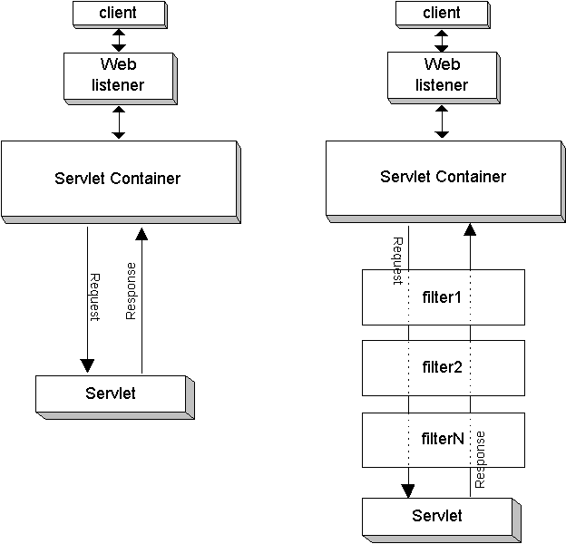

# Servlet
## What is servlet? 
  - Servlet is a Java class that is used to handle HTTP requests and responses in a web application
  - The `Servlet` is an interface provided by the `javax.servlet` package
  - The web container creates only one instance of a servlet and uses multiple threads (one per request) to process client requests

## Working of servlet 
- When a client makes a call to server, server passes request to servlet container
- Each servlet container finds mapping to servlet and passes the request
- Then servlet lifecycle management starts
  - Container checks if servlet is already loaded (initialized)
    - Load servlet if not loaded
  - Container create two objects 
    - HttpServletRequest, HttpServletResponse
  - Container invokes `Service` method by passing `HttpServletRequest`, `HttpServletResponse` 
  - Response is generated and sent back to client
  - Servlet cleanup (Optional)
- For each client request, container spawns new thread to handle request

## Deployment descriptor (web.xml)
- Used for mapping servlet to url pattern
```xml
<!-- servlet names are matched-->
<web-app>
  <servlet>
    <!-- the name in servlet must match with servlet-mapping -->
    <servlet-name>servlet_name</servlet-name>
    <servlet-class>class_name</servlet-class>
  </servlet>
  <servlet-mapping>
    <servlet-name>servlet_name</servlet-name>
    <url-pattern>/url</url-pattern>
  </servlet-mapping>
</web-app>  
```

## Writing servlet code
- We will be implementing `HttpServlet` class
- Url of the current class can be done in two ways one is defined above using web.xml
- Other way can be using `annotations` like shown below

```java
@WebServlet("/add")
public class Add extends HttpServlet {
    public void service(HttpServletRequest req, HttpServletResponse res) throws ServletException, IOException {
...
  }
}
```

- ### Accessing parametes
  - for the params `url/add?num1=1&num2=3` we use

```java
// conversion is request to int if arthmathic operations are reuqired
String param1 = req.getParameter("num1");
String param2 = req.getParameter("num2");
```

- ### Exceptions to catch
  - `ServletException`

- ### Handling request from client
  - `service()` method handles all the request
  - It is entry point for requests
  - It automatically determines the request type
  - it takes servlet request and response as input

    ```java
      protected void service(HttpServletRequest req, HttpServletResponse res){}
    ```
  - If we want to manually handle each request we can override `goGet()`, `doPost()`, `doPut()`, `doDelete()`
  - Basic code

```java
import java.io.IOException;
import javax.servlet.ServletException;
import javax.servlet.annotation.WebServlet;
import javax.servlet.http.HttpServlet;
import javax.servlet.http.HttpServletRequest;
import javax.servlet.http.HttpServletResponse;

@WebServlet("/add")
public class Add extends HttpServlet {
    public void service(HttpServletRequest req, HttpServletResponse res) throws ServletException, IOException {

        int num1 = Integer.parseInt(req.getParameter("num1"));
        int num2 = Integer.parseInt(req.getParameter("num2"));
        int result = num1 + num2;

        System.out.println(result);
        out.print("Result is: " + result);
    }
}
```
  - Example of REST operatiosn
```java
    protected void doGet(HttpServletRequest req, HttpServletResponse res) throws IOException {}
    protected void doPost(HttpServletRequest req, HttpServletResponse res) throws IOException {}
    protected void doPut(HttpServletRequest req, HttpServletResponse res) throws IOException {}
    protected void doDelete(HttpServletRequest req, HttpServletResponse res) throws IOException {}
```

- ### Request forwarding using `RequestDispatcher`
  - It forwards the request that is recieved from client to another servlet
  - The client url wont change 
    - Say from `/add` url I used requestDispatcher to forward it to `/sq` then the client url wont change

  ```java 
    import java.io.IOException;
    import javax.servlet.RequestDispatcher; // Import for RequestDispatcher
    import javax.servlet.ServletException;
    import javax.servlet.annotation.WebServlet;
    import javax.servlet.http.HttpServlet;
    import javax.servlet.http.HttpServletRequest;
    import javax.servlet.http.HttpServletResponse;


    @WebServlet("/add")
    public class Add extends HttpServlet {
        public void service(HttpServletRequest req, HttpServletResponse res) throws ServletException, IOException {

            RequestDispatcher rd = req.getRequestDispatcher("sq");
            rd.forward(req, res);

        }
    }

  ```
  - #### Methods under request dispatcher
    - forward(HttpServletRequest req, HttpServletResponse res)
      - transfers the control to another servlet or resource
    - include(HttpServletRequest req, HttpServletResponse res)
      - include the content of another resource 
      - Control is returned to original servlet
      
      ```java
        
        RequestDispatcher rd = req.getRequestDispatcher("header");
        rd.include(req, res);

      ```
- ### Request forwarding using `Redirect`
  - Here insteading of forwarding the request 
  - Response is returned from first request to create a new request-response life cycle with new url
  - When to use redirect
    - When forwarding client to external website
    - When you dont want to pass data to new url
    - When client needs to know new url
  - Data during redirect
    - Cookies remain 
    - Attributes are lost
    - new url params remain (coz they are in the new url)
  ```java
    res.sendRedirect("sq?result=" + result);
  ```
- ### Setting HttpSession
  - Setting session attribute
  - used to store stateful info accross multiple request

  ```java
  HttpSession session = req.getSession();
  session.setAttribute("attribute_name", attribute_value);

  // Getting session attribute
  session.getAttribute("attribute_name");

  // Removing it after use
  session.removeAttribute("attribute_name");
  ```

  - Another common uses include 
    - Getting SessionID and setting sessionID

- ### Setting cookie
  - Cookie comes from server and is sent back to server with every request
  
  ```java
  // sending cookie
  Cookie cookie = new Cookie(name,value);
  // name and value must be string
  ```
  
  - Reading cookie when recieved
  
  ```java
  String k;
  Cookie cookies[] = req.getCookies();
  for(Cookie c : cookies){
    if(c.getName().equals("some name")){
      k = c.getValue();
    }
  }
  ```
- ### Managing configurations 
  - `ServletConfig` and `ServletContext` are used to manage config in servlet
  - They are like initial preset static configs required
  - ServletConfig : is for perticular servlet
  - ServletContext : for all servlet 
  - #### ServletConfig
  
  ```xml
    <servlet>
        <servlet-name>MyServlet</servlet-name>
        <servlet-class>com.example.MyServlet</servlet-class>
        <init-param>
            <param-name>username</param-name>
            <param-value>admin</param-value>
        </init-param>
    </servlet>
  ```
  ```java
    ServletConfig ctx = getServletConfig();
    String name = ctx.getInitParameter("username");
  ```

  - #### ServletContext
  
  ```xml
    <context-param>
        <param-name>appVersion</param-name>
        <param-value>1.0.0</param-value>
    </context-param>
  ```
  ```java
    ServletContext ctx = getServletContext();
    String name = ctx.getInitParameter("appVersion");
  ```


## Filters 
- Just like middleware
- If multipe filters are applied then we have to chain them 
- One filter does not have info about other filter
- filter is interface we need to implement them
- there are 3 main methods to implement
  - `doFilter(ServletRequest, ServletResponse, FilterChain)`, `init`, `destroy`
- Once the filtering is complete we need to pass it to next part of chain by using 
  - `chain.doFilter(ServletRequest, ServletResponse)`
  - If it the last filter it will call servlet



