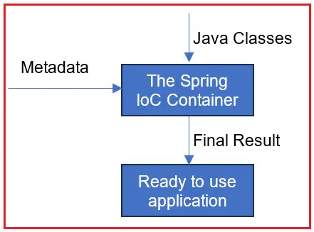
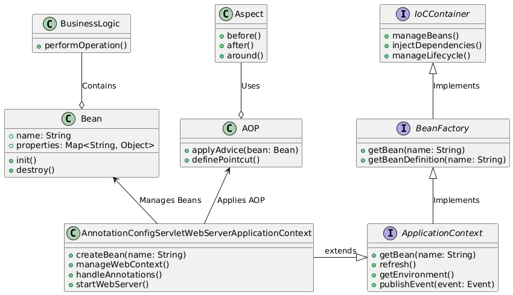

# Spring
- Use the `spring initiailizr` (ctrl+shift+p)
- Running project: Go to dir, build it and run it
> - Dont forget to stop tomcat if running 

```sh
/opt/tomcat9/bin/shutdown.sh
```

```sh
mvn clean package
```

```sh
mvn spring-boot:run
```

- Changing port 
  - Go to `/src/main/resources/application.properties` and add
  ```
  server.port:8081
  ```

> ## Remember to create all files in java/com/.../spring/

## Entry point in spring Application
- ### Terminologies
  - `Spring IoC(Inversion Of Control) container`
    - Injects dependencies into object 
    - Manages object creation and lifecycle
    - Both `ApplicationContent` and `BeanFactory` are part of `Spring IoC container`
    - 
  - `Beans`
    - POJO(Plain Old Java Object)
    - Must have getters and setters method
    - `Spring IoC Container` is reponsible for configuring them at runtime
  - `BeanFactory`
    - Light weight implementation of `Spring IoC container`
    - Parent interface of `ApplicationContext`
  - `ApplicationContext`
    - Subinterface of `BeanFactory`
    - Used at enterprice level 
    - It holds all the beans
  - Dependency Injection
    - Process where objects define their own dependency
    - So if one class is depended on other, so on creation it wont give problem



```java
package com.mechsimvault.spring;
import org.springframework.boot.SpringApplication;
import org.springframework.boot.autoconfigure.SpringBootApplication;
import org.springframework.context.ApplicationContext;
import com.mechsimvault.spring.model.Student;
@SpringBootApplication
public class Application {
	public static void main(String[] args) {
		ApplicationContext context = SpringApplication.run(Application.class,args);
		Student st = context.getBean(Student.class);
		st.compile();
	}
}
```
- `@SpringBootApplication`
  - Marks the main class of spring boot application
  - Combination of 3 functionalitites
    1. `@SpringBootConfiguration`
        - Defines class is source of bean defination
    2. `@EnableAutoConfiguration`
        - Configure the project for `spring-boot-starter-web`
    3. `@ComponentScan`
        - Scans for the components
  - If beans are location outside
- `@ComponentScan(basePackages = {"com.mechsimvault.spring", "com.mechsimvault"})`
  - If the packages are outside the spring or spring's subdirs we can mention the same using component scan to let it know where exactly to scan 
- `@Component`
  - Lets `IoC container` know that this is `bean object`
  - And hence will be managed by `IoC Container`    
  - 
  ```java

    package com.mechsimvault.spring.model;

    import org.springframework.stereotype.Component;

    @Component
    public class Student{
      
      public void compile(){
        System.out.println("Student");
      }
    }
  ```

- `ApplicationContext`
  - Holds all beans and manages their lifecycle
- Dependency injection
  - `@Autowired` annotation is used for dependence injection
  ```java
  // Field injection
  public class Student{
    @Autowired
    private int marks;
  }
  // Setter injection
  public class School { 
    private final Student student;
    @Autowired
    public void setStudent(Student student) {  
        this.student = student;
    }
  }
  // Constructor injection
  public class School{
    @Autowired
    public School(Student student) {  
        this.student = student;
    }
  }
  ```
- To avoid dependency or make dependency opyional
  ```java
  public class Student{
    @Autowired(required = false)
    private String name;// optional to provide
  } 
  ```
- `ClassPathXmlAppliationContext`
  - Used to load xml files, can load multiple files at once 
  
  ```java
  ApplicationContext context = new ClassPathXmlApplicationContext("beanConfig1.xml","beanConfig2.xml",...);
  ```

  ```xml
  <?xml version="1.0" encoding="UTF-8"?>
  <beans xmlns="http://www.springframework.org/schema/beans"
        xmlns:xsi="http://www.w3.org/2001/XMLSchema-instance"
        xsi:schemaLocation="http://www.springframework.org/schema/beans
        https://www.springframework.org/schema/beans/spring-beans.xsd">
  
      <bean id="student" class="com.mechsimvault.spring.model.Student"></bean>
  
  </beans>
  ```
- Singleton and Prototype scope
  - The bean config file use `scope="singleton"` by default 
    - This means object is created regardless the object is called or not
    - And only one copy is created and used then after 
    - Hence can craete problem like for the code 

    ```java
		Student st = context.getBean(Student.class);
		st.setMarks(10);
		System.out.println("initial st0 marks : "+ st.getMarks());

		Student st1 = context.getBean(Student.class);
		st1.setMarks(15);
		System.out.println("initial st1 marks : "+ st1.getMarks());
		System.out.println("Final st0 marks : "+ st.getMarks());
    ```

    - Output is

    ```java
    // with scope singleton
    /*     
      <bean 
        id="student" 
        class="com.mechsimvault.spring.model.Student" 
        scope="singleton">
      </bean>
    */

    Student constructor
    initial st0 marks : 10
    initial st1 marks : 15
    Final st0 marks : 15

    // with scope protoype
    /*     
      <bean 
        id="student" 
        class="com.mechsimvault.spring.model.Student" 
        scope="prototype">
      </bean>
    */

    Student constructor
    initial st0 marks : 10
    Student constructor
    initial st1 marks : 15
    Final st0 marks : 10
    ```

- Property tag in bean script
  - Used for multiple purpose
  - used with `value` to fill primitives
  - Used with `ref` to fill object 
  - Can be drectly used with using `p:`
  
    ```xml
    <bean id="course" class="com.mechsimvault.model.Course">
        <property name="courseName" value="Math 101"/>
    </bean>

    <bean id="student" class="com.mechsimvault.model.Student">
        <property name="course" ref="course"/>
    </bean>

    <bean 
      id="student" 
      class="com.mechsimvault.model.Student" 
      p:name="John Doe" 
      p:cource-ref="course"
    />
    ```

  - Autowire : Fill the value of bean is available
  ```xml
    <bean id="student" class="com.mechsimvault.model.Student" autowired="default">
    </bean>

    <bean id="course" class="com.mechsimvault.model.Course"></bean>
  ```
  
  - Here it will fill value of course
  - Say there are two cousre then it will give error so we have to set `autowired` type
  ```xml
    <bean 
      id="student" 
      class="com.mechsimvault.model.Student" 
      autowired="byName" 
      >
      <!--autowired can also be byValue : So will select data type instead of name -->
      <!--when used by name so will match with the name of variable or object in class -->
    </bean>

    <bean id="math_course" class="com.mechsimvault.model.MathCourse"></bean>
    <bean id="sci_course" class="com.mechsimvault.model.SciCourse"></bean>

  ``` 


## Creating model and returing
- Say we have creating a POJO(Plain Old Java Object)
- Student is POJO with 
  - name : stiring
  - id : int
- It has getters and setters
> ### - It must have empty constructor
- Creting controller for it 

  ```java
  package com.mechsimvault.spring;

  import com.mechsimvault.spring.model.Student;
  import org.springframework.http.ResponseEntity;
  import org.springframework.web.bind.annotation.*;

  @RestController
  @RequestMapping("/api/students")
  public class StudentController {

      // @GetMapping("/dummy")
      @RequestMapping(value = "/dummy", method = RequestMethod.GET)
      public Student getDummyStudent() {
          // Creating a dummy Student object
          Student dummyStudent = new Student(1, "John Doe");
          return dummyStudent; // Return the object as JSON
      }
  }

  ```

- Annotations
  - `@RestController`
    - Combines functionalities of `@Controller` and `@ResponseBody`
    - Used for handing HTTP requests
    - Response object will automatically converted to HTTP response
  - `@RequestMapping('/url')`
    - URL mapping
  - `@GetMapping`, `@PutMapping`, `@PostMapping`, `@DeleteMapping`
    - Mapping perticular request to a method
    - Same can be done by 
      - `@RequestMapping(value = "/dummy", method = RequestMethod.GET)`


# - ?

- xml configuration file "spring.xml" with bean tag and attribute class, id, scope(singleton and prototype)
- ClassPathXmlApplicaionContext
- Spring container
- Why beans are called singleton beans coz they are created once
- Setter injection
  - poperty tag in bean tag
  - reference attribute
  - autowite
    -  multiple properties : primary 
- Constructor injection