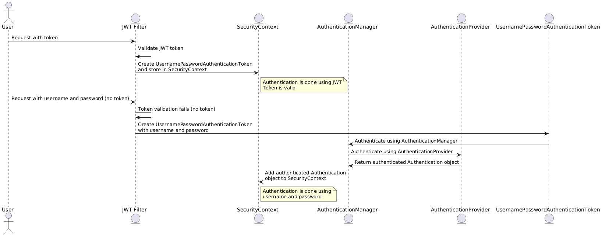

# Spring Boot Security JWT and Custom user

> ### Reference : springbootjwt

## AuthenticationProvider and AuthenticationManager creation and registeration flow
- First Bean is created and registered in IoC container
   
    ```java
    @Bean 
    public AuthenticationProvider authenticationProvider(){
      DaoAuthenticationProvider authProvider = new DaoAuthenticationProvider();
      authProvider.setUserDetailsService(userDetailsService());
      authProvider.setPasswordEncoder(passwordEncoder());
      return authProvider;
    }
    ```

- And then we instruct `http.authenticationProvider(authenticationProvider)` explicitly registers a custom `AuthenticationProvider`, overriding any default ones.

    ```java
    import org.springframework.security.authentication.AuthenticationProvider;
    @Configuration
    @RequiredArgsConstructor
    public class SecurityConfigs{

      // This is not custom authenticationProvider it is spring provided
      @Autowired
      private AuthenticationProvider authenticationProvider;

      @Bean
      public SecurityFilterChain securityFilterChain(HttpSecurity http) throws Exception {
        ...
        http.authenticationProvider(authenticationProvider);
        ...
      }
    }
    ```
  
- Now when AuthenticationManager is created list of AuthenticationProvider is supplied
    
    ```java
    @Bean 
    public AuthenticationManager authenticationManager(AuthenticationConfiguration config)throws Exception{
      return config.getAuthenticationManager();
    }
    ```


## Working of Authentication when a request comes with and without token

### With Token  
- When a request comes with a token, the token is validated, and user details are extracted.
- A `UsernamePasswordAuthenticationToken`, which is an authentication object, is created:
  - The input parameters are:
    - **UserDetails**: The authenticated user's details.
    - **Credentials**: Set to `NULL` as authentication is done via the JWT token.
    - **Authorities**: The authorities of the user.
- Additional details are added using the `setDetails` method of the authentication object:
  - Details like the IP address are extracted from the request object.
- The token is then directly added to the `SecurityContext` because the authentication has already been done with the JWT token.

### Without Token  
- When a login request is made, no token is provided.
- The request goes to the `JWTFilter`. Since no token is found, it exits the filter.
  - **Note**: The login page must be public, so it can be accessed without any authentication.
- In the login service, an authentication object is created using:
  - **UserDetails**: The username.
  - **Credentials**: The password.
- The authentication object is then authenticated using the `AuthenticationManager`.
  - The `AuthenticationManager` will delegate to the appropriate `AuthenticationProvider` to authenticate the request.
- Once the user is authenticated, it is optional to add the authentication object to the `SecurityContext`. In the next step, a JWT token will be generated and sent back to the user, which will be used for authentication in future requests.



## Steps to creating Custom user and implementing JWT
1. Create a DAO layer by extending interface JpaRepository
2. Create Entities 
  - User Entity: Create a User entity class with fields like id, username, password, and roles.
  - Role Enum Entity: Implement a Role enum to define different user roles (e.g., ADMIN, USER).
  - Implement getAuthorities Method: Ensure that the User entity implements the getAuthorities() method to map roles to authorities.
3. Create a JwtUtils to create and validate token + Extract UserDetails
4. Create a filter that will intercept the request and check for token 
    - It will extend OncePerRequestFilter
    - Override doFilterInternal method
    - If valid token then add `usernamePasswordAuthenticationToken` to `SecurityContextHolder`
5. Create UserDetailsService and Authentication Provider
    - Implement a custom UserDetailsService to load user data from the database.
    - Create a custom AuthenticationProvider that uses your UserDetailsService and add a PasswordEncoder (e.g., BCryptPasswordEncoder) to encode user passwords.
    - Configure a new AuthenticationManager to prevent the use of the default manager.
6. Create A `SecurityFilterChain` bean to override existing security filter chain
    - As using JWT remove csrf and make session serverless
    - Add jwtFilter 
    - Add new `authenticationProvider` created
    - Define specific access rules for different endpoints using `.authorizeRequests()` based on user roles.
7. Create authentication service
    - Implement a service class (AuthenticationService) that handles user registration and authentication.
    - Include methods like registerUser() and authenticateUser() to handle registration and login functionality.
    - Ensure that passwords are encoded when registering a new user and validated during authentication.
8. Create LogIn and LogOut Endpoints
    - Create custom DTO (Data Transfer Objects) to handle request and response
    - User the register method and authentication method to handle login and signin request
    - Make these endpoint as public endpoints
9. Create a demo class to test token and add authority check 

