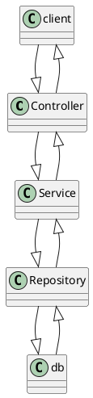

# Spring Boot Security

## Spring Security Architecture
- Request flow 
	- Client makes request
	- It goes through `security filter chain`
		- One filter among them is JWTAuthentication filter
		- The list of filters and order is mentioned below in [Filter chain order](./spring_boot_secutiy.md#security-filter-chain-order)

## Security Filter Chain order
- `ChannelProcessingFilter` : ensure protocal is HTTP and/or HTTPs 
- `SecurityContextPersistenceFilter` : Ensure user's auth details are persisted during the session
- `UsernamePasswordAuthenticationFilter` : Checks if credentials are valid and create an `Authentication Object`
- `ConcurrentSessionFilter` : Limits number of sessions user can have. 
	- Used only when session `Stateful`
- `LogoutFilter` : Intercept logout request and terminate session and clear cache
- `RememberMeAuthenticationFilter` : Remember session even after logout 
	- Used only when session `Stateful`
- `AnonymousAuthenticationFilter` : Created even if no credentials are provided 
	- It is created so spring security can provide authorization rights which are limited to open pages
- `SessionManagementFilter` : Handle session related tasks
- `ExceptionTranslationFilter` : Translates exception to unauthenticated response
- `FilterSecurityInterceptor` : Last filter in chain, and is responsible for authorization(access control) when requesting for resources

- ### Order with JWT filter
  - ChannelProcessingFilter
  - SecurityContextPersistenceFilter
  - ✅ JWT Filter 
  - UsernamePasswordAuthenticationFilter
  - ConcurrentSessionFilter
  - LogoutFilter
  - RememberMeAuthenticationFilter
  - AnonymousAuthenticationFilter
  - SessionManagementFilter
  - ExceptionTranslationFilter
  - FilterSecurityInterceptor

## Components of Spring Security Arch
- ### Security Context Holder
  - Holds details of the currently authenticated user, including their authentication and authorization information.
  - `SecurityContextHolder` provides access to `SecurityContext`, which contains the `Authentication object`.
  - The `Authentication object` holds the `Principal` (authenticated user details) and their `GrantedAuthority` (permissions/roles).

- ### Authentication Manager (Interface)
	- Takes request and passes it on to `Authentication Providers`
	- These `authentication Provider` are the actual place where these requests are authenticated
	- There can be multiple `authentication provider` and `Provider Manager` loops through them 
    - the first one that supports the authentication type handles it.
    - If none of the providers authenticate the request, an exception is thrown.- 

- ### Provider Manager
	- Default Implemention of `Authentication Manager`
  - It maintains a list of `AuthenticationProvider` instances and delegates authentication to them.
  - If authentication fails in all configured providers, and a `parentAuthenticationManager` is set, it will attempt authentication using the parent

- ### Authentication Provider
	- AuthenticationProvider is responsible for performing the actual authentication logic.
	- Different implementations exist to support various authentication mechanisms:
    - DaoAuthenticationProvider (UserDetailsService).
    - JwtAuthenticationProvider (custom) 
    - LdapAuthenticationProvider 
    - OAuth2AuthenticationProvider

- ### UserDetailsService
	- Interface used to load specific user details
	- By default it is implemented but we can change it 
  - Spring Security does not provide a default implementation; developers must implement `loadUserByUsername()`.
  - The `UserDetailsService` implementation is used by `DaoAuthenticationProvider` to fetch user information from a database or other sources.


- ### UserDetails
	- Spring Security uses this object to store user details and access rights
	- Can be modified by implementing UserDetails interface

- ### GrantedAuthority
  - GrantedAuthority represents a user's permissions or roles in the security context.
  - It is used by Spring Security to determine access control.
  - Authorities can be defined as roles (e.g., "ROLE_ADMIN") or specific permissions (e.g., "READ_PRIVILEGES").


## CSRF (Cross Site Resource Forgery)
- When attacker tricks user to perform action without even knowing
- How it works
  - If we visit a trusted website it saves sessionID
  - Now when we visit a malicious website or open malicious email it uses session id stored
  - This sessionId can be used to access the trusted website
- Even though sessionID is stored in cookies and when we have 
  - HttpOnly : JS is prevented from accessing cookies
  - SameSite(Strict) : Cookies are only sent from same origin request
  - Secure : Ensuring cookies are only sent over HTTPs connection
- But when the request is sent cookies are auto attached by browser hence it will be accepted
- Mitigation Technique
  1. CSRF Token
      - This token is sent to the client (browser) in a secure way:
        - Option 1: Embedded in the HTML form as a hidden field.
        - Option 2: Sent as part of a response header (e.g., for APIs or SPAs).
      - Hence as they are not stored as cookie they cannot be used it send back directly
  2. SameSite Cookies:
    - Set cookies with the SameSite attribute to control cross-origin requests.
      - Strict: Only first-party requests can use cookies.
      - Lax: Allows cookies for top-level navigation but not for third-party embedded requests.

## Spring Security
- Each request goes through following chain
  1. Request enter filter chain
  2. Then authentication : Identify is user is valid
  3. Then authorization : check if user has access to perticular resource
- Provides security against some common threats and more
  - CSRF (Cross-Site Request Forgery)
  - XSS (Cross-Site Scripting)
  - Session Fixation
  - Clickjacking
- Easily integrate with third party 

## Spring Security Filter Chain
- Series of security filters applied to incomming HTTP request
- It helps in authentication and authorization of request based on security config
- When spring security is enabled, `FilterChainProxy` in the web is enabled.
  - This deligates the request handling of a perticular url to required FliterChain
- ### Terminologies
  - `Filter` : Spring has some predefined filters like AuthenticationFilter, AuthorizationFilter
  - `FilterChainProxy` : Main entrypoint in for spring security
    - this object manages multiple multiple `SecurityFilterChain`
  - `SecurityFilterChain` : Each chain has 
    - Matching condition : url pattern 
    - List of filters for each matching pattern
  - Execution Order : Order of execution of security filter 


## Dependencies
- Spring Web
- Spring security
- Additional 
  - tomcat-jasper
  - mysql-connector-j

## Creating project
- Add dependencies (username : user)
- update application.properties

  ```java
  spring.security.user.name=admin
  spring.security.user.password=admin123
  ```

## Spring filter security configuration
- Spring used `SecurityFilterChain` bean for security config
- We need to override it for custom security
- ### HttpSecurity
  - Defines which urls to be secured to what level
  - how to authenticate and authorize users
  - enable role based control
  - other security customization like CSRF, CORS etc...
  - Basic structure

    ```java
    @Bean
    public SecurityFilterChain securityFilterChain(HttpSecurity http) throws Exception {
        http
            .authorizeHttpRequests(auth -> auth
                // No authentication required for /public/**
                .requestMatchers("/public/**").permitAll() 
                // Only users with ADMIN role
                .requestMatchers("/admin/**").hasRole("ADMIN") 
                 // Only users with USER role
                .requestMatchers("/user/**").hasRole("USER")
                // All other requests require authentication
                .anyRequest().authenticated() 
            )
            .formLogin(); // Enables form-based login
        return http.build();
    }
    ```

- ### Managing User 
  - Spring Security provides a predefined User class that implements the UserDetails interface, which represents the core user information used by Spring Security
  - Spring security provides a predefined `User` class 
    - The UserBuilder allows you to set properties such as username, password, and roles.
    - Once all properties are set, the build() method is used to create an `immutable User object`.

  - Steps for Creating a User:
    - Use the factory method User.builder() to obtain a UserBuilder object.
    - Add user properties to the UserBuilder object, such as:
      - `username(String username)`
      - `password(String password)`
      - `roles(String... roles)`
    - Call the build() method to create a User object.
    - Store the created user(s) in an instance of InMemoryUserDetailsManager for testing purposes:

      ```java
      return new InMemoryUserDetailsManager(admin, user1, user2, ..., usern);
      ```

    - We must provide PasswordEncoder bean to Spring Security.
      - This bean ensures that passwords are encoded before storage and automatically decoded during authentication.
  
        ```java
        @Bean
        public PasswordEncoder passwordEncoder() {
            return new BCryptPasswordEncoder();
        }
        ```

    ```java
    @Bean
    public UserDetailsService userDetailsService(PasswordEncoder encoder) {
        UserDetails admin = User.builder()
                .username("admin")
                .password(encoder.encode("admin123")) // Encode password
                .roles("ADMIN")
                .build();

        UserDetails user = User.builder()
                .username("user")
                .password(encoder.encode("user123")) // Encode password
                .roles("USER")
                .build();

        return new InMemoryUserDetailsManager(admin, user); // Store users in memory
    }

    @Bean
    public PasswordEncoder passwordEncoder() {
        return new BCryptPasswordEncoder();
    }
    ```

  > After Spring 5.7 we dont explicitly need to annotate class with `@EnableWebSecurity`  
  > But it is a good practice to annotate it 

## Adding custom access deined page
- HttpSecurity provides method to customize exception handling
  
  ```java
  .exceptionHandling(exceptions -> exceptions
        .accessDeniedPage("/access-denied") // Redirect on 403 errors
    )
  ```

- Full method

```java
@Bean
public SecurityFilterChain securityFilterChain(HttpSecurity http) throws Exception {
    http
        .authorizeHttpRequests(auth -> auth
            .requestMatchers("/public/**").permitAll()
            .requestMatchers("/secure/admin/**").hasRole("ADMIN") // Only ADMIN role
            .anyRequest().authenticated()
        )
        .exceptionHandling(exceptions -> exceptions
            .accessDeniedPage("/access-denied") // Redirect on 403 errors
        )
        .formLogin();
    return http.build();
}
```

## UserDetailsService
- Core component of spring security
- Used for retreving user data during authentication and authorization
- We can use `loadUserByUsername()` to load user
- It returns `UserDetails` object

## JWT utils
- Before using JWT we need utilities to 
  - Create Token
  - Validate token
  - Extract Username from token

- ## Configuring Security Config for JWT
  - disabling csrf
    - When working with jwt, they are recieved as a header and stored in inmemory object and not in browser storage
  - make session management stateless
    - As JWT are stateless 
  - Create a jwtUtils to provide basic functionality like 
    - Generate token
    - Validate Token
    - Extract Payload
  - Add JWT Auth Filter
    - To intercept requests, validate token, extract details
    - Inside filter
      - Validate token and extract user
      - Get `userDetails` objects
      - Get `UsernamePasswordAuthenticationToken` object
        - Spring Security relies on `SecurityContextHolder` for all the auth purpose
        - So we are not validating it again we are just providing it to spring security for authorization purposes
  - use AddfilerBefore in SecurityFilterChain to use JWT filter 
  
      ```java
      http.addFilterBefore(authenticationJwtTokenFilter(), UsernamePasswordAuthenticationFilter.class);
      ```

  - 

- ### Creating token
  - Even here builder pattern is used
  - First builder object is returned `Jwts.builder()`
  - Then properties are added  
    - `Jwts.builder().setSubject(userDetails.getUsername()).setIssuedAt(new Date())`
  - At last it is converted to string to return as token

    ```java
    public String generateToken(UserDetails userDetails) {
        return Jwts.builder()
                .setSubject(userDetails.getUsername()) // Subject (username)
                .setIssuedAt(new Date()) // Current timestamp
                .setExpiration(new Date(System.currentTimeMillis() + EXPIRATION_TIME)) // Expiration time
                .signWith(SignatureAlgorithm.HS256, SECRET_KEY) // Sign with HS256 and secret key
                .compact(); // Build the token
    }
    ```

- ### Validating Token and extract Username from token
  - First the `UserDetails` object and token as string are provided

    ```java
    // Check if token is valid
    public boolean isTokenValid(String token, UserDetails userDetails) {
        // Extract username
        final String username = extractUsername(token); 
        // Match username and expiration
        return username.equals(userDetails.getUsername()) && !isTokenExpired(token); 
    }
    ```

  - To extract user name

    ```java
    // Extract username from token
    public String extractUsername(String token) {
        return extractClaims(token).getSubject();
    }
    ```

  - Claims
    - It is the info in the token
    - Parts of claim 
      - (iss) Issure : Who's sending token
      - (sub) Subject : Main info that is required 
      - iat (Issued At): The timestamp when the token was issued.
      - exp (Expiration): The timestamp when the token expires.
    - Payload example

      ```json
      {
        "sub": "john.doe",
        "role": "admin",
        "iat": 1650838400,
        "exp": 1650924800
      }
      ```

    - To extract claims we can use jwt parser

      ```java
      private Claims extractClaims(String token) {
        return Jwts.parser()
                .setSigningKey(SECRET_KEY)
                .parseClaimsJws(token)
                .getBody();
      }
      ```

    - Also to check if the token is not expired

      ```java
      // Check if token is expired
      private boolean isTokenExpired(String token) {
          return extractClaims(token).getExpiration().before(new Date());
      }
      ```


## Using 
`https://chatgpt.com/c/6794e958-c16c-800d-94a9-39543e08fb71`

---

```java
public SecurityFilterChain securityFilterChain(HttpSecurity http) throws Exception {

  http.csrf(customizer -> cusomizer.disable());
  http.authorizeHttpRequests(request -> request.anyRequest().isAuthenticated());
  http.formLogin(Customize.withDefault());
  http.httpBasic(Customize.withDefault()); // for postman to work

  http.sessionManagement(session -> session.sessionCreationPolicy(SesscionCreationPolicy.STATELESS));

}
```
```java

Customizer<CsrfConfigurer<HttpSecurity>> cust = new Customizer<CsrfConfigurer<HttpSecurity>>() {
  @Override
  public void customize(CsrfConfigurer<HttpSecurity> customizer){
    customizer.disable();
  }
}; 
http.csrf(custCsrf);
```
- Creating Authentication provider and return authenticated object
  - DaoAuthenticationInterface provider
- Creating a class for implementing userDetailService  
- Structure for authentication
- Create repo class using JpaRepository
- public class UserPrincipal implements UserDetails{}



  - Making session stateless

- Samesite strict
- OWASP
- CORS setup
- JWT

