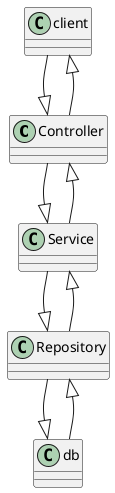

# Spring Boot Security

## CSRF (Cross Site Resource Forgery)
- When attacker tricks user to perform action without even knowing
- How it works
  - If we visit a trusted website it saves sessionID
  - Now when we visit a malicious website or open malicious email it uses session id stored
  - This sessionId can be used to access the trusted website
- Even though sessionID is stored in cookies and when we have 
  - HttpOnly : JS is prevented from accessing cookies
  - SameSite(Strict) : Cookies are only sent from same origin request
  - Secure : Ensuring cookies are only sent over HTTPs connection
- But when the request is sent cookies are auto attached by browser hence it will be accepted
- Mitigation Technique
  1. CSRF Token
      - This token is sent to the client (browser) in a secure way:
        - Option 1: Embedded in the HTML form as a hidden field.
        - Option 2: Sent as part of a response header (e.g., for APIs or SPAs).
      - Hence as they are not stored as cookie they cannot be used it send back directly
  2. SameSite Cookies:
    - Set cookies with the SameSite attribute to control cross-origin requests.
      - Strict: Only first-party requests can use cookies.
      - Lax: Allows cookies for top-level navigation but not for third-party embedded requests.

## Spring Security
- Each request goes through following chain
  1. Request enter filter chain
  2. Then authentication : Identify is user is valid
  3. Then authorization : check if user has access to perticular resource
- Provides security against some common threats and more
  - CSRF (Cross-Site Request Forgery)
  - XSS (Cross-Site Scripting)
  - Session Fixation
  - Clickjacking
- Easily integrate with third party 

## Spring Security Filter Chain
- Series of security filters applied to incomming HTTP request
- It helps in authentication and authorization of request based on security config
- When spring security is enabled, `FilterChainProxy` in the web is enabled.
  - This deligates the request handling of a perticular url to required FliterChain
- ### Terminologies
  - `Filter` : Spring has some predefined filters like AuthenticationFilter, AuthorizationFilter
  - `FilterChainProxy` : Main entrypoint in for spring security
    - this object manages multiple multiple `SecurityFilterChain`
  - `SecurityFilterChain` : Each chain has 
    - Matching condition : url pattern 
    - List of filters for each matching pattern
  - Execution Order : Order of execution of security filter 


## Dependencies
- Spring Web
- Spring security
- Additional 
  - tomcat-jasper
  - mysql-connector-j

## Creating project
- Add dependencies (username : user)
- update application.properties

  ```java
  spring.security.user.name=admin
  spring.security.user.password=admin123
  ```

## Spring filter security configuration
- Spring used `SecurityFilterChain` bean for security config
- We need to override it for custom security


## Using 
`https://chatgpt.com/c/6794e958-c16c-800d-94a9-39543e08fb71`

- CSRF 
- Spring Security Filter Chain
  - @EnableWebSecurity
  - SecurityFilterChain object
  - HttpSecurity
    - CSRF with HttpSecurity
  - httpform login
```java
public SecurityFilterChain securityFilterChain(HttpSecurity http) throws Exception {

  http.csrf(customizer -> cusomizer.disable());
  http.authorizeHttpRequests(request -> request.anyRequest().isAuthenticated());
  http.formLogin(Customize.withDefault());
  http.httpBasic(Customize.withDefault()); // for postman to work

  http.sessionManagement(session -> session.sessionCreationPolicy(SesscionCreationPolicy.STATELESS));

}
```
```java

Customizer<CsrfConfigurer<HttpSecurity>> cust = new Customizer<CsrfConfigurer<HttpSecurity>>() {
  @Override
  public void customize(CsrfConfigurer<HttpSecurity> customizer){
    customizer.disable();
  }
}; 
http.csrf(custCsrf);
```
- UserDetailService, InMemoryUserDetailManager, UserDetails, User
- Creating Authentication provider and return authenticated object
  - DaoAuthenticationInterface provider
- Creating a class for implementing userDetailService  
- Structure for authentication
- Create repo class using JpaRepository
- public class UserPrincipal implements UserDetails{}



  - Making session stateless

- Samesite strict
- OWASP
- CORS setup
- JWT

