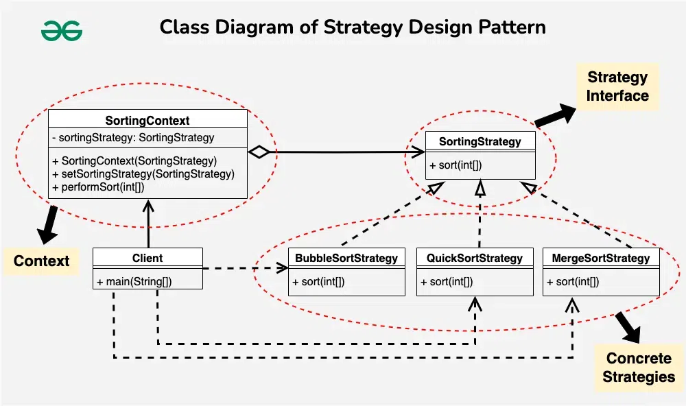
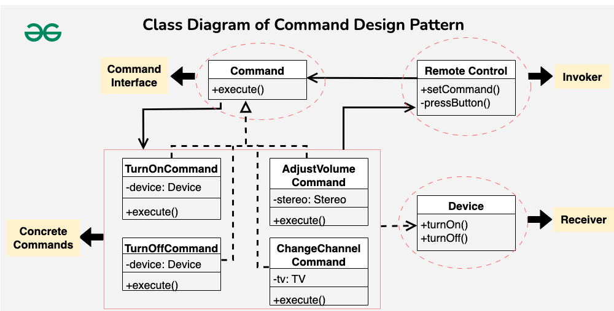
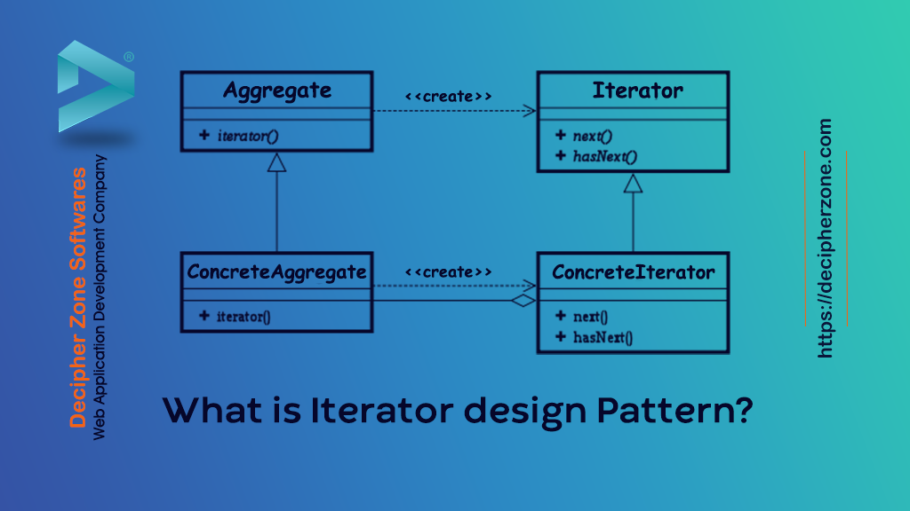

# Low Level Design

> # PlantTest UML

## Virtual Functions

- If we create a base class and a child class like this
```cpp

class Base{
    public:
        void print(){cout<<"Base\n";}
};

class Child: public Base{
    public:
        void print(){cout<<"Child\n";}
};

void PrintFn(Base* cl){
    cl->print();
}

int main(){
    
    Base* base = new Base();
    PrintFn(base);
    
    Child* child = new Child();
    PrintFn(child);
    
    return 0;
}
```
- Output will be
```
Base
Base
```
- Instead of `child`,`base` is printed as C++ will act as the The template defined for object
- This is why we use virtual functions (As they use vTables to Map)
- So just adding `virtual` in front of print function in Base will generate pointer pointing to designated function 
```cpp

class Base{
    public:
        virutal void print(){cout<<"Base\n";}
};

```
- Now output wil be 
```
Base
Child
```
- And to increase readability we also add `override` keyword in child
```cpp
class Child: public Base{
    public:
        void print() override{cout<<"Child\n";}
};
```
- Cost of virtual class
  - Extra memory to create vTable
  - Whenever it is called extra runtime is used too

## Abstract class | Interface class | Pure virtual fnnctions
- In the previous example we have defined implementation of print function in both base and child class
  - If we choose to skip implementation in child class the code would work fine
  - And in some cases we dont want that
    - We want user to define all the functions in base class
    - hence abstract class or classes with pure virtual functions comes into picture
- In `Abstract class` or `interface class` we cannot define implemenation
```cpp
class Base{
  public:
    // As we have defined a pure virtual function 
    // Now all the funcitons and variables in this class need to be pure virtual
    virtual void print() = 0;

    // So the following are invalid
    virtual int add(int a, int b){ return a+b; } ❌
    virtual int add(int a, int b) = 0;✅
};
```
- Other languages have interface class seprate but C++ has classes with pure virtual functions
- These classes with virtual functions are interface

## Basic Principles
### 1. DRY (Dont Repeat Yourself) ✅
### 2. WET (We Love Typing) ❌
### 3. KISS (Keep It Simple Stupid)
  - Good for maintaibality
  - Good for review
### 4. YAGNI (You Aren,t Gonna Need It)
  - Take it slow one step at a time
  - Dont bring all the libs

<!-- <hr>  -->

### SOLID principles

1. Single Responsibility Principle
  - A class should have only one reason to change
  - Say in the following example I have a class apple and a class invoice  
  - And we have to make following changes
    - While calcutating total we want to add GST and discount
    - Change the way printing invoice
    - Change the API calls to DB
  - So on the left side code all these changes are done in same class
  - On the right side code each change is done in individual class
    - Hence it follows Single responsisbility priciple
```cpp

// Car class
class Car{
  string name;
  string model;
  int prince;
  public:
    Car(){}
};

```

<table>
<tr>
<th>Dont follow principle</th>
<th>follow principle</th>
</tr>

<tr>

<td>

```cpp
class Invoice{
  int quantity;
  Car* car;
  public:
    Invoice(Car* car, int  q)
    {
      car = car;
      quantity = q;
    }
    int calc_total(){
       return quantity*car.price; 
    }
    void printInvoice(){
       /* Printing fn*/ }
    void SaveDataToDB(){
       /* API calls*/ }
};

```

</td>
<td>

```cpp
class InvoiceTotal{
  int quantity;
  Car* car;
  public:
    InvoiceTotal(Car* car, int  q)
    {
      car = car;
      quantity = q;
    }
    int calc_total(){ 
      return quantity*car.price; }
};
///////////////////////
class InvoicePrint{
  Car* car;
  int quantity;
  public:
    InvoicePrint(Car* car, int  q)
        {
      car = car;
      quantity = q;
    }

    void PrintInvoice(){
      /* Print Invoice*/}
};
///////////////////////
class InvoiceSaveDB{
  Car* car;
  int quantity;
  public:
    InvoiceSaveDB(Car* car, int  q)
    {
      car = car;
      quantity = q;
    }
    void SaveInvoice_to_DB(){
      /* Save Invoice*/}
};

```

</td>


</tr>
</table>

2. Open/Closed principle
  - Open for extension and closed for modification
  - If a tested class in live so dont modify it add add function 
  - Instead add extrension as shown
  - In the above example lets say we want to save invoice to DB and Filesystem
  - So saving invoice to DB is implemented 
    - But save invoice to file is not
    - So if we modify the class it wont follow `Open/Closed priciple`
    - Hence we create a interface saveInvoice and inherit them in `save to DB` and `save to Filesystem` 

<table>

<table>
  <tr>
    <th>❌Dont Follows Open/Close principle</th>
    <th>✅Follows Open/Close principle</th>
  </tr>
  <tr>
  <td>
    
  ```cpp

    class InvoiceSaveDB{
    Car* car;
    int quantity;
    public:
      InvoiceSaveDB(Car* car, int  q)
      {
        car = car;
        quantity = q;
      }
      void SaveInvoice_to_DB(){
        /* Save Invoice*/}
      // New function added
      void SaveInvoice_to_DB(){
        /* Save Invoice*/}
  };

  ```

  </td>
  <td>
  
  ```cpp
class InvoiceSave{
  public:
    virtual void SaveInvoice() = 0;
};

class SaveToDB: public InvoiceSave{
  Car* car;
  int quantity;
  public:
    SaveToDB(Car* car, int  q)
    {
      car = car;
      quantity = q;
    }
    // function defined over here
    void SaveInvoice override(){}

}
class SaveToFs: public InvoiceSave{
  Car* car;
  int quantity;
  public:
    SaveToFs(Car* car, int  q)
    {
      car = car;
      quantity = q;
    }
    // function defined over here
    void SaveInvoice override(){}

}
  ```
  
  </td>
  </tr>
</table>

3. Liskov Substitution Principle
- B subclass should be able to replace all the objects in parent class A without breaking it
- The following code does not follow it
- Motorbike : implementes all the parent functions 
- Bicycle : does not implemente TurnOnEngine object 

```cpp

class Bike {
public:
    virtual void turnOnEngine() = 0;
    virtual void accelerate() = 0;
};

class Motorbike : public Bike {
public:
    void turnOnEngine() override {
        std::cout << "Motorbike engine turned on!" << std::endl;
    }
    
    void accelerate() override {
        std::cout << "Motorbike is accelerating!" << std::endl;
    }
};

class Bicycle : public Motorbike {
public:
    void turnOnEngine() override {
        throw std::logic_error("Bicycle does not have an engine!");
    }
    
    void accelerate() override {
        std::cout << "Bicycle is accelerating!" << std::endl;
    }
};
```
- To solve this we only need to add very generic objects in interface class
- and create subclass which can act as parent to other classes as shown
```cpp

class Vehicle{
  public:
    virtual int wheels()=0;
}
class EngineVehicles:public Vehicles{
  public:
    virtual string engineSpec(){}
}

class Bicycle: public Vehicle{
  public:
    int wheels override(){}
}
class Car: public EngineVehicle{
  public:
    int wheels override(){}
    string engineSpec override(){}
}
class Bike: public EngineVehicle{
  public:
    int wheels override(){}
    string engineSpec override(){}
}

```

4. Interface segmented Principle
- Interface should not be such that client has to implement unnecessary functions
- In the given example Waiter has to implement `washDishes` and `cookfood` functions even if it is not needed

```cpp
#include <iostream>

class RestaurantEmployee {
public:
    virtual void washDishes() = 0;
    virtual void serveCustomers() = 0;
    virtual void cookFood() = 0;
};

// Waiter class only implements the serveCustomers function
class Waiter : public RestaurantEmployee {
public:
    void washDishes() override {
        // not my job
        std::cerr << "Waiter cannot wash dishes." << std::endl;
    }
    
    void serveCustomers() override {
        std::cout << "Serving the customer" << std::endl;
    }

    void cookFood() override {
        // not my job
        std::cerr << "Waiter cannot cook food." << std::endl;
    }
};

int main() {
    Waiter waiter;
    waiter.serveCustomers();
    waiter.washDishes();
    waiter.cookFood();

    return 0;
}
```

- Here is a better version

```cpp
#include <iostream>

// Separate interfaces for each responsibility
class Dishwasher {
public:
    virtual void washDishes() = 0;
};

class Server {
public:
    virtual void serveCustomers() = 0;
};

class Cook {
public:
    virtual void cookFood() = 0;
};

// Waiter class implementing only the Server interface
class Waiter : public Server {
public:
    void serveCustomers() override {
        std::cout << "Serving the customer" << std::endl;
    }
};

// Example usage
int main() {
    Waiter waiter;
    waiter.serveCustomers();

    return 0;
}
```

5. Dependency inversion principle
- child classes should depend on interfaces rather then concrete classes
- Say I have a child class named laptop and it will inherit keyboard and mouse which can be wired or wireless
  - So if they inherit classes directly like wired or wireless keyboard rather then keyboard interface it is good

- The code that dont follow DIP
```cpp
class WiredKeyboard {
    // WiredKeyboard implementation
};
class WirelessKeyboard {
    // WiredKeyboard implementation
};

class WiredMouse {
    // WiredMouse implementation
};
class WirelessMouse {
    // WiredMouse implementation
};

class MacBook {
private:
    WiredKeyboard keyboard;
    WiredMouse mouse;

public:
    MacBook() : keyboard(), mouse() {
        // Constructor
    }
};
```
- so if we are changing from wired to wireless then we need to endt subclasses 
- but if we had provided interface then this wont be a problem 
- Like shown in the code below
```cpp
class Keyboard {
public:
    virtual void type() = 0; // Abstract method
};

class Mouse {
public:
    virtual void click() = 0; // Abstract method
};

class MacBook {
private:
    Keyboard& keyboard;
    Mouse& mouse;

public:
    MacBook(Keyboard& keyboard, Mouse& mouse) : keyboard(keyboard), mouse(mouse) {
        // Constructor
    }
};

// Concrete implementations
class WiredKeyboard : public Keyboard {
public:
    void type() override {
        // Implementation of typing
    }
};
class WirelessKeyboard : public Keyboard {
public:
    void type() override {
        // Implementation of typing
    }
};

class WiredMouse : public Mouse {
public:
    void click() override {
        // Implementation of clicking
    }
};
class WirelessMouse : public Mouse {
public:
    void click() override {
        // Implementation of clicking
    }
};


// Example usage
int main() {
    WiredKeyboard keyboard;
    WiredMouse mouse;
    MacBook macbook(keyboard, mouse);

    return 0;
}


```

## Concurrency Control in Distributed System / Transactions

### Shared lock (S) v/s Exclusive Lock
- `Shared lock` is a `read-only lock`
- A `read lock` stops the Transaction from happening till it is reading
- `Exclusive lock` is `write lock`

### Transaction isloation Level
- The level to which an `operation in a transaction` `is isolated` from `other operations` in `concurrent transactions`
- It also specifies how and when changes made by one transaction are visible to other transactions
- The Phenomenas in Transaction isloation Level are :
    1. Dirty read
        - Situtation where other transactions reads the data that is yet to commit
        - Here say if a T1(Transaction 1) is in uncommited state and T2 reads it
        - Now if T1 rolls back then T2 need to reads that and also update the data
    2. Non Repeatable read
        - Happens when a transaction reads a same row twice and gets different results
    3. Phantom Read
        - Say T1 makes a qurey and gets result (row1 ..., row2...,)
        - And now if T2 completes transaction and a new row is added that satifies the qurey
        - So now If T1 makes qurey again it will show 3 rows (row1 ..., row2..., row3...)
- Transactions Isolation levels
    1. Read uncommited : 
        - Read the data that is uncommited
    2. Read committed :
        - Read the data that is committed
    3. Repeatable read :
        - Acquire a read lock so no one can modify the data that is being read
    4. Serializable :
        - Acquire an Exclusive lock, so no read or write in database

### Distributed concuren Control
- There are two methods of Concurrency control widely used
1. Optimistic Concurrency control
- To solve the issue of `Phantom read` a version of data is maintained in the DB
- And here initially shared lock is acquired by Transaction to fetch the state of DB 
- Then the operations are perfromed on the snapshot of DB
- After that transaction acquire Exclusive lock, 
- Then it performs validation checks to match version then updates the DB 

| Timestep | Transaction A | Transaction B | DB state |
|-|-|-|-|
| T1 | Begin Transaction | Begin Transaction | ID: 1; Status: Free; Version: 1 |
| T2 | Read row with ID 1 (Version 1 fetched) | Read row with ID 1 (Version 1 fetched) | ID: 1; Status: Free; Version: 1 |
| T3 | acquire exclusive lock and validate version |  | ID: 1; Status: Free; Version: 1;  (Exclusive lock Tx A)|
| T4 | update row 1, status : booked, version 2 |  | ID: 1; Status: Booked; version 2;(Exclusive lock Tx A); |
| T5 | Commit |  | ID: 1; Status: Booked; version 2;(Exclusive lock Tx A); |
| T6 |  | acquire exclusive lock and validate version | ID: 1; Status: Booked; version 2;(Exclusive lock Tx B); |
| T7 |  | ROLL BACK (Version missmatch) | ID: 1; Status: Booked; version 2;(Exclusive lock Tx B); |
| T7 |  | Read row with ID 1 (Version 2 fetched)  | ID: 1; Status: Booked; version 2; |

2. Pessimistic Concurrency Control
- Here just after getting shared lock the transaction will try to acquire exclusive without releasing shared lock
- and once the entire transaction is completed exclusive lock is released
- This can cause dead lock 

| Timestep | Transaction A | Transaction B | 
|-|-|-|
| T1 | Shared Lock on resource A | Shared Lock on resource B |
| T2 | Try Exclusive Lock on resource B | Try Exclusive Lock on resource A |

- As seen above this can cause deadlock
- After this all the resource are released and it starts again


<table>

<tr>
<th>is a relation</th>
<th>has a relation</th>

</tr>

<tr>
<td>
</td>
<td>
</td>

</tr>

</table>

## Design Pattern
- There are three types of design pattern 
1. Creational Design Pattern : Create object and control creation of objects
2. Structural Design Pattern
3. behavioral Design Pattern 

### Stratergy design pattern

<center>
<h3><b><u>
This pattern allows the behavior of an object to be selected at runtime.
</h3></b></u>
</center>

- Say I have a interface vehicle and it has a few objects (functions) like driveStratergy 
- Now in all the child classes of vehicles we have same 3 driveStratergies implemented again and again so the code repeates itself
- To solve this we can create a `stratergy interface` which will serve as a parent of different stratergies
- As shown in the code vehicle has 2 driveStratergies and they can be passed on from vehicle class

```cpp

#include <iostream>
using namespace std;

class DriveStrategy {
public:
    virtual void drive() = 0; // Pure virtual function
};

class StratA : public DriveStrategy {
public:
    void drive() override {
        cout << "StratA" << endl;
    }
};

class StratB : public DriveStrategy {
public:
    void drive() override {
        cout << "StratB" << endl;
    }
};

// Vehicle as an interface
class Vehicle {
protected:
    DriveStrategy& ds;
public:
    Vehicle(DriveStrategy& ds) : ds(ds) {}
    virtual void maxSpeed() = 0; // Pure virtual function
    virtual ~Vehicle() {} // Virtual destructor for cleanup
};

class VehicleA : public Vehicle {
public:
    VehicleA(DriveStrategy& ds) : Vehicle(ds) {}

    void maxSpeed() override {
        ds.drive();
    }
};

int main() {
    StratA strategyA;
    VehicleA vehicleA(strategyA);
    vehicleA.maxSpeed(); // Should output "StratA"

    return 0;
}


```


### Observer design pattern
<h3><b><u>

- This pattern defines a one-to-many dependency between objects 
  - so that when one object (the subject) changes state
  - all its dependents (observers) are notified and updated automatically.

</h3></b></u>

- Say we have a weather station and it delivers updates to different apps and users accross devices like TV, mobile etc...
- And all the devices are attached to weather station for updates
- Now instead of creating different type of functions in weather station class that will take care of different devices we can create an observer interface 
- And weather station subject will take observer interface's child and store them in list to notify
- Each different observer(TV, mobile etc..) will have their own implementation of observer class's update function and it will be well managed
- And different observors can also access different weather station(Subjects) of their choise and no extra code for each weather station will be reqired

```cpp

#include <iostream>
#include <list>
#include <string>

// Device Interface (Observer Interface)
class IObserver;

// Subject (Weather Station)
class ISubject {
public:
    virtual void attach(IObserver* observer) = 0;
    virtual void detach(IObserver* observer) = 0;
    virtual void notify() = 0;
    virtual ~ISubject() = default;
};

// Device Interface (Observer Interface)
class IObserver {
public:
    virtual void update(float temperature, float humidity, float pressure) = 0;
    virtual ~IObserver() = default;
};

// Concrete Subject (Weather Station Implementation)
class WeatherStation_Subject : public ISubject {
private:
    std::list<IObserver*> observers;
    float temperature;
    float humidity;
    float pressure;

public:
    void attach(IObserver* observer) override {
        observers.push_back(observer);
    }

    void detach(IObserver* observer) override {
        observers.remove(observer);
    }

    void notify() override {
        for (IObserver* observer : observers) {
            observer->update(temperature, humidity, pressure);
        }
    }

    void setMeasurements(float temp, float hum, float press) {
        temperature = temp;
        humidity = hum;
        pressure = press;
        notify();
    }
};

// Concrete Observer (Display Device)
class Display_TV : public IObserver {
private:
    std::string name;

public:
    Display_TV(const std::string& displayName) : name(displayName) {}

    void update(float temperature, float humidity, float pressure) override {
        std::cout << "Display [" << name << "] - Temperature: " << temperature
                  << ", Humidity: " << humidity << ", Pressure: " << pressure << std::endl;
    }
};
// Concrete Observer (Display Device)
class Display_app : public IObserver {
private:
    std::string name;

public:
    Display_app(const std::string& displayName) : name(displayName) {}

    void update(float temperature, float humidity, float pressure) override {
        std::cout << "Display [" << name << "] - Temperature: " << temperature
                  << ", Humidity: " << humidity << ", Pressure: " << pressure << std::endl;
    }
};

int main() {
    WeatherStation_subject weatherStation;

    Display_TV display1("Display 1");
    Display_TV display2("Display 2");
    Display_app display3("Display 3");

    weatherStation.attach(&display1);
    weatherStation.attach(&display2);
    weatherStation.attach(&display3);

    weatherStation.setMeasurements(25.0, 65.0, 1013.0);
    weatherStation.setMeasurements(30.0, 70.0, 1012.0);

    return 0;
}

```


### Decorator Pattern

<center>
<h3><b><u>

In decorator pattern we add new functionality to objects dynamically without altering their structure

</h3></b></u>
</center>

- Here the decorator has both relations with Component `is-a` and `has-a`
- Say we have a food delivery app which sends updates
```cpp

#include <iostream>
#include <string>

// Base Component interface
class IMessage {
public:
    virtual ~IMessage() {}
    virtual std::string send() const = 0;
};

// Concrete Components
class BasicMessage : public IMessage {
public:
    std::string send() const override {
        return "Message: Your food delivery is on the way!";
    }
};

// Base Decorator
class MessageDecorator : public IMessage {
protected:
    IMessage* message_;
public:
    MessageDecorator(IMessage* message) : message_(message) {}
    std::string send() const override {
        return message_->send();
    }
};

// Concrete Decorators
class WhatsAppMessage : public MessageDecorator {
public:
    WhatsAppMessage(IMessage* message) : MessageDecorator(message) {}
    std::string send() const override {
        /* API to send whatsapp message */
        return "WhatsApp - " + MessageDecorator::send();
    }
};

class SMSMessage : public MessageDecorator {
public:
    SMSMessage(IMessage* message) : MessageDecorator(message) {}
    std::string send() const override {
        /* API to send SMS */
        return "SMS - " + MessageDecorator::send();
    }
};

class FacebookMessage : public MessageDecorator {
public:
    FacebookMessage(IMessage* message) : MessageDecorator(message) {}
    std::string send() const override {
        /* API to send facebook message */
        return "Facebook - " + MessageDecorator::send();
    }
};

void ClientCode(IMessage* message) {
    std::cout << "RESULT: " << message->send() << std::endl;
}

int main() {
    IMessage* basicMessage = new BasicMessage;
    std::cout << "Client: I've got a basic message:\n";
    ClientCode(basicMessage);
    std::cout << "\n";

    IMessage* whatsappMessage = new WhatsAppMessage(basicMessage);
    IMessage* smsWhatsAppMessage = new SMSMessage(whatsappMessage);
    IMessage* facebookSmsWhatsAppMessage = new FacebookMessage(smsWhatsAppMessage);
    std::cout << "Client: Now I've got a decorated message:\n";
    ClientCode(facebookSmsWhatsAppMessage);
    std::cout << "\n";

    delete basicMessage;
    delete whatsappMessage;
    delete smsWhatsAppMessage;
    delete facebookSmsWhatsAppMessage;

    return 0;
}


```


### Factory / Abstract Factory pattern
- Factory Method

<center>
<h3><b><u>

A factory design pattern is a creational design pattern that provides an interface for creating objects.

</h3></b></u>
</center>

```cpp

#include <iostream>

class Fruit {
public:
    virtual void eat() = 0;
};

class Apple : public Fruit {
public:
    void eat() override {
        std::cout << "Eating a delicious apple!" << std::endl;
    }
};

class Banana : public Fruit {
public:
    void eat() override {
        std::cout << "Eating a sweet banana!" << std::endl;
    }
};

class Orange : public Fruit {
public:
    void eat() override {
        std::cout << "Eating a juicy orange!" << std::endl;
    }
};

class FruitFactory {
public:
    static Fruit* createFruit(const std::string& type) {
        if (type == "apple") {
            return new Apple();
        } else if (type == "banana") {
            return new Banana();
        } else if (type == "orange") {
            return new Orange();
        } else {
            return nullptr;
        }
    }
};

int main() {
    Fruit* fruit1 = FruitFactory::createFruit("apple");
    fruit1->eat();

    Fruit* fruit2 = FruitFactory::createFruit("banana");
    fruit2->eat();

    Fruit* fruit3 = FruitFactory::createFruit("orange");
    fruit3->eat();

    return 0;
}

```


- Abstract Concrete Factory 
- It is a factory of factory method

```cpp
#include <iostream>

// Abstract Factory
class AbstractFactory {
public:
    virtual ProductA* createProductA() = 0;
    virtual ProductB* createProductB() = 0;
};

// Concrete Factories
class ConcreteFactoryX : public AbstractFactory {
public:
    ProductA* createProductA() override {
        return new ProductAX();
    }
    ProductB* createProductB() override {
        return new ProductBX();
    }
};

class ConcreteFactoryY : public AbstractFactory {
public:
    ProductA* createProductA() override {
        return new ProductAY();
    }
    ProductB* createProductB() override {
        return new ProductBY();
    }
};

// Product Interfaces
class ProductA {
public:
    virtual void doSomething() = 0;
};

class ProductB {
public:
    virtual void doSomethingElse() = 0;
};

// Concrete Products
class ProductAX : public ProductA {
public:
    void doSomething() override {
        std::cout << "ProductAX: Doing something" << std::endl;
    }
};

class ProductAY : public ProductA {
public:
    void doSomething() override {
        std::cout << "ProductAY: Doing something" << std::endl;
    }
};

class ProductBX : public ProductB {
public:
    void doSomethingElse() override {
        std::cout << "ProductBX: Doing something else" << std::endl;
    }
};

class ProductBY : public ProductB {
public:
    void doSomethingElse() override {
        std::cout << "ProductBY: Doing something else" << std::endl;
    }
};

// Client
int main() {
    AbstractFactory* factoryX = new ConcreteFactoryX();
    ProductA* productAX = factoryX->createProductA();
    productAX->doSomething();

    AbstractFactory* factoryY = new ConcreteFactoryY();
    ProductB* productBY = factoryY->createProductB();
    productBY->doSomethingElse();

    return 0;
}
```


### Chain Of Responsibility

<center>
<h3><b><u>

Chain of Responsibility is behavioral design pattern that allows passing request along the chain of potential handlers until one of them handles request.

</h3></b></u>
</center>

- In the given example an eatble is given if certain animal will eat then the request is processed then and there else it is forwarded

```cpp
/**

 * The Handler interface declares a method for building the chain of handlers.
 * It also declares a method for executing a request.
 */
class Handler {
 public:
  virtual Handler *SetNext(Handler *handler) = 0;
  virtual std::string Handle(std::string request) = 0;
};
/**
 * The default chaining behavior can be implemented inside a base handler class.
 */
class AbstractHandler : public Handler {
  /**
   * @var Handler
   */
 private:
  Handler *next_handler_;

 public:
  AbstractHandler() : next_handler_(nullptr) {
  }
  Handler *SetNext(Handler *handler) override {
    this->next_handler_ = handler;
    // Returning a handler from here will let us link handlers in a convenient
    // way like this:
    // $monkey->setNext($squirrel)->setNext($dog);
    return handler;
  }
  std::string Handle(std::string request) override {
    if (this->next_handler_) {
      return this->next_handler_->Handle(request);
    }

    return "Animals wont eat this shit";
  }
};
/**
 * All Concrete Handlers either handle a request or pass it to the next handler
 * in the chain.
 */
class MonkeyHandler : public AbstractHandler {
 public:
  std::string Handle(std::string request) override {
    if (request == "Banana") {
      return "Monkey: I'll eat the " + request + ".\n";
    } else {
      return AbstractHandler::Handle(request);
    }
  }
};
class SquirrelHandler : public AbstractHandler {
 public:
  std::string Handle(std::string request) override {
    if (request == "Nut") {
      return "Squirrel: I'll eat the " + request + ".\n";
    } else {
      return AbstractHandler::Handle(request);
    }
  }
};
class DogHandler : public AbstractHandler {
 public:
  std::string Handle(std::string request) override {
    if (request == "MeatBall") {
      return "Dog: I'll eat the " + request + ".\n";
    } else {
      return AbstractHandler::Handle(request);
    }
  }
};
/**
 * The client code is usually suited to work with a single handler. In most
 * cases, it is not even aware that the handler is part of a chain.
 */
void ClientCode(Handler &handler) {
  std::vector<std::string> food = {"Nut", "Banana", "Cup of coffee"};
  for (const std::string &f : food) {
    std::cout << "Client: Who wants a " << f << "?\n";
    const std::string result = handler.Handle(f);
    if (!result.empty()) {
      std::cout << "  " << result;
    } else {
      std::cout << "  " << f << " was left untouched.\n";
    }
  }
}
/**
 * The other part of the client code constructs the actual chain.
 */
int main() {
  MonkeyHandler *monkey = new MonkeyHandler;
  SquirrelHandler *squirrel = new SquirrelHandler;
  DogHandler *dog = new DogHandler;
  monkey->SetNext(squirrel)->SetNext(dog);

  /**
   * The client should be able to send a request to any handler, not just the
   * first one in the chain.
   */
  std::cout << "Chain: Monkey > Squirrel > Dog\n\n";
  ClientCode(*monkey);
  std::cout << "\n";
  std::cout << "Subchain: Squirrel > Dog\n\n";
  ClientCode(*squirrel);

  delete monkey;
  delete squirrel;
  delete dog;

  return 0;
}

```


### Handling NULL pointer (Factory and Abstract Factory Design )
- Say I have an object which may throw null pointer
```cpp
void getVehicleDetails(Vehicle vehicle){
    // What if vehicle does not exit and NULL pointer is passed
    cout<<vehicle.getSeats()<<end;
    cout<<vehicle.maxSpeed()<<end;
    // We can use if to check if it is null
    // if(vehicle != NULL)
    // say we are using vechile at 100s of places in code
    // Then we need to update at all the places 
}
```
- To handle this, we will replace `NULL` with `NULL object`
- Now we wont need to add `NULL object`
- This comes handy in factory and abstract factory design 

```cpp

class Fruit {
public:
    virtual void eat() = 0;
};

class Apple : public Fruit {
public:
    void eat() override {
        std::cout << "Eating a delicious apple!" << std::endl;
    }
};

class NullFruit : public Fruit {
public:
    void eat() override {
        std::cout << "NULL object" << std::endl;
    }
};

class FruitFactory {
public:
    static Fruit* createFruit(const std::string& type) {
        if (type == "apple") {
            return new Apple();
        } else if (type == "banana") {
            return new Banana();
        } else if (type == "orange") {
            return new Orange();
        } else {
            // here instead of null pointer we will send a null object
            // return nullptr;

            // This is null object
            return new NullFruit();
        }
    }
};


```

### State Design Pattern

<center>
<h3><b><u>

This pattern focuses on managing state transitions and coordinating state-specific behaviors

</h3></b></u>
</center>

- Eg: a vending machine
    - The state interface has all the function definations and they are fully defined for error control
    - Then there are concrete classes or concrete states 
    - These concrete classes implemenats only the necessary function that it inherits from state interface
    - Rest of the functions are taken care be state interface
    - After each operation(say coins inserted)
    - The vending machine context updates the states and then the state is again fetched


```cpp
class VendingMachineContext;
enum Coins{ Penny = 0.5, Dime=0.75, Quater=0.25}

class VendingMachineStateInterface{        
    public:
        virtual void handleRequest1(){ throw error("Error"); }
        virtual void handleRequest2(){ throw error("Error"); }
        virtual void handleRequest3(){ throw error("Error"); }
        .
        .
        .
        virtual int insertCoin(Coins){ throw error("Error");}
        .
        .
        .
};

class CoinsHandlerState: public VendingMachineStateInterface{
    int total_value;
    vendingMachineContext machine;
    public:
        CoinsHandlerState():total_value(0){}
        int insertCoin(enum Coins coin) override{
            total_value += coin;
            machine.setState(new ProcessMoney());
        }
}

class ProcessMoney: public VendingMachineStateInterface{
    .
    .
    .
}

class VendingMachineContext{
    VendingMachineStateInterface state;
    public:
        VendingMachineContext(){
            setState(new initialState());
        }
        setState(VendingMachineStateInterface newState):state(newState){}
        .
        .
        .
}
```

### Composite Design pattern
- Any problem that falls inside tree can be solved using this 
- Like a file system, employeer-heridetry chart
- So Component or interface


```cpp

#include <iostream>
#include <vector>
#include <string>

// Component
class FileSystemInterface {
public:
    virtual ~FileSystemInterface() = default;
    virtual void showDetails() const = 0;
    virtual bool isComposite() = 0;
};

// Leaf
class File : public FileSystemInterface {
private:
    std::string name;
    double size; // size in MB
public:
    File(const std::string& name, double size) : name(name), size(size) {}
    bool isComposite()override{ return false;}
    void showDetails() const override {
        std::cout << "File: " << name << " (" << size << " MB)" << std::endl;
    }
};

// Composite
class Directory : public FileSystemInterface {
private:
    std::string name;
    std::vector<FileSystemInterface*> components;
public:
    Directory(const std::string& name) : name(name) {}
    void add(FileSystemInterface* component) {
        components.push_back(component);
    }
    bool isComposite()override{ return true;}
    void showDetails() const override {
        std::cout << "Directory: " << name << std::endl;
        for (const auto& component : components) {
            component->showDetails();
        }
    }
    ~Directory() {
        for (auto component : components) {
            delete component;
        }
    }
};

int main() {
    Directory* rootDir = new Directory("root");
    Directory* homeDir = new Directory("home");
    Directory* userDir = new Directory("user");
    File* file1 = new File("file1.txt", 1.5);
    File* file2 = new File("file2.txt", 2.5);
    
    rootDir->add(homeDir);
    homeDir->add(userDir);
    userDir->add(file1);
    userDir->add(file2);

    rootDir->showDetails();

    delete rootDir; // This will recursively delete all components

    return 0;
}


```

### Adaptor Design pattern
- Convert the input request to a processable from
- Like an ORM converts input from OOPs to Database qurey

### Builder Design Pattern

<center>
<h3><b><u>

 It allows the construction of a product in a step-by-step fashion, where the construction process can vary based on the type of product being built.

</h3></b></u>
</center>

- It helps where there are multiple optional fields
- Eg. If a student class is to be created but, there can be multiple constructor
    - Like create student with first name and rollno
        - Create student with first name, last name and rollno
        - create student with name, phone_no and rollno 
        - .
        - .
        - .
    - So the class will look like a big mess
- Another example a house class
    - First all walls
    - Then add roof, then door, paint, statue, garden ...
- So the builder first takes all the inputs at onces or seperately
- Then when we run build then it gives complete builded object
- The computer is a 


```cpp

#include <iostream>
#include <string>

using namespace std;

// Product
class Computer {
public:
    void setCPU(const std::string& cpu) {
        cpu_ = cpu;
    }

    void setRAM(const std::string& ram) {
        ram_ = ram;
    }

    void setStorage(const std::string& storage) {
        storage_ = storage;
    }

    void displayInfo() const {
        std::cout << "Computer Configuration:"
                  << "\nCPU: " << cpu_
                  << "\nRAM: " << ram_
                  << "\nStorage: " << storage_ << "\n\n";
    }

private:
    string cpu_;
    string ram_;
    string storage_;
};

// Builder interface
class Builder {
public:
    virtual void buildCPU() = 0;
    virtual void buildRAM() = 0;
    virtual void buildStorage() = 0;
    virtual Computer getResult() = 0;
};

// ConcreteBuilder
class GamingComputerBuilder : public Builder {
private:
    Computer computer_;

public:
    void buildCPU() override {
        computer_.setCPU("Gaming CPU");
    }

    void buildRAM() override {
        computer_.setRAM("16GB DDR4");
    }

    void buildStorage() override {
        computer_.setStorage("1TB SSD");
    }

    Computer getResult() override {
        return computer_;
    }
};

// Director
class ComputerDirector {
public:
    void construct(Builder& builder) {
        builder.buildCPU();
        builder.buildRAM();
        builder.buildStorage();
    }
};

// Client
int main() {
    GamingComputerBuilder gamingBuilder;
    ComputerDirector director;

    director.construct(gamingBuilder);
    Computer gamingComputer = gamingBuilder.getResult();

    gamingComputer.displayInfo();

    return 0;
}
```

### Builder v/s Decorator
- Builder cannot handle dynamic design
- While decorator can do
- Take pizza example
    - If options are cheese, tomato, mushroom, onion....
    - Then for all combinations we need a different concrete class in Builder
- Builder is helpful when object is to be built in systemmatic and consistant MonkeyHandler
- And decorator is suited for dynammic and flexible build

### Facade Design Pattern
<center>
<h3><b><u>

we use this to hide system complexicity from the client 

</h3></b></u>
</center>

- It is not a madateory
- It is optional and client can use facade or it can directly interact with model
- Say in future if the logic changes so client dont need to make changes in the code as facade layer takes care of it 


### Bridge Design pattern 

<center>
<h3><b><u>

Decouples abstraction from its implemenation so that the two can vary independently

</h3></b></u>
</center>

- In the image the redenfiend abstraction and concrete implemenation can grow independently

```cpp
#include <iostream>

// Implementation Interface
class BreathingPattern {
public:
    virtual void breathe() const = 0;
    virtual ~BreathingPattern() = default;
};

// Concrete Implementations
class Gills : public BreathingPattern {
public:
    void breathe() const override {
        std::cout << "Breathing through gills.\n";
    }
};

class Leaves : public BreathingPattern {
public:
    void breathe() const override {
        std::cout << "Breathing through leaves.\n";
    }
};

class Nose : public BreathingPattern {
public:
    void breathe() const override {
        std::cout << "Breathing through nose.\n";
    }
};

// Abstract Interface
class Life {
protected:
    BreathingPattern* breathingPattern;
public:
    Life(BreathingPattern* bp) : breathingPattern(bp) {}
    virtual void performBreathing() const = 0;
    virtual ~Life() { delete breathingPattern; }
};

// Refined Interfaces
class Tree : public Life {
public:
    Tree(BreathingPattern* bp) : Life(bp) {}
    void performBreathing() const override {
        std::cout << "Tree: ";
        breathingPattern->breathe();
    }
};

class Fish : public Life {
public:
    Fish(BreathingPattern* bp) : Life(bp) {}
    void performBreathing() const override {
        std::cout << "Fish: ";
        breathingPattern->breathe();
    }
};

class Bird : public Life {
public:
    Bird(BreathingPattern* bp) : Life(bp) {}
    void performBreathing() const override {
        std::cout << "Bird: ";
        breathingPattern->breathe();
    }
};

int main() {
    Life* tree = new Tree(new Leaves());
    Life* fish = new Fish(new Gills());
    Life* bird = new Bird(new Nose());

    tree->performBreathing();
    fish->performBreathing();
    bird->performBreathing();

    delete tree;
    delete fish;
    delete bird;

    return 0;
}
```


### Bridge design pattern v/s Stratergy Design Pattern
- Both look very same but it is the intent of use
- We use Stratergy pattern when the redenfiendAbstract is dynamically alloted concrete implemenation
    - i.e. redenfiend abstract get concrete implemenation on runtime
- While we use Bridge pattern when the abstraction and implemenation grow independently

### Prototype design Pattern
- Say object creation is expensive 
- So instead of creating new object we clone the object and make minor modifications


```cpp
#include <iostream>
#include <string>
#include <unordered_map>

// Prototype interface
class Animal {
public:
    virtual Animal* clone() const = 0;
    virtual void speak() const = 0;
    virtual ~Animal() = default;
};

// Concrete Prototypes
class Dog : public Animal {
public:
    Animal* clone() const override {
        return new Dog(*this);
    }
    void speak() const override {
        std::cout << "Woof! Woof!\n";
    }
};

class Cat : public Animal {
public:
    Animal* clone() const override {
        return new Cat(*this);
    }
    void speak() const override {
        std::cout << "Meow! Meow!\n";
    }
};

// Prototype Factory
class AnimalFactory {
private:
    std::unordered_map<std::string, Animal*> prototypes;
public:
    AnimalFactory() {
        prototypes["dog"] = new Dog();
        prototypes["cat"] = new Cat();
    }
    ~AnimalFactory() {
        for (const auto& pair : prototypes) {
            delete pair.second;
        }
    }
    Animal* createAnimal(const std::string& type) const {
        return prototypes.at(type)->clone();
    }
};

int main() {
    AnimalFactory factory;

    Animal* dog = factory.createAnimal("dog");
    Animal* cat = factory.createAnimal("cat");

    dog->speak(); // Output: Woof! Woof!
    cat->speak(); // Output: Meow! Meow!

    delete dog;
    delete cat;

    return 0;
}

```

### Singleton Pattern 

<center>
<h3><b><u>

To control object creation, limiting the number to one but allowing the flexibility to create more objects if the situation changes

</h3></b></u>
</center>


- When only limited or one instance of class is required then this pattern is used
- Say DB connection, we only need to conenct db once then save the instance to be used every time
- This can be done in 4 ways 
1. Eager 
```cpp
// Here the connection is initialised in the start
// But sometimes connection needs to be invoked at certain time
class dbConnect {
private:
    static dbConnect instance;
    dbConnect() {}
public:
    static dbConnect& getInstance() {
        return instance;
    }
};

dbConnect dbConnect::instance;

```
2. Lazy
```cpp
// This will invoke connection once
// But say two threads access getInstance at same time 
// So two instances will be created 
// So we can lock it 
class dbConnect {
private:
    static dbConnect* instance;
    dbConnect() {}
public:
    static dbConnect* getInstance() {
        if (instance == nullptr) {
            instance = new dbConnect();
        }
        return instance;
    }
};

dbConnect* dbConnect::instance = nullptr;

```
3. Sync locking
```cpp
// Here to mutex prevents creation of multiple instances 
// But every time mutex needs to invoked (problem)
#include <mutex>

class dbConnect {
private:
    static dbConnect* instance;
    static std::mutex mutex;
    dbConnect() {}
public:
    static dbConnect* getInstance() {
        std::lock_guard<std::mutex> lock(mutex);
        if (instance == nullptr) {
            instance = new dbConnect();
        }
        return instance;
    }
};

dbConnect* dbConnect::instance = nullptr;
std::mutex dbConnect::mutex;
```

4. Double locking

```cpp
// Here mutex is only invoked when db instance is not created
// So if it exist locking does not happed
#include <mutex>

class dbConnect {
private:
    static dbConnect* instance;
    static std::mutex mutex;
    dbConnect() {}
public:
    static dbConnect* getInstance() {
        if (instance == nullptr) {
            std::lock_guard<std::mutex> lock(mutex);
            if (instance == nullptr) {
                instance = new dbConnect();
            }
        }
        return instance;
    }
};

dbConnect* dbConnect::instance = nullptr;
std::mutex dbConnect::mutex;
```

### Two Issues with Double check locking
1. Instruction Reordering Issue:
    - The compiler and CPU may reorder instructions to optimize performance.
    - In double-checked locking, without proper synchronization, the write of the new object instance may be visible to other threads before the constructor has finished executing, leading to a partially constructed object being accessed.
    - Like first memory for connection created and alloted in storage then the initialisation is perfromed 
    - So before initialisation the object is acceessable
2. L1 Caching Issue:
    - In multicore systems, each core might have its own L1 cache.
    - Without proper synchronization, changes to shared variables might not be immediately visible to other cores, causing them to read stale data from their own cache instead of the updated value.
    - In L1 Cache initialisation is done and lock is released but changes not reflected in memory
    - In Another L1 Cache another thread comes and lock is given and a new connection is establisted 
- Using the volatile Keyword
    - Marking the instance variable as volatile ensures that the variable reads and writes are directly from and to main memory, not caches.
    - This prevents instruction reordering and ensures visibility of changes across threads.
```cpp
#include <mutex>

class dbConnect {
private:
    static volatile dbConnect* instance;
    static std::mutex mutex;
    dbConnect() {}
public:
    static dbConnect* getInstance() {
        if (instance == nullptr) {
            std::lock_guard<std::mutex> lock(mutex);
            if (instance == nullptr) {
                instance = new dbConnect();
            }
        }
        return const_cast<dbConnect*>(instance);
    }
};

volatile dbConnect* dbConnect::instance = nullptr;
std::mutex dbConnect::mutex;
```

### Flywheel Design Pattern

<center>
<h3><b><u>

This helps in reduced memory usage by sharing data among multiple objects 

</h3></b></u>
</center>

- Mostly used in `desgin a word Processor/Text editor` & `Design a game`
- It is used when 
    - memory is limited
    - multiple objects need to be created and single object creation is explensive
    - And object shares data
- Here the data is divided into two types
    - Intrensic data : The data which is same btwn objects
    - Extrensic data : Data which differs from object to object
- Solving issue
    - Remove all the extrensic data from object 
        - Now this class will be immutable and is called Flywheel class
    - Then pass this data is cached whenever created and passed to class that store intrensic data

```cpp
#include <iostream>
#include <unordered_map>
#include <string>

// Flyweight Interface
class InterfaceRobot {
public:
    virtual void get_position(int x, int y) const = 0;
    virtual ~InterfaceRobot() {}
};

// Concrete Flyweight
class ConcreteRobot : public InterfaceRobot {
private:
    std::string type;
    std::string sprite;

public:
    ConcreteRobot(const std::string& type, const std::string& sprite)
        : type(type), sprite(sprite) {}

    void get_position(int x, int y) const override {
        std::cout << "Robot Type: " << type << ", Position: (" << x << ", " << y << "), Sprite: " << sprite << std::endl;
    }
};

// Flyweight Factory
class RobotFactory {
private:
    std::unordered_map<std::string, InterfaceRobot*> robot_map;

public:
    InterfaceRobot* get_robot(const std::string& type) {
        if (robot_map.find(type) == robot_map.end()) {
            // Heavy object creation: sprite could be an actual image in a real game
            std::string sprite = "sprite_" + type;
            robot_map[type] = new ConcreteRobot(type, sprite);
        }
        return robot_map[type];
    }

    ~RobotFactory() {
        for (auto& pair : robot_map) {
            delete pair.second;
        }
    }
};

// Usage
int main() {
    RobotFactory robotFactory;

    InterfaceRobot* robot1 = robotFactory.get_robot("TypeA");
    InterfaceRobot* robot2 = robotFactory.get_robot("TypeB");
    InterfaceRobot* robot3 = robotFactory.get_robot("TypeA");

    robot1->get_position(10, 20);
    robot2->get_position(30, 40);
    robot3->get_position(50, 60);

    return 0;
}
```
 
### Commnd Desgin Pattern
- It divides logic into 3 groups
    1. Reciever
    2. Invoker
    3. Command



```cpp
#include <iostream>
#include <string>

// Command Interface
class Command {
public:
    virtual void execute() = 0;
    virtual ~Command() {}
};

// Receiver Class
class AirConditioner {
public:
    void turnOn() {
        std::cout << "AC is turned ON." << std::endl;
    }

    void turnOff() {
        std::cout << "AC is turned OFF." << std::endl;
    }

    void setTemperature(int temperature) {
        std::cout << "AC temperature set to " << temperature << " degrees." << std::endl;
    }
};

// Concrete Command Classes
class TurnOnCommand : public Command {
private:
    AirConditioner* ac;

public:
    TurnOnCommand(AirConditioner* ac) : ac(ac) {}
    void execute() override {
        ac->turnOn();
    }
};

class TurnOffCommand : public Command {
private:
    AirConditioner* ac;

public:
    TurnOffCommand(AirConditioner* ac) : ac(ac) {}
    void execute() override {
        ac->turnOff();
    }
};

class SetTemperatureCommand : public Command {
private:
    AirConditioner* ac;
    int temperature;

public:
    SetTemperatureCommand(AirConditioner* ac, int temp) : ac(ac), temperature(temp) {}
    void execute() override {
        ac->setTemperature(temperature);
    }
};

// Invoker Class
class RemoteControl {
private:
    Command* command;

public:
    void setCommand(Command* cmd) {
        command = cmd;
    }

    void pressButton() {
        if (command) {
            command->execute();
        }
    }
};

// Usage
int main() {
    AirConditioner* ac = new AirConditioner;
    Command* turnOn = new TurnOnCommand(ac);
    Command* turnOff = new TurnOffCommand(ac);
    Command* setTemp = new SetTemperatureCommand(ac, 24);

    RemoteControl* remote = new RemoteControl;

    remote->setCommand(turnOn);
    remote->pressButton();

    remote->setCommand(setTemp);
    remote->pressButton();

    remote->setCommand(turnOff);
    remote->pressButton();

    delete ac;
    delete turnOn;
    delete turnOff;
    delete setTemp;
    delete remote;

    return 0;
}

```


### Iterator Design Pattern
<center>
<h3><b><u>

So, its a Behavioral Design pattern, that provides a way to access element of a Collection sequentially without exposing the underlying representation of the collection.

</h3></b></u>
</center>

- Like say list in cpp implements vector, set, queue, stack etc...
- Aggregator: This is an interface that defines a method for creating an iterator object
- Iterator: This is an interface that provides methods to traverse the collection



```cpp
#include <iostream>
#include <vector>
#include <stack>
#include <queue>

// Iterator Interface
template <typename T>
class Iterator {
public:
    virtual bool hasNext() const = 0;
    virtual T next() = 0;
    virtual ~Iterator() {}
};

// Aggregate Interface
template <typename T>
class Aggregate {
public:
    virtual Iterator<T>* createIterator() const = 0;
    virtual ~Aggregate() {}
};

// Concrete Iterator for Vector
template <typename T>
class VectorIterator : public Iterator<T> {
private:
    const std::vector<T>& vec;
    size_t index;
public:
    VectorIterator(const std::vector<T>& v) : vec(v), index(0) {}
    bool hasNext() const override {
        return index < vec.size();
    }
    T next() override {
        return vec[index++];
    }
};

// Concrete Aggregate for Vector
template <typename T>
class VectorAggregate : public Aggregate<T> {
private:
    std::vector<T> vec;
public:
    void add(const T& value) {
        vec.push_back(value);
    }
    Iterator<T>* createIterator() const override {
        return new VectorIterator<T>(vec);
    }
};

// Example Usage
int main() {
    VectorAggregate<int> vectorAggregate;
    vectorAggregate.add(1);
    vectorAggregate.add(2);
    vectorAggregate.add(3);

    Iterator<int>* it = vectorAggregate.createIterator();
    while (it->hasNext()) {
        std::cout << it->next() << " ";
    }
    delete it;
    return 0;
}


```

### Mediator Desgin Pattern

<center>
<h3><b><u>

Mediator enables decoupling of objects by introducing a layer in between so that the interaction between objects happens via the layer

</h3></b></u>
</center>

- Reason for decoupling
    - If the objects interact with each other directly, the system components are tightly coupled with each other making higher maintainability cost and not hard to extend.
    - The mediator pattern focuses on providing a mediator between objects for communication and helps in implementing loose coupling between objects.
- The pattern has Colleagues, Mediator, communication flow.
- Example: auction system
- Another example is Group project in school
    - Colleagues(Students) 
    - Mediator(Teacher)
    - communication flow:
        - If a student needs information from another, they tell the teacher.
        - The teacher figures out how to get the needed information from the other students.
        - The teacher then relays the information back to the requesting student.
        - Students communicate indirectly through the teacher, keeping things organized and preventing chaos in the classroom.


```cpp
#include <iostream>
#include <string>

// Mediator Interface
class ATC_Interface {
public:
    virtual void takeoff(const std::string& airplane) = 0;
    virtual void landing(const std::string& airplane) = 0;
    virtual ~ATC_Interface() {}
};

// Colleague Interface
class Airplane_Interface {
public:
    virtual void takeoff() = 0;
    virtual void landing() = 0;
    virtual void notifyAirTrafficControl(const std::string& message) = 0;
    virtual ~Airplane_Interface() {}
};

// Concrete Mediator
class ATC : public ATC_Interface {
public:
    void takeoff(const std::string& airplane) override {
        std::cout << "ATC: Cleared for takeoff: " << airplane << std::endl;
    }

    void landing(const std::string& airplane) override {
        std::cout << "ATC: Cleared for landing: " << airplane << std::endl;
    }
};

// Concrete Colleague
class Airplane : public Airplane_Interface {
private:
    ATC_Interface* atc;
    std::string name;

public:
    Airplane(ATC_Interface* atc, const std::string& name) : atc(atc), name(name) {}

    void takeoff() override {
        notifyAirTrafficControl("requesting takeoff clearance");
        atc->takeoff(name);
    }

    void landing() override {
        notifyAirTrafficControl("requesting landing clearance");
        atc->landing(name);
    }

    void notifyAirTrafficControl(const std::string& message) override {
        std::cout << name << " " << message << std::endl;
    }
};

// Usage
int main() {
    ATC* atc = new ATC;
    Airplane* airplane1 = new Airplane(atc, "Airplane 1");
    Airplane* airplane2 = new Airplane(atc, "Airplane 2");

    airplane1->takeoff();
    airplane2->landing();

    delete airplane1;
    delete airplane2;
    delete atc;

    return 0;
}
```


### Visitor Design Pattern

<center>
<h3><b><u>

- This pattern allows you to add new operations to exsiting class without changing their structure
- It does this by seperating the operations from the object on which it operates
- It uses double dispatch to do this


</h3></b></u>
</center>

- It is called double dispatch because
    - the selection of method based on the runtime types of two objects — the receiver and the argument
- Like the example desicribed below for performing action on a room we need to type of action(book, maintain, visit) and type of the room(single, double)


```cpp
#include <iostream>
#include <vector>
#include <string>

class Room;

// Visitor Interface
class Visitor {
public:
    virtual void visit(Room* room) = 0;
    virtual ~Visitor() {}
};

// Room Interface
class Room {
public:
    virtual void accept(Visitor* visitor) = 0;
    virtual ~Room() {}
};

// Concrete Room Classes
class SingleRoom : public Room {
public:
    void accept(Visitor* visitor) override {
        visitor->visit(this);
    }
};

class DoubleRoom : public Room {
public:
    void accept(Visitor* visitor) override {
        visitor->visit(this);
    }
};

class DeluxeRoom : public Room {
public:
    void accept(Visitor* visitor) override {
        visitor->visit(this);
    }
};

// Concrete Visitor Classes for different actions
class MaintenanceVisitor : public Visitor {
public:
    void visit(Room* room) override {
        if((dynamic_cast<SingleRoom*>(room))){
            std::cout << "Performing maintenance on Single Room." << std::endl;        
        }
        else if((dynamic_cast<DoubleRoom*>(room))){        
            std::cout << "Performing maintenance on Double Room." << std::endl;
        }
        else if((dynamic_cast<DeluxeRoom*>(room))){
            std::cout << "Performing maintenance on Deluxe Room." << std::endl;
        }
        else{
            std::cout<<"wrong room type";
        }
    }
};

class BookingVisitor : public Visitor {
public:
    void visit(Room* room) override {
        if((dynamic_cast<SingleRoom*>(room))){
            std::cout << "Booking on Single Room." << std::endl;        
        }
        else if((dynamic_cast<DoubleRoom*>(room))){        
            std::cout << "Booking on Double Room." << std::endl;
        }
        else if((dynamic_cast<DeluxeRoom*>(room))){
            std::cout << "Booking on Deluxe Room." << std::endl;
        }
        else{
            std::cout<<"wrong room type";
        }
    }
};

// Usage
int main() {
    std::vector<Room*> rooms = { new SingleRoom, new DoubleRoom, new DeluxeRoom };

    MaintenanceVisitor maintenance;
    BookingVisitor booking;

    for (Room* room : rooms) {
        room->accept(&maintenance);
        room->accept(&booking);
    }

    // Clean up
    for (Room* room : rooms) {
        delete room;
    }

    return 0;
}
```

### MVC design Pattern (Model View Controller)
- Usually for designing games this is used
- `View(User)` -- (Interact with) --> `Controller` --(Interact with)--> `Model` --(Interact with) --> `DB`
 


### Memento desgin pattern / snapshot design pattern

<center>
<h3><b><u>

- Provides an ability to revert an object to its previous state (UNDO capability)
- Done without exposing internal functionality

</h3></b></u>
</center>

- It has 3 major componenets
    1. Originator
    2. Memento
    3. Caretaker
- Originator:
    - The object for which we want to maintain history and state need to resotred
- Memento
    - Holds the state of Originator
- Caretaker
    - List of Memento
    - Manages list of states


```cpp
#include <iostream>
#include <string>
#include <stack>

// Memento Class
class Memento {
private:
    std::string state;
public:
    Memento(const std::string& state) : state(state) {}
    std::string getState() const {
        return state;
    }
};

// Originator Class
class Originator {
private:
    std::string state;
public:
    void setState(const std::string& state) {
        this->state = state;
    }

    std::string getState() const {
        return state;
    }

    Memento saveStateToMemento() {
        return Memento(state);
    }

    void getStateFromMemento(const Memento& memento) {
        state = memento.getState();
    }
};

// Caretaker Class
class Caretaker {
private:
    std::stack<Memento> mementoStack;
public:
    void saveState(Originator& originator) {
        mementoStack.push(originator.saveStateToMemento());
    }

    void restoreState(Originator& originator) {
        if (!mementoStack.empty()) {
            originator.getStateFromMemento(mementoStack.top());
            mementoStack.pop();
        }
    }
};

// Usage Example
int main() {
    Originator originator;
    Caretaker caretaker;

    originator.setState("State #1");
    originator.setState("State #2");
    caretaker.saveState(originator);

    originator.setState("State #3");
    caretaker.saveState(originator);

    originator.setState("State #4");

    std::cout << "Current State: " << originator.getState() << std::endl;
    
    caretaker.restoreState(originator);
    std::cout << "Restored to State: " << originator.getState() << std::endl;

    caretaker.restoreState(originator);
    std::cout << "Restored to State: " << originator.getState() << std::endl;

    return 0;
}
```


### Template Design Pattern

<center>
<h3><b><u>

- When we want a class to follow certain steps for a specific task
- But also give flexibility to each class for their own logic

</h3></b></u>
</center>

- Eg. Money needs to be sent
    - Maybe I want to send money to a friend 
    - Maybe I want to send money to a Merchant like amazon
- For both the money should be debited from my account and credited to another account
- Like in the example given `TemplateMethod` make the order to be followed, and that wont be changed
- Another thing is `const` after function means that funciton does not alter object 
like
```cpp
class something{
    int a;
    public:
        something():a(0){}
        // even if this is overriden then it wont have ability to update any state of object
        void display() const {cout<<a;}
}

```

```cpp
/**
 * The Abstract Class defines a template method that contains a skeleton of some
 * algorithm, composed of calls to (usually) abstract primitive operations.
 *
 * Concrete subclasses should implement these operations, but leave the template
 * method itself intact.
 */
class AbstractClass {
  /**
   * The template method defines the skeleton of an algorithm.
   */
 public:
  void TemplateMethod() const {
    this->BaseOperation1();
    this->RequiredOperations1();
    this->BaseOperation2();
    this->Hook1();
    this->RequiredOperation2();
    this->BaseOperation3();
    this->Hook2();
  }
  /**
   * These operations already have implementations.
   */
 protected:
  void BaseOperation1() const {
    std::cout << "AbstractClass says: I am doing the bulk of the work\n";
  }
  void BaseOperation2() const {
    std::cout << "AbstractClass says: But I let subclasses override some operations\n";
  }
  void BaseOperation3() const {
    std::cout << "AbstractClass says: But I am doing the bulk of the work anyway\n";
  }
  /**
   * These operations have to be implemented in subclasses.
   */
  virtual void RequiredOperations1() const = 0;
  virtual void RequiredOperation2() const = 0;
  /**
   * These are "hooks." Subclasses may override them, but it's not mandatory
   * since the hooks already have default (but empty) implementation. Hooks
   * provide additional extension points in some crucial places of the
   * algorithm.
   */
  virtual void Hook1() const {}
  virtual void Hook2() const {}
};
/**
 * Concrete classes have to implement all abstract operations of the base class.
 * They can also override some operations with a default implementation.
 */
class ConcreteClass1 : public AbstractClass {
 protected:
  void RequiredOperations1() const override {
    std::cout << "ConcreteClass1 says: Implemented Operation1\n";
  }
  void RequiredOperation2() const override {
    std::cout << "ConcreteClass1 says: Implemented Operation2\n";
  }
};
/**
 * Usually, concrete classes override only a fraction of base class' operations.
 */
class ConcreteClass2 : public AbstractClass {
 protected:
  void RequiredOperations1() const override {
    std::cout << "ConcreteClass2 says: Implemented Operation1\n";
  }
  void RequiredOperation2() const override {
    std::cout << "ConcreteClass2 says: Implemented Operation2\n";
  }
  void Hook1() const override {
    std::cout << "ConcreteClass2 says: Overridden Hook1\n";
  }
};
/**
 * The client code calls the template method to execute the algorithm. Client
 * code does not have to know the concrete class of an object it works with, as
 * long as it works with objects through the interface of their base class.
 */
void ClientCode(AbstractClass *class_) {
  // ...
  class_->TemplateMethod();
  // ...
}

int main() {
  std::cout << "Same client code can work with different subclasses:\n";
  ConcreteClass1 *concreteClass1 = new ConcreteClass1;
  ClientCode(concreteClass1);
  std::cout << "\n";
  std::cout << "Same client code can work with different subclasses:\n";
  ConcreteClass2 *concreteClass2 = new ConcreteClass2;
  ClientCode(concreteClass2);
  delete concreteClass1;
  delete concreteClass2;
  return 0;
}
```

