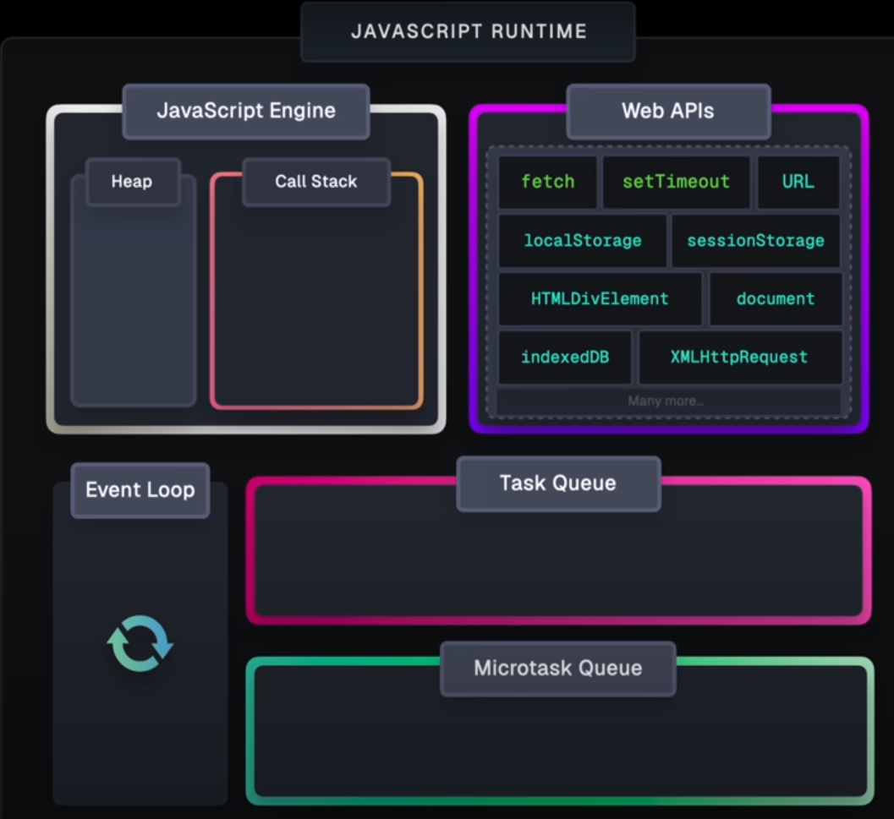

# Javascript basics

## JavaScript's Asynchronous Execution
- JavaScript is single-threaded, hence Syncronus. 
- However, to handle time-consuming operations without blocking the main thread, JavaScript uses an asynchronous event-driven model. 
- This model relies on `task queues` and the `event loop`.

**Task Queues**

JavaScript utilizes two primary task queues:

1.  **Macro Task Queue (Task Queue):**
    * Handles larger, long-running tasks.
    * Generally `Callbacks`
    * Examples:
        * `setTimeout` and `setInterval` callbacks.
        * I/O operations (file system, network requests).
        * Event handlers (e.g., `click`, `load`).
        * `requestAnimationFrame`
2.  **Micro Task Queue (Microtask Queue):**
    * Handles smaller, higher-priority tasks that need to be executed before the next macro task.
    - Generally `Promises` and its varients
    * Examples:
        * Promise `then`, `catch`, and `finally` callbacks.
        * `async/await` (the part of the function after the `await` keyword).
        * `queueMicrotask()` calls.
        * Mutation Observer callbacks.
        * .then
        * .catch
        * .finally
        * parts of function in async after await
        * queueMicrotask(()=>{...})
        * new MutationOberserver()

**The Event Loop**

The event loop is the core mechanism that manages asynchronous execution. It continuously monitors the call stack and the task queues:

1.  **Call Stack:**
    * JavaScript executes code from the call stack.
    * When the call stack is empty, the event loop proceeds.
2.  **Microtask Queue Priority:**
    * The event loop first checks the microtask queue.
    * If there are microtasks, it executes them one by one until the microtask queue is empty.
3.  **Macro Task Queue Execution:**
    * Once the microtask queue is empty, the event loop takes the oldest macro task from the macro task queue and moves it to the call stack for execution.
4.  **Repeat:**
    * The event loop repeats this process, continuously checking the call stack and task queues.

**Web APIs**

* Web APIs (provided by the browser or Node.js) handle asynchronous operations that are beyond the core JavaScript language.
* When a Web API operation completes (e.g., a network request), it places the resulting callback into the appropriate task queue (macro or micro task queue).
* Examples of web API's are `DOM manipulation`, `fetch`, `XMLHttpRequests`, and `timers`.

**Execution Flow**

1.  **Synchronous Code:**
    * JavaScript executes synchronous code directly on the call stack.
2.  **Asynchronous Operations:**
    * When an asynchronous operation is encountered (e.g., `setTimeout`, `fetch`, a Promise), it's handed off to a Web API.
    * The Web API processes the operation and places the callback into the appropriate task queue.
3.  **Event Loop Processing:**
    * The event loop manages the execution of tasks from the queues, ensuring that microtasks are processed before macro tasks.



## Promise
- A promise consist of 3 things
  1. PromiseState
  2. PromiseResult
  3. PromiseFullFilmentReaction

### Using Promise1
- Promise creation
  - It takes function as an argument
  - This function is called `executor` 
  - `Executor` function takes two arguments : `resolve`, `reject`

    ```js
    // Way 1
    const new_promise = new Promise((resolve, reject) => {})

    // Way 2
    function custom_function(resolve, reject){}
    const new_promise = new Promise(custom_function(resolve, reject))
    ```

- Executor Function
  - `Resolve` and `Reject` are two functions provided by `Promise` itself
  - Their sole purpose is to signal outcome of the asynchronous operation that the promise represents 

    ```js
    const myPromise = new Promise((resolve, reject) => {
      setTimeout(() => {
          const success = Math.random() > 0.5;

          if (success) {
            resolve("Data fetched successfully!"); // Signal success with data.
          } else {
            reject("Error: Data fetch failed."); // Signal failure with an error message.
          }
        }, 1000); 
    })
    ```
- `then/catch` in micro-queue
  - These are methods of promise function 
  - These are used to register callbacks 
    - That will be executed once promise is resolved or rejected
  - Both of these will take functions as input
  - Eg. 
    - `.then(onFulfilled, onRejected)`
      - onFulfilled is called if the promise resolves.
      - onRejected is called if the promise rejects.
    - `.catch(onRejected)`
      - A shorthand for `.then(null, onRejected)`, specifically for handling rejections.
  
  ```js
  // way 1
  myPromise
    .then((data) => {
      console.log("Success:", data);
    })
    .catch((error) => {
      console.error("Error:", error);
    });

  // way 2
  myPromise.then(
    (data) => {
      // onFulfilled (called if the promise resolves)
      console.log("Success:", data);
    },
    (error) => {
      // onRejected (called if the promise rejects)
      console.error("Error:", error);
    }
  );
  ```

## Async/Await
- `Async` 
  - keyword used before functions
  - It always returns a promise
- `Await` 
  - Keyword used inside async function only
  - Stops the code execution till the results come


  ```js
  // use 1
  const newPromise = async () =>{
    return "jey";  
  }
  newPromise().then((data)=>{console.log(data);})

  // use 2
  const fetchData = async () => {
    try {
      const response = await fetch("https://jsonplaceholder.typicode.com/todos/1");
      const data = await response.json();
      return data;
    } catch (error) {
      console.error("Error fetching data:", error);
      throw error; 
    }
  }
  fetchData()
    .then(data => console.log(data))
    .catch(error => console.log("caught by the caller", error));
    
  // use 3 : using then, catch in async function
    // here promises are executed one after another 
    // and are not executed parallely
  const processData = async () => {
    const firstData = await fetch("https://jsonplaceholder.typicode.com/todos/3")
      .then(res=>res.json());
    
    const secondData = await fetch("https://jsonplaceholder.typicode.com/todos/4")
      .then(res=>res.json());

    console.log("First data:", firstData);
    console.log("Second data:", secondData);
  }

  // use 4 : use Promise.all
  // here promises are executed parallely
  const processDataParallel = async () => {
    try {
      const [firstData, secondData] = await Promise.all([
        fetch("https://jsonplaceholder.typicode.com/todos/3")
          .then(res=>res.json()),
        fetch("https://jsonplaceholder.typicode.com/todos/4")
          .then(res=>res.json())
      ]);
      console.log("First data:", firstData);
      console.log("Second data:", secondData);
    } catch(error){
        console.error("Error processing data", error);
    }
  }
  processDataParallel();  
  ```
### Problem with array iteration
-
  ```js
  // here code will wait at each fruit
  // hecne promises are not executed parallely
  const smoothie = fruits.map(async v => {
    const emoji = await getFruit(v)
    log(emoji)
    return emoji
  });

  // for next two codes
  // loops are executed parallely
  const fruitLoop = async() => {
    for await (const emoji of smoothie) {
      log(emoji)
    }
  }
  const fruitLoop = async() => {
    if (await getFruit(fruitname) === "smoothie") {
      log(emoji)
    }
  }
  ```


