# OS
- Acts as in interface for managing resources
- Uses
    - Resource management (Memory, CPU ...)
    - DRY(Do not Repeat yourself)
        - Hardware management code needs to be written in the application if not written in OS
    - Isolation and protection

## Goals of OS
1. Max CPU utilization
2. No Process Starvation
    - If there is big job so other small jobs must not remain unattended
    - small memory need to assigned to them as well
3. High Priority Job

## Types of OS
- Single Processing OS
    - Single CPU
    - Limits
        - Max CPU utilization not occuring
        - Process Starvation will occur
        - Neither High priority Jobs will be executed
    - Eg. MS DOS
- Batch Processing OS
    - Single CPU
    - There exist an operator which is responsible for sorting similar jobs <br> and then passing it to CPU
    - eg. Bank statement
- Multi Programming OS
    - Single CPU
    - Jobs are in `ready queue`
    - If executing process goes to I/O then next process in the queue starts and the current process goes to waiting
    - ## Context Switching 
        - Say we are doing porcess switching btwn two process from P1 to P2
        - so current state of P1 will be stored in `PCB(process control block)`
            - PCB stores all process related info (Eg. Callstack, progress)
- Multi Tasking OS
    - Single CPU
    - `Context switching` is also used
    - Difference from Multi programming is
        - `Time sharing` occurs
    - A `Time Quantum` is defined as time for which a process will execute
    - Say it is set to 100ms so after 100ms `Context Switching` will occur
- Multi Processing OS
    - `Context Switchig` and `time sharing` occurs
    - Difference is it has more then one CPU (`Multiple CPU`)
- Distributed OS
    - Multiple CPU connected via internet
    - `Loosely coupled autonomous systems`
- RTOS - Real time OS
    - Very low error
    - High Computation power
    - Eg. Air traffic control, nuclear plane

### Multi Threading
- Process
    - program under execution
- Thread
    - Light weight process

- Multi tasking 
    - More then one process occuring at once
    - Time sharing, context switching yeti, yeti,yeti...
    - Isolation and memory protection

- Multi threading
    - Dividing single process into multiple small threads
    - Hence for multiple CPU it is advantageous
    - No isolation and no memory protection
    - Threads have priority 

- Context switching in thread is faster then for process
- In process while switching memory address base is changed
    - While in multi threading it is not done   
- In process swithcing cache is flused and in threading cache is flushed


# Components of OS
1. User Space - Apps run over here 
2. Kernel - Access to underlying hardware

## User Space
- No hardware access
- convinent environment for users
- GUI and CLI are over here
- User space interact with kernal
> GUI (Graphical user interface)

> CLI (Command line interface) 

## Kernel
> Shell is command line interpreter
- Interace with Hardware
- Four functions of kerne
- Process management
   - Process creation
   - Process termincation
   - Process and thread scheduling
   - Process exection
   - Process sync 
   - Process communication
      - Process are isolated but may need to communicate 
- Memory management
   - Memory allocation and deallocation
   - Free space management
      - When process ends or exits in between of execution so kernel must know where is free space 
      - Basically tracks free space
- File management
   - Create Process and delete files
   - Manage directory
      - Dir are stored in tree struct
- I/O management
   - Spooling : Temperory string data for use and execution
   - Buffering
   - Caching

## Types of kernel
1. Monolithic kernel
   - All 4 functions is done by 
   - all in one so fast communication between kernels 
      - Software interupt are used 
   - Hence kernel bulky
      - Hence less reliable (say management component dies so all components die as all are in one)
   - EG. linux, unix, MS/DOS
   - As all 4 functions are done over here so overhead(comunicaiton delay) is less
2. Micro Kernel
   - Only major functionalities are in kernel 
   - Other are implemented in user space
   - Adv - less bulky kernel, more reliable, more stable
   - Dis - There is impact on performance
      - So here there is switching between kernel and userspace so there is cost known as `overhead`
   - EG: L4 linux, Symbion OS
> how communication occur between User and kernel mode?
> IPC -> InterProcess communication 
>  - OS's process management part provide this functionality      
> - Methods of IPC
>  1. Shared memory
>   - A shared memeory is created which both process can access
>  2. Message passing
>   - OS provide system calls 
>   - <b>`Logical pipe`</b> is established between two processes

3. Hybrid kernel
- have advantage of both kernel monolithic and micro 
- Eg:
    - Userspace : will have file management
    - Kernel : Process, memory, I/O management 
- Hence overhead is reduced 
- Eg: Windows, MAC

> Other kernel nano and exo kernel

# System calls
- System calls are mechanisms using which an app can request for services which it does not have access to 
- System calls are implemented in `C`
- Interface between userspace and kernel is called `SCI (System Call Interface)`
- SCI is entry point for kernel space

> How apps interact with kernel 
> - Using system calls
 
> How to switch from kernel mode to user mode?
> - Using software interupt,
> - When we run something on userspace it calls software interupt and execute our task

> How a task in given in userspace occur
> - First according to the task commands are given to kernel 
> - now mode is switched to kernal mode
> - In kernel mode the task is executed 
> - Then again the mode is switched to userspace and the output is displayed 

- Category of system call
    1. Process control
    2. File management
    3. Device management
    4. Information manitainance 
    5. Communication Management : Eg. pipe creation, management,<br>LAN, data transfer, attach remove device yeti, yeti...

 
# How OS boots up
1. Power is supplied to all the microcontroller, microprocessor etc
2. CPU loads BIOS or UEFI 
    - BIOS (Basic input output system) 
    - UEFI (Unified Extensible Firmware Interface)
    - Earlier BIOS was used 
    - UEFI is more advanced then UEFI
3. BIOS or UEFI run tests to initialize hardware
    - Loads Some setting from memory area
    - This memory area is backed by another power source known as CMOS battery 
    - The program in this memory area loads some settings
    - This programs have set of instructions which perfrom POST
    - POST (Power On Self Test)
4. BIOS or UEFI hands off to boot device
    - Boot device a.k.a boot loader
    - Now the control is handed off to OS
    - Bootloader can be SSD, HDD, CD, USB etc.
    - Locations of boot loader
    1. MBR - Master Boot Record
        - Present at disk's 0th index
        - Used is old system
        - Mostly in system with BIOS
    2. EFI - Extensible firmware interface
    - Partition in disk which has boot loader
5. Bootloader Loads OS
    - From here bootloader takes command
    - Windows : bootmgr.exe
    - Mac : boot.efi
    - Linux : GRUB
 
# 64 vs 32 bit OS
- Register : it can be 32 bit or 64 bit
- CPU has registers which can be 32 bit or 64 bit
- So say 32bit means 2^32 addresses : 4 GB data 
 - Hence can only accomodate 4 GB RAM
- Hence 64-bit system was created
- Say I have to add two 64bit integer in 32bit system so it will take two `cycles` 
 - It will divide 64bit number into two 32bit number and add them
- But a 64 bit system can do it at once
- Advanges of 64bit
    - `Addressable spaces` 
    - resource usage : 32 bit only support 4GB RAM 
    - Performance : Calculations : Fast in 64 bit : Coz can process huge chunk of data
    - Compatibility : 64 bit can run both 32bit and 64bit OS| 32bit cannot run 64bit OS
    - Better performance 

# Different storages in PC
1. Primary Memory : 
    1. Register (closest to CPU)
    2. Cache (stores temperory repeatedly used memory and provide easy fetching as close to CPU)
    3. Main Memory (RAM)
2. Secoundary memory : Stores data not active data eg stoted in SSD HDD
    1. Electronic disk ()
    2. Magnetic disk
    3. Optical Disk
    4. Magnetic tape 
## Comparing of storage
1. Cost
    - Register 
        - Most Costly
        - need best performance hence made of costly materials
    - Cache
        - Less costly then Register but more costly then main memory
    - Main memory
        - Less costly then Cache but more costly then seconundary memory
2. Accessability speed
    - Register being fastest > Cache > Main Memory > Secoundary Memory
3. Size
    - Secoundary Memory > Main Memory > Cache > Register
4. Volatilability
    - Data in primary memory is flushed and that in secounday memory remains
 
# How OS create PROCESS
## Process
- `Process : Program Under Execution` 
- We write code and store it in a file say we stored it in file with CPP extension
- Then a compiler compiles the code
- Hence now it becomes executable
- This executable is called a program
- Now when we try to run program 
- OS convert program to process
- `Process : Program Under Execution` 
- Unit of work done by PC

## Process Creation by OS
1. Load program and static data to memory
2. Allocate runtime stack
3. Allocate Heap : Part of memory used for dynamic allocation say in int is created in for loop and then that int is deallocated
4. IO task : Input handle / Output handle / Error Handle
5. `OS` handoff control to `main`

# Process architecture

<center>

> | Stack | 
> | --- |
> | heap |
> | data |
> | text | 

</center>

- Text : compiled code
- data : global and static data
- Heap : dynamiccally allocated memory
- heap and stack at the start and far away(dosent make sense?)

## Error that can occur while execution
- Stack overflow
- Out of memory

# Attribute of process
- Say OS has list of process to execute p1,p2 ... pn
- They are stored in `Process Table`
- Each entry in pocess table is a `PCB (Process Control Block)`

## PCB

<center>

> | PCB |
> |:---:|
> | Prcess ID |
> | Program Counter | 
> | Process State | 
> | Priority | 
> | Register | 
> | Open File list | 
> | Open device List | 

</center>

- Process ID : Unique for every ID
- Program counter : A process has list of instructions 
    - To execute each instruction on after another a counter is maintained
    - This counter is incremented as each instruction completes
- Process State : New, Wait, Run yeti...
- Priority : High low priority jobs
- Register : Stored the current CPU registers state
- Open file list : the list of files to be used while exectution of the file
- Open device list : ...
 

# Process state
- Process lifecycle : From generation to termination
1. New State : When program is begin converted to process 
2. Ready State : Process is created and is been brought to memory 
    - Process is in ready queue
    - It can be executed 
3. Running State : CPU is allocated 
4. Waiting State : waiting for I/O
5. Terminated State : Process execution is finished
## 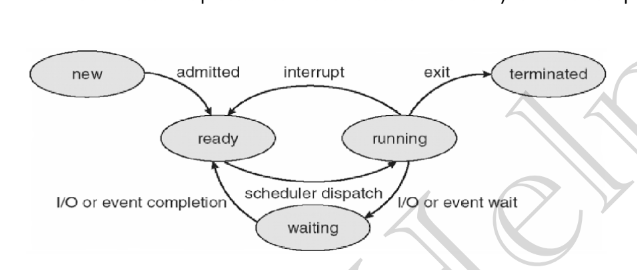

# Scheduler
- Job Queue : All the process in new state   
1. Job Scheduler (LTS :Long Term Scheduler)
    - admited jobs from disk to ready state (Disk - New State - Ready Queue)
2. CPU Scheduler (STS :Short Term Scheduler) (Process Scheduling): Ready Queue to Running state
- STS runs at highest rate and LTS runs at slower rate
- Degree of multi programming : Number of process in ready queue 
# MTS (Meduim Term Scheduler)
- Say the process in my ready queue have taken nearly all storage allocated to ready queue
- In this case next process are added to a `swaping space` in `secoundary storage`
- When the ready queue is ready to take on more process these process are added 
- This scheduling is done my MTS
- `Removing` process from ready queue is called `swap-out`
- `Adding process` back from swaping space is called `swap-in`

# Context Switching
- Say in the ready queue a high proirity process came so after current time quanta is ended so current process is saved and the high priority job is added to execution
- `This is done by Kernel`
- It is pure overhead

# Orphan Process
- Process whose parent exited or died while child was still is running 
- So the child process becomes orphan process
- To handle the main process of OS which is init and has pid 1 is made parent of orphan process

# Zombie process
- A process whose execution is completed but it is stil in `process table`
- Normally when child process gives exited output but the parent process has still not read it
- Parent has not read it because it has imposed wait time and child exited before 
- Once the wait over the process is removed from the process table this is called `reaping`
> Reaping? Zombie Process?

# Process Scheduling
- Types of scheduling : Non preempting / preempting
- Non preempting
    - Here when process get CPU it will stop when either it terminate or it goes to wait state for I/O
    - `Time sharing does not occur`
- Preempting
    - Process frees the CPU when process terminates or process goes for I/O 
    - Process also frees CPU when the time quanta ends
    - `Time sharing occurs` 
- Starvation : Happens more in non-preempting scheduling
- CPU utilization : Preempting utilizes more CPU
- Overhead : More in Preempting (Extra overhead on end of each time quanta )

# Goals of CPU scheduling algo
- Max CPU utilization
- Minimum Turn Around Time(TAT)`?`
    - Exit time - Time when it entered ready queue
- Minimum wait time : Process gets CPU ASAP
- Minimum Response time : Process entered ready queue - First time process gets CPU
- Maximum ThroughPut : Max process completed per unit time

## Other Terminology
| | |
|---|---|
| `Throughput`| No. of processes completed per unit time. |
| `Arrival time (AT)`| Time when process is arrived at the ready queue. |
| `Burst time (BT)`| The time required by time process for its execution. |
| `Turnaround time (TAT)`| Time taken from first time process enters ready state till it terminates. (CT-AT) |
| `Wait time (WT)`| Time process spends waiting for CPU. (WT = TAT-BT) |
| `Response time`| Time duration between process getting into ready queue and process getting CPU for the first time. |
| `Completion Time (CT)`| Time taken till process gets terminated. |

## Scheduling algo
- FCFS (First Come First Serve)
    - The process that comes first to ready queue then it is sent to CPU
    - <b>`Convoy Effect`</b> : If a process with higher BT comes first so other process have to wait for long before execution
    - This effect is called convoy effect
    - But if this process with higher BT comes at end so the average waiting time for all process will be less 


# Job scheduling algo
1. Shortest Job First(SJF) (Non preemptive)
    - CPU estimates BT using heruistic algo (i.e. It finds extimate which may not be correct)
    - Process with smallest BT executes first and then CPU waits for the job to complete then schedules next job with smallest BT.
    - say a job with small estimate BT is going to execution but in actual it has very big BT hence convoy effect occurs
    - Due to this process starvation may occur
2. Shortest Job First(SJF) (Preemptive)
    - After every time quanta Schedular checks if process with low BT exist if yes so current job is preempted and low BT job is executed
    - No Convoy effect, Little starvation
    - High overhead may exist
3. Priority Scheduling (Non preemptive)
    - Sets job with highest priority job to execution and waits for it to finish
    - Then sets next highest priority job to execution
4. Priority Scheduling (Preemptive)
    - Priority Scheduling with checking of high priority job at each time quanta
    - Lowest priority not executed job will starve forever
    41. Aging solution
        - Gradually increase priority of all the jobs in the ready queue 
5. Round Robin Scheduling 
    - like FCFS but preemptive
    - Criteria : AT + Time quanta
    - First process executed for a time quanta then it is send to ready queue
    - If process to be executed has BT less then Time Quanta then execute till end
    - After execution if process is terminated then set it to terminated and remove it from ready queue
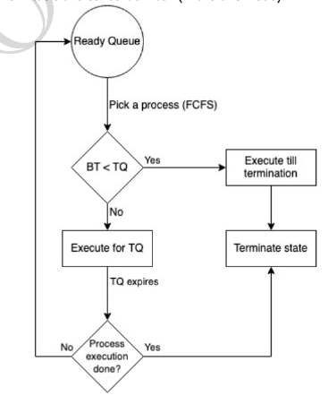

> These all algo are not used directly these are used in optimized way

1. Multi Level Queue scheduling
    - There exist 3 Queues 
        1. System Process : Createed by OS
        2. Interactive process : I/O Process or User Process
        3. Batch process : Process that occur in backgorund and require no I/O
    - System process has highest priority followed by Interactive process and Batch process at end
    - Each queue can have its different Scheduling algo
    - Problem only after all process from top queue is ended then next queue can be scheduled
    - This can cause convoy effect  
2. Multi Level Feedback Queue Scheduling
    - Multiple sub queues are present
    - Processes are alloweded to move between queues
    - Process with higher BT are moved down to lower priority sub queue
    - Process with I/O are moved to higher priority sub queue
    - Aging is also done: If process have to wait in lower priority queue for long so it is moved to higher priority queue
    - Each queue can have its own scheduling algo
    - It is flexible
 
# Threads
## Concurrency
- Execution of multiple instructions at once 
- Can be achieved in OS using threads

## What are threads
- light weight executable processes
- Independent path of execution? yes (within a program thread has a seperate execution path)
## Threads scheduling
- Threads also have priority 
- They are executed based on priority by OS
## Context switching in threads
- Context switching is faster as memory address space is not swaped
- Also cache is not flushed here
## Thread and CPU access
- Threads have TCB(Thread Control Board)
- So each TCB has program counter 
## Single CPU v/s multi core CPU
- Single CPU cant give advantage of multi threading 
- Two threads would perform context switching and both wont be running simuntaniously 
- Hence only multi core would give multi threading advantage     

# Critical Section Problem Threads
- Critical Section : When two or more threads access same resource
- Race Condition : When two or more threads try to change data of same shared resource at same time 
 - Say two threads try to increase an integer by one so it should be increased by 2 idealy but in real it may be only incremented by one
## Solution to race condition
- Atomic operation : A shared resource can only be fetched by one CPU at a time
- Mutual exclusion : While one process has taken access of a resource so it locks that resource to itself and no one else can use it
- Semaphores
> This mutual exclusion can cause indefinate waiting
> - Say a thread dies in between without unlocking the resource
## .
> Can single flag solve race condition?
> - Single flag soltion:
>   -  Assign 1 flag to a resource if flag is false so resource can be accesses or else it cannot be accessed
>   - If a progess holding flag dies so resource can never be accessed
>   - Also deadlocks can occur
> - No, `Progress` cant be achieved
> - `Progress` -> any thread can access shared resource without any order
> Use example to understand

## Peterson's solution
- Can be an ideal solution for two threads

## Mutex/Locks
- Problem 
    1. Contention : If one thread lock resource and die in between so that resource will be locked forever
    2. Deadlock : Say thread 1 has locked resource 1 and wants to access resource 2 and is waiting for it to be released and thread 2 has locked resource 2 and is waiting for resource 1 to be unlocked
    3. Difficult debuggin
    4. Starvation of high priority thread

## Conditional Variable solution
- Waits for signal
    - Say a thread is using `Critial Section (C S)` 
    - Has two methods : `wait` & `signal`
    - While waiting I dont waste CPU cycles
    - Say T1 has wait, so it will wait on conditional wait 
        - Now T2 uses Critial Section and when T2 sends signal so T1 will use the Critial Section(CS)

## Semaphores
- Say I have multiple instances of a resource which is under Critial Section
- So multiple threads can access the CS
- In Mutex and Locks only one thread can access a resouce at a time
- Here say we have `n` instances 
- So if say n+m threads wants to access the resource so first n threads will work as one thread complete its will signal for other
- Working of semaphores
    - Say there a resource which has `wait` and `signal`
    - Now 3 threads approch 
        - Say 1st thread takes resource
        - So other threads cant take resource 
        - So other threads will wait on `wait flag`
        - When resource will be free then signal will be send then other thread can access reource
    - If a process exits without releasing resource so signal will go to zero and will free the reosurce
        - This is possible beacuse signal has a value which constantly decreses and if a thread is accesing resource then that thread increases the value of signal so it wont go to zero and other thread can access resource 
    ```python
    # Three Threads can access the resource
    # or Shared resource has 3 instances
    sem = Semaphore(3) 
    def Task(name):
        sem.aquire() # one thread has aquired resource
        # Do something
        sem.release()# after work is done CS is released and other thread can access the resource

    if __name__ == '__main__':
    t1 = Thread(target=task, args=('Thread-1',))
    t2 = Thread (target=task, args=('Thread-2',))
    t3 = Thread (target=task, args=('Thread-3',))
    t4 = Thread (target=task, args=('Thread-4',))
    t5 = Thread (target=task, args=('Thread-5',))

    t1.start()
    t2.start()
    t3.start()
    t4.start()
    t5.start()
    t1.join()
    t2.join()
    t3.join()
    t4.join()
    t5.join()
    ```

    ```shell
    task1 # running 
    task2 # running with task 1 in parallel
    . # as one of them is over 3rd task takes over 
    task3
    task1
    .
    .
    .
    ```

# Producer consumer Problem (Bounded Buffer Problem)
## Problem Statement
- Say a buffer exist of finite length
- And producer fills the buffer and consumers uses the buffer
- So here if consumer access the buffer which producer is filling<br> or vice-verse so it will be problem
- If buffer is full and producer is trying to fill the buffer so it will casue problem
- If buffer is empty and consumer access the buffer so it will be a problem

## Solution
### Producer
```cpp
do{
    wait(empty); // if buffer is not full i.e emtpy > 0

    wait(mutex); // will lock critical seciton

    // now the memory address is updated or say producer fill the buffer

    signal(mutex);// will release the mutex/lock 
    signal(full);// send a signal that buffer is not empty and data can be accesses as of now
}while(1)

```
### Consumer
```cpp
do{
    wait(full); // if the buffer is not empty i.e full > 0

    wait(mutex); // lock critcal seciton

    // update memory address as required

    signal(mutex); // release mutex/lock
    signal(empty); // send signal that buffer is not full and data can be added if wanted 
}
```

# Reader writer problem

## Problem statement
- Say a reader is reading and a writer is writing so reader will not get the data which writer is writing at this time quanta
- So the aim is while multiple reader can read when no writer is writing 
- But only one writer can write when no other writer is writing or no reader is reading

## Solution
### Writer
```cpp
do{
    // ensuring no other reader is reading or no other writer is writing
    // locking cirtical section 
    wait(wrt);
    // update memory
    signal(wrt);

}while(1)

```

### Reader
```cpp
do{
    wait(mutex); //mutex to update variable 'num_of_reader'
    num_of_reader++;
    if(num_of_reader == 1)
        // if writer is writitng so dont access the address
        // else lock the critical section
        // do this only when first reader starts reading for all other reader it will be already locked from writer
        wait(wrt); 
    
    signal(mutex); // 'num_of_reader' is now released

    // reading operations of Critical section

    wait(mutex); // lock 'num_of_reader' as current reader is leaving
    num_of_reader--;

    if(num_of_reader == 0) 
        signal(wrt);// if no reader is reading so writer can write
    
    signal(mutex);// reader leaves releasing 'num_of_reader' variable

}while(1)
```

# Dining Philosopher problem
## Problem statement
- Say there are 5 philosopher sitting on a round table
- and there are 5 forks which they can use for eating 
- At a time a philosopher is either thinking or eating 
- For eating a philosopher needs to have two forks on its left and right
 <center>  </center>

- Say every philosopher takes a spoon on its left, locks it and tries to pick spoon on its right but it not available as other philosopher on his right has locked the spoon so this an inifinite loop and condition is called `dead lock`

## Solution 1
- Remove 1 philosopher
- Say we remove 5th philosopher so 1st philosopher will be able to take both spoon eat and then release fork so second philosopher can take spoon and so on
## Solution 2
- Add mutex/lock while picking both fork
- ```cpp
    do{
        // lock picking so no one except currnet philosopher can pick
        wait(picking);

        wait(fork[i]);
        wait(fork[(i+1)%5]);

        // current philosopher has picked fork now other can pick
        signal(picking);

        // eat

        // release the current picked fork
        signal(fork[i]);
        signal(fork[(i+1)%5]);

        //think

    }while(1)
    ```

## Solution 3
- All odd numbered philosopher will pick left fork first and then right fork 
- All even numbered philosopher will pick right fork first and then left fork 
- ```cpp
    do{
        // ph_id = philosopher's id

        if(ph_id%2)// if odd id philosopher
        {
            wait(fork[i]);// try locking left fork first 
            wait(fork[(i+1)%5]);
        } 
        else// if odd id philosopher
        {
            wait(fork[(i+1)%5]);// try locking right fork first
            wait(fork[i]);        
        } 

        // eat

        // release fork
        signal(fork[i]);
        signal(fork[(i+1)%5]);

        // think    
    }while(1)
    ```

# DeadLock
- When a process say `P` request for a resource `R` but it is not available so `P` will enter waiting state
- sometimes it happens that `R` is not available forever or `R` is busy forever 
- This condition is called deadlock

> ## How a process utilise a reource
> - Request -> Use -> Release
> - A process request a resource if resource is not locked so current process
>  will lock the resource and once process has used the resoure it unlockes it 

## Condition for dead lock
1. Mutual exclusion : At a time only one process can use a resource
2. Hold and wait : A process must be holding atleast one resource and should be waiting for another resource
3. Non preemptibe resource : If a process holds a resource then no other process can access that resource untill the process holding the resource releases it
4. Cicular wait : say P1 process is waiting for some P2 process to release resource and P2 is waiting for some P3 process to release some resource .... say some Pn process is waiting for P1 process to release some resource this is called circular wait

## Finding deadlocks : Resource Allocation Graph(RAG)
- Nomenclature
    - Vetrex : 
        1. Process Vertex(P1,P2,...)
        2. Resource Vertex (R1,R2,R3...)
    - Edge : 
        1. Assigned (Points from Resource to Process)
        2. Requested (Points from Process to Resource)
    - Resource with multiple instances is represented by dots

 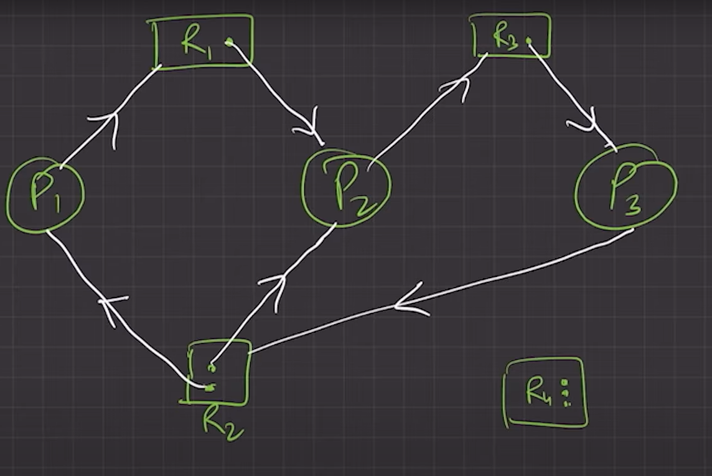

<center>

> ### If there is no cycle in RAG so no deadlock

> ### Else if cycle may exist so there may be a deadlock not necessary


| Deadlock exist | Deadlock dont exist |
|---|---|
| |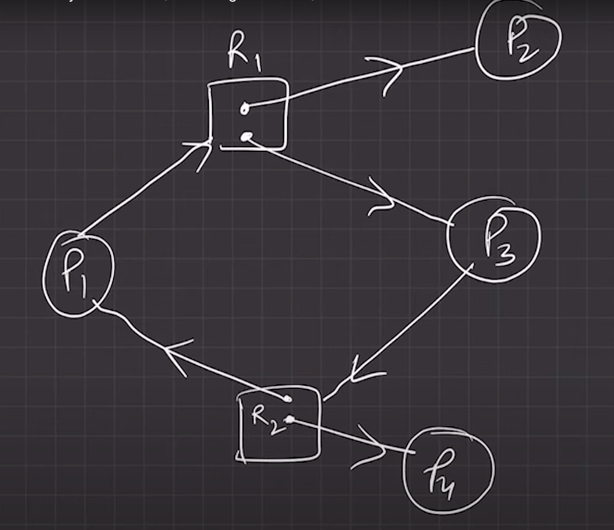 |

</center>

## Handling Deadlocks
1. Prevent or Avoid deadlock
2. Allow system to go to deadlock then detect deadlock and recover
3. Ostrich algorithm : Ignore Deadlock (Assume the app/software developer will handle deadlock and OS wont handle deadlock)

## Preventing or Avoiding deadlocks
- If one of 4 deadlock conditions are not satisfied so deadlocks wont happen
1. Mutual exclusion 
    - Allow mutual sharing wereever possible
    - Except for non-sharable resourse it can applied
    - Eg. For read only files there is no need of mutual exclusion
2. Hold and Wait
    - When a process holds a resource it ensures that it is holding no other resourcee
    1. Protocal A : Pre allocating all the resource before proceeding
        - This can decrease CPU max utilisation
    2. Protocal B : Allow process to request a resoruce when it holding none
    - Eg : Process P : copy data from I/O device to a file then print file after I/O is done
    - If we go by Processs A : P process will aquire I/O device, file, printer all at once
    - If we go by process B : P will aquire I/O first copy data then release both then again request file and printer resource
3. Non Preemption
    1. If a process P1 has some resoruces R1,R2,R3 aquired and wants to access other resource say R4 which are already allocated to other process P2, so P1 will release all resource untill it can access all resoruce at once
    2. If process P1 wants resource R1 but it is aquried by process P2, now if P2 is waiting for some other resource so P2 will preempt resource R1 and then P1 can access R1
4. Circular Wait
    - Order Resources to be allocated 
    - If a resource R1,R2 exist so order their picking preference 
    - Say R1's preference > R2's preference
    - and say P1 and P2 both want R1 and R2
    - So both will aim for R1 then one which gets R1 can go for R2 and other will wait for R1 itself

# Deadlock Avoidance
- System will have following information
    - Number of processes
    - Number of resources required for each process
    - Currently allocated reosurces to each process
    - Max amount of each process
- Safe state : if with this info we can schedule process such that there is no deadlock then system is in Safe State  
## Banker's algo
- Used to plan processes to avoid DL


# Deadlock detection
- At fix interval of time system checks for deadlock's existance
    - If there exist a deadlock so system tries to recover from it 
## For `single instance` of all resource
### `Wait-for graph method`
    
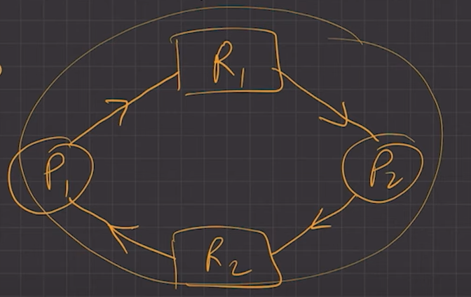 
    
### Convert above graph to below   
    
 

## For Resource with multiple instances
- Use banker's algo
- If we cannot attain safe state so deadlock will exist

# Revocery from deadlock
1. Process Termination
    - Terminate all process with DL
    - Terminate one process at a time and check for DL
2. Resource Preemption
    - Successively preempt resources till DL is not broken


# Memory Management
- Logical address space (`Virtual Address Space`<font size="4">` (VAS))`</font> 
    - Say a process wants is alloted 16KB of space so inside the process it will access address from 0KB to 16KB this is `logical or virtial address space`
    - But in RAM the address space will be different 
    - Say in RAM process is alloted memory space from 153KB to 153+16KB so OS will work as a layer and when prcess asks for any address space which is alloted to it say 2nd KB so OS will return him 153+2 th space 
    - This will help in process isolation and protection
- Physical address
    - In the above example the memory space in RAM was from 153rd KB so this is physical address
## How OS(MMU) does allocate memory 
- MMU(Memory Management Unit) : Responsible for mapping from Logical Address to Physical Address
- `Reallocation Register` : In the above example MMU will store a `base(B)` for process(153rd kB) this is stored in Reallocation Register
    - This will be the starting of the allocated memory
- `limit Register` : Other thing MMU will store is `Offset(O)` 2KB in limit Register

<center>

> ## Address Translation done by MMU <br>
> 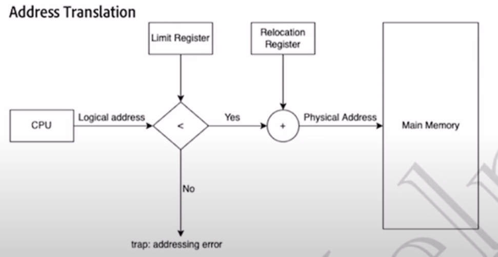

</center>

<br>
<br>


# Allocation Method on physical memory

1. Contigious allocation
2. Non-Contigious allocation

## Contigious Allocation
- Each process is contained in a single memory block
- Two types of Contigious memory allocation
    1. Fixed Partitioning 
    2. Dynamic Partitioning

    ### Fixed Partitioning
    - Memory is divided into fixed sized partitions
    - Limitation 
        - Internal Fragmentation : Say partition size of 4KB and two process request 3KB of space. So 1KB of space is unused and non-allotable. This is internal framentation
        - External Fragmentation : Say There are multiple internal fragments of unused space are created and it sums up to 10KB, now a process comes and asks for 7KB of space. Technically RAM has 10KB of space free but it cannot allot it hence it is called External framentation
        - Process of size greater then partition size is not allowed
        - Less multiprogramming : Less number of process will be available due to fixed partition size
    
    ### Dynamic partitoning
    - Here partition size is determined at the time of process allocation
    - Advantage :
        - No internal framentation
        - No limit on size of process
        - Better level of multiprogramming
    - Limitation :
        - External Fragmentation

<center>


</center>

# Free Space management
- Say 5 process are in the RAM P1,P2,P3,P4,P5
- Now process P2, P4 exit
- So OS will store the new free space in the form of linked list and merge two nodes of linked list if they are continous.

## Defragmentation and Compaction
- Dynamic Partitioning suffers from external fragmenatation
- To solve this all the free spaces are brought together and all the loaded partitons are brought together
- This is called defragmentation
- But performing defragmentation will also give overhead and reduce the efficiency of system

## Free Space allocation
- Say a new process is to be allocated some memory so which part of memory from the listed list of free spaces will be alloted
    1. First Fit
        - Allocate the first free hole or first big enough free space available 
        - Fast/ Less time complexity
        - Simple and easy to implement
    2. Next Fit
        - Same as First Fit but here search will start from last allocated hole
    3. Best fit
        - Will find the smallest big enough hole or free space to fit in
        - Less internal fragmentation
        - Slow
        - May create small holes that can cause major external fragmenation
    4. Worst Fit
        - Finds the largest big enough hole or free space to allot to a process
        - Slow
        - Leaves larger fragments of space that can accomodate other porcesses
        - Less external fragmenation

# Non Contigious memory allocation

## Paging

- Process as well as memory is divided into partitions 
- For `process` each partition is called `page` 
- For `memeory` each partition is called `frame`
- The `page size` should be equal to `frame size`
- Each page is mapped to a frame for a process and it is stored in `Page Table`
- Example of Page Table for a process
<center>

| Logical Page Number | Physical Frame Number |
| --- | --- |
| Page no. 1 | Frame No. 8 |
| Page no. 2 | Frame No. 13 |
| Page no. 3 | Frame No. 43 |
| Page no. 4 | Frame No. 2 |
  
</center>

## Address Translation

- Say page size is `32bits` and the process size is 128 bits
- So page size is 4 pages(2^`2`) and 2^`5` are there
- Hence `7 bits` in total are required to uniquely identify the process
- `2 bits` for page number and `5 bits` for offset 
- say I want `98th` bit so it will be 96 + 2 or 32*`3` + `2` or `11`-`00010`
- Now from memory address to physical address we just need to map `3` or `11` to the physical space or frame number and the offset will be same as frame size will be same  

> Page table is stored in main memory and its `base address` is stored in `PCB`

> OS has `PTBR(Page Table Base Register)` which points to current page table and when context switching occurs only this `PTBR` changes 


> ### Paging is slow and has a overhead : Say a process want to access a data to it will go to memory to ask for address and then it can access the memory

## Translation Look Aside Buffer (TLB) (`Cache`)
- It is a hardware support to speed up the paging process
- Hardware Cache
- TLB has key value pairs

<center>

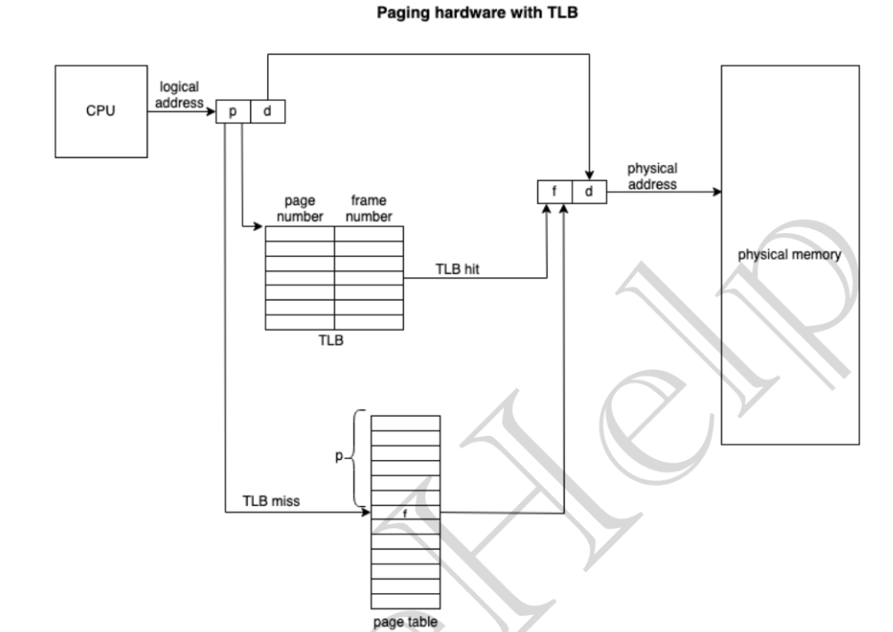

</center>

- Here P D block is the page number, offset 
- First the MMU tries to find the page number in TLB 
    - If it finds the page number then it a hit and will return the frame number 
    - If it does not find the page number in TLB then it will check in page number table and find the corrosponding frame number

>  Now say initially there exited process 0 P0 whose page 3 pointed to some frame number say F10 now say P0 left and P1 came and it also request for page 3 so from the TLB it will return F10 which will violate memory isolation and protection

> To solve this we can 
> - Clear the TLB but it will have overhead and will now be able to serve to purpose of improving the performance
> - Add `ASID (Address Space Identifier)` to uniquely identify each process is now say P1 tries to access page 3 it will get miss as its ASID wont match.


## Problem with paging

1. External Fragmentation
2. Say I have fixed page size of 4KB and a process having a function of size 8KB so the function will divided into two parts and it will look like 
<center>

| |
|-|
|OS|
| other process | 
| `Function Part 1` | 
| other process | 
| other process | 
| other process | 
| `Function Part 2` | 
| other process | 
| other process | 

</center>

2. So each time the function runs it will have call MMU two time for two parts of function 

## Solution 

### Segmentation
- A process divides itself into small segments of different size 
- And for translation from MMU it uses segment offset form
- Segment contain corrosponding base address to main memory   

<center>
|||
|-|-|
| Segment | Offset |

</center>

### Segmentation hardware

<center>

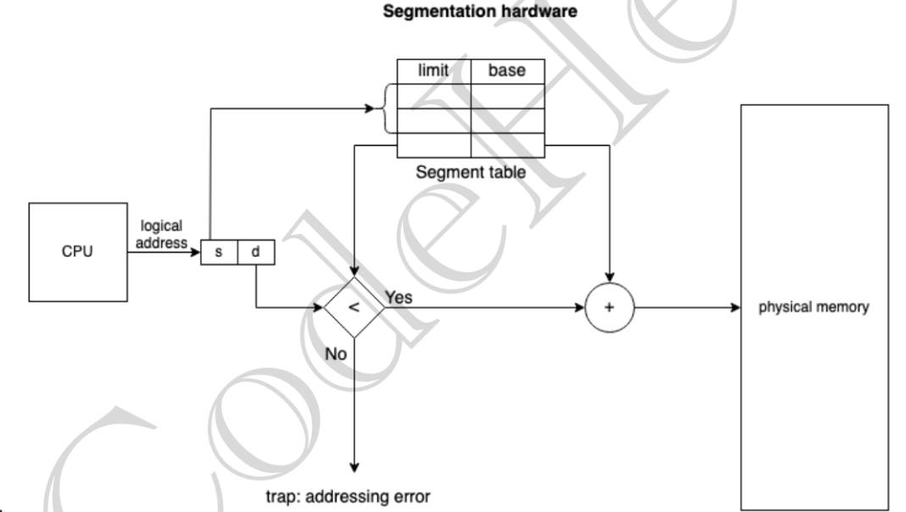

</center>

- The segment table has two columns 
    1. The limit column gives limit of segment
    2. Base gives base address
- When a request(logical address) comes offset is checked with the limit of segment

### Advantages
- No internal framentation
- One segment is alloted contigiously hence more efficient 
- Generally Segmnet take takes less memory to store then page table

### Disadvantage
- External Fragmenation
- Different size of segment is not at time of swapping

> Modern systems have hybrid of Paging and Segmentation

<center>

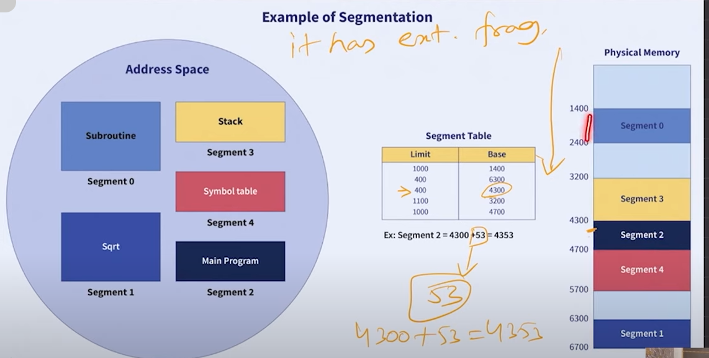

</center>
<br>
<br>

# Virtual Memory Management
- If entire memory required by a process is loaded into Memory so number of process that can be executed will be less
- Say P1,P2,P3 three process each with 5KB memory needs to be loaded and 12KB of RAM exist
- So only two process at once can be loaded
- To solve this only the part of memory that is required by process at current time is loaded and rest exist in `Swap space`
- `Swap space` is fixed space alloted to OS in secondary memory which no process can access
- When the process request of memory not loaded in primary memory that memory is `paged in` from secoundary memory to primary memory
- <b> Advantage </b> : 
    - Program larger then physical memory can be loaded
    - CPU utilisation and throughput is increased

> RAM + SWAP SPACE = VIRTUAL MEMORY

## Demand Paging
- Popular Virtual Memory Management technique
- Least used pages are stored in secondary memory
- When userspace asks for a page not in primary memory, `page fault` occurs
- `Page fault` (<b>`Interupt`</b>) : To add page to primary memory there are various `page replacement algorithms` used
- Rather then swaping in entire process <b>`Lazy Swapper`</b> swaps in page when needed 
- This avoids reading unnecessary memory and reduce OS's swapin time 
- `Valid-Invalid` scheme in page table is used to check if the page is available to is to be loaded
    - Valid-invalid `1` : associated page is `legal` and is in `memory` 
    - Valid-invalid `0` : Either bit in invalid or is in the swap space

<center>

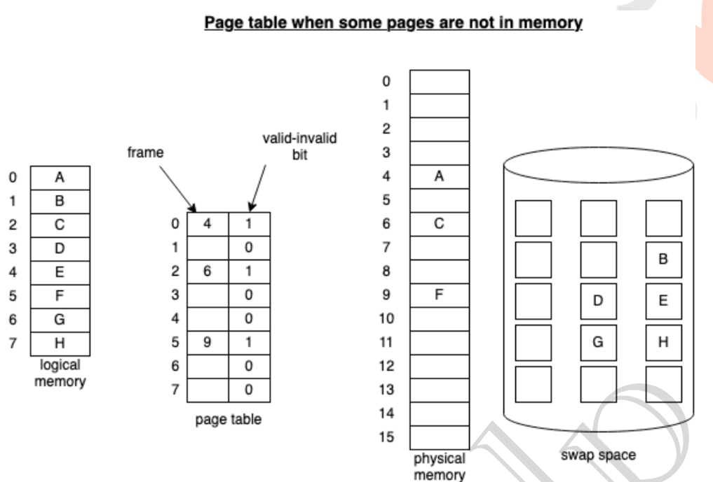

</center>

### Handling Page Fault

- First process request for a memory address
- It OS checks with internal table in PCB that if the reference is correct or not
- If the reference is valid then it checks `Valid-Invalid table`
- If it is `0` then process will throw exception `page fault`
- Is the reference is valid OS will now get a `Free Frame` to store memory from `swap space`
- Then the memory brought form swap space is stored in primary memory
- This frame address is then returned to page table to store it corrospoding the page address and the Valid-Invalid bit is changed to 1
- <center> 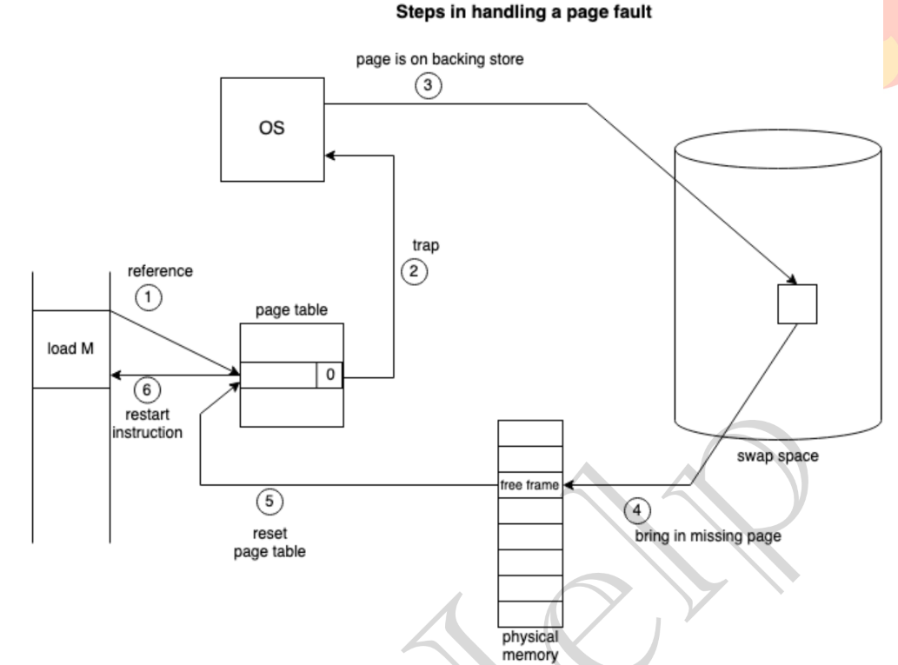  </center>

    ### Pure Page Demanding
    - In worst case OS starts process execution with no memory 
    - Whenever a memory is required then swap in occurs
    > This gives huge overhead
    ### Locality of referencing
    - Brings resonable number of pages on start of the process

- Advantages : 
    - Degree of multiprogramming increase
    - User can run program with memory larger then physical memory
- Disadvantage
    - Sawping can bring overhead
    - `Thrashing` may occur

# Page replacement Algorithm
- `Page Fault Service Time` : Time taken to remove a page from primary memory and add another page to the memory
1. FIFO 
    - Replace last page with first page
    - Bad performance 
        - High number of page faults will be called
        - Good candidate may be replaced
            - This removal of good candidate may cause more number of page faults in future
    - `Belady's anomaly`
        - Ideally With increase in number of frames availabe to the process then number of page faults called should be decreased 
        - But there may be cases where reverse may happen
2. Optimal Page replacement
    - Ideally best algo 
    - Not practically implementable
    - Removes Page which will have least occurance in the future
    - This can be used as refrence to check the preformance of other algos
3. LRU
    - Best practically implemntable algo

# Thrashing
- Say there are two situtations
- Pi_j = Process i page j

|Situation 1 | Situation 2 |
|-|-|
|Process 1 page 1 | Process 1 page 1 | 
|Process 1 page 2 | Process 2 page 1 |  
|Process 1 page 3 | Process 3 page 1 |  
|Process 2 page 1 | Process 4 page 1 |  
|Process 2 page 2 | Process 5 page 1 |  
|Process 3 page 1 | Process 6 page 1 |  
|Process 3 page 2 | Process 7 page 1 | 
|RAM|RAM| 

- Here Situation 2 will get more number of page faults compared to Situation 1
- Though Siutaiton 2 will have higher degree of multiprogramming then situation 1 
    - But Situation 2 will be slower due to Page Fault service time
- This high paging activity is called thrashing
- System is called under threshing when it is spending more time under paging then execution
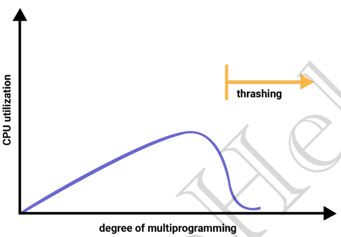

### Solving Threshing
1. Working set model (Similar to segmentation)
    - This is based on <b>`Locality`</b> Model
    - At a time entire localilty (Segment for refernce) is loaded 
    - Instead of loading half function now and half by paging entire is loaded at a time
2. Page Fault Frequency
    - Threshing occurs when page fault rate is high 
    - So the OS control Page Fault rate(pf-rate)
    - If pf-rate is high then some process are swaped out and more frames are alloted to other existing process
    - If the pf-rate is low the Medium Term Schedular loads few more process and increase degree of multiprogramming

# C++ implementation mutex, semaphores, condition_variables
- ### Mutex methods 
    - lock : lock mutex if available or else waits on mutex if not available 
    - unlock : unlocks mutex
    - try_lock : tries to lock mutex if not available then continue
    ```c++
    #include <bits/stdc++.h>
    #include <thread>
    #include <mutex>

    std::mutex m;

    void print1(){
        m.lock();
        for(int i = 0;i<10;i++){
            std::cout<<"print 1 : "<<i<<std::endl;
        }
        m.unlock();
    }
    void print2(){
        m.lock();
        for(int i = 0;i<10;i++){
            std::cout<<"print 2 : "<<i<<std::endl;
        }
        m.unlock();
    }

    int main(){
        std::thread t1(print1);
        std::thread t2(print2);
        t1.join();
        t2.join();
        return 0;
    }
    ```

- ### Lock_guard
    - Say we lock mutex but forgot to unlock it 
    - So lock_guard prevents that
    - Its constructor locks the mutex and destructor releases or unlocks the mutex
    - This means when the function ends class destructor will be called hence mutex will be released
    - But this cant be done manually over here
    ```c++
    #include <bits/stdc++.h>
    #include <thread>
    #include <mutex>

    std::mutex m;
    void print1(){
        // lock_guard constructor will lock the mutex
        const std::lock_guard<std::mutex> lg(m);
        for(int i = 0;i<10;i++){
            std::cout<<"print1:"<<i<<std::endl;
        }
        // when we exit function the lock_guard lg will call the destructor 
        // this destructor will release mutex m 
    }
    void print2(){
        const std::lock_guard<std::mutex> lg(m);
        for(int i = 0;i<10;i++){
            std::cout<<"print2:"<<i<<std::endl;
        }
    }
    int main(){
        std::thread t1(print1);
        std::thread t2(print2);
        t1.join();
        t2.join();
        return 0;
    }
    ```

- ### Unique_lock
    - Just like lock_guard but has additional methods
    - Methods
        - lock : lock mutex at class initialisation
        - unlock : same as mutex.unlock
        - try_lock : same as mutex.try_lock()
        - defer_lock : do not try to acquire lock
        - adopt_lock : assume that thead is mutex's ownership
        - try_lock_until : tries to lock mutex untill certain time point
            - Takes std::chrono::steady_clock::time_point as input
        ```c++
        std::unique_lock<std::mutex> lock(mtx,std::defer_lock);

        std::chrono::steady_clock::time_point endTime = 
            std::chrono::steady_clock::now() + 
            std::chrono::seconds(5);
        
        lock.try_lock_until(endTime);
        ```
    - example
    ```cpp
    #include <bits/stdc++.h>
    #include <mutex>
    #include <thread>

    std::mutex m;

    void print(std::string &s){
        std::unque_lock<std::mutex> ul(m,std::defer_lock);

        ul.lock();
        for(int i = 0;i<10;i++){
            std::cout<<s<<i<<std::endl;
        }
    }
    int main(){
        std::thread t1(print,"lock1 : ");
        std::thread t2(print,"lock2 : ");

        t1.join();
        t2.join();

        return 0;
    }
    ```

- ### condition_variable
    - first locks thread and check for condition 
        - if condition not satisfied then release thread and wait
        - else lock thread and return (continue the function)
    - `Waits for thread` <b>and<b> `the condition to be satisfied`
    - say std::condition_variable cv;
    - so cv.wait(), cv.wait_for(), cv.wait_for_until()
    - cv.wait() : wait for infinite time 
    - cv.wait_for() or cv.wait_until() : wait for certain time and then returns even if condition is not met
    - Difference in wait_for and wait_until is `wait_for` will take time duration (eg: 5 sec) and `wait_until` will take time point (eg: time.now() + 5 sec)
    ```c++
    #include <bits/stdc++.h>
    #include <thread>
    #include <condition_variable>

    std::mutex m;
    std::condition_variable cv;
    bool cond = 0;

    void fun1(std::string& s){
        std::unique_lock<std::mutex> ul(m);
        std::cout<<"condition fulfilled"<<std::endl;
        cond = 1;
        cv.notify_one();// notify_all also works
    } 
    void fun2(std::string& s){
        std::unique_lock<std::mutex> ul(m);
        cv.wait(ul,[](){return cond;})
        std::cout<<"fun2 completed"<<std::endl;
    }

    int main(){
        std::thread t1(fun2,"abc");
        std::thread t2(fun1,"abcd");
        t1.join();
        t2.join();
        return 0;
    }
    ```   
- ### Binary and counting semaphors
    - has two methods `acquire` & `release`
        - acquire : decrease count if count>0
        - release : increase count by 1
    - syntex of counting semaphore
    ```cpp
    // two instances of resource with 4 as intial counter
    std::counting_semaphore<2> prepareSignal(4);
    ``` 
    - syntex of binary semaphore
    ```cpp
    // 0 is the initial value of counter
    std::binary_semaphore smphSignalMainToThread{0}
    ```
    
