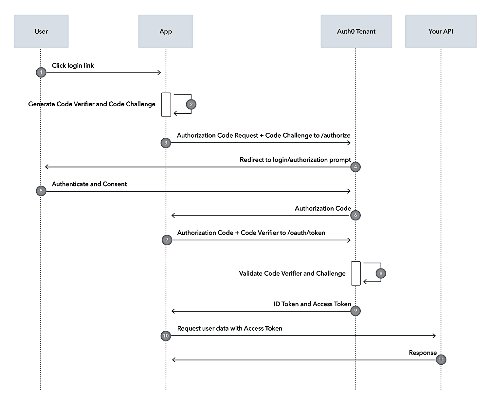

# WEB

- [WEB](#web)
- [API](#api)
  - [Basic HTTP Methods](#basic-http-methods)
  - [Idempotency](#idempotency)
  - [Different Request Body](#different-request-body)
  - [Ways to send Token in header](#ways-to-send-token-in-header)
  - [Common Status code](#common-status-code)
  - [API versioning](#api-versioning)
  - [Rate limiting](#rate-limiting)
  - [Pagination](#pagination)
- [CSRF (Cross-Site Resource Forgery)](#csrf-cross-site-resource-forgery)
- [gRPC (Google Remote Procedure Call)](#grpc-google-remote-procedure-call)
- [JWT](#jwt)
  - [Authorisation v/s Authentication](#authorisation-vs-authentication)
  - [Ways of using JWT](#ways-of-using-jwt)
- [Browser Storage](#browser-storage)
  - [Browser has three types of storages](#browser-has-three-types-of-storages)
  - [Local Storage \& Session Storage](#local-storage--session-storage)
  - [CORS (Cross-Origin Resource Sharing)](#cors-cross-origin-resource-sharing)
  - [Cookie Attribures](#cookie-attribures)
    - [Core Attributes](#core-attributes)
    - [Security and Privacy Attribute](#security-and-privacy-attribute)
- [OAuth2](#oauth2)
  - [Types of Grants](#types-of-grants)
  - [Abstract Flow](#abstract-flow)
  - [OAuth2.0 + PKCE (Proof of Key for Code Exchange)](#oauth20--pkce-proof-of-key-for-code-exchange)
  - [OIDC](#oidc)


# API
## Basic HTTP Methods
- **GET:**
    - Generally used to fetch data.
    - Idempotent.
- **POST:**
    - Generally used to create/add new data.
    - **Non-idempotent.**
- **PUT:**
    - Generally used to update data (replace the entire resource).
    - Full entity is typically sent to be updated.
    - **Idempotent.**
- **PATCH:**
    - Generally used to update data (partial modification of a resource).
    - Only the part of the entity to be updated is typically sent.
    - **Idempotency depends on the implementation.**
- **DELETE:**
    - Generally used to delete an entity.
    - **Idempotent.**

## Idempotency
- Idempotency means that multiple identical requests have the same effect as a single request.
- Example:
    - A PUT request to update the name from `ohm` to `ohm1` will return the same resource state every time, regardless of how many times it's sent.
    - Hence, it's idempotent.
- **Key Points:**
    - **POST is inherently non-idempotent.**
    - **PATCH's idempotency is determined by the server-side implementation.**
    - **PUT, GET, HEAD, DELETE, OPTIONS, and TRACE are designed to be idempotent.**
    - Ultimately, it's the developer's responsibility to ensure that idempotent methods are implemented correctly.
    - Example of non-idempotent PATCH:
        - A PATCH request used to increment a counter will produce a different result with each request.
    - Example of idempotent PATCH:
        - A PATCH request that updates the name from `ohm` to `ohm1` will result in the same outcome regardless of the number of requests.

## Different Request Body
- `application/json`

  ```json
  {
    "username": "john_doe",
    "password": "secure123"
  }
  ```

- application/x-www-form-encoded
  - Generally used to submit forms
  - It is how url handles params
  - key=value&key=value&...
  - As used to submit form vulnerable to CSRF
    - Hence CSRF should be used

  ```url
  username=john_doe&password=secure123
  ```

- multipart/form-data
  - Different types of data can be sent in one request like text, image, json ....

    <details>
      <summary>request</summary>

      ```
      ### Fetch Bill by Email with Multipart Form
      POST http://localhost:8000/fetchOrderByEmail
      Content-Type: multipart/form-data; boundary=----WebKitFormBoundary7MA4YWxkTrZu0gW

      ------WebKitFormBoundary7MA4YWxkTrZu0gW
      Content-Disposition: form-data; name="image"; filename="your_image.jpg"
      Content-Type: image/jpeg

      < ./your_image.jpg  # Replace with the actual path to your image file

      ------WebKitFormBoundary7MA4YWxkTrZu0gW
      Content-Disposition: form-data; name="jsonData"
      Content-Type: application/json

      {
          "shopEmail": "vaghleaohm@gmail.com"
      }

      ------WebKitFormBoundary7MA4YWxkTrZu0gW
      Content-Disposition: form-data; name="plainText"

      This is some plain text.

      ------WebKitFormBoundary7MA4YWxkTrZu0gW--
      auth-token: token
      ```
      
    </details>

- application/octet-stream
  - Used for data streaming, blob

## Ways to send Token in header
- There 3 common ways to send in header
  - Authorization: Bearer <JWT>
  - Authorization: Token <JWT>
  - X-Auth-Token: <JWT>
- It is generally advised to send them via cookie so client side dont need to explicitly handle it

## Common Status code

| Color | Code | Description |
|---|---|---|
| 🟢 | 200 OK | Standard response for successful HTTP requests. |
| 🟢 | 201 Created | Request succeeded, and a new resource was created. |
| 🟢 | 204 No Content | Request succeeded, but there's no content to return. |
| 🔴 | 400 Bad Request | Server couldn't understand the request due to invalid syntax. |
| 🔴 | 401 Unauthorized | Client lacks valid authentication credentials. |
| 🔴 | 403 Forbidden | Client is authenticated but lacks permission to access the resource. |
| 🔴 | 404 Not Found | Server couldn't find the requested resource. |
| 🔴 | 409 Conflict | Request couldn't be completed due to a conflict with the resource's current state. |
| 🟠 | 500 Internal Server Error | Server encountered an unexpected condition preventing it from fulfilling the request. |

## API versioning 
- It can be done using 
  - URL path param like `domain.com/v1/api`
  - URL query param like `domain.com/api?version=v1`
  - Header
  - Body

## Rate limiting 
- ### Client Based Rate limiting 
  - Limits the number of requests a specific client (identified by IP address, API key, user ID, etc.) can make within a given time window.
  - Stratergies
    - Token Bucketing
      - Imagine a bucket with a fixed capacity. Each request consumes a "token."
      - Tokens are replenished at a fixed rate.
      - If the bucket is empty, requests are rejected.
      - This allows for burst requests as long as the bucket has tokens.
    - Leaky Bucket
      - Similar to the token bucket, but requests "leak" out of the bucket at a fixed rate.
      - If the bucket is full, new requests are rejected.
      - This provides a smoother, more consistent rate limit
    - Fixed Window:
      - Limits the number of requests within a fixed time window (e.g., 100 requests per minute).
      - Once the window expires, the counter resets.
      - Simple to implement, but can lead to bursts at the window boundary.
    - Sliding Window:
      - A more refined version of the fixed window.
      - Instead of a fixed window, it uses a sliding window (e.g., the last minute).
      - This prevents bursts at window boundaries and provides a smoother rate limit
- ### Server Based Rate limiting
  - Concurrency limits
    - Limits the number of concurrent requests the server can handle.
    - New requests are queued or rejected if the limit is reached.
    - Protects against server overload.
  - Request Query
    - All the requests are in query
    - And are processed as the resource becomes available
- ### Geographic Rate Limiting:
  - Limits requests based on the geographic location of the client.
- ### Application-Specific Rate limiting 
  - Tailored rate limits based on the specific API endpoint or functionality

## Pagination
- Method used to send large data as small chunks
- Techniques
  - ### Page based pagination
    - Data is broken into pages of equal size
      - `GEt /api?page=2&size3`
    
    ```json
    page1:{
      "data1"
      "data2"
      "data3"
    },
    page2 : {
      "data4"
      "data5"
      "data6"
    }
    ```

  - ### Offset based pagination
    - Offset is the offset from the starting key and limit is number of data points
      - `/api/products?offset=20&limit=10`
    - So skip first 20 datapoints and give next 10 data points
  - ### Cursor based pagination
    - Uses primary key of last fetched data as custor and limit as number of data points
      - `/api/products?cursor=product_id_123&limit=10` 
    - returns 10 products after the item with ID 123
  - ### Key Based Pagination
    - This is a variant of cursor based pagination
    - Uses a unique, ordered key (like a timestamp or ID) to determine the next page
    - `/api/products?last_id=123&limit=10` 
      - returns 10 products with IDs greater than 123

# CSRF (Cross-Site Resource Forgery)
- Generally users have session stored on a website say website A, 
- Now say user visit to another website B, and it is malicious website
- So website B will run as script to call request to Website A on behalf of user
- To prevent this CSRF token embaded in HTML, and HTTP-only is set to true so no one can access JS code from outside
- And this token is sent to vailidate requst 

# gRPC (Google Remote Procedure Call)
- Like we have system calls for appications to communicate with OS locally
- We have RPC, Remove Procedure to call from one system to other 
- gRPC is popular implementation of RPC
- It uses protocal buffer to encode message (.proto) files

# JWT 
## Authorisation v/s Authentication
- `Authentication` :  is verifying the true identity of a user or entity
  - Done for when the user comes to website for first time
  - Like login/signup
- `Authorization` :  Determine access level of user, i.e. the resources that the user can access

  > ### JWT is used for authorization, `not for authentication`

- Authorization using SessionID
  - After authentication server generates SesisonID
  - Server stores SessionID, and also sends it back to client
  - Now for every request client sends sessionID to verify itself 
  - 
  - Here server needs to store `session ID`
- But this JWT uses a token instead of session ID
  - Here after authentication server creates a JWT with a secret key that only server has
  - Now each time client makes a request the server verifies the token with its secret key 
  - So here no extra memory is stored and no searching of id
  - 

## Ways of using JWT
- There are two types of tokens usually stored on client side
  - Access Token
  - Refresh Token
- `Access token` 
  - have relatively short lifespan (10-15min)
  - Are stored in session storad
- `Refresh Token`
  - Have relatively long lifespan (from days to months)
  - Are stored in HTTP-only cookies for enhanced security


# Browser Storage
## Browser has three types of storages   
  - Local Storage
  - Session Storage
  - Cookie Storage

|| Local Storage | Session Storage | Cookie Storage |
|-|-|-|-|
| Storage Cap | 5-10MB | 5MB | 5KB |
| Expiration | Never/set Manually | Till the tab is open | Never / set manually |
| Access | All tabs of browser | Same tab only | All tabs + server |
| Sent with request | Nop | Nop | Always sent with request |

## Local Storage & Session Storage 
- Data is stored as key value pairs

## CORS (Cross-Origin Resource Sharing)
- On both server and client side we need to mention 
  - What kind of resources are acceptable
  - From what urls resources are accepted
- While defining CORS option we specifiy 
  - Credentials : True/False : Are we expecting any of following credentials?
    - Cookies 
    - Authorization Header 
    - Server/Client-side SSL certificates 
  - AllowedHeader : List of Allowed headers
    - Auth-Token
    - Content-Type
  - Origin : List of urls from where server will accept requests
  - allowedMethods : Allowed methods : (GET, POST, PUT, DELETE, OPTIONS)
  - Prefilght : For complex request brower requests this(Preflight) from server

## Cookie Attribures
### Core Attributes
  - Name
  - Value
  - Domain : URL from where cookie is recieved
  - Path : The path where cookie is valid 
    - If path is `url/home`
    - And if you try to access cookie from `url/dashboard` it will be termed as invalid
    - It can also be accessed from `url/home/*`
  - Expires/ Max Age
  - Size : Brower defines it after determining it's size

### Security and Privacy Attribute
  - HttpOnly : If true client-side JS wont be able to access it
  - SameSite : Determines when the cookie is to be sent 
    > - SameSite : Two urls are samesite when scheme(HTTP/HTTPS) and domain matches
    > - CrossSite : When either of one schema or domain does not match
    - Strict : Cookie sent when user is on the SameSite
    - Lax : 
      - Cookie is sent on SameSite
      - When a new site opens from by clicking on url of sameSite cookie is sent
    - None : Allows all cross site 
  - Secure : When true, cookie is sent only to HTTPS secured server
  - Partitioned?
  - Priority?

# OAuth2
- industry-standard protocol for authorization
- allows applications to securely access resources on behalf of a user without exposing their credentials
<h3> Terminologies </h3>
  
  - **Resource Owner** (User)
    - The resource owner is the user who owns the data or resources
  - **Client**
    - The application into which user is trying to login
  - **Resource Server** / Thrid Party Resource Server
    - The server that hosts and protects user resources.
  - **Authorization Server** / Thrid Party Authorization Server
    - The server that `authenticate` user
    - This server issues access tokens after verifying user consent.
  - **Access Token**
    - A short-lived credential used by the client to access resources on behalf of the user.
    - Generally stored in browser memory like HttpOnly cookie
  - **Refresh Token** 
    - A long-lived credential used to obtain new access tokens without requiring the user to log in again.
    - Refresh tokens should always be stored securely on the backend server/database

## Types of Grants
1. **Authorization Code Grants (Most Secure)**
2. Implicit Grants (Depriciated)
3. Client Credential Grants
4. Resource Owner Password Grant (Can be Security Issue)
5. Authorization Code with PKCE (For mobile and SPA(Single Page Applications))

## Abstract Flow
- User clicks on login using google, github, facebook etc
- Client Redirects to Authserver login page and user logs in 
- Then Authorization server sends Authorization code to client
- This authorization code is used to request access token and refresh token from authorization server
- Then this access token is used to request for resources from Resource Server

  

## OAuth2.0 + PKCE (Proof of Key for Code Exchange)

  > PKCE is just using `Code Verifier` and `Code Challenge` to avoid missuse of `Authorization code` by attacker
   
1. `User` clicks on login link
2. `Client` App generates `Code Verifier` and `Code Challenge`

   > [!NOTE]
   > `Code Challenge` is encoded version of `Code Verifier`

    - Request
  
    ```shell
    GET https://auth.example.com/oauth/authorize?
      response_type=code&
      client_id=CLIENT_ID&
      redirect_uri=https://myapp.com/callback&
      scope=read_profile&
      state=xyz123&
      code_challenge=E9Melhoa2OwvFrEMTJguCHaoeK1t8URWbuGJSstw-cM&
      code_challenge_method=S256
    ```

    > [!NOTE]
    > - Other values for `response_type`
    >   - `code` : Request for Authorization Code
    >   - `token`(Depriciated) : Request for Access Token (Implicit Grant)
    >   - `id_token` : Used in OpenID Connect (for authentication)
    > - `state=xyz123`
    >   - The state parameter is a random unique value generated by the `client`
    >   - Used to prevent `CSRF(Cross-Site Request Forgery)` attack

3. Request for `Authorization code` is sent to `Authorization server`
    - Along with the request `Code Challenge` is sent
4. `User` is redirected to Third-Party Login page.
5. `User` logs in and concents to resources
    - After concenting user is redirected to 

    ```shell
    https://myapp.com/callback?
      code=AUTHORIZATION_CODE&
      state=xyz123
    ```

6. `Authorization server` send `Authorization Code` to `Client`
7. `Client` requests for `Access token` and `Refresh token` 
    - `Code Verifier` is sent with request
    
    ```shell
    POST https://auth.example.com/oauth/token
    Content-Type: application/x-www-form-urlencoded

    grant_type=authorization_code&
    code=AUTHORIZATION_CODE&
    redirect_uri=https://myapp.com/callback&
    client_id=CLIENT_ID&
    code_verifier=CODE_VERIFIER
    ```

    > [!NOTE]
    > - Grant_type
    >   - `authorization_code` : Used in Authorization Code Grant (standard for web apps).
    >   - `client_credentials` : Used in machine-to-machine authentication (no user involved).
    >   - `password` : Used in Resource Owner Password Credentials (deprecated, insecure).
    >   - `refresh_token` : Used to get a new access token without user login.
    >   - `implicit` : Used in Implicit Grant (deprecated, insecure).

8. `Authorization Server` verifiers `Code Verifier` and `Code Challenge`
9. After verification `Authorization Server` sends `Access Token` and `Refresh Token`

      ```json
      {
        "access_token": "eyJhbGciOiJIUzI1NiIsInR...",
        "token_type": "Bearer",
        "expires_in": 3600,
        "refresh_token": "YWFhYWFhYWFh...",
        "scope": "read_profile"
      }
      ```

10. `Client` requests resources from `Resource Server` using `Access Token`

    ```shell
    GET https://api.example.com/user/profile
    Authorization: Bearer ACCESS_TOKEN
    ```

11. `Resource Server` responds with resources
  
  

## OIDC

1. User Clicks on Login Link
     - The user initiates authentication by clicking on "Login with Example.com."

2. Client App Generates Code Verifier and Code Challenge
    - Code Verifier: A cryptographically random string.
    - Code Challenge: A hashed version of the Code Verifier (using SHA-256, i.e., S256 method).

3. Client Requests Authorization Code from the Authorization Server
    - The client redirects the user to the Authorization Endpoint with OpenID Connect parameters:

    ```shell
    GET https://auth.example.com/oauth/authorize?
      response_type=code&         # Request for Authorization Code
      client_id=CLIENT_ID&        # Client Identifier
      redirect_uri=https://myapp.com/callback&
      scope=openid profile email& # "openid" is required for OIDC
      state=xyz123&               # Prevents CSRF attacks
      nonce=abc456&               # Prevents replay attacks
      code_challenge=E9Melhoa2OwvFrEMTJguCHaoeK1t8URWbuGJSstw-cM&
      code_challenge_method=S256
    ```

    > [!NOTE]
    > OIDC-Specific Parameters
    > - scope=openid profile email:
    >   - openid → Required for OIDC (to request ID Token).
    >   - profile → Requests user profile info.
    >   - email → Requests user’s email.
    > - nonce=abc456: Prevents replay attacks by ensuring a unique request.

4. User Logs in and Consents to Resources
    - The Authorization Server shows a login page and consent screen.
    - The user authenticates (enters credentials) and approves access.

5. Authorization Server Redirects User to Client with Authorization Code
    - The user is redirected back to the Client App with:

    ```shell
   https://myapp.com/callback?
   code=AUTHORIZATION_CODE&
   state=xyz123
   ```

6. Client Requests Access Token and ID Token
    - The client sends the Authorization Code and Code Verifier to get tokens:

    ```shell
    POST https://auth.example.com/oauth/token
    Content-Type: application/x-www-form-urlencoded

    grant_type=authorization_code&
    code=AUTHORIZATION_CODE&
    redirect_uri=https://myapp.com/callback&
    client_id=CLIENT_ID&
    code_verifier=CODE_VERIFIER
    ```

7. Authorization Server Verifies and Issues Tokens
    - The Authorization Server verifies:

      - Authorization Code
      - Code Verifier (checks hash against Code Challenge)
      - Client ID
      - Redirect URI

    - If valid, it issues tokens:

    ```json
    {
      "access_token": "eyJhbGciOiJIUzI1NiIsInR...",
      "id_token": "eyJhbGciOiJIUzI1NiIsInR...",  # JWT with user identity
      "token_type": "Bearer",
      "expires_in": 3600,
      "refresh_token": "YWFhYWFhYWFh...",
      "scope": "openid profile email"
    }
    ```

    > [!NOTE]
    > - OIDC-Specific Token
    >   - id_token (JWT format) → Contains:
    >   - sub: User identifier.
    >   - iss: Authorization server.
    >   - aud: Client ID.
    >   - exp: Expiration time.
    >   - nonce: Must match request nonce (to prevent replay attacks).
    > ```json
    > // id_token
    > {
    >   "iss": "https://auth.example.com",  // Issuer (Authorization Server)
    >   "sub": "1234567890",                // User ID
    >   "aud": "my-client-app",             // Client ID
    >   "exp": 1714567890,                  // Expiry Time
    >   "iat": 1714567890,                  // Issued At
    >   "email": "user@example.com",        // User Email
    >   "name": "John Doe",                  // User Name
    >   "nonce": "abc456"
    > }
    > ```


8.  Client Validates the ID Token (OIDC Step)
    - The client verifies the ID Token without making a request to the Authorization Server by checking:
      - iss: Must match the Authorization Server.
      - aud: Must match the Client ID.
      - exp: Must not be expired.
      - nonce: Must match the request.
9. Client Requests Protected Resources Using Access Token
The client sends the Access Token to the Resource Server:

      ```shell
      GET https://api.example.com/user/profile
      Authorization: Bearer ACCESS_TOKEN
      ```
10. Resource Server Responds with User Information
    - If the access_token is valid, the Resource Server returns the requested data.

11. (OIDC-Specific) Client Uses the ID Token for Authentication
    - Instead of calling an API, the Client App extracts user identity from the ID Token. 
    - It uses this to create a user session in the frontend.

| Feature             | OAuth 2.0 + PKCE           | OAuth 2.0 + PKCE + OIDC     |
|----------------------|---------------------------|----------------------------|
| Used for             | API Authorization          | API Authorization + User Authentication |
| Tokens Issued        | Access Token, Refresh Token | Access Token, Refresh Token, ID Token |
| Stores User Identity? | ❌ No                      | ✅ Yes, via ID Token        |
| Requires openid Scope? | ❌ No                      | ✅ Yes                     |
| Session Management   | ❌ Requires API calls       | ✅ Done using ID Token      |
| Nonce Parameter      | ❌ No                      | ✅ Yes (Prevents replay attacks) |


> [!NOTE]
> + Why Authorization token is send, when directly access token can be sent
>   - To prevent
>     - Interception attacks (e.g., if logged in from a public/shared network)
>     - CSRF (Cross-Site Request Forgery) attacks
>     - Leakage in browser history
> + Why use PKCE (Proof of Key for Code Exchange)
>   - PKCE is just using `Code Verifier` and `Code Challenge` to avoid missuse of `Authorization code` by attacker
> + What is replay Attack (nonce=abc123)
>   - A Replay Attack is when an attacker captures and reuses a valid authentication request/token to gain unauthorized access.

